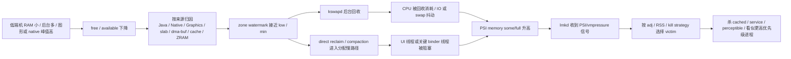
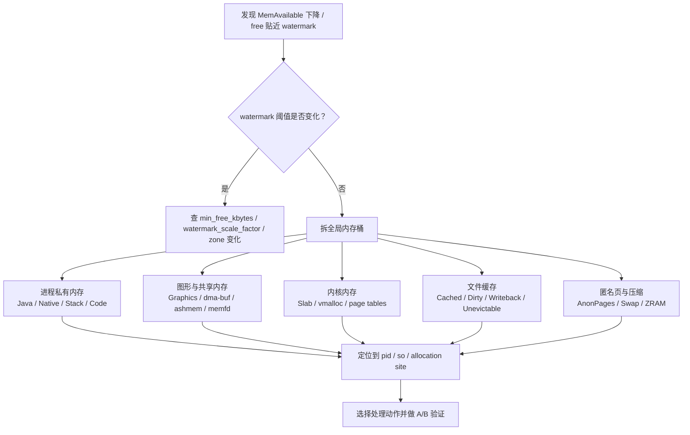

# 低端机系统内存学习规划

目标不是把 PSI、lmkd、ZRAM、水位这些词背下来，而是能处理三类真实问题：

1. 内存水位持续增长或可用内存持续下降，需要追到来源：Java、Native、Graphics、dma-buf、slab、page cache、ZRAM、memcg、内核驱动还是配置变化。
2. 低端机空闲水位长期过低，分配路径频繁进入 `kswapd`、`direct reclaim` 或 `compaction`，最终表现为滑动卡顿、启动慢、输入延迟。
3. lmkd 查杀了业务上看起来更重要的进程，需要证明它在被杀瞬间的 `oom_score_adj`、RSS、swap、PSI 和 kill reason，并判断是配置、状态计算、进程关系还是系统内存过载导致。

## 核心故障链



排查时不要先争论“系统是不是杀错了”，先把链路落到证据：**被杀瞬间的 adj 是多少、系统压力多高、还有没有更低 adj 的可杀进程、kill reason 是什么、回收是否已经造成可感知 stall**。

## 阶段安排

| 阶段 | 对应课程 | 必须能回答的问题 |
|---|---|---|
| 应用层证据 | Day 21-28 | Java/Native/Graphics 哪类内存增长？PSS/RSS/USS、heap dump、allocation 怎么互证？ |
| Native 安全与归因 | Day 29-40 | 泄漏、越界、踩踏、UAF、double free 是哪类问题？ASan/HWASan/KASAN/GWP-ASan 该用哪个？ |
| 图片与图形峰值 | Day 41-47 | Bitmap/GPU/dma-buf 是否把低端机推到系统水位边缘？ |
| 系统低内存基础 | Day 48-53 | watermark、LRU/MGLRU、kswapd、direct reclaim、PSI 如何共同描述压力，并追出水位增长来源？ |
| lmkd 与 adj | Day 54-57 | AMS 如何算 `oom_score_adj`？lmkd 为什么选择这个 victim？日志如何复盘？ |
| ZRAM 与内存拓展 | Day 58-60 | ZRAM 是缓冲还是拖慢？mmd、writeback、recompression、厂商内存拓展各自解决什么？ |
| 调参与保护 | Day 61-63 | 如何复现、采集、调水位和 lmkd 属性？关键进程保护的边界在哪里？ |
| 案例复盘 | Day 64-65、Day 78-79 | 能否从 trace、logcat、`/proc`、statsd 还原完整事故链？ |

## 低端机水位过低卡顿：学习目标

必须掌握三层判断：

| 层级 | 关注点 | 关键证据 |
|---|---|---|
| 水位层 | free pages 是否长期贴近 `low` / `min` watermark | `/proc/zoneinfo`、`/proc/meminfo`、`/proc/vmstat` |
| 回收层 | 卡顿时是否有 direct reclaim、compaction、major fault、swap in/out | Perfetto ftrace、`pgscan_*`、`pgsteal_*`、`compact_*`、`pswpin/pswpout` |
| 体验层 | stall 是否落在 UI、RenderThread、binder、system_server 关键路径 | Perfetto sched slice、frame timeline、`/proc/pressure/memory` |

解决方向要按证据选择：

| 现象 | 更可能的方向 |
|---|---|
| `direct reclaim` 打到 UI 线程 | 提高关键路径前的内存余量，降低前台峰值，调整水位或缓存策略 |
| `kswapd` CPU 长期高但回收收益差 | 查不可回收页、匿名页、ZRAM 压力、MGLRU 行为 |
| PSI `full` 升高 | 系统已经接近 thrashing，优先降并发、减后台、调 lmkd 触发策略 |
| swap in/out 抖动明显 | 查 ZRAM 大小、压缩算法、冷页策略、后台保活和内存拓展配置 |

## 内存水位增长来源追查：学习目标

先澄清两个容易混在一起的问题：

| 问题 | 含义 | 先看什么 |
|---|---|---|
| watermark 阈值变高 | `min/low/high` 本身因为 `min_free_kbytes`、zone、启动参数或厂商配置变化而提高 | `/proc/zoneinfo`、`/proc/sys/vm/min_free_kbytes`、`/proc/sys/vm/watermark_scale_factor` |
| 使用水位变高 | 阈值没变，但 Java、Native、Graphics、kernel、cache、ZRAM 等占用上涨，导致 `MemAvailable` 下降 | `/proc/meminfo`、`dumpsys meminfo`、`showmap`、`smaps`、`vmstat`、Perfetto |

追查顺序必须从全局到局部：



归因矩阵要写进后续文章和案例：

| 增长来源 | 关键指标 | 定位办法 | 处理方向 |
|---|---|---|---|
| Java Heap | `dumpsys meminfo` 的 Java Heap、heap dump retained | LeakCanary、MAT、Allocation Tracker | 修泄漏、降峰值、分页/流式加载、缩短 owner 生命周期 |
| Native Heap | Native Heap、`smaps` anon、heapprofd allocation site | heapprofd、malloc_debug、`showmap`、tombstone | 配对释放、对象池设上限、修 native 泄漏、降低 JNI 批量分配 |
| Graphics / dma-buf | Graphics、GL mtrack、dma-buf size、Surface 数量 | `dumpsys meminfo -a`、SurfaceFlinger、debugfs dma-buf、Perfetto | 降纹理/Bitmap 峰值、释放 Surface、减少缓冲队列、修渲染资源泄漏 |
| Slab / kernel | `SReclaimable`、`SUnreclaim`、`slabinfo` | `/proc/slabinfo`、kernel trace、驱动日志 | 查 fd/socket/inode/dentry、驱动缓存上限、修 kernel 泄漏 |
| Page cache | `Cached`、`Dirty`、`Writeback`、major fault | `/proc/meminfo`、`vmstat`、IO trace | 控制大文件读写、避免无界 mmap、调整预读和缓存策略 |
| Anonymous pages | `AnonPages`、进程 RSS、PSS | `dumpsys meminfo`、`smaps_rollup`、memcg | 找大户进程，拆 Java/Native/stack，降低后台常驻 |
| ZRAM / swap | `SwapTotal/Free`、`ZRAM mm_stat`、`pswpin/pswpout` | `/sys/block/zram0/mm_stat`、`/proc/vmstat`、Perfetto | 调 ZRAM 大小/算法，减少冷页反复换入，评估 mmd writeback |
| Unevictable / mlocked | `Unevictable`、`Mlocked` | `/proc/meminfo`、驱动和 HAL 审计 | 减少 pin 住的 buffer，缩短锁页生命周期 |
| Page tables / vmalloc | `PageTables`、`VmallocUsed` | `/proc/meminfo`、进程 VMA 数、kernel debug | 减少碎片化 mmap、大量线程/小映射、驱动 vmalloc 泄漏 |

每次追查至少输出一张差分表：

| 时间点 | MemAvailable | AnonPages | Slab | SUnreclaim | Cached | Dirty | SwapUsed | Graphics/dma-buf | Top PSS 进程 |
|---|---|---|---|---|---|---|---|---|---|
| T0 空闲稳定 |  |  |  |  |  |  |  |  |  |
| T1 复现前 |  |  |  |  |  |  |  |  |  |
| T2 水位升高 |  |  |  |  |  |  |  |  |  |
| T3 处理后 |  |  |  |  |  |  |  |  |  |

处理办法要按来源收敛，不允许只写“释放内存”：

| 归因结论 | 处理办法 |
|---|---|
| 前台瞬时峰值推低水位 | 分阶段加载、降低解码并发、提前释放中间 buffer、把大分配移出帧关键路径 |
| 后台进程常驻过多 | 收紧后台服务、降低缓存上限、响应 `onTrimMemory()`、调整多进程策略 |
| 图形 buffer 持续增长 | 查 Surface/Texture 生命周期、减少 buffer count、降低分辨率和离屏缓存 |
| slab 不可回收增长 | 查 fd/socket/inode/dentry 或驱动对象，修资源泄漏或加缓存上限 |
| ZRAM 反复换入换出 | 减少后台热冷切换，调整 ZRAM/mmd 策略，避免把卡顿换成 swap 抖动 |
| watermark 阈值配置不合理 | 评估 `min_free_kbytes`、`watermark_scale_factor` 和 lmkd 触发点，做帧率、kill 率、启动耗时 A/B |

## lmkd 查杀高优先级进程：学习目标

先把“高优先级”拆成两个概念：

| 说法 | 需要验证 |
|---|---|
| 业务认为重要 | 是否有前台可见组件、前台服务、绑定关系、用户可感知任务 |
| 系统认为重要 | 被杀瞬间 `/proc/<pid>/oom_score_adj`、AMS process state、lmkd kill log |

必须建立这个复盘表：

| 字段 | 来源 | 用途 |
|---|---|---|
| victim pid/process | lmkd log、tombstone、ActivityManager log | 确认被杀对象 |
| kill reason | lmkd log、statsd | 判断是 PSI、swap、thrashing 还是低水位 |
| `oom_score_adj` | `/proc/<pid>/oom_score_adj`、`dumpsys activity oom` | 判断系统优先级 |
| RSS/PSS/swap | lmkd log、`dumpsys meminfo`、`smaps` | 判断是否杀了大户 |
| 更低优先级候选 | lmkd log、`dumpsys activity processes` | 判断是否真的“跳级” |
| 状态变化时间线 | ActivityManager、OomAdjuster、binder 关系 | 判断 adj 是否滞后或被错误提升/降低 |

常见根因要在后续文章逐个展开：

1. `oom_score_adj` 已经变高，但业务仍以为它是前台或重要服务。
2. 进程拆分后，真正持有关键能力的是子进程、isolated process、WebView renderer 或 native daemon。
3. cached 进程已经被杀光，lmkd 只能向更低数值的 adj 档位推进。
4. RSS 最大的进程在同一 adj 档位内被优先选中，看起来像“更重要”。
5. AMS 状态更新、绑定关系、前台服务声明或厂商保活策略导致 adj 与业务预期不一致。
6. 水位和 PSI 触发过晚，系统已经 thrashing，lmkd 在高压下快速连续查杀。

## 必读源码路径

| 模块 | 路径 | 重点 |
|---|---|---|
| lmkd | `system/memory/lmkd/lmkd.cpp` | PSI/vmpressure 监听、kill strategy、victim 选择 |
| AMS adj | `frameworks/base/services/core/java/com/android/server/am/OomAdjuster.java` | 进程状态到 `oom_score_adj` 的计算 |
| 进程列表 | `frameworks/base/services/core/java/com/android/server/am/ProcessList.java` | adj 档位、minfree/LMK 参数衔接 |
| cached compaction | `frameworks/base/services/core/java/com/android/server/am/CachedAppOptimizer.java` | app compaction、ZRAM writeback 触发 |
| ZRAM 管理 | `system/memory/mmd/` | writeback、recompression、per-process 维护 |
| 页分配 | `mm/page_alloc.c` | watermark 检查、慢路径分配 |
| 页回收 | `mm/vmscan.c` | kswapd、direct reclaim、LRU 扫描 |
| 内存压缩 | `mm/compaction.c` | high-order 分配和 compaction 卡顿 |
| PSI | `kernel/sched/psi.c` | stall 统计和 trigger 机制 |
| MGLRU | `mm/vmscan.c`、`mm/workingset.c`、`mm/mglru` 相关实现 | 新旧 reclaim 策略差异 |

## 最小观测命令

这些命令不是一次性全跑，而是在复盘表里按时间线取证：

```bash
adb shell cat /proc/pressure/memory
adb shell cat /proc/meminfo
adb shell cat /proc/vmstat
adb shell cat /proc/zoneinfo
adb shell cat /proc/buddyinfo
adb shell cat /proc/slabinfo
adb shell cat /proc/swaps
adb shell cat /sys/block/zram0/mm_stat
adb shell cat /sys/kernel/debug/dma_buf/bufinfo
adb shell dumpsys meminfo
adb shell dumpsys activity oom
adb shell dumpsys activity processes
adb shell cat /proc/<pid>/smaps_rollup
adb logcat -b all -v threadtime | grep -iE "lmkd|lowmemorykiller|am_kill|am_proc_died|OomAdjuster|CachedAppOptimizer"
```

Perfetto 至少要覆盖：

| 类别 | 事件 |
|---|---|
| 调度 | `sched/sched_switch`、线程 runnable/blocked 时间 |
| 内存回收 | `vmscan/mm_vmscan_*`、`compaction/mm_compaction_*` |
| PSI | memory pressure stall 相关 trace 或同步采样 |
| page fault | major fault、swap in/out |
| 归因采样 | meminfo、vmstat、process stats、heapprofd、dma-buf |
| Android | ActivityManager、lmkd、frame timeline、binder |

## 调参原则

1. 先证明卡顿来自 reclaim/compaction/PSI，再讨论水位和 lmkd；不要把所有低端机卡顿都归因到内存。
2. 提高水位或提前杀后台可以减少 direct reclaim 卡顿，但会降低可用缓存和后台存活率。
3. lmkd 触发过晚会让系统 thrashing，触发过早会增加可感知 kill；低端机要在二者之间找可测量的平衡点。
4. ZRAM 可以延缓 kill，但会引入 CPU、换入延迟和功耗；内存拓展不是增加真实 RAM。
5. 关键进程保护必须通过正确的组件状态、绑定关系和前台语义实现，不能靠无边界保活。
6. 每次调参必须同时记录体验指标、PSI、水位、kill 率、启动耗时和后台存活率。

## 完成标准

完成这条学习线后，面对低端机内存问题应该能交付四样东西：

1. 一张来源差分表：证明水位增长来自 Java、Native、Graphics、slab、page cache、ZRAM、memcg 还是 watermark 配置。
2. 一张时间线：内存下降、watermark 命中、reclaim/compaction、PSI 升高、lmkd kill、用户卡顿之间的顺序。
3. 一张进程表：被杀进程和候选进程的 adj、RSS/PSS、swap、状态、绑定关系。
4. 一组处理动作：每个动作都对应明确来源，不能只写“释放内存”。
5. 一套验证：修改后 PSI、direct reclaim、frame miss、kill 率和关键进程存活是否改善。
