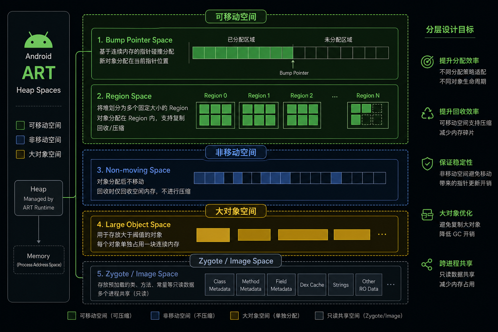
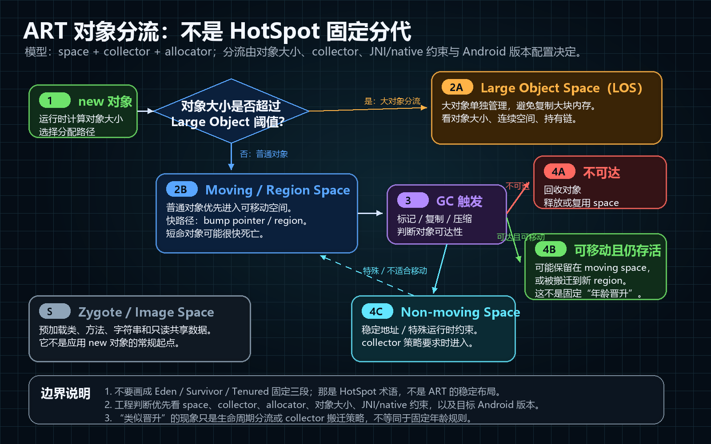

# Day 1：Java 堆结构：Young/Old Generation 在 ART 上的实现

> 系列第 1 篇。把 “年轻代 / 老年代” 这套 JVM 语言迁移到 Android Runtime（ART）的语境里：在 ART 里它们分别对应哪些内存空间、哪些对象会被 “晋升”，以及你在排查内存问题时应该看哪些证据而不是概念。

## 背景

在 HotSpot 里，“Young / Old Generation” 是一个强约束的堆分代模型：对象先在年轻代分配，经历若干次 Minor GC 后存活的对象被晋升到老年代，最终通过 Major / Full GC 回收。

在 Android（ART）里，你仍然会在面试、性能优化、OOM 排查中听到 “年轻代 / 老年代” 的说法，但它更像一种**经验映射**：用于描述 “新分配对象更容易被回收、长寿命对象应当尽量减少写屏障和搬迁成本” 的设计取向，而不是某个固定的两段式堆布局。

要把概念讲清楚，必须把 ART 的堆拆成两个维度：

- **内存空间（space）维度**：对象到底分配在哪些空间里（moving / non-moving / large object / zygote 等），空间的分配器是什么（bump pointer / rosalloc 等）。
- **回收策略（collector）维度**：当前 GC 选用的收集器是什么（如 Concurrent Copying、CMS），它如何选择回收集合、是否搬迁对象、如何处理跨空间引用。

这篇文章只解决第一步：把 ART 堆空间的结构讲透，并给出“年轻 / 年老”的可操作映射。



## 核心机制

### 1）ART 的 “堆” 是一组 space 的组合，而不是一段连续内存

ART 的 GC Heap（下文简称 heap）管理多个 space。你在 `dumpsys meminfo` 里看到的 Java Heap 指标，底层往往对应这些 space 的合集，而非单一连续区域。

从源码入口看：

- `art/runtime/gc/heap.h`：heap 的顶层抽象与生命周期。
- `art/runtime/gc/heap.cc`：创建各类 space、选择收集器、触发 GC、统计与调参。

space 的实现集中在：

- `art/runtime/gc/space/`：不同 space 的具体实现（是否可移动、是否按 region 管理、是否面向大对象等）。

### 2）把 “年轻代 / 老年代” 映射到 ART：看 “可移动性 + 生命周期”，不要硬套代际名称

在实际工程里，可以用下面的映射来指导你做判断（注意：是映射，不是标准命名）：

**更接近“年轻代”的区域（更强调快速分配、可搬迁、倾向于容纳短命对象）**

- **Bump Pointer Space**（典型的 “指针碰撞” 分配，分配极快，常用于可移动对象）
  - 关键实现：`art/runtime/gc/space/bump_pointer_space.h`
  - 特点：按块线性分配，几乎没有分配元数据开销；适合配合复制/搬迁式收集器。
- **Region Space**（把堆切成固定大小 region，支持更细粒度的管理与搬迁）
  - 关键实现：`art/runtime/gc/space/region_space.h`
  - 特点：每个 region 可标记为不同状态（如 free、allocated、large 等），收集器可以按 region 组织 evacuation 与 compaction。

**更接近“老年代”的区域（更强调稳定地址、避免频繁搬迁、容纳长寿命或特殊对象）**

- **Non-moving Space**（不可移动对象的容器）
  - 常见动机：某些对象（或它们被 native 持有的地址）不适合频繁搬迁；或者为了降低移动成本与屏障开销。
  - 你可以在 heap 初始化逻辑中看到它与 moving space 并存。
- **Large Object Space（LOS）**（大对象通常单独管理，避免在常规 space 里导致碎片与复制成本）
  - 关键实现：`art/runtime/gc/space/large_object_space.h`
  - 特点：大对象往往按页或大块分配；回收策略与普通对象不同，且 “晋升” 概念通常不适用。
- **Zygote Space / Image Space**（由 Zygote 预加载与映像共享带来的特殊空间）
  - 关键意义：这些对象对应用进程而言几乎是 “常驻” 的；你排查内存时需要能区分“共享映射”与“私有脏页”带来的增量。

因此，如果面试或排查场景里你必须用 “年轻 / 老年代” 语言，建议用下面的句式落地：

- “ART 没有固定的两段式年轻代/老年代布局；更准确地说，新分配对象通常进入 moving space（如 bump pointer / region），长寿命或不适合移动的对象可能进入 non-moving 或 LOS；是否发生类似 ‘晋升’ 的行为由收集器与对象特性共同决定。”

### 3）什么情况下会出现类似 “晋升（promotion）” 的现象

在 HotSpot 里 promotion 是从年轻代到老年代的明确拷贝路径；在 ART 里，更接近 promotion 的现象通常表现为：

- 对象最初分配在 **moving space**（便于复制、压缩与并发回收）
- 经历若干次 GC 后，某类对象被转移到 **non-moving**（减少搬迁成本/降低某些引用处理复杂度）
- 大对象直接进入 **LOS**，通常绕过 “年轻代” 路径

这里最关键的工程判断是：**对象“生命周期长”并不自动意味着它一定会进入某个 “老年代”**。你需要结合：

- 当前设备/系统上启用的收集器（不同 collector 对 space 的使用方式不同）
- 对象大小（是否触发 LOS 分配）
- 对象是否被某些 native 结构长期持有（是否更倾向 non-moving）

把 “晋升” 当成固定规则很容易误判。



> 图中 “Young / Tenured” 是帮助理解生命周期分流的近似标注，不表示 ART 固定采用 HotSpot 式 Eden / Survivor / Tenured 三段布局。实际判断仍以 space、collector、对象大小和目标 Android 版本为准。

### 4）为什么这个结构对性能与 OOM 排查很关键

1. **分配热点与 GC 压力**  
   moving space（尤其是 bump pointer）分配快，但短命对象多会提高 GC 触发频率；如果你看到频繁 GC，第一步通常不是“优化 GC”，而是找分配热点。

2. **大对象的 OOM 行为经常与常规对象不同**  
   大 Bitmap、超大数组直接进入 LOS。你在 Java Heap 看起来还有空间，但 LOS 的可用连续块不足时仍然会 OOM（或触发更激进的回收）。

3. **“共享内存” 与 “私有脏页” 会掩盖问题**  
   Zygote/Image 相关空间会把一部分内存表现为共享映射。排查时要把 PSS/Private Dirty 分开看，否则容易把系统共享页当成应用泄漏。

## 代码示例

下面这段代码的目的，是在应用内把 “分配行为” 与 “内存统计” 连起来：你能看到短时间大量分配如何推动 GC，以及 Java Heap/Native Heap 的统计口径差异。

```kotlin
import android.os.Debug
import android.util.Log

private const val TAG = "MemDemo"

fun allocateBurst(rounds: Int, bytesPerObj: Int, objsPerRound: Int) {
  val holder = ArrayList<ByteArray>(objsPerRound)
  repeat(rounds) { r ->
    holder.clear()
    repeat(objsPerRound) {
      holder.add(ByteArray(bytesPerObj))
    }
    val runtime = Runtime.getRuntime()
    Log.i(
      TAG,
      "round=$r javaUsed=${runtime.totalMemory() - runtime.freeMemory()} " +
        "javaTotal=${runtime.totalMemory()} javaMax=${runtime.maxMemory()} " +
        "nativeHeap=${Debug.getNativeHeapAllocatedSize()}"
    )
  }
}
```

这段代码证明的不是某个绝对数值（不同设备差异很大），而是两点：

- 短时间内的突发分配会让 Java Heap 的 `javaUsed` 呈现“锯齿”，这通常对应 GC 的回收节奏。
- `nativeHeap` 与 Java Heap 的变化可能不同步：这对排查 Bitmap、JNI 分配、mmap 相关内存非常重要。

## 常见问题与误判

### 误判 1：把 “年轻代 / 老年代” 当成 ART 的真实堆布局

如果你用 “老年代占满导致 Full GC” 去解释 ART 的 GC 行为，结论往往不可验证。更可验证的路径是：

- 你要说清楚 “对象在哪个 space 分配、为什么会进入该 space”
- 你要能给出可观察证据（见下文观测方法）

### 误判 2：看到 Java Heap 还有空间，就认为不会 OOM

典型反例是 LOS：大对象分配失败并不需要 Java Heap 总体接近上限。你需要结合：

- 分配对象的大小分布（是否大量接近阈值的大对象）
- 设备上进程内存上限（`getMemoryClass()` 与 `getLargeMemoryClass()` 只是上层提示）
- `dumpsys meminfo` 的 Native/Graphics/Other 指标（特别是图像与映射）

### 误判 3：把 “System” 或 “Zygote” 相关内存全算作应用泄漏

共享页（PSS）与私有脏页的口径不同。你真正能优化/回收的，是私有脏页（以及你能控制的分配行为），而不是共享映像本身。

## 观测方法

### 1）用 `dumpsys meminfo` 把 “Java / Native / Graphics” 拆开看

在你复现问题时抓取：

```bash
adb shell dumpsys meminfo <pid>
```

关注三个层面：

- Java Heap 的增长是否来自大量短命分配（通常伴随 GC 频繁）
- Native Heap/Graphics 的增长是否与 Java Heap 脱钩（常见于图片、JNI、mmap）
- Private Dirty 是否持续抬升（比单看 PSS 更接近“应用增量”）

### 2）用 Android Studio Memory Profiler 看分配热点，而不是先看 GC 次数

Memory Profiler 的 Allocation 视图能直接定位“是谁在制造短命对象”。当你还没找到热点就讨论 “GC 调参”，通常会绕远路。

### 3）需要更底层证据时：看 ART 的 space/collector 日志与 trace

你如果能控制测试环境（debug build 或 rooted），可以通过运行时参数或日志开关让 ART 打印更细粒度信息（不同 Android 版本开关不同）。但在多数业务场景里，更现实的做法是：

- 先用 `dumpsys meminfo` + Profiler 定位对象类型与分配链路
- 再决定是否值得进入 AOSP 源码级分析（例如确认 LOS 阈值、space 配置、collector 行为）

## 面试考点

1. “ART 里有没有年轻代/老年代？”  
   建议回答：ART 不以固定的两段式分代暴露给开发者；更准确的描述是多个 space 的组合，moving space 更像“年轻代”的承载，non-moving/LOS/zygote/image 更像“年老或特殊对象的承载”，对象迁移由收集器与对象特性决定。

2. “为什么大对象容易导致 OOM，即使看起来 Java Heap 还没满？”  
   建议回答：大对象常进入 LOS，LOS 的分配与碎片约束不同；OOM 可能由连续空间不足或进程整体内存上限触发，而不等价于 Java Heap 总量耗尽。

3. “排查内存问题时你优先看什么？”  
   建议回答：先定位分配热点与增长来源（Profiler + `dumpsys meminfo`），区分 Java/Native/Graphics；再决定是否需要进一步用 heap dump、native 工具链或 AOSP 源码验证。

## 参考资料

- AOSP 源码（ART）：
  - `art/runtime/gc/heap.h`
  - `art/runtime/gc/heap.cc`
  - `art/runtime/gc/space/bump_pointer_space.h`
  - `art/runtime/gc/space/region_space.h`
  - `art/runtime/gc/space/large_object_space.h`
- 工具：
  - `adb shell dumpsys meminfo`
  - Android Studio Memory Profiler

