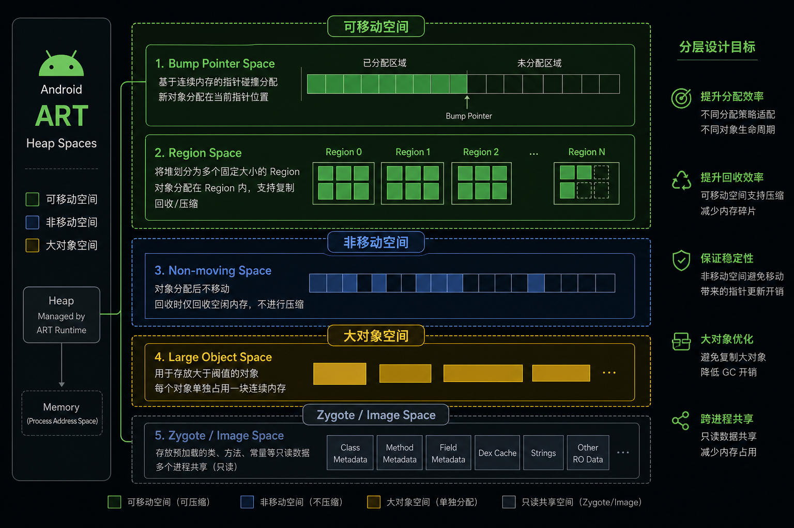
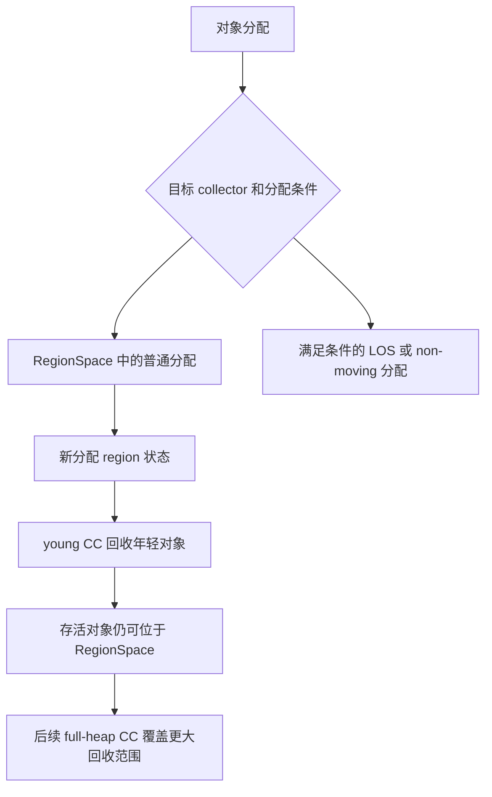

# Day 1：Java 堆结构：Young/Old Generation 在 ART 上的实现

> 系列第 1 篇。把 “年轻代 / 老年代” 这套 JVM 语言迁移到 Android Runtime（ART）的语境里：在 ART 里代际与 space 有什么区别、存活对象如何参与后续回收，以及你在排查内存问题时应该看哪些证据而不是概念。

## 背景

HotSpot 的典型分代收集器常用 Young / Old、Eden / Survivor 等术语；具体布局和晋升策略同样取决于收集器，不能推广为所有 JVM 的固定模型。

ART 中确实存在分代回收实现，例如 Android 10 引入的 generational CC。理解它要区分空间布局与回收集合，不能把不可移动空间当作老年代。

要把概念讲清楚，必须把 ART 的堆拆成两个维度：

- **内存空间（space）维度**：对象到底分配在哪些空间里（moving / non-moving / large object / zygote 等），空间的分配器是什么（bump pointer / rosalloc 等）。
- **回收策略（collector）维度**：当前 GC 选用的收集器是什么（如 Concurrent Copying、CMS），它如何选择回收集合、是否搬迁对象、如何处理跨空间引用。

这篇文章只解决第一步：把 ART 堆空间的结构讲透，并说明 space 与代际回收的区别。



## 核心机制

### 1）ART 的 “堆” 是一组 space 的组合，而不是一段连续内存

ART 的 GC Heap（下文简称 heap）管理多个 space。你在 `dumpsys meminfo` 里看到的 Java Heap 指标，底层往往对应这些 space 的合集，而非单一连续区域。

从源码入口看：

- `art/runtime/gc/heap.h`：heap 的顶层抽象与生命周期。
- `art/runtime/gc/heap.cc`：创建各类 space、选择收集器、触发 GC、统计与调参。

space 的实现集中在：

- `art/runtime/gc/space/`：不同 space 的具体实现（是否可移动、是否按 region 管理、是否面向大对象等）。

### 2）Space 与代际是两个维度

| Space | 含义 | 不能推出的结论 |
|---|---|---|
| Bump Pointer Space | 线性分配空间，配合相应搬迁收集器 | 使用指针碰撞就一定是年轻代 |
| Region Space | CC 使用的 region 化空间，支持 RegionTLAB 分配和搬迁 | 其中所有对象都是年轻对象 |
| Non-moving Space | 满足特定不可移动分配需求 | 它就是老年代，长寿命对象都会进入 |
| Large Object Space（LOS） | 满足类型、大小等条件的大对象分配路径 | 所有大对象或所有 Bitmap 像素都进入 LOS |
| Zygote / Image Space | 预加载、映像及共享相关空间 | 共享页都是应用泄漏 |

LOS 的类型条件、阈值与实现需要绑定 ART 分支核对；不要仅凭对象大小推断 space。JNI global reference 是 GC 可追踪的引用，不是承诺对象地址不变的裸指针，持有时间长不会自动把对象搬到 non-moving。

### 3）以 Android 10 的 generational CC 为例理解代际

Android 10 引入 generational CC，并默认启用 CC 的分代模式。这是具体收集器行为，不是把 moving/non-moving 改名为 young/old；其他版本、收集器和厂商配置应另行确认。

- RegionSpace 跟踪新分配 region 等状态，young collection 针对年轻对象缩小回收工作范围。
- 存活对象可以继续留在 RegionSpace；不能描述为“存活若干轮后必然转入 non-moving”。
- 跨代引用需要配合写屏障和相应记录机制处理，年轻对象仍可能由老对象保持可达。
- young 与 full-heap CC 的选择涉及回收吞吐量等策略，不能简化为每次分配都先 young、失败再 full。


```mermaid
flowchart TD
  A[对象分配] --> B{目标 collector 和分配条件}
  B --> C[RegionSpace 中的普通分配]
  B --> D[满足条件的 LOS 或 non-moving 分配]
  C --> E[新分配 region 状态]
  E --> F[young CC 回收年轻对象]
  F --> G[存活对象仍可位于 RegionSpace]
  G --> H[后续 full-heap CC 覆盖更大回收范围]
```

> 图只解释 generational CC 的概念关系，不代表所有 ART 版本的固定调用顺序。存活对象不必迁移到 non-moving。

### 4）为什么这个结构对性能与 OOM 排查很关键

1. **分配热点与 GC 压力**  
   moving space（尤其是 bump pointer）分配快，但短命对象多会提高 GC 触发频率；如果你看到频繁 GC，第一步通常不是“优化 GC”，而是找分配热点。

2. **大对象的 OOM 行为经常与常规对象不同**  
   满足分配条件的大型基本类型数组可能进入 LOS；分配失败需要结合请求大小、堆限制和具体 LOS 实现判断。Android 8.0 起普通软件 Bitmap 的像素数据位于 native heap，Java wrapper 与像素必须分开核算；硬件 Bitmap 还要检查 Graphics/buffer 路径，不能用 Java LOS 解释全部图片内存。

3. **“共享内存” 与 “私有脏页” 会掩盖问题**  
   Zygote/Image 相关空间会把一部分内存表现为共享映射。排查时要把 PSS/Private Dirty 分开看，否则容易把系统共享页当成应用泄漏。

## 代码示例

下面这段代码的目的，是在应用内把 “分配行为” 与 “内存统计” 连起来：你能看到短时间大量分配如何推动 GC，以及 Java Heap/Native Heap 的统计口径差异。

```kotlin
import android.os.Debug
import android.util.Log

private const val TAG = "MemDemo"

fun allocateBurst(rounds: Int, bytesPerObj: Int, objsPerRound: Int) {
  val holder = ArrayList<ByteArray>(objsPerRound)
  repeat(rounds) { r ->
    holder.clear()
    repeat(objsPerRound) {
      holder.add(ByteArray(bytesPerObj))
    }
    val runtime = Runtime.getRuntime()
    Log.i(
      TAG,
      "round=$r javaUsed=${runtime.totalMemory() - runtime.freeMemory()} " +
        "javaTotal=${runtime.totalMemory()} javaMax=${runtime.maxMemory()} " +
        "nativeHeap=${Debug.getNativeHeapAllocatedSize()}"
    )
  }
}
```

这段代码证明的不是某个绝对数值（不同设备差异很大），而是两点：

- 短时间内的突发分配会让 Java Heap 的 `javaUsed` 呈现“锯齿”，这通常对应 GC 的回收节奏。
- `nativeHeap` 与 Java Heap 的变化可能不同步：这对排查 Bitmap、JNI 分配、mmap 相关内存非常重要。

## 常见问题与误判

### 误判 1：把 “年轻代 / 老年代” 当成 ART 的真实堆布局

如果你用 “老年代占满导致 Full GC” 去解释 ART 的 GC 行为，结论往往不可验证。更可验证的路径是：

- 你要说清楚 “对象在哪个 space 分配、为什么会进入该 space”
- 你要能给出可观察证据（见下文观测方法）

### 误判 2：看到 Java Heap 还有空间，就认为不会 OOM

典型反例是 LOS：大对象分配失败并不需要 Java Heap 总体接近上限。你需要结合：

- 分配对象的大小分布（是否大量接近阈值的大对象）
- 设备上进程内存上限（`getMemoryClass()` 与 `getLargeMemoryClass()` 只是上层提示）
- `dumpsys meminfo` 的 Native/Graphics/Other 指标（特别是图像与映射）

### 误判 3：把 “System” 或 “Zygote” 相关内存全算作应用泄漏

共享页（PSS）与私有脏页的口径不同。你真正能优化/回收的，是私有脏页（以及你能控制的分配行为），而不是共享映像本身。

## 观测方法

### 1）用 `dumpsys meminfo` 把 “Java / Native / Graphics” 拆开看

在你复现问题时抓取：

```bash
adb shell dumpsys meminfo <pid>
```

关注三个层面：

- Java Heap 的增长是否来自大量短命分配（通常伴随 GC 频繁）
- Native Heap/Graphics 的增长是否与 Java Heap 脱钩（常见于图片、JNI、mmap）
- Private Dirty 是否持续抬升（比单看 PSS 更接近“应用增量”）

### 2）用 Android Studio Memory Profiler 看分配热点，而不是先看 GC 次数

Memory Profiler 的 Allocation 视图能直接定位“是谁在制造短命对象”。当你还没找到热点就讨论 “GC 调参”，通常会绕远路。

### 3）需要更底层证据时：看 ART 的 space/collector 日志与 trace

你如果能控制测试环境（debug build 或 rooted），可以通过运行时参数或日志开关让 ART 打印更细粒度信息（不同 Android 版本开关不同）。但在多数业务场景里，更现实的做法是：

- 先用 `dumpsys meminfo` + Profiler 定位对象类型与分配链路
- 再决定是否值得进入 AOSP 源码级分析（例如确认 LOS 阈值、space 配置、collector 行为）

## 面试考点

1. “ART 里有没有年轻代/老年代？”  
   建议回答：有具体的分代收集器实现，例如 Android 10 的 generational CC；代际不等同于 space，RegionSpace 可承载不同存活阶段的对象，non-moving 不等于老年代。先明确目标 collector 和版本。

2. “为什么大对象容易导致 OOM，即使看起来 Java Heap 还没满？”  
   建议回答：大对象常进入 LOS，LOS 的分配与碎片约束不同；OOM 可能由连续空间不足或进程整体内存上限触发，而不等价于 Java Heap 总量耗尽。

3. “排查内存问题时你优先看什么？”  
   建议回答：先定位分配热点与增长来源（Profiler + `dumpsys meminfo`），区分 Java/Native/Graphics；再决定是否需要进一步用 heap dump、native 工具链或 AOSP 源码验证。

## 参考资料

- AOSP 源码（ART）：
  - `art/runtime/gc/heap.h`
  - `art/runtime/gc/heap.cc`
  - `art/runtime/gc/space/bump_pointer_space.h`
  - `art/runtime/gc/space/region_space.h`
  - `art/runtime/gc/space/large_object_space.h`
- 工具：
  - `adb shell dumpsys meminfo`
  - Android Studio Memory Profiler


- [AOSP：ART GC、generational CC 与吞吐量策略](https://source.android.com/docs/core/runtime/gc-debug)
- [Android：Bitmap 像素内存的版本变化](https://developer.android.com/topic/performance/graphics/manage-memory)
- [Android：ART 搬迁 GC 与 JNI 注意事项](https://developer.android.com/guide/practices/verifying-apps-art)
