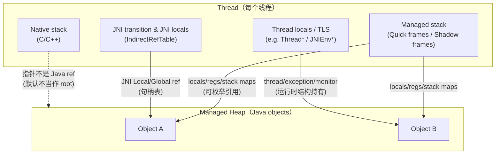
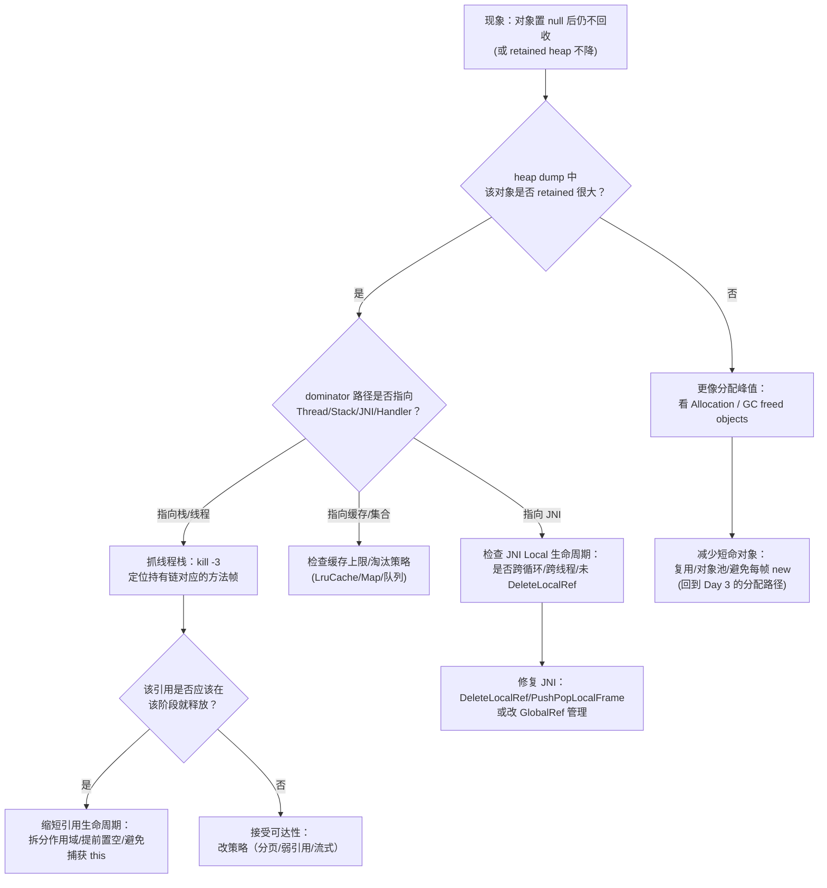

# Day 4：栈内存与帧结构（ART 视角）：从局部引用到 GC Roots

> 系列第 4 篇。Day 3 讲“对象如何分配到各个 space”，今天补上另一半：**对象为什么仍然可达**——很多时候答案不在堆里，而在**线程栈 / JNI 边界 / 寄存器与栈帧**里。

## 一句话结论（先看图）

- **GC Roots 不只来自 static/单例**：线程栈上的局部变量、寄存器里的引用、JNI Local/Global refs、线程对象等，都可能成为 Roots。
- **“我已经置 null 了怎么还没回收？”**：常见原因是（1）引用仍在当前/上层栈帧里；（2）异常路径/闭包/内联把引用“延长”；（3）JNI Local 没出栈；（4）Debugger/Profiler/挂起线程导致可达性暂存。

---

## 核心结构图：ART 线程栈、栈帧、引用如何被扫描

### 关键边界（避免把 HotSpot 经验硬套到 ART）

| 你看到的“栈” | ART 内部常见对应 | 是否会被当作 Java 引用扫描 | 备注 |
|---|---|---:|---|
| Java 方法调用栈 | Quick frame / Shadow frame | ✅ | 通过**栈图（stack map）**/寄存器映射枚举“哪些 slot 是引用” |
| JNI 调用链 | Managed ↔ Native 交界 | ✅（但走句柄表） | JNI Local/Global 通过 IndirectRefTable 维护 |
| 纯 Native C/C++ 栈 | Native stack | ❌（默认） | Native 指针不等价于 Java reference；需要 JNI 句柄才能安全追踪 |

---

## “局部变量”为什么能成为 GC Root：可达性从栈帧开始

### 1）局部变量表 ≠ 一定等于“仍可达”

你写的 Java 代码里，变量的“作用域结束”与运行时“引用是否还在栈上”并不总一致：

- 编译器/运行时可能让某个引用在寄存器或栈 slot 中**保留更久**（尤其在调试、内联、异常路径下）。
- ART 需要知道“哪里是 reference”，通常依赖 dex2oat/JIT 生成的 **stack map**（哪些寄存器/栈槽位含引用）。

### 2）Shadow frame vs Quick frame（只要知道差异，不用背实现）

| Frame 类型 | 常见出现时机 | 特点 | 你在排障中关心什么 |
|---|---|---|---|
| Quick frame | AOT/JIT 编译后的 quick code | 更接近机器栈帧 | “引用在哪里”靠 stack map/寄存器映射 |
| Shadow frame | 解释执行/去优化/部分运行时路径 | 结构更直接 | 更容易枚举 vreg 引用，但不代表更快 |

> 边界：不同 Android 版本与编译模式（AOT/JIT/解释）组合会变化；**本文只建立“扫描来源”的稳定心智模型**。

---

## 证据链：如何把“栈引用导致不回收”落到可观测信号

### 你能做的最小可复现（不依赖 root 权限）

| 目的 | 工具/命令 | 你要看什么 | 注意 |
|---|---|---|---|
| 拿到 Java 线程栈 | `adb shell kill -3 <pid>` | logcat 里的 Java stack traces | 会输出到系统日志；不同 ROM 输出位置略有差异 |
| 触发/观察 GC 行为 | `adb logcat | rg -i \"GC\\(|art\"` | GC 前后 freed bytes/objects 变化 | 日志标签在不同版本可能不同；只作为辅助证据 |
| 采集 heap dump | `adb shell am dumpheap <pid> /data/local/tmp/app.hprof` | dominator tree、retained size | 需要可读写路径/权限；导出后用 `adb pull` |

> 为什么 Day 4 要写这些命令：承接 Day 3 的要求——结论必须落到“可观测证据链”，而不是停留在概念解释。

---

## 排障决策流：怀疑“栈/帧持有导致对象无法回收”时怎么做

---

## 工程边界与常见误区（用“短表”说清）

| 误区 | 更准确的边界 | 对应行动 |
|---|---|---|
| “变量出了作用域就一定可回收” | 运行时可达性由**栈图/寄存器/栈槽位**决定，且可能比源码作用域更长 | 用 heap dump + 线程栈做证据链，不靠直觉 |
| “Native 栈里有指针就算 root” | Native 指针默认不是 Java reference；**JNI 句柄表**才是可追踪 root | 查 JNI Local/Global 的生命周期与跨线程使用 |
| “GC 一定马上把内存降回去” | 回收与归还 OS 页并不等价；不同空间/分配器行为不同 | 用 meminfo/heap dump/GC 日志联合判断 |

---

## AOSP 代码导航（用于“更深证据”，不是让你背源码）

> 只给路径：下一次要更深时，从这些点切入即可（不同分支/版本会有差异）。

- `art/runtime/thread.h` / `art/runtime/thread.cc`：线程结构、managed stack 的入口
- `art/runtime/stack.h` / `art/runtime/stack.cc`：栈与栈帧相关抽象
- `art/runtime/jni/`：JNIEnv 扩展、间接引用表（IndirectRefTable）相关
- `art/runtime/gc/`：Root 枚举与扫描（不同 collector 会有差异）

---

## 小抄：把“帧/栈/Root”映射回你日常排障语言

| 你说的现象 | 很可能对应 | 你优先查 |
|---|---|---|
| “某个 Activity 退出了还在” | 线程/Handler/消息队列持有引用或闭包捕获 | heap dump dominator + 主线程栈 |
| “循环里 JNI 调用导致内存涨” | JNI Local 没及时释放，或 LocalFrame 太大 | JNI 代码是否 `DeleteLocalRef` / `PushPopLocalFrame` |
| “只要打开 Profiler 就不一样” | 调试/采样改变执行与保活时机 | 关掉 profiler 复现；对比两次 dump |

