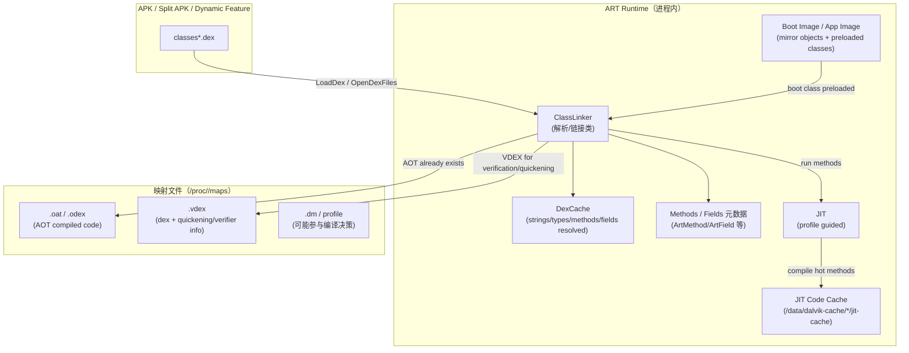
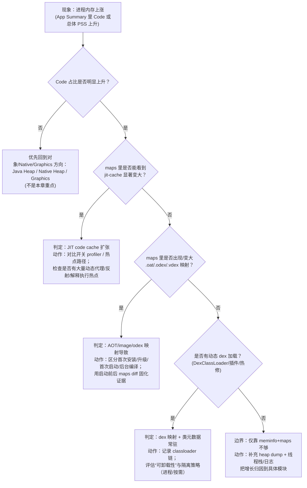

# Day 5：方法区/元数据空间（ART 视角）：ClassLinker、DEX/OAT/VDEX、JIT Code Cache 怎么在内存账单里“对上号”

> Day 4 讲清了 **“对象为什么还可达（GC Roots）”**。今天把“不是对象的那一坨内存”补齐：**类/方法元数据、已加载 dex、AOT/JIT 代码、镜像（boot image）**。目标不是背名词，而是能把它们在 `dumpsys meminfo` 和 `/proc/<pid>/maps` 里定位出来，形成可复用的证据链。

---

## 一句话结论（先看图）
- **ART 的“方法区”不是 HotSpot 的 Metaspace 复刻**：不要用 HotSpot 的概念直接套。ART 更像把“类/方法元数据 + dex/oat/vdex/odex + image + JIT code cache”分散在多个映射与堆结构里。
- 排查时优先问两件事：  
  1) **涨的是“映射文件（maps）”还是“运行时堆结构（native/java heap）”？**  
  2) **涨的是“代码（oat/jit-cache）”还是“数据（classes、dex、intern、reflection 等）”？**

---

## 核心结构图：从“加载 dex”到“类元数据 + 已编译代码”在内存里的落点



### 你在证据链里要“对齐”的字段（最常用）

| 你在问什么 | `dumpsys meminfo <pid|package>` 里优先看 | `/proc/<pid>/maps` 里优先 grep | 解释边界（别误判） |
|---|---|---|---|
| “是不是代码把内存顶上去了？” | `App Summary` 里的 `Code`（以及 `Graphics/Native/Java heap` 的占比） | `oat|odex|vdex|jit-cache` | `Code` 是聚合口径；要用 maps 把“到底是哪种 code”拆账 |
| “是不是类加载/反射/动态 dex 导致的元数据涨？” | `Java Heap` / `Native Heap` 变化 + heap dump 侧证 | `dex|vdex` 映射是否增多 + 是否出现 `base.apk!classes*.dex` 相关映射 | 类元数据很多在 native/匿名映射里，maps 只能给你“加载了什么文件”的线索 |
| “是不是启动/升级触发 dex2oat 导致波动？” | `Code` 的阶段性跳变 + `Objects/Views` 等保持稳定 | 新出现/变大的 `oat/vdex` 映射；或 `dalvik-cache` 路径变化 | 这类波动要按“阶段”解释：首次安装/升级/首次启动/后台编译 |

---

## 现象 → 机制 → 可观测信号：一张对照表（工程上最常用）

| 现象（你看到的） | 机制（你要想到的） | 你应该抓的证据（命令） | 你要得出的结论句式 |
|---|---|---|---|
| 进程常驻一段时间后 `Code` 缓慢上升 | JIT 热点累积，code cache 扩张 | `adb shell cat /proc/<pid>/maps | rg -n \"jit-cache|dalvik-cache\"` + `dumpsys meminfo` | “上涨主要来自 JIT code cache（maps 里 `jit-cache` 变大）” |
| 冷启动后 `Code` 直接跳一截 | 已存在 AOT / image 映射进入；或设备/ROM 策略不同 | 启动前后各抓一次 maps diff（见下） | “跳变来自映射 `.oat/.vdex`（新增映射数量/大小）而非 Java heap” |
| 引入 DexClassLoader/插件后内存涨、且难以回落 | 新 dex 映射 + 类/方法元数据常驻（ClassLinker/DexCache） | `maps` 中新增 dex/vdex 映射；heap dump 看 `Class`/`DexCache`/相关 classloader | “增长由动态 dex 加载引起，且类元数据不会因置 null 自动回落” |
| “关掉 profiler 就不涨/涨得慢” | 采样/插桩影响热点、触发更多编译/保活 | 两次同场景对比：开/关 profiler 的 meminfo+maps | “差异主要体现在 code cache（jit-cache）而非对象分配峰值” |

---

## 最小可执行证据链（不靠 root）：meminfo + maps 两段式

### 1）抓账单：`dumpsys meminfo`
```bash
adb shell dumpsys meminfo <package>
adb shell dumpsys meminfo <pid>
```

### 2）拆账：把 `Code` 拆到具体映射（oat / vdex / jit-cache）
```bash
adb shell cat /proc/<pid>/maps | rg -n "oat|odex|vdex|jit-cache|dalvik-cache|classes.dex"
```

### 3）做一次“前后对比”（最能避免空谈）
```bash
# 采两次（例如：冷启动刚进入首页 vs 使用 10 分钟后）
adb shell cat /proc/<pid>/maps > /data/local/tmp/maps_1.txt
adb shell cat /proc/<pid>/maps > /data/local/tmp/maps_2.txt
adb pull /data/local/tmp/maps_1.txt .
adb pull /data/local/tmp/maps_2.txt .

# 本地 diff（Windows PowerShell）
Compare-Object (Get-Content .\\maps_1.txt) (Get-Content .\\maps_2.txt) | Select-Object -First 200
```

> 这段是对 Day 4 的“证据链写法”做进一步落实：不只写概念，而是把“可观测信号 → 结论句式”固定下来，下一次遇到 code 相关内存问题可以直接复用。

---

## 决策流：看到 `Code`/`maps` 异常时怎么快速缩小范围



---

## 常见误区（用短表讲清边界）

| 误区 | 更准确的边界 | 你该怎么说/怎么做 |
|---|---|---|
| “方法区=Metaspace，都是类信息” | ART 中“类/方法元数据”分散在 runtime 结构与映射文件里 | 用 `meminfo` 定位“Code 占比”，再用 `maps` 拆到 `oat/vdex/jit-cache` |
| “`Code` 高就是泄漏” | `Code` 的涨可能是 JIT 正常累积，也可能是 dex2oat/升级波动 | 用 `maps` 做时间对比；别只用单点截图下结论 |
| “类卸载能自动回收” | App 进程里类卸载非常受限（很多场景几乎等同不可卸载） | 以“隔离/按需加载/多进程”作为工程策略讨论，而不是期待 GC 回收 |

---

## AOSP 源码路径（用来加深证据，不要求背）

- `art/runtime/class_linker.{h,cc}`：类链接/加载主入口（ClassLinker）  
- `art/runtime/dex/dex_file.*`：dex 文件抽象、打开/校验逻辑  
- `art/runtime/oat/oat_file.*`：oat/odex 映射与访问  
- `art/runtime/jit/*`：JIT 与 code cache（含内存管理策略）  
- `art/runtime/mirror/class.*`：`java.lang.Class` 等镜像对象侧的结构线索  

> 边界声明：不同 Android 大版本、以及 OEM/ROM 的编译与缓存策略会不同（AOT/JIT/后台编译触发时机、文件路径等）。本文把“证据链方法”固定下来，具体实现差异需要你在目标设备上用 `maps`/`meminfo` 复核。

