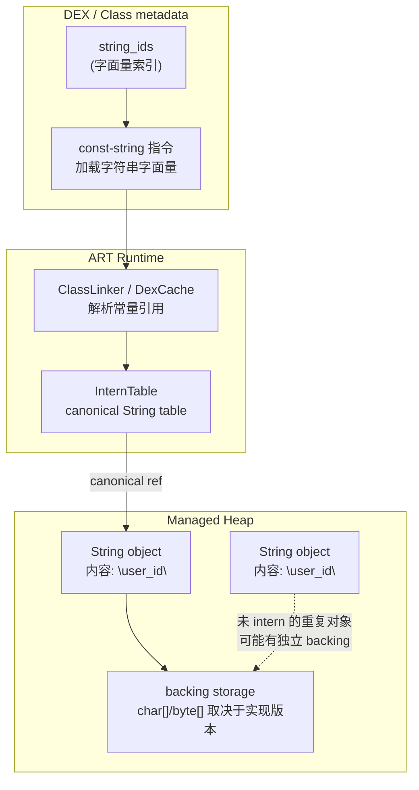
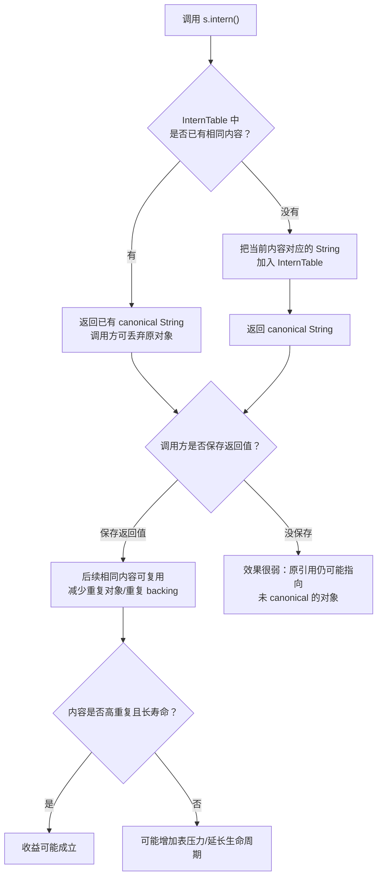
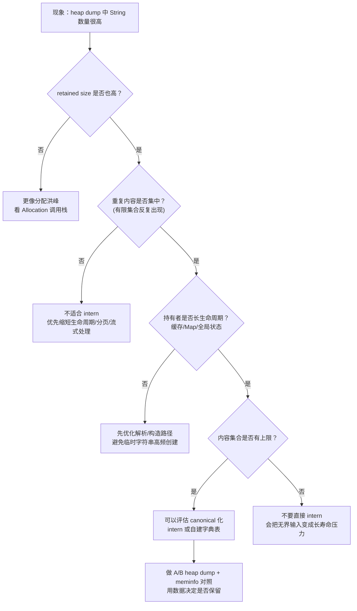

# Day 6：String 常量池与 intern() 机制（ART 视角）

> 系列第 6 篇。Day 5 把类元数据、DEX/OAT/VDEX、JIT Code Cache 的内存账单拆开；今天只盯一个高频对象：`String`。目标不是背“字符串常量池”，而是能判断：重复字符串到底是不是问题，`intern()` 能不能救，证据该从 heap dump、allocation 和引用链里怎么拿。

---

## 一句话结论（先看图）

- `intern()` 不是“省内存开关”，它是把字符串放进运行时的 **InternTable**，让相同内容复用同一个 canonical `String`。
- 它适合“高重复、长生命周期、内容集合有限”的字符串；不适合“低重复、一次性、用户输入/日志/网络 payload”。
- 排查必须先看证据：重复率、retained size、持有链、生命周期。没有这些，直接加 `intern()` 常常只是把临时对象变成更长寿命对象。

---

## 核心结构图：DEX 字符串、Java String、InternTable 的关系



> 边界：不要把 Android/ART 的实现直接套成 HotSpot 的字符串池模型。概念上都是 canonical string table，但对象布局、backing storage、压缩字符串策略、GC 交互要按目标 Android 版本的 libcore/ART 实现核对。

---

## `intern()` 的流程：命中复用，未命中驻留



---

## 什么时候值得考虑 `intern()`

| 场景 | 重复率 | 生命周期 | 是否适合 | 判断依据 |
|---|---:|---:|---|---|
| 协议字段名、固定枚举值、状态码 | 高 | 长 | 可以评估 | heap dump 中大量同内容 `String`，且内容集合有限 |
| JSON key、数据库列名、路由名 | 中高 | 中长 | 谨慎评估 | 重复明显，但要确认解析库/缓存是否已有复用 |
| 用户昵称、搜索词、日志片段 | 低 | 短 | 通常不适合 | 内容分散，驻留后可能更难回收 |
| 一次性网络 payload | 低 | 短 | 不适合 | 分配热点应从解析/切片/流式处理优化 |

---

## 证据链：先证明“重复字符串是主因”

### 1）heap dump 看 `String` 与 backing 占用

```bash
adb shell am dumpheap <package> /data/local/tmp/app.hprof
adb pull /data/local/tmp/app.hprof .
```

在 MAT / Android Studio Memory Profiler 里看：

| 视角 | 看什么 | 结论怎么写 |
|---|---|---|
| Histogram | `java.lang.String` 数量、浅大小、retained size | “String 数量高，但 retained 是否高要再看持有链” |
| Dominator Tree | 谁持有这些字符串 | “主要由缓存/Map/解析结果持有，而不是短命临时对象” |
| Duplicate strings | 相同内容重复次数 | “重复内容集中在有限集合，才有 canonical 化价值” |

### 2）Allocation 视图看字符串创建热点

如果 String 数量高但 retained 不高，更像分配洪峰：

- JSON/XML 解析时反复创建 key。
- 日志拼接或格式化创建临时字符串。
- 列表绑定中每帧/每项构造展示文案。

这时优先优化创建路径，而不是先 `intern()`。

### 3）对照实验：加 intern 前后必须可复现

| 实验步骤 | 要固定什么 | 要比较什么 |
|---|---|---|
| Baseline | 同设备、同数据集、同页面路径 | String 数量、retained size、GC 次数 |
| 加 canonical 化 | 只改字符串复用策略 | 重复字符串是否下降，PSS/Java heap 是否下降 |
| 压力回归 | 大数据量/长时间驻留 | InternTable 是否让长期内存更高 |

---

## 排障决策流：看到 String 很多时怎么判断



---

## `intern()` 的常见误区

| 误区 | 更准确的说法 | 处理方式 |
|---|---|---|
| “所有重复字符串都 intern” | 只有高重复、有限集合、长生命周期才可能收益稳定 | 先用 heap dump 证明重复集中 |
| “调用 `s.intern()` 就行” | 要使用返回值；原 `s` 不会自动变成 canonical 引用 | `s = s.intern()` 或在写入缓存前 canonical |
| “intern 一定省内存” | 低重复/无界输入会增加长期驻留压力 | 对用户输入、日志、payload 保持克制 |
| “String 多就是泄漏” | 可能只是短命分配洪峰 | 用 retained size 和 dominator path 区分 |

---

## 代码示例：只在写入长寿命集合前 canonical

这段代码表达的是策略边界：只对有限集合字段做 canonical，不对任意用户输入做 intern。

```kotlin
class EventStore {
    private val events = ArrayList<Event>()

    fun add(rawType: String, rawSource: String, userText: String) {
        val type = rawType.intern()
        val source = rawSource.intern()

        events += Event(
            type = type,
            source = source,
            userText = userText
        )
    }
}

data class Event(
    val type: String,
    val source: String,
    val userText: String
)
```

`type` 和 `source` 通常是有限集合，适合评估 canonical 化。`userText` 是无界输入，直接 intern 会把随机内容推向更长生命周期，风险比收益更高。

---

## AOSP/实现路径（用于继续深挖）

- `art/runtime/intern_table.*`：ART InternTable 相关实现入口。
- `art/runtime/mirror/string.*`：ART 中 `java.lang.String` mirror 侧结构线索。
- `libcore/ojluni/src/main/java/java/lang/String.java`：Android Java 层 `String` 行为与字段实现需按版本核对。
- `art/runtime/dex/dex_file.*`：DEX 字符串索引与常量解析的关联路径。

---

## 小抄：一句话判断

| 你看到的证据 | 优先结论 |
|---|---|
| String 数量高，但 retained 不高 | 分配洪峰，不是驻留问题 |
| 重复内容集中，且由长寿命缓存持有 | 可以评估 intern/自建字典 |
| 内容来自用户输入/日志/payload | 不要直接 intern |
| 加 intern 后 Java heap 降了但 GC pause 增加 | 继续做压力回归，不能只看单一指标 |
