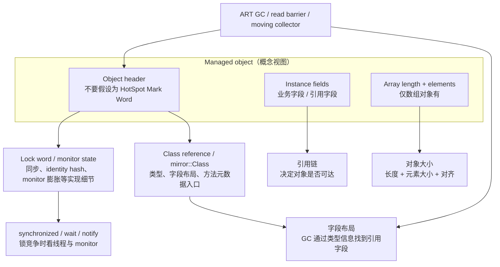
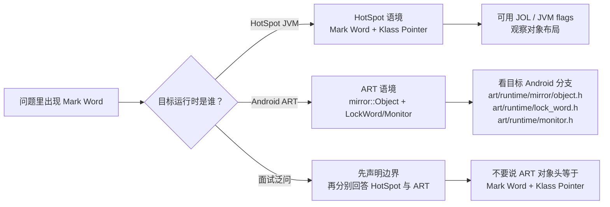
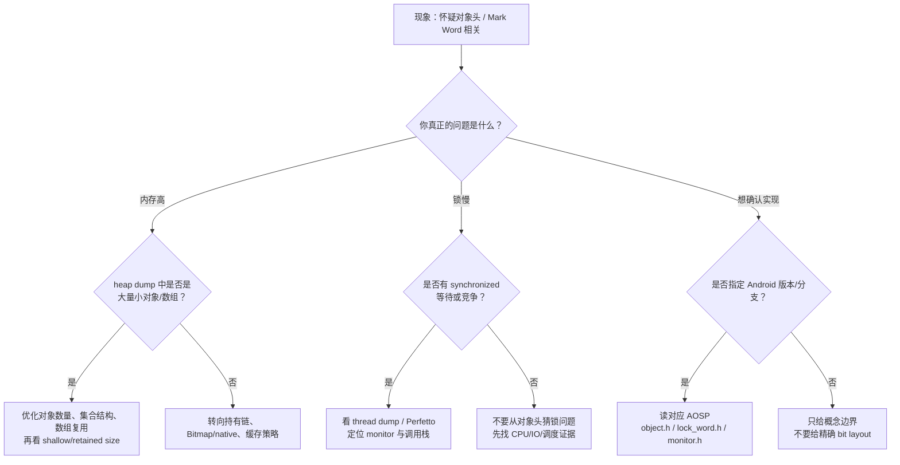

# Day 7：对象头结构与 Mark Word（ART 视角）

> 系列第 7 篇。今天先把坑填平：**Mark Word 是 HotSpot 的对象头术语，不是 Android ART 的通用模型**。在 Android 上讨论对象头，要回到 ART 的 `mirror::Object`、class 信息、lock/monitor 状态、数组长度、对齐和 GC 访问路径。

---

## 一句话结论（先看图）

- HotSpot 常讲“Mark Word + Klass Pointer”；Android ART 不应直接套这个口径。
- ART 更适合按“对象身份/类型信息 + 同步状态 + 实例字段/数组数据 + GC 可遍历信息”来理解。
- 真正影响 App 内存的，通常不是单个对象头的几个字节，而是**大量小对象、数组碎片、锁竞争、长期持有链**。

---

## 图 1：ART 对象的安全心智模型



> 读图边界：这不是 bit layout。不同 Android 版本、架构、GC、压缩引用和构建配置会改变细节。要确认具体字段，必须看目标分支 AOSP。

---

## 图 2：HotSpot Mark Word vs ART 说法边界



---

## 最小拆账表

| 你关心的问题 | ART 视角优先看什么 | 不要先看什么 |
|---|---|---|
| 对象属于哪个类 | `mirror::Class` / heap dump class name | HotSpot Klass Pointer 细节 |
| 对象有多大 | shallow size、字段数量、数组长度、对齐 | 单独背对象头字节数 |
| 为什么不能回收 | GC Roots、引用链、retained size | Mark Word bit |
| 为什么锁慢 | thread dump、Perfetto、monitor contention | heap dump 里的对象大小 |
| GC 如何扫描引用 | class metadata 的引用字段布局 | 把引用扫描想成对象头自带全部信息 |

---

## 图 3：排障决策流



---

## Android 工程里更有用的 4 个判断

| 判断 | 证据 | 常见结论句式 |
|---|---|---|
| 小对象太多 | heap dump Histogram：同类对象数量高 | “优化对象数比纠结对象头更有效” |
| 数组浪费 | 大量小数组 / 稀疏数组 / 装箱集合 | “换数据结构可能减少 header + element 开销” |
| 锁状态异常 | thread dump、Perfetto、monitor contention | “这是同步竞争，不是内存泄漏” |
| 持有链过长 | Dominator Tree / shortest path to GC root | “对象头不决定可达性，持有者决定生命周期” |

---

## 常见误区

| 误区 | 修正 |
|---|---|
| “ART 对象头 = Mark Word + Klass Pointer” | 这是 HotSpot 口径；ART 要按 `mirror::Object` 和目标分支核对 |
| “JOL 能直接说明 Android 对象布局” | JOL 主要面向 HotSpot；Android 上要看 ART 源码和设备证据 |
| “内存高先优化对象头” | 先看对象数量、数组、缓存、持有链、native/Bitmap |
| “锁信息能从 Java 直接读出来” | App 层通常看线程、Perfetto、日志和源码路径，不直接读 header bit |

---

## AOSP 源码入口（按目标分支核对）

| 入口 | 用来看什么 |
|---|---|
| `art/runtime/mirror/object.h` | `mirror::Object` 的对象基础结构入口 |
| `art/runtime/mirror/class.h` | 类型信息、字段布局、方法元数据入口 |
| `art/runtime/lock_word.h` | lock word 状态编码入口（具体版本可能变） |
| `art/runtime/monitor.h` | monitor、wait/notify、锁竞争相关入口 |
| `art/runtime/gc/heap.*` | GC、移动、对象访问与堆空间管理入口 |

---

## 小抄：面试/排障怎么答

```text
如果讨论 HotSpot：可以讲 Mark Word、Klass Pointer、锁状态、hash、GC age。
如果讨论 Android ART：先声明 Mark Word 不是通用术语，再讲 mirror::Object、class ref、lock/monitor、字段布局、数组长度、对齐和 GC 扫描路径。
如果讨论 App 内存优化：优先拿 heap dump / retained size / allocation / thread dump / Perfetto 证据，不从对象头 bit 开始猜。
```

