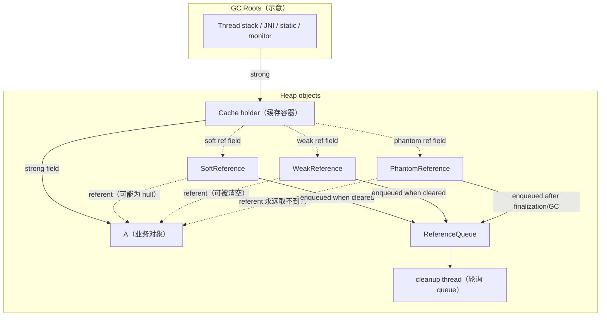
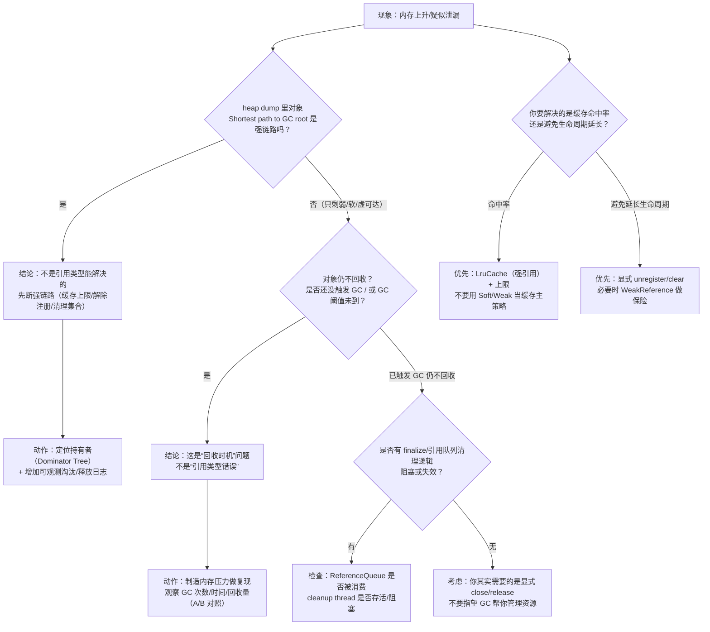

# Day 8：引用类型：强引用 / 软引用 / 弱引用 / 虚引用（Android/ART 视角）
> 系列第 8 篇。Day 7 我们强调：对象“是否回收”不由对象头/Mark Word 决定，而是由**可达性 + 引用链**决定。今天把“引用强度”这把刀磨锋利：你不仅要会背 `Strong/Soft/Weak/Phantom`，更要会把它们落到 **ReferenceQueue、GC 行为、缓存策略、Leak 排查证据链** 上。

---

## 一句话结论（先看图）
- **强引用**：只要链路可达，就不会被 GC 回收（除非整个链路断开）。  
- **软引用**：*“内存紧张时尽量回收”* 的提示，不是可靠缓存策略；不同版本/厂商策略差异大。  
- **弱引用**：只要下一次 GC 发现只剩弱可达，就可以回收；适合“观察者/回调/映射键值”这类不想延长生命周期的场景。  
- **虚引用**：永远拿不到对象本体，只用于“对象已不可达后”的**回收后通知**（配合 `ReferenceQueue` 做资源清理/追踪）。

---

## 图 1：可达性层级 + ReferenceQueue（核心结构图）



### 读图要点（边界声明）
| 点 | 你要记住的“工程边界” |
|---|---|
| `SoftReference` | **不是“保证留到 OOM 前”**；行为受 GC/内存压力/版本策略影响，不能当成稳定缓存。 |
| `WeakReference` | 不是“立刻回收”，而是“**下一次 GC 时**只剩弱可达就可能回收”；对象何时回收仍受 GC 触发时机影响。 |
| `PhantomReference` | `get()` 永远是 `null`；它解决的是“**回收后通知**”，不是“延迟回收”。 |
| `ReferenceQueue` | 真正可操作的落地点：你能在这里把“引用类型”接到“可观测动作”（清理 native/关闭 fd/移除表项）上。 |

---

## 四种引用类型对照（最短可复用表）

| 引用类型 | 是否阻止回收 | `get()` 是否能拿到对象 | 常见用途（Android） | 典型坑 |
|---|---:|---:|---|---|
| 强引用（Strong） | ✅ | ✅ | 一切正常对象图 | 缓存/单例持有导致生命周期过长（“不是泄漏但像泄漏”） |
| 软引用（SoftReference） | ❌（内存压力下优先回收） | ✅（可能突然变 `null`） | *不推荐*作为图片缓存；偶尔用于“可丢弃”的计算结果 | 以为它“更省内存/更稳定”；实际可能抖动、命中率差、难调参 |
| 弱引用（WeakReference） | ❌（下一次 GC 可回收） | ✅（可能很快变 `null`） | Listener/Callback、Map key（弱键）、避免延长生命周期 | 把它当缓存：GC 一来全没，导致反复创建/抖动 |
| 虚引用（PhantomReference） | ❌ | ❌（永远 `null`） | 资源清理信号：对象回收后触发清理逻辑（配合 queue） | 误以为能“拿回对象做最后一次使用” |

---

## Android 场景落地：应该用哪种？

| 场景 | 推荐策略 | 不推荐/原因 | 证据链怎么验证 |
|---|---|---|---|
| 图片缓存（Bitmap） | 用成熟库（如 Glide）自带内存/磁盘缓存 + Pool；按容量淘汰 | 用 `SoftReference<Bitmap>`：回收策略不可控、抖动大 | `dumpsys meminfo` + heap dump 看 Bitmap/byte[] retained；观察 GC 频率与抖动 |
| 监听器注册（Activity/Fragment 生命周期） | 明确 unregister；必要时用 `WeakReference` 做“保险” | 只靠弱引用：逻辑可能丢回调、时序不可控 | LeakCanary/heap dump 查看“Shortest path to GC root” |
| Handler/消息队列 | 使用静态 Handler + `WeakReference` 指向外部；及时移除消息 | 匿名内部类/非静态持有外部：延长生命周期 | heap dump 找 `Message` 链路；结合 thread dump 看主线程 backlog |
| 大对象缓存（如解析后的模型） | LruCache（强引用）+ 合理上限 + 可观测淘汰日志 | 用软引用“让系统管”：不可预测 | A/B 对照：命中率、GC pause、PSS 变化（见下方命令模板） |

---

## 证据链模板：把“引用类型”落到可观测信号

### 1）heap dump：确认“是谁持有”而不是猜引用类型
```bash
adb shell am dumpheap <package> /data/local/tmp/app.hprof
adb pull /data/local/tmp/app.hprof .
```

在 MAT / Android Studio Memory Profiler 里优先看：
| 视角 | 看什么 | 你要写下的结论句式 |
|---|---|---|
| Dominator Tree | 谁在强持有（retained 大） | “主要由 X 缓存/单例持有，生命周期过长” |
| Shortest path to GC roots | 强链路是否存在 | “对象并非仅弱可达；存在强链路：A → … → Root” |
| Histogram | 数量/体量变化 | “数量高但 retained 不高：更像分配峰值而非驻留” |

### 2）meminfo + maps：验证“压力来自哪一块”
```bash
adb shell dumpsys meminfo <package> | head -n 120
adb shell cat /proc/$(adb shell pidof <package>)/maps | rg -n "anon|dalvik|jit-cache|oat|vdex" | head
```

> 结论边界：**Soft/Weak 不是“省内存开关”**。你要用 meminfo/maps/heap dump 证明：压力来自 Java heap、Native、Graphics 还是 Code，避免只在引用类型上打转。

---

## 图 2：排障/决策流（如何选引用类型 + 如何排“像泄漏”的问题）



---

## 最小代码骨架：ReferenceQueue 驱动的“回收后清理”（虚引用典型用法）
> 只展示结构意图：当对象被回收后，把清理动作从“靠 finalizer”挪到“可控的 queue 消费线程”。

```kotlin
class ResourceTracker {
    private val queue = java.lang.ref.ReferenceQueue<Any>()
    private val refs = java.util.concurrent.ConcurrentHashMap<java.lang.ref.PhantomReference<Any>, () -> Unit>()

    fun track(target: Any, cleanup: () -> Unit) {
        val ref = java.lang.ref.PhantomReference(target, queue)
        refs[ref] = cleanup
    }

    fun start() {
        Thread {
            while (true) {
                val ref = queue.remove() as java.lang.ref.PhantomReference<Any>
                refs.remove(ref)?.invoke()
                ref.clear()
            }
        }.apply { isDaemon = true; name = "ref-queue-cleaner" }.start()
    }
}
```

边界说明：
- 这不是“保证及时释放”的魔法；它只是把“对象已被回收”变成**可观测事件**。  
- 资源管理优先级仍然是：**显式 close/release > 引用队列辅助清理 > finalizer（不推荐）**。

---

## AOSP / 源码入口（按目标分支核对）
| 路径 | 用来确认什么 |
|---|---|
| `libcore/ojluni/src/main/java/java/lang/ref/Reference.java` | Reference 基类与队列入队行为 |
| `libcore/ojluni/src/main/java/java/lang/ref/SoftReference.java` | 软引用语义与实现提示 |
| `libcore/ojluni/src/main/java/java/lang/ref/WeakReference.java` | 弱引用语义 |
| `libcore/ojluni/src/main/java/java/lang/ref/PhantomReference.java` | 虚引用语义（`get()` 永远 `null`） |
| `art/runtime/gc/reference_processor.*` | ART 如何处理 Reference（入队/清理/与 GC 的交互） |

---

## 小抄：一句话选型
| 你要的效果 | 优先选 |
|---|---|
| “对象必须活着” | 强引用 + 明确生命周期管理 |
| “不想延长生命周期（但允许偶尔拿不到）” | 弱引用（并接受 `null`） |
| “需要缓存命中率可控” | LruCache（强引用）+ 上限 + 观测 |
| “对象回收后触发清理通知” | 虚引用 + ReferenceQueue（或更直接的显式释放） |

