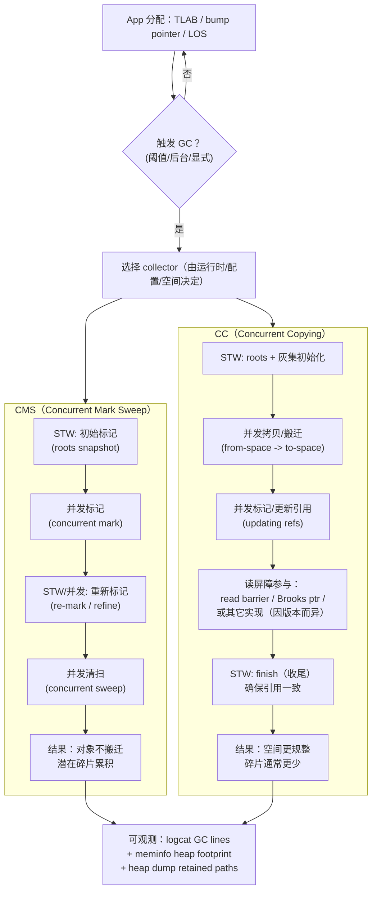
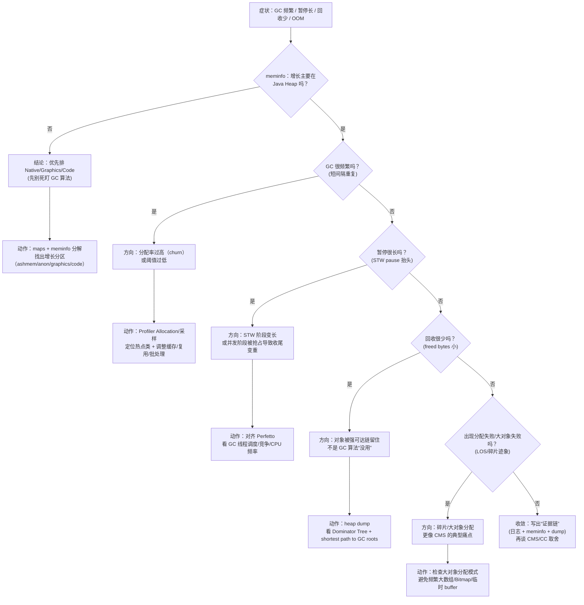

# Day 9：ART GC 算法：CMS vs CC（Concurrent Copying）

> 系列第 9 篇。目标：把“GC 名词”落到 **执行路径 + 可观测证据 + 可排障决策** 上。

---

## 一句话结论（先看图）

- **CMS（Concurrent Mark Sweep）**：以并发标记 + 清扫为主，**不搬对象**（或极少搬），优点是实现路径直观；代价通常是 **碎片 + 分配失败/回退** 风险更高。
- **CC（Concurrent Copying）**：以 **并发搬迁** 为主（moving GC），通过 **read barrier / 读屏障** 保证并发可达性正确；优点通常是 **降低碎片、回收更“干净”**，代价是 **读屏障开销 + 搬迁复杂度**。

> 边界声明：不同 Android 版本/ROM 的默认 collector 组合、日志字段、读屏障实现细节可能不同；本文给出“可核对入口 + 观测手段”，避免把某个版本当成永恒真理。

---

## 图 1：两条执行路径（核心结构/执行路径图）



---

## CMS vs CC：工程取舍速查（对比矩阵）

| 维度 | CMS | CC（Concurrent Copying） |
|---|---|---|
| 是否 moving | 通常 **non-moving** | **moving**（搬迁对象） |
| 主要收益 | 并发标记降低停顿（相对纯 STW） | **降低碎片**、回收后空间更“干净” |
| 常见代价 | **碎片**、分配失败时可能触发更重 GC/回退路径 | **读屏障开销**、搬迁/引用更新复杂 |
| 你更可能看到的现象 | “回收了不少，但后续分配仍失败/抖动” | “单次 GC 回收更彻底，但 CPU/读屏障成本可能上升” |
| 排障关键点 | 碎片/大对象分配失败、LOS 行为 | 读屏障相关成本、并发阶段线程竞争/调度 |

---

## 证据链：把“我觉得 GC 有问题”变成可复现数据

### 1）先确认问题属于哪一类内存

| 现象 | 优先看 | 你要回答的问题 |
|---|---|---|
| GC 很频繁 | Allocation rate / 分配热点 | “是对象 churn 还是泄漏？” |
| GC 暂停很长（jank） | GC pause + 线程调度 | “暂停发生在哪个阶段？STW 还是并发被抢占？” |
| 回收很少（回收后还很大） | Retained paths / Dominator | “是谁把对象留住了（强可达链）？” |
| OOM 但 Java heap 不大 | native/graphics/code | “压力其实在 Native/Graphics/Code 吗？” |

### 2）最小可执行命令（logcat + meminfo + maps）

```bash
# 2.1 GC 日志（不依赖特定 tag：先粗筛）
adb logcat -v time | rg -n "GC\\s|Concurrent|mark sweep|copying|freed|pause"

# 2.2 看 Java/Native/Graphics/Code 哪块在涨
adb shell dumpsys meminfo <package> | head -n 160

# 2.3 结合映射（判断 anon / dalvik / jit-cache / oat 等）
adb shell cat /proc/$(adb shell pidof <package>)/maps | rg -n "anon|dalvik|jit-cache|oat|vdex" | head
```

> 备注：不同版本可用的 ART GC tag/property 不一致；如果你知道设备支持的 tag，再做更精确的过滤即可。但不要把“开不了某个 tag”当成无法排障的理由——先抓到 GC 行，再逐步细化。

### 3）把 GC 暂停和主线程卡顿对齐（必要时）

```bash
# Perfetto：抓 sched + atrace（示例，具体选项按设备能力调整）
adb shell perfetto -o /data/misc/perfetto-traces/gc.perfetto-trace -t 20s \
  sched freq idle am wm gfx view binder_driver hal dalvik \
  --txt
adb pull /data/misc/perfetto-traces/gc.perfetto-trace .
```

> 你要对齐的是：GC 相关线程的运行/阻塞 + 主线程长帧（jank）是否同一时间窗。

---

## 图 2：排障决策流（Troubleshooting / Decision Flow）



---

## AOSP / 源码入口（按目标 Android 分支核对）

| 路径 | 你用它确认什么 |
|---|---|
| `art/runtime/gc/collector/concurrent_mark_sweep.*` | CMS 核心阶段（mark/sweep） |
| `art/runtime/gc/collector/concurrent_copying.*` | CC 核心阶段（copy/evacuation） |
| `art/runtime/gc/heap.*` | 触发条件、空间/阈值、与 collector 的协作 |
| `art/runtime/gc/space/*` | region/LOS/其他 space 行为差异 |
| `art/runtime/gc/reference_processor.*` | Reference（Soft/Weak/Phantom）处理边界 |

---

## 小抄：一句话把问题说清楚（面试/复盘可直接复用）

| 你看到的现象 | 更可能的根因表达（比“GC 不行了”更可行动） |
|---|---|
| GC 很频繁 | “分配率过高（对象 churn），需要先降分配/提升复用” |
| 暂停很长 | “STW 阶段变长或并发阶段被抢占，需对齐 Perfetto 看调度/竞争” |
| 回收很少 | “强可达链留住对象，优先 heap dump 做 retained 分析” |
| 大对象/分配失败 | “碎片或 LOS 分配模式问题，先修分配模式再谈换 collector” |

