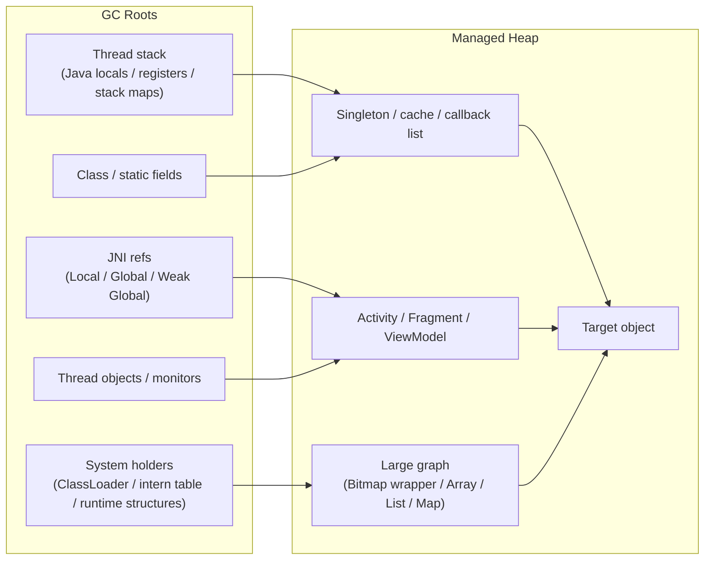
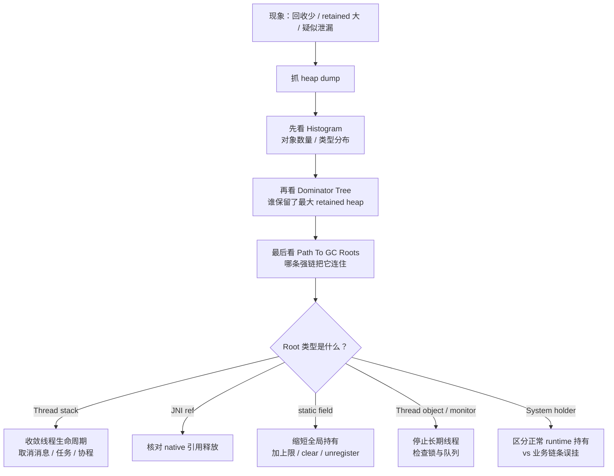
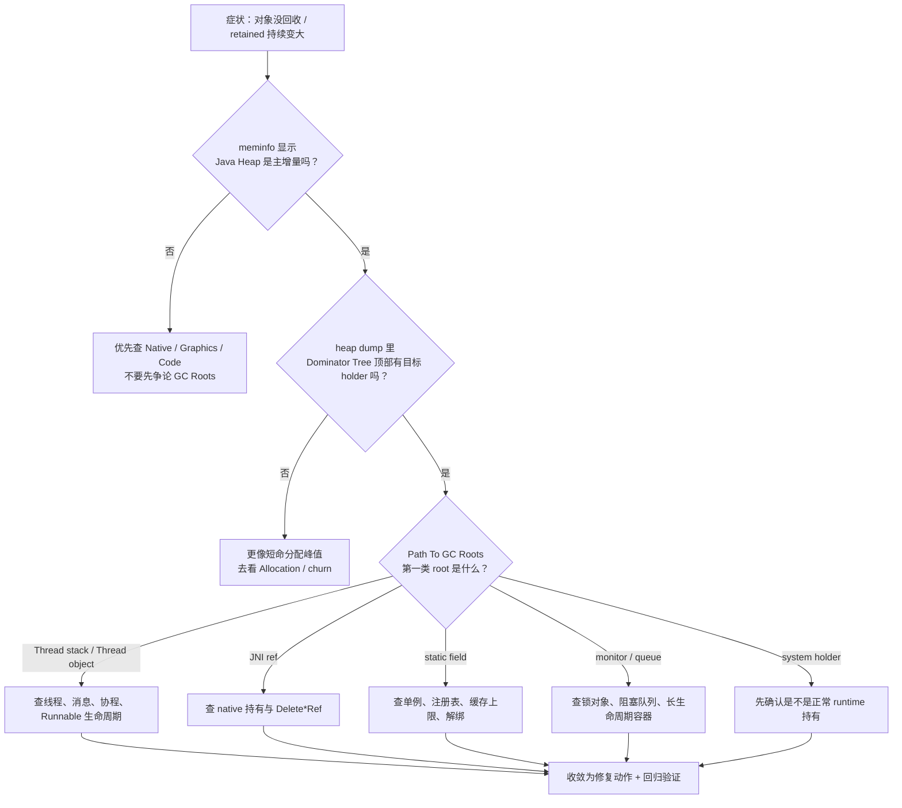

# Day 10：GC Roots 枚举与可达性分析
> 系列第 10 篇。目标不是背“哪些算 Root”，而是把 **roots 分类 -> 强引用链 -> heap dump/MAT 证据 -> 修复动作** 串成一条可复现路径。

---

## 一句话结论
- **对象没回收，先问“谁把它连到了 GC Roots”，再问“为什么这条强链还存在”。**
- **GC Roots 只是起点，不是结论**。真正决定 retained size 的，是 `Root -> ... -> Holder -> Target` 这条强可达链。
- **排障闭环要落到工具**：`am dumpheap` / Android Studio Memory Profiler / MAT 的 `Dominator Tree`、`Path To GC Roots`、`Histogram`。

---

## 图 1：GC Roots 分类 -> 可达性闭环（核心结构图）



### 读图规则
| 你看到什么 | 你该怎么判断 |
|---|---|
| `Thread stack` 连到目标 | 先怀疑“方法还没返回 / 线程长期存活 / 消息队列没清掉” |
| `JNI refs` 连到目标 | 先查 native 层有没有忘记 `DeleteLocalRef` / `DeleteGlobalRef` |
| `static fields` 连到目标 | 先查单例、静态缓存、注册表、全局 listener |
| `Thread objects / monitors` 连到目标 | 先查工作线程、线程池任务、锁对象、阻塞队列 |
| `System holders` 连到目标 | 先区分是正常 runtime 持有，还是业务对象被间接挂住 |

---

## Roots 分类速查表：从“类型”直接跳到“证据”

| Root 类型 | 常见 Android 场景 | 你在 heap dump / MAT 里会看到什么 | 优先动作 |
|---|---|---|---|
| Java 栈帧 | Activity 销毁后，后台线程仍在跑；匿名内部类回调未结束 | `Path To GC Roots` 指向某个 `Thread`、`Runnable`、局部变量槽位 | 让任务结束、取消协程/消息、缩短对象暴露范围 |
| JNI Local / Global Ref | native 解码、第三方 SDK、手写 JNI 缓存对象 | Root 指向 JNI 相关 holder；Java 侧链条很短但始终活着 | 查 native 生命周期，核对 `Delete*Ref` |
| 静态字段 | 单例、对象池、缓存、全局注册中心 | `Class` -> `static field` -> holder -> target | 清空静态表、改成有上限的缓存、解绑生命周期 |
| 线程对象 | `HandlerThread`、线程池、长期活跃 worker | `Thread` / `ThreadGroup` / `MessageQueue` 相关链路 | 停线程、移除消息、让 worker 可退出 |
| Monitor / 同步结构 | 锁对象长期挂在队列或阻塞结构上 | Root 经 monitor 或同步容器进入业务图 | 查锁对象是否兼任业务对象 holder |

---

## 图 2：从 heap dump 到结论的最短路径（证据流）



---

## 最小可执行清单：真的把 root 路径抓出来

### 1. 抓 heap dump
```bash
adb shell am dumpheap <package> /data/local/tmp/app.hprof
adb pull /data/local/tmp/app.hprof .
```

### 2. 在 Android Studio / MAT 里按这个顺序看
| 视图 | 先看什么 | 你要写下的结论句式 |
|---|---|---|
| `Histogram` | 哪类对象数量暴涨 | “对象数量高，先区分是短命 churn 还是长期 retained。” |
| `Dominator Tree` | 谁的 retained heap 最大 | “主要由 X 持有，真正需要修的是 X，不是目标对象本身。” |
| `Path To GC Roots` | 第一条强链来自哪类 root | “对象被 `Thread/static/JNI/...` 链接到 Root，生命周期没有断开。” |
| `Merge Shortest Paths` | 多个实例是否共享同一 holder | “多个实例都挂在同一个 holder 上，修一个点能一起释放。” |

### 3. 用 `meminfo` 先确认真的是 Java heap 压力
```bash
adb shell dumpsys meminfo <package> | head -n 160
adb shell cat /proc/$(adb shell pidof <package>)/maps | rg -n "anon|dalvik|jit-cache|oat|vdex|ashmem" | head
```

> 如果增长主要在 `Native Heap`、`Graphics`、`Code`，先别把锅甩给 GC Roots。

---

## 排障矩阵：看到什么，就先怀疑什么

| 现象 | 更像哪类问题 | 对应 root 入口 | 第一证据 |
|---|---|---|---|
| `freed bytes` 很少，但 Java Heap 很大 | 强可达链没断 | `static` / `Thread` / `JNI` | `Path To GC Roots` |
| Activity 退出后对象仍驻留 | 生命周期解绑失败 | `Thread stack` / `MessageQueue` / `static` | `Dominator Tree` + `Thread` 链 |
| Java Heap 不高但总内存高 | 不是 roots 主问题 | `Native/Graphics/Code` | `dumpsys meminfo` |
| 多实例一起泄漏 | 共享 holder | `static cache` / registry / singleton | `Merge Shortest Paths` |
| Java 对象只剩很短链，却长期不释放 | native 侧仍持有 | `JNI Global Ref` | JNI root 路径 |

---

## 图 3：Troubleshooting / Decision Flow



---

## ART / AOSP 入口：不要只会看图，要知道源码从哪进

| 路径 | 用来确认什么 |
|---|---|
| `art/runtime/thread.cc` / `thread.h` | 线程、栈、TLS、root 相关线程上下文 |
| `art/runtime/jni/jni_env_ext.cc` / `jni_env_ext.h` | JNI Local/Global/WeakGlobal 引用表 |
| `art/runtime/gc/heap.cc` / `heap.h` | GC 入口、root visitor 调度、collector 协作 |
| `art/runtime/gc/root_visitor.h` | root 枚举 visitor 抽象 |
| `art/runtime/gc/reference_processor.*` | 引用类型与 root tracing 的交界 |
| `art/runtime/class_linker.cc` | `Class`、静态字段、类相关 holder |

> 边界声明：具体 root 枚举细节会随 Android 分支变化。这里给的是“排障入口”，不是假装所有版本完全一致。

---

## 这篇要带走的 4 句工程话术

| 场景 | 更好的表述 |
|---|---|
| 对象没回收 | “先定位是哪类 GC Root 通过强链把它留住。” |
| 想直接怪 GC | “先用 `meminfo` 确认是不是 Java heap，再看 heap dump。” |
| 看到大量对象 | “数量高不等于泄漏，要看 retained 和 root path。” |
| 想立刻改缓存策略 | “先修 holder，再谈缓存；根因通常在生命周期和持有链。” |
