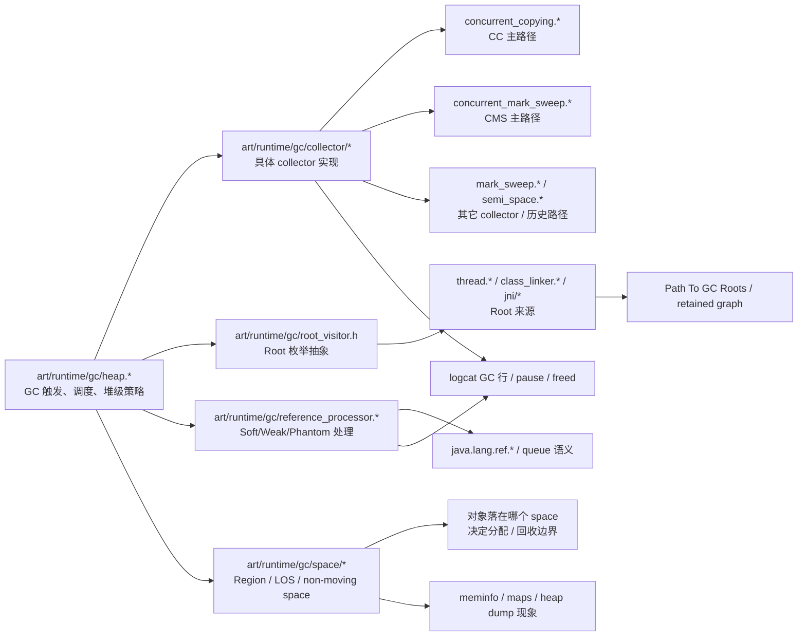
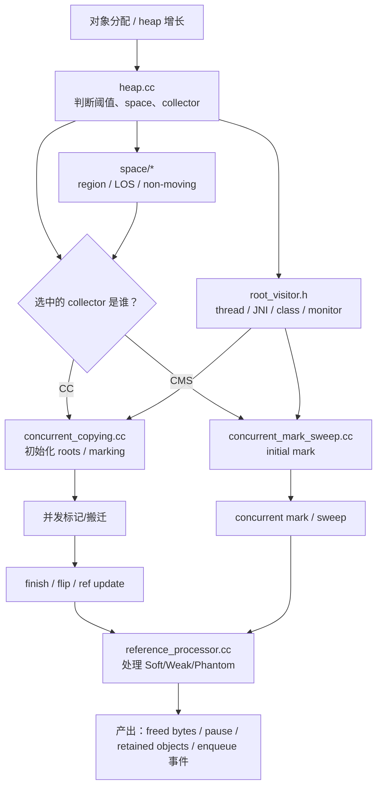
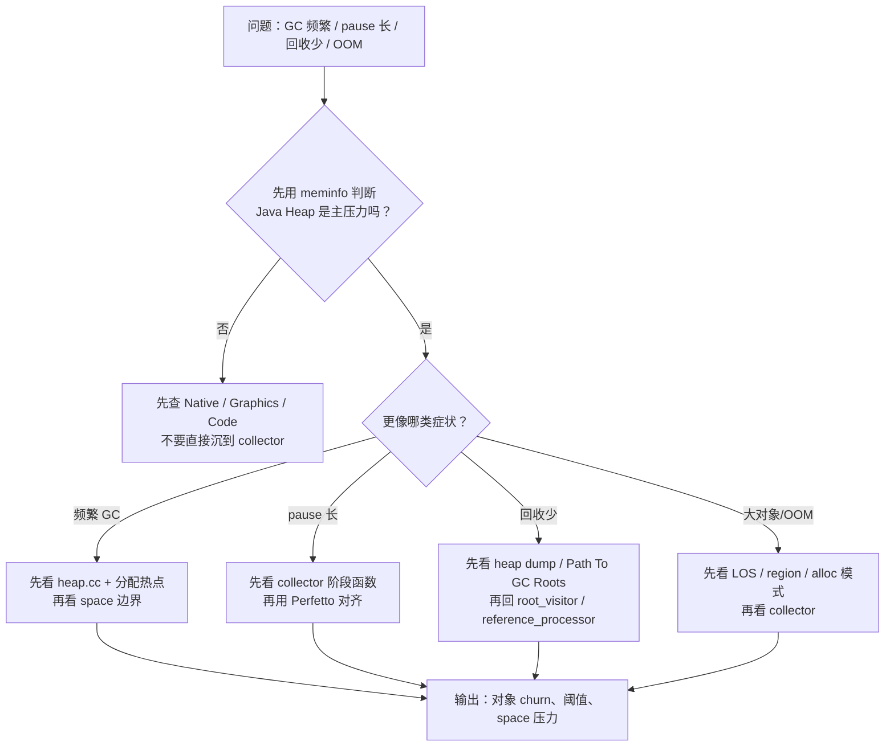

# Day 11：ART GC 源码：`gc/collector/` 目录关键路径
> 系列第 11 篇。目标不是“把源码文件名背下来”，而是把 **`heap -> collector -> root visitor -> reference processor -> space`** 串成一条可排障、可搜索、可验证的工程路径。

---

## 一句话结论
- **排查 GC，不要先钻 `collector/` 单个文件。先看 `heap.cc` 如何调度，再看 collector 阶段，再回到 root/reference/space。**
- **`collector/` 只回答“这次 GC 怎么执行”，不单独回答“为什么回收少/为什么卡顿/为什么 OOM”。** 这些问题必须回到 `root path`、`space`、日志和 trace。
- **源码阅读最有效的方式不是顺着文件从头读到尾，而是建立“路径索引 + 可观测信号 + 搜索命令”三件套。**

---

## 图 1：ART GC 源码目录关系图（核心结构 / 执行入口）



### 读图规则

| 你要回答的问题 | 先看哪里 | 不够时再跳到哪里 |
|---|---|---|
| 这次 GC 为何触发、选了什么 collector？ | `heap.*` | `collector/*` |
| 这次 pause 长在哪里？ | `collector/*` 的阶段函数 | Perfetto 调度轨迹 |
| 回收为什么少？ | `root_visitor` + heap dump | `reference_processor.*` |
| 大对象/碎片/space 边界在哪里？ | `space/*` | `collector/*` |
| `Soft/Weak/Phantom` 在 GC 里何时处理？ | `reference_processor.*` | `collector/*` 调用点 |

---

## 源码入口表：别从文件名猜职责

| 路径 | 主要职责 | 你排障时用它确认什么 | 可观测信号 |
|---|---|---|---|
| `art/runtime/gc/heap.cc` | GC 触发、堆状态、collector 协作 | 为什么现在收、收哪一类 space、和 allocator 怎么联动 | `logcat` GC 行、heap footprint、阈值变化 |
| `art/runtime/gc/collector/concurrent_copying.cc` | CC 的标记、搬迁、收尾路径 | pause 是否集中在 flip / remark / finish | GC pause、Perfetto 中 GC 线程运行段 |
| `art/runtime/gc/collector/concurrent_mark_sweep.cc` | CMS 的标记/清扫路径 | 回收后为何仍可能有碎片或后续分配失败 | freed bytes、后续 alloc/LOS 压力 |
| `art/runtime/gc/root_visitor.h` | Root 枚举抽象接口 | roots 从哪里进来，哪些对象天然长寿命 | `Path To GC Roots`、thread/JNI/class holder |
| `art/runtime/gc/reference_processor.cc` | Reference 清理/入队 | `Soft/Weak/Phantom` 何时 clear / enqueue | `ReferenceQueue` 行为、回收后清理线程 |
| `art/runtime/gc/space/region_space.cc` | region 管理、分配边界 | CC/分代/region 行为是否影响对象存活布局 | heap dump 中对象分布、meminfo Java Heap 变化 |
| `art/runtime/gc/space/large_object_space.cc` | 大对象空间 | 大 Bitmap/大数组为何与普通对象回收观感不同 | `Large object` 分配失败、maps/meminfo 增长 |

---

## 图 2：从分配压力到 GC 阶段的执行路径



### 这张图要带走的工程判断

| 现象 | 更像哪一层的问题 | 先别误判成什么 |
|---|---|---|
| GC 频繁 | `heap.*` 阈值、对象 churn、space 压力 | “collector 算法不行” |
| pause 长 | `collector/*` 阶段 + 调度竞争 | “一定是对象太多” |
| 回收少 | `root_visitor` / retained graph | “GC 没工作” |
| 大对象分配失败 | `large_object_space` / 碎片 / 分配模式 | “所有 OOM 都是泄漏” |
| `ReferenceQueue` 无消费 | `reference_processor` 后续清理路径 | “Weak/Phantom 自己会完成资源释放” |

---

## 源码搜索最小命令集

> 前提：你本地有 AOSP checkout。没有就先把本文当索引，不要假装已经验证了分支细节。

```bash
# 1. 快速看 heap 如何调 collector
cd <aosp>/art/runtime/gc
rg -n "CollectGarbage|Request|TransitionCollector|RunPhases" heap.cc heap.h collector

# 2. 直接抓 CC / CMS 的阶段函数
rg -n "RunPhases|InitializePhase|MarkingPhase|CopyingPhase|ReclaimPhase|FinishPhase" collector/concurrent_copying.cc collector/concurrent_mark_sweep.cc

# 3. 看 roots 从哪里汇入 GC
rg -n "VisitRoots|RootVisitor|Thread::|ClassLinker|JNI" . -g "!**/*.o"

# 4. 看 Reference 处理点
rg -n "ProcessReferences|Enqueue|ClearReferent|Phantom|SoftReference|WeakReference" reference_processor.* collector

# 5. 看大对象 / region 边界
rg -n "LargeObject|RegionSpace|AllocLargeObject|Evacuate" space collector heap.cc
```

### 命令输出怎么读

| 搜索结果 | 说明什么 | 下一步 |
|---|---|---|
| `heap.cc` 里有阶段调度 | 先确认 GC 是堆策略触发，不是单 collector 自说自话 | 回去对 `meminfo` / alloc 场景 |
| `collector/*` 里阶段名清晰 | 这部分适合对 pause、trace 分段 | 去 Perfetto 对齐线程运行 |
| `VisitRoots` 来源分散 | root 枚举跨 thread/JNI/class，不要只盯 GC 文件夹 | 去 heap dump 看 root 类型 |
| `ProcessReferences` 调用在 collector 尾部 | 引用类型处理是 GC 路径的一部分，不是 Java 层独立事件 | 对齐 `ReferenceQueue` 清理逻辑 |

---

## 观测矩阵：源码路径如何映射到真实工具

| 你手里的证据 | 对应源码层 | 你应该得出的结论 |
|---|---|---|
| `adb logcat -v time | rg "freed|paused|Concurrent|GC"` | `heap.*` + `collector/*` | 先知道这次 GC 做了什么，再猜原因 |
| `dumpsys meminfo <package>` | `heap.*` + `space/*` | 先确认压力在 Java Heap、Native、Graphics 还是 Code |
| `am dumpheap` + MAT Dominator | `root_visitor` | 回收少通常是强可达链没断，不是“GC 失灵” |
| `Path To GC Roots` | `root_visitor` + thread/JNI/class 入口 | 根因往往在 holder 生命周期 |
| Perfetto `sched + dalvik` | `collector/*` 阶段线程 | pause 长要看阶段和调度，不要只看一行 GC 日志 |

### 最小命令块

```bash
adb logcat -v time | rg -n "freed|paused|Concurrent|GC"
adb shell dumpsys meminfo <package> | head -n 160
adb shell am dumpheap <package> /data/local/tmp/app.hprof && adb pull /data/local/tmp/app.hprof .
adb shell perfetto -o /data/misc/perfetto-traces/gc.perfetto-trace -t 15s sched dalvik --txt
```

---

## 图 3：源码阅读 / 排障决策流



---

## 阅读边界：哪些结论不能假装已经确认

| 容易说过头的话 | 更严谨的写法 |
|---|---|
| “Android 都默认用 CC” | “不同 Android 版本 / ROM / 进程形态下 collector 组合可能不同，先按目标分支确认。” |
| “回收少就是 GC 算法问题” | “回收少更常见是强可达链未断，先看 retained path。” |
| “`SoftReference` 能当缓存” | “它可以被系统提前清掉，不能当稳定缓存策略。” |
| “看 `collector/` 就能解释所有内存问题” | “GC 解释执行路径；根因仍要结合 root、space、日志、heap dump。” |

---

## 这篇要记住的 5 句工程话术

| 场景 | 更好的表达 |
|---|---|
| 想开始读 GC 源码 | “先从 `heap.cc` 建立调度图，再下钻 collector 阶段。” |
| 日志里看到 GC | “先把这次 GC 的阶段和结果说清，再追根因。” |
| 回收很少 | “先看 `Path To GC Roots`，确认是不是 holder 生命周期问题。” |
| pause 很长 | “把 GC 线程放到 Perfetto 上，看阶段和调度竞争。” |
| 想优化 collector | “先证明瓶颈在 GC 路径，而不是 alloc churn、LOS 或 Native。” |

