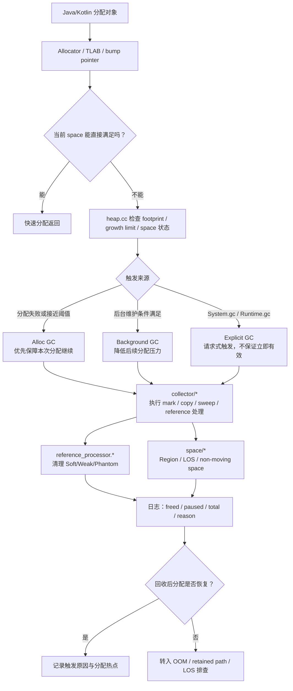
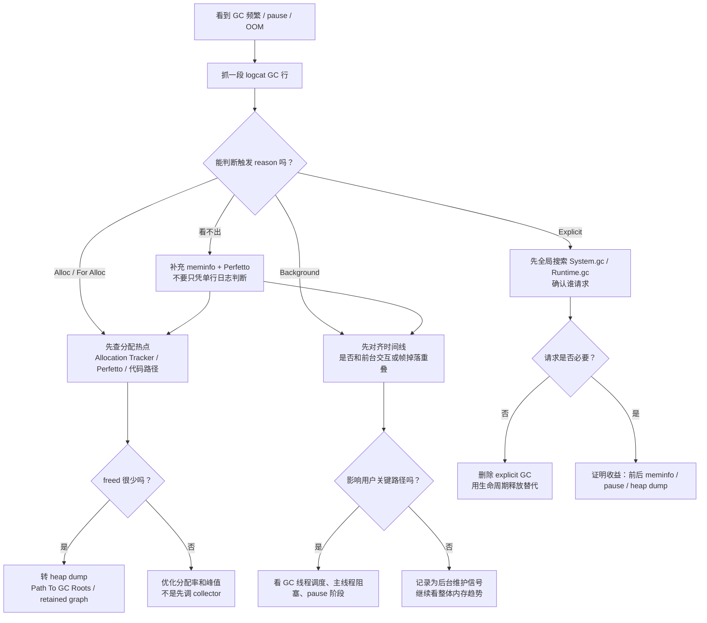
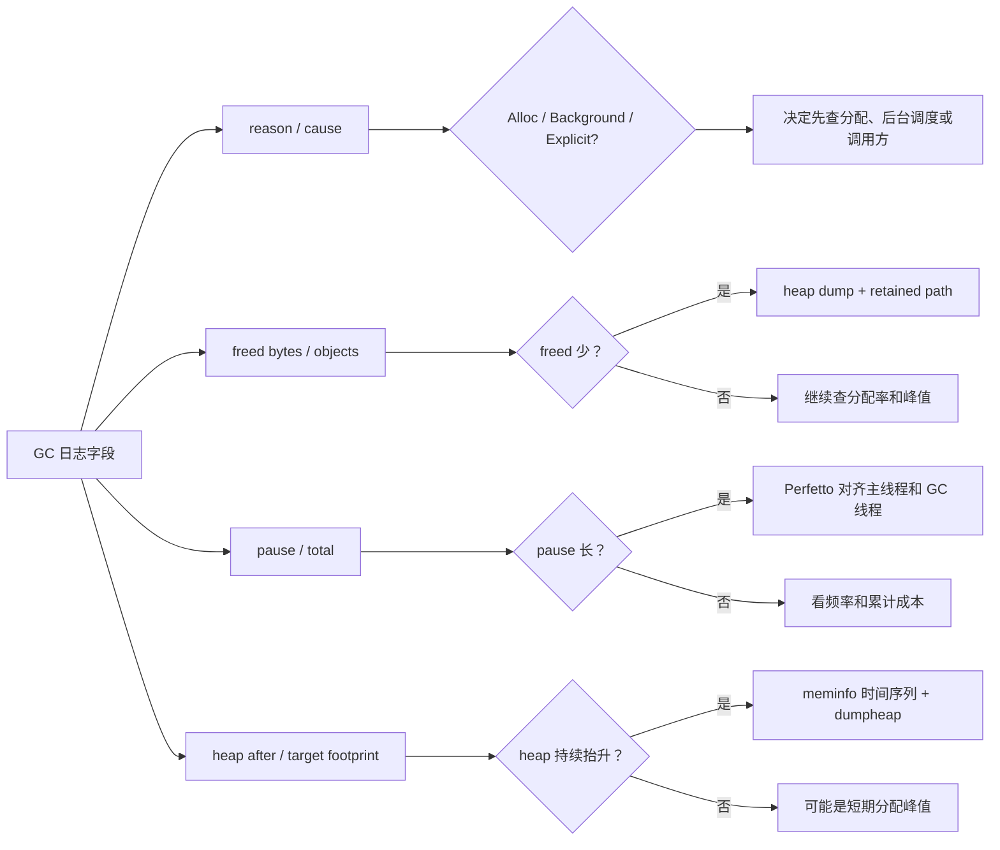

# Day 12：GC 触发时机：alloc GC、background GC、explicit GC
> 系列第 12 篇。目标不是背“有几种 GC”，而是把 **谁触发、为什么触发、会观察到什么、应该怎么排障** 串成一张工程决策图。

---

## 一句话结论
- **alloc GC 是分配路径被迫触发的 GC：它通常说明当前分配压力已经撞到堆阈值或 space 边界。**
- **background GC 是运行时趁进程相对空闲做的堆整理/回收：它更像维护动作，不等价于 OOM 前兆。**
- **explicit GC 是代码或框架请求的 GC：它可能被运行时忽略、延迟、降级，也不能当作释放内存的可靠 API。**
- **排查时先问触发来源，再看回收效果；不要只看到一行 GC 日志就判断“GC 有问题”。**

---

## 图 1：从分配到触发的运行时路径



### 读图规则

| 触发类型 | 第一问题 | 第二问题 | 不要先问 |
|---|---|---|---|
| Alloc GC | 是谁在高频分配？ | 回收后分配是否恢复？ | collector 是否“坏了” |
| Background GC | 是否只是维护性回收？ | 是否和前台卡顿重叠？ | 是否一定有泄漏 |
| Explicit GC | 谁请求了 GC？ | 请求是否造成 pause 或无效等待？ | 能不能靠它释放内存 |

---

## 触发矩阵：三类 GC 的边界

| 维度 | Alloc GC | Background GC | Explicit GC |
|---|---|---|---|
| 触发入口 | 分配路径、heap 增长、space 无法满足 | runtime 后台策略、空闲窗口、堆状态 | `System.gc()` / `Runtime.getRuntime().gc()` / 框架调用 |
| 工程信号 | GC 贴近分配峰值、OOM 前后更常见 | 不一定贴近用户操作 | 日志 reason 可能带 explicit/request 字样，依版本而异 |
| 最常见根因 | 对象 churn、短时间大量临时对象、LOS 压力 | 堆占用高但进程仍可运行 | 误以为 GC 是资源释放 API |
| 优化方向 | 降低分配率、复用对象、拆分峰值、定位大对象 | 避免和关键路径重叠，验证是否影响帧 | 删除无意义调用，改成生命周期释放 |
| 证据工具 | logcat + Allocation view + meminfo | logcat + Perfetto sched/dalvik | 代码搜索 + logcat + Perfetto pause |

---

## 图 2：排障决策流



---

## `heap.cc` 视角：触发不是 collector 自己决定的

Day 11 留下的浅点是：还没有把 `heap.cc` 触发逻辑按 alloc / background / explicit 拆开。这里补上工程索引。

| 源码入口 | 你要搜索什么 | 能回答什么 | 下一跳 |
|---|---|---|---|
| `art/runtime/gc/heap.cc` | `CollectGarbage`、`RequestConcurrentGC`、`CollectGarbageInternal` | 这次 GC 是谁请求、以什么 reason 进入 | `collector/*` |
| `art/runtime/gc/heap.h` | `GcCause`、`CollectorType`、heap 参数 | 日志 reason 与运行时枚举如何对应 | logcat GC 行 |
| `art/runtime/gc/collector/*` | `RunPhases`、`Pause`、`Marking`、`Reclaim` | pause 长在哪个阶段 | Perfetto |
| `art/runtime/gc/space/*` | `LargeObject`、`Region`、`Alloc` | 分配失败是否和 space 边界有关 | meminfo / maps |
| `art/runtime/gc/reference_processor.*` | `ProcessReferences`、`ClearReferent` | 回收后引用对象何时清理 | heap dump / ReferenceQueue |

### AOSP 搜索模板

```bash
cd <aosp>/art/runtime/gc

# 触发入口：先从 heap 建图
rg -n "CollectGarbage|CollectGarbageInternal|RequestConcurrentGC|GcCause|Explicit" heap.cc heap.h

# 分配路径：确认 alloc GC 是否贴着分配失败走
rg -n "Alloc|Allocate|TryToAllocate|GrowForUtilization|footprint|growth_limit" heap.cc space

# 后台路径：确认 concurrent/background 请求和线程协作
rg -n "background|concurrent|RequestConcurrentGC|Signal" heap.cc task_processor* runtime*

# 显式路径：确认 System.gc/Runtime.gc 在目标分支怎么进入 ART
rg -n "Explicit|System.gc|Runtime.gc|GcCause" .. -g "*.cc" -g "*.h"
```

---

## 证据链：先定位触发，再判断根因

| 证据 | 观察重点 | 对应判断 |
|---|---|---|
| `logcat` GC 行 | reason、freed、pause、total time、LOS 字样 | 是 alloc、background 还是 explicit；回收是否有效 |
| `dumpsys meminfo <package>` | Java Heap、Native Heap、Graphics、Code | GC 触发是否真的解释主压力 |
| Allocation Profiler | 单位时间分配量、热点调用栈、短命对象 | alloc GC 是否由 churn 触发 |
| Perfetto `sched + dalvik` | GC 线程、主线程、RenderThread 时间线 | background/explicit GC 是否撞到关键路径 |
| heap dump / MAT | Dominator、Path To GC Roots、retained size | freed 少是否由强可达链导致 |

### 最小命令块

```bash
# 1. 抓 GC 行：先拿到触发 reason 和耗时
adb logcat -v time | rg -n "GC|freed|paused|Explicit|Alloc|Background|Concurrent"

# 2. 判断压力是否在 Java Heap
adb shell dumpsys meminfo <package> | head -n 180

# 3. 分配热点：Android Studio Profiler 更直观；命令侧先保留 meminfo 时间序列
for i in 1 2 3 4 5; do adb shell dumpsys meminfo <package> | rg "Java Heap|Native Heap|Graphics|TOTAL"; sleep 2; done

# 4. 需要对齐 pause 时抓 Perfetto
adb shell perfetto -o /data/misc/perfetto-traces/gc-trigger.perfetto-trace -t 20s sched dalvik --txt

# 5. freed 少或 OOM 前后：拉 heap dump 看 retained path
adb shell am dumpheap <package> /data/local/tmp/app.hprof
adb pull /data/local/tmp/app.hprof .
```

---

## 三个常见场景的判读表

| 场景 | 更可能的触发 | 该做什么 | 不该做什么 |
|---|---|---|---|
| 滑动列表时 GC 一直出现 | Alloc GC | 看 bind / decode / adapter 是否制造临时对象 | 先加 `System.gc()` |
| 退到后台后出现 GC | Background GC | 看是否正常回落；记录 meminfo 趋势 | 直接判定泄漏 |
| 点击某按钮后长 pause，日志带 explicit | Explicit GC | 搜索调用方，评估删除或移出关键路径 | 把它当作“优化按钮” |
| 大图加载后 OOM，GC freed 很少 | Alloc GC + LOS 压力 | 看 Bitmap 尺寸、采样、region/LOS | 只盯普通 Java 对象数 |
| GC 后 Java Heap 仍高 | 触发类型不是根因 | dumpheap 看 retained path | 反复触发 GC |

---

## 图 3：从日志字段到下一步动作



---

## 工程边界：这些话不要说满

| 容易说过头的话 | 更严谨的写法 |
|---|---|
| “调用 `System.gc()` 就能释放内存” | “它只是请求 GC，是否执行、何时执行、收益多少都要看运行时策略和可达性。” |
| “GC 频繁就是泄漏” | “GC 频繁先看分配率；泄漏更需要 retained path 证明。” |
| “后台 GC 一定不影响前台” | “大多数后台维护不在关键路径，但必须用 Perfetto 验证是否和交互重叠。” |
| “OOM 前 GC freed 少说明 GC 失效” | “更可能是对象仍强可达、LOS 压力或 Native/Graphics 不是 GC 能释放的部分。” |

---

## 这篇要记住的 5 句工程话术

| 场景 | 更好的表达 |
|---|---|
| 看到 For Alloc GC | “先量分配率和热点调用栈，再谈 collector。” |
| 看到 Background GC | “先确认它是否撞到用户关键路径。” |
| 看到 Explicit GC | “先找到请求方，证明它有收益，否则删除。” |
| GC freed 少 | “这不是 GC 没跑，先看 retained path。” |
| OOM 前后 GC 很多 | “把 Java Heap、LOS、Native、Graphics 分开看。” |

