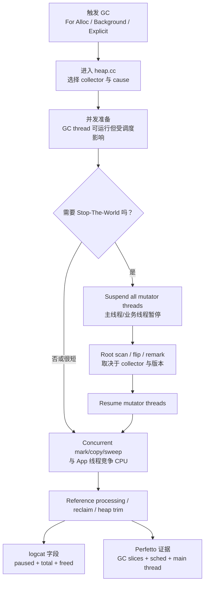
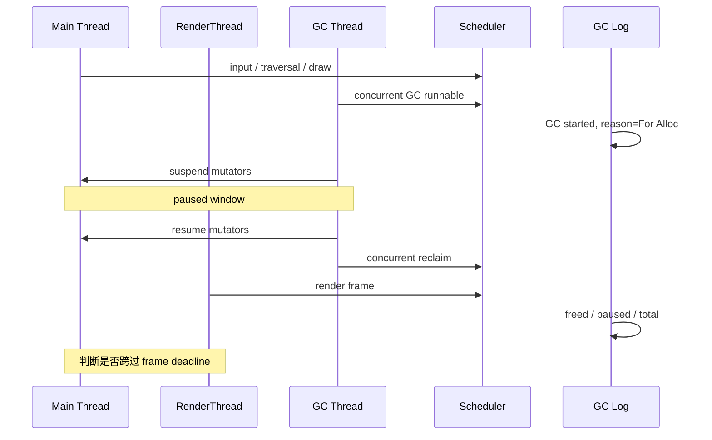
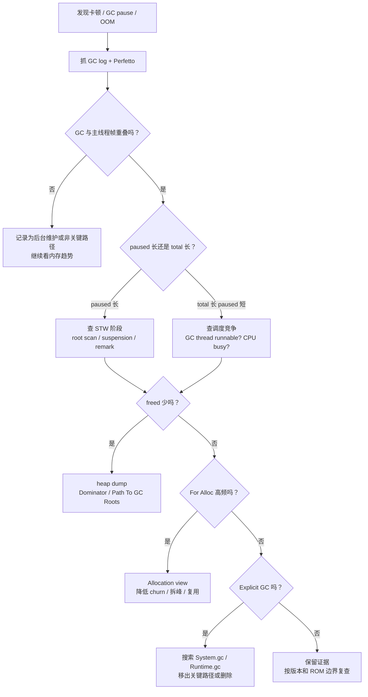
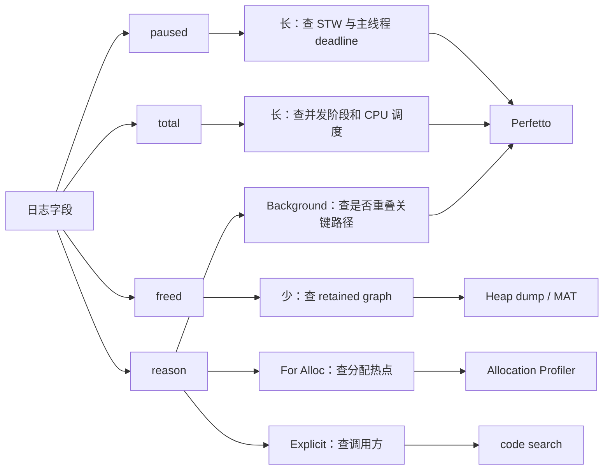

# Day 13：GC pause 的来源与优化思路
> 系列第 13 篇。目标不是把 pause 简化成“GC 很慢”，而是拆成 **STW 阶段、并发阶段、调度竞争、分配压力、可达性结果** 五个可验证信号。

---

## 一句话结论
- **GC pause 只统计线程被暂停的窗口；用户感知卡顿还要看主线程、RenderThread、GC 线程和 CPU 调度是否重叠。**
- **优化 pause 之前，先把 `paused`、`total time`、Perfetto slice、主线程 frame deadline 对齐。**
- **freed 少不是 pause 优化问题，通常要转向 retained path、LOS、大对象或 Native/Graphics 压力。**
- **Day 12 的触发原因必须保留：For Alloc、Background、Explicit 的优化入口不同。**

---

## 图 1：pause 从哪里来



### 读图规则

| 信号 | 说明 | 下一步 |
|---|---|---|
| `paused` 长 | mutator 被停住的窗口长 | 查 root scan、remark、thread suspension |
| `total time` 长但 `paused` 短 | 并发阶段或调度竞争长 | 查 Perfetto `sched`、GC thread runnable/blocked |
| GC 与主线程 frame 重叠 | 可能造成 jank | 对齐 Choreographer、RenderThread、GC slice |
| freed 少 | pause 不是根因 | heap dump 看 retained path |
| For Alloc 后紧接 OOM | 分配路径被顶到边界 | 看分配热点、LOS、growth limit |

---

## pause 拆解表：不要只盯一行日志

| 层级 | 你看到的现象 | 可能根因 | 证据入口 |
|---|---|---|---|
| Runtime STW | `paused` 明显长 | root scan、thread suspension、remark | logcat + Perfetto dalvik |
| Collector 并发阶段 | `total time` 长 | concurrent copy/mark 被 CPU 抢占 | Perfetto sched |
| App 分配路径 | For Alloc 高频 | 对象 churn、短时峰值、大对象 | Allocation view |
| Reachability | freed bytes 少 | 强可达链、静态持有、JNI Global | heap dump / MAT |
| Space 边界 | LOS 或 Java Heap 高 | Bitmap、大数组、region/LOS 压力 | meminfo + maps |

---

## 图 2：Perfetto 对齐法



### 最小抓取命令

```bash
# GC 日志：先拿 reason、freed、paused、total
adb logcat -v time | rg -n "GC|freed|paused|For Alloc|Background|Explicit|Concurrent"

# Perfetto：把 GC、线程调度、帧时间放在同一条时间线上
adb shell perfetto -o /data/misc/perfetto-traces/gc-pause.perfetto-trace -t 20s sched freq idle am wm gfx view dalvik --txt
adb pull /data/misc/perfetto-traces/gc-pause.perfetto-trace .

# Java Heap 是否真是主压力
adb shell dumpsys meminfo <package> | head -n 180

# pause 长但 freed 少：转 heap dump
adb shell am dumpheap <package> /data/local/tmp/app.hprof
adb pull /data/local/tmp/app.hprof .
```

---

## 图 3：排障决策流



---

## source path + trace signal

| 问题 | AOSP 入口 | 搜索词 | 运行时证据 |
|---|---|---|---|
| 谁触发 GC | `art/runtime/gc/heap.cc` | `CollectGarbage`, `GcCause` | logcat reason |
| 哪些阶段可能 STW | `art/runtime/gc/collector/*` | `Pause`, `RunPhases`, `RevokeAllThreadLocalBuffers` | Perfetto dalvik slice |
| root scan 为什么长 | `art/runtime/gc/heap.*`, `root_visitor` | `VisitRoots`, `ThreadList`, `RootVisitor` | paused + thread count |
| reference 处理是否拖尾 | `art/runtime/gc/reference_processor.*` | `ProcessReferences`, `Enqueue` | total time + heap dump |
| space 是否顶到边界 | `art/runtime/gc/space/*` | `LargeObject`, `Region`, `Alloc` | meminfo Java Heap / LOS |

```bash
cd <aosp>/art/runtime

rg -n "CollectGarbage|GcCause|Pause|RunPhases" gc/heap.cc gc/heap.h gc/collector
rg -n "VisitRoots|RootVisitor|ThreadList|SuspendAll" .
rg -n "ProcessReferences|ReferenceProcessor|ClearReferent" gc
rg -n "LargeObject|Region|Alloc" gc/space gc
```

---

## 优化矩阵：先选正确战场

| 证据组合 | 不要先做 | 应该先做 |
|---|---|---|
| For Alloc 高频 + freed 正常 | 调 collector 参数 | 降低分配率、复用对象、拆分峰值 |
| `paused` 长 + frame miss | 只看 heap 占用 | Perfetto 对齐 STW 阶段与主线程 |
| `total` 长 + `paused` 短 | 说“GC 卡住主线程” | 查 CPU 抢占、后台线程、并发阶段 |
| freed 少 + heap 高 | 反复手动 GC | heap dump 找 retained path |
| Explicit GC 在点击路径 | 证明“释放内存了” | 搜索调用方，移出关键路径或删除 |
| Java Heap 不高但 RSS 高 | 继续优化 Java GC | 看 Native Heap、Graphics、maps |

---

## 图 4：从现象到工程动作



---

## 边界说明

| 边界 | 严谨说法 |
|---|---|
| Android 版本 | pause phase 名称、collector 默认组合、日志字段会随分支变化；必须用目标 AOSP 分支确认。 |
| ROM 差异 | 厂商可能改日志、调度、内存策略；不能只用一台设备外推。 |
| Perfetto 配置 | 没有 `dalvik`/`sched` 数据时，只能证明日志存在，不能证明卡顿归因。 |
| Issue 反馈 | 本次 `gh issue list` 被认证阻塞，不能声称已吸收 open Issue。 |

---

## 记住这 5 句

| 场景 | 工程表达 |
|---|---|
| 看到 GC pause | “先对齐 paused、total、主线程帧和 GC slice。” |
| paused 长 | “这是 STW 或 suspension 方向的问题。” |
| total 长 | “这可能是并发阶段或调度竞争，不等于主线程一直停着。” |
| freed 少 | “先找 retained path，不要反复触发 GC。” |
| For Alloc 高频 | “先降分配率，再谈 collector。” |
