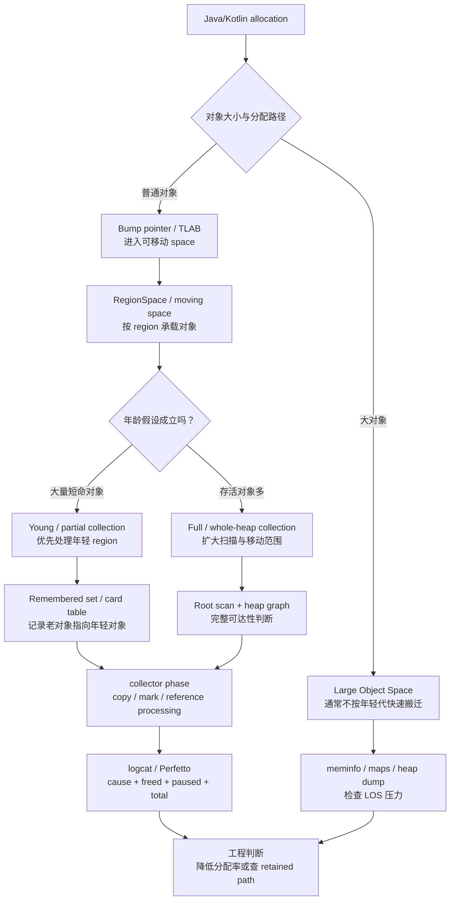
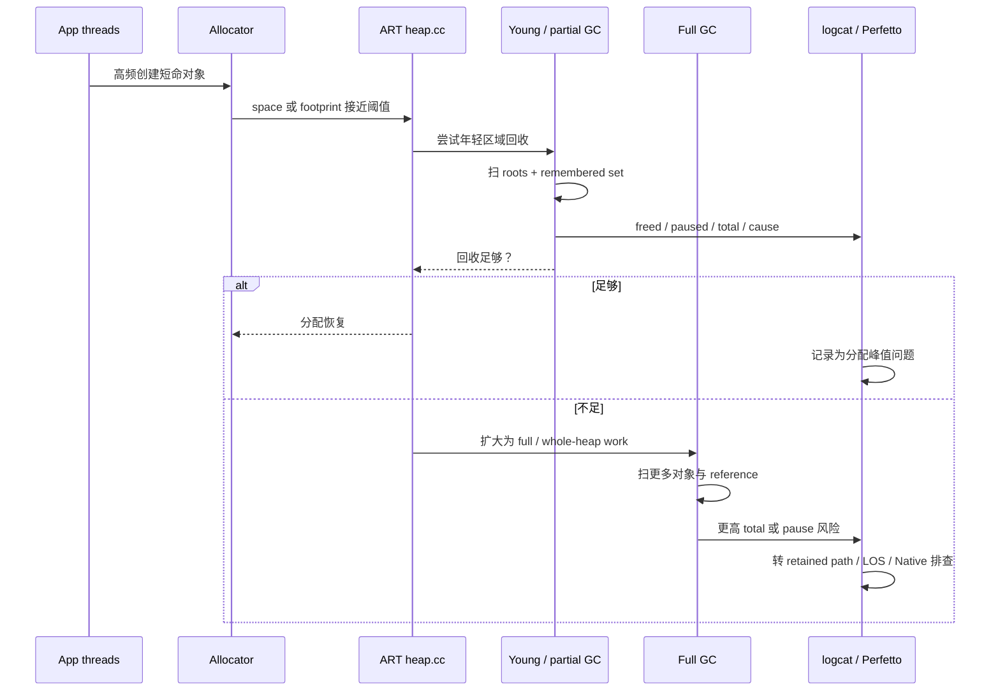
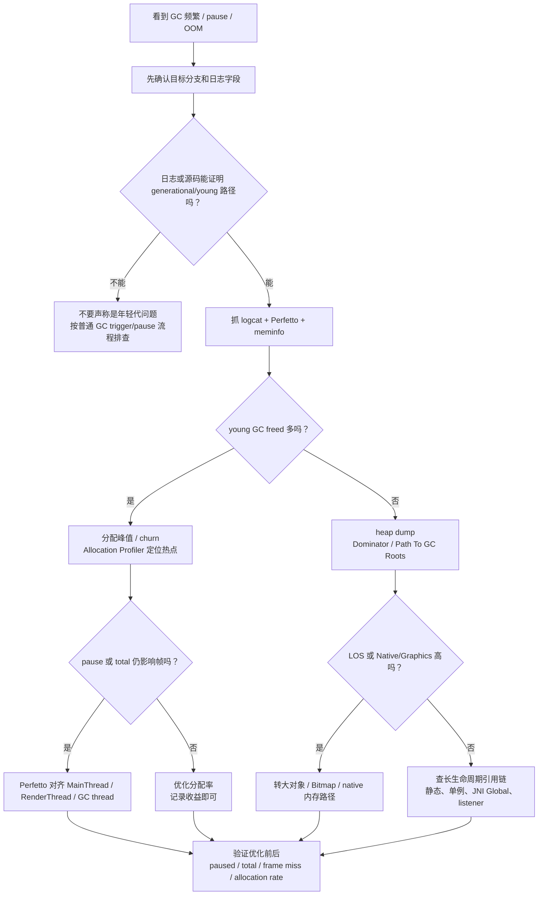

# Day 14：Generational GC 在 ART 中的实现
> 系列第 14 篇。目标不是把 ART 套进 HotSpot 的 Young/Old 模型，而是用 **space、collector、年龄假设、写屏障、日志证据** 来判断：目标设备上到底有没有、怎么运行、是否值得排查。

---

## 一句话结论

- **Generational GC 的核心收益来自“多数对象很快死亡”的年龄假设：先回收年轻对象，减少全堆扫描成本。**
- **在 ART 里不能直接套用 HotSpot 的 Eden/Survivor/Old 话术；必须回到 `RegionSpace`、collector 类型、read/write barrier、GC cause 和目标 Android 分支。**
- **排查时先证明目标运行时真的走了 generational 路径，再看年轻代回收是否降低 pause、total time 和 For Alloc 压力。**
- **如果 GC 后 freed 很少，问题通常不在 generational 策略本身，而在 retained path、LOS、大对象或 Native/Graphics 压力。**

---

## 图 1：ART generational GC 的结构视角



### 读图规则

| 结构 | 工程含义 | 证据入口 |
|---|---|---|
| young / partial collection | 只处理一部分年轻对象区域，期待短命对象快速死亡 | GC 日志 cause、freed、paused、total |
| remembered set / card table | 老对象指向年轻对象时，年轻代 GC 不能只扫年轻对象 | AOSP `card_table`、`remembered_set` 搜索 |
| RegionSpace | ART CC 常见空间表达，比 Eden/Survivor 更贴近源码 | `art/runtime/gc/space/region_space.*` |
| Large Object Space | 大对象压力通常不会被“年轻代更快”直接解决 | `dumpsys meminfo`、heap dump、`/proc/<pid>/maps` |
| full collection | 年轻代回收无法满足目标时，仍要回到全堆可达性 | Perfetto GC slice + heap dump |

---

## 先立边界：不要把 ART 讲成 HotSpot

| 容易误用的话 | 更严谨的 ART 表达 |
|---|---|
| “ART 一定有 Eden、Survivor、Old” | “目标分支可能有 generational CC，但应以 RegionSpace、collector 和日志字段确认。” |
| “Young GC 一定 pause 更短” | “只在短命对象多、跨代引用少、调度不拥塞时更可能降低成本。” |
| “Full GC 就是 Old GC” | “ART 日志和源码要按 collector/cause/space 看，不能直接套 HotSpot 名称。” |
| “freed 少说明 generational GC 无效” | “freed 少通常先查强可达链、LOS、Native/Graphics，而不是先怪 collector。” |

---

## 版本与源码入口

Day 13 留下的浅点是：pause phase、collector 默认组合、日志字段都没有绑定目标分支。这里直接把 Day 14 的讲法收窄为 **需要目标 Android 分支验证**。

| 要确认的问题 | AOSP 搜索入口 | 运行时信号 | 命令 |
|---|---|---|---|
| 是否启用 generational collector | `art/runtime/gc/heap.*`、`collector_type`、`generational` | GC reason / collector 名称 | `rg -n "generational|young|CollectorType|kCollectorType" art/runtime/gc` |
| young collection 如何选 region | `art/runtime/gc/space/region_space.*` | freed 对象多、pause 较短 | `rg -n "RegionSpace|young|age|evac" art/runtime/gc/space art/runtime/gc/collector` |
| 跨代引用如何维护 | `card_table`、`remembered_set`、write barrier | young GC 仍能找到老到新的引用 | `rg -n "CardTable|RememberedSet|write barrier|mod-union" art/runtime` |
| 何时退回 full collection | `CollectGarbageInternal`、`GcCause`、footprint/growth limit | For Alloc 后仍紧张或 freed 少 | `rg -n "CollectGarbageInternal|GcCause|footprint|growth_limit" art/runtime/gc/heap.*` |
| 是否撞到 LOS | `large_object_space.*` | Java Heap/LOS 高，普通 young GC 不解压 | `adb shell dumpsys meminfo <package>` |

```bash
cd <aosp>

# 1. 不先背概念，先确认目标分支有没有 generational 相关路径
rg -n "generational|young generation|young|tenuring|age" art/runtime/gc

# 2. 看 collector 与 heap 入口
rg -n "CollectorType|GcCause|CollectGarbage|CollectGarbageInternal" art/runtime/gc/heap.cc art/runtime/gc/heap.h

# 3. 看 RegionSpace / LOS / remembered set
rg -n "RegionSpace|LargeObject|RememberedSet|CardTable|ModUnion" art/runtime/gc art/runtime
```

---

## 图 2：从分配峰值到 young / full GC 的执行路径



### 观察矩阵

| 现象组合 | 更可能说明 | 下一步 |
|---|---|---|
| For Alloc 高频 + young GC freed 多 | 分配 churn，短命对象多 | Allocation Profiler 找热点，削峰 |
| young GC pause 短但 total 偶尔长 | 并发阶段或调度竞争 | Perfetto 看 GC thread runnable/blocked |
| young GC freed 少 + heap 持续涨 | 年轻代不是根因 | heap dump 看 retained path |
| full GC 频繁出现 | young 回收不足或堆压力过大 | 查存活率、LOS、大对象、Native/Graphics |
| Java Heap 不高但 RSS 高 | GC 策略解释不了主压力 | 看 Native Heap、Graphics、maps |

---

## 图 3：排障决策流



---

## 最小证据链

| 步骤 | 命令/工具 | 目标 |
|---|---|---|
| 1 | `adb logcat -v time \| rg -n "GC\|young\|freed\|paused\|Alloc\|Concurrent"` | 读取 cause、freed、paused、total |
| 2 | `adb shell dumpsys meminfo <package>` | 判断 Java Heap、Native Heap、Graphics 谁是主压力 |
| 3 | Android Studio Allocation Profiler | 找短命对象和分配峰值 |
| 4 | Perfetto `sched + dalvik + gfx + view` | 判断 GC 是否与帧 deadline 重叠 |
| 5 | `adb shell am dumpheap <package> /data/local/tmp/app.hprof` | freed 少时查 retained path |
| 6 | AOSP `rg` | 绑定目标分支的 collector、space、barrier 事实 |

```bash
# GC 日志：先拿到 cause、freed、pause、total
adb logcat -v time | rg -n "GC|young|freed|paused|Alloc|Concurrent|Explicit|Background"

# 内存归属：确认是否真是 Java heap
adb shell dumpsys meminfo <package> | head -n 180

# Perfetto：把 GC、调度、帧放在同一时间线上
adb shell perfetto -o /data/misc/perfetto-traces/gc-gen.perfetto-trace -t 20s sched freq idle am wm gfx view dalvik --txt
adb pull /data/misc/perfetto-traces/gc-gen.perfetto-trace .

# freed 少：转 retained path，不要反复手动 GC
adb shell am dumpheap <package> /data/local/tmp/app.hprof
adb pull /data/local/tmp/app.hprof .
```

---

## 优化动作表：按证据选战场

| 证据 | 不要先做 | 应该先做 |
|---|---|---|
| young GC 高频且 freed 多 | 调 collector 参数 | 降低分配率、复用对象、拆峰 |
| young GC 高频但 freed 少 | 继续期待年轻代回收 | heap dump 查存活链 |
| full GC 紧跟 young GC | 只看 pause 字段 | 查堆增长、LOS、retained path |
| total 长但 paused 短 | 说“主线程被 GC 卡住” | Perfetto 查调度竞争和 GC thread |
| Java Heap 低、RSS 高 | 优化 Java GC | 查 Native Heap、Graphics、mmap |
| Explicit GC 混入 | 把它当优化手段 | 搜索调用方，删除或移出关键路径 |

---

## 一张跨主题连接表

| 前序文章 | Day 14 复用点 | 为什么重要 |
|---|---|---|
| Day 11：源码路径 | `heap.cc -> collector -> space -> reference_processor` | generational 结论必须能落到源码路径 |
| Day 12：触发时机 | For Alloc / Background / Explicit | young GC 高频常常是分配触发，不是 collector 结论 |
| Day 13：pause 优化 | paused / total / Perfetto 对齐 | generational 是否有收益要看帧和调度证据 |
| Day 10：可达性 | retained path | freed 少时回到引用链，而不是调 GC |
| Day 3：分配路径 | TLAB / bump pointer / LOS | young GC 优化经常从分配率和大对象开始 |

---

## 这篇要记住的 5 句工程话术

| 场景 | 更好的表达 |
|---|---|
| 讨论 ART generational GC | “先确认目标分支的 collector、space 和日志字段。” |
| 看到 young GC 高频 | “先量分配率和对象存活率。” |
| young GC freed 少 | “转 heap dump，看 retained path。” |
| full GC 频繁 | “年轻代回收不足只是现象，继续拆 Java Heap、LOS、Native、Graphics。” |
| 评价优化收益 | “用 paused、total、frame miss、allocation rate 四个指标前后对比。” |

---

## 边界记录

| 边界 | 本文处理方式 |
|---|---|
| Android 分支差异 | 不声称所有 ART 版本都有相同 generational 行为；必须用目标 AOSP 分支验证。 |
| ROM 差异 | 厂商可能改日志、调度和 GC 策略；只用一台设备不能外推。 |
| 工具证据缺口 | 没有真实 Perfetto trace 时，只能给证据链模板，不能声称已验证具体 pause 阶段。 |
| GitHub Issues | 本次 `gh issue list` 因未认证被阻塞，不能声称吸收了 open Issue 反馈。 |
