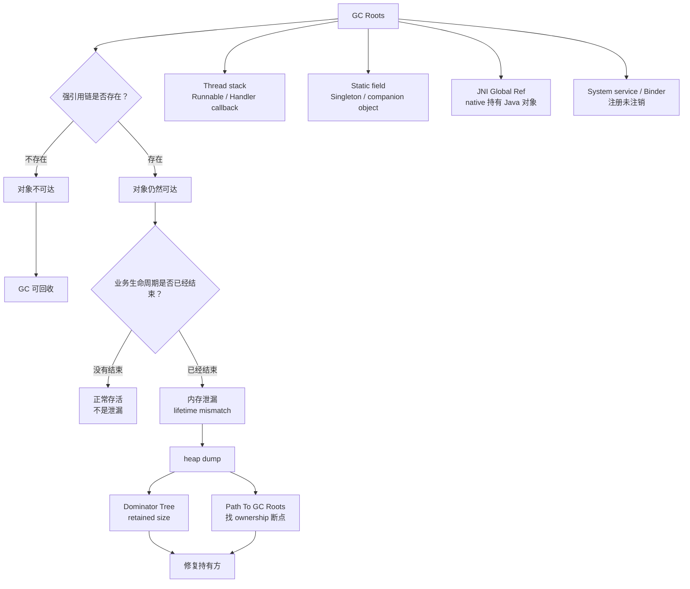
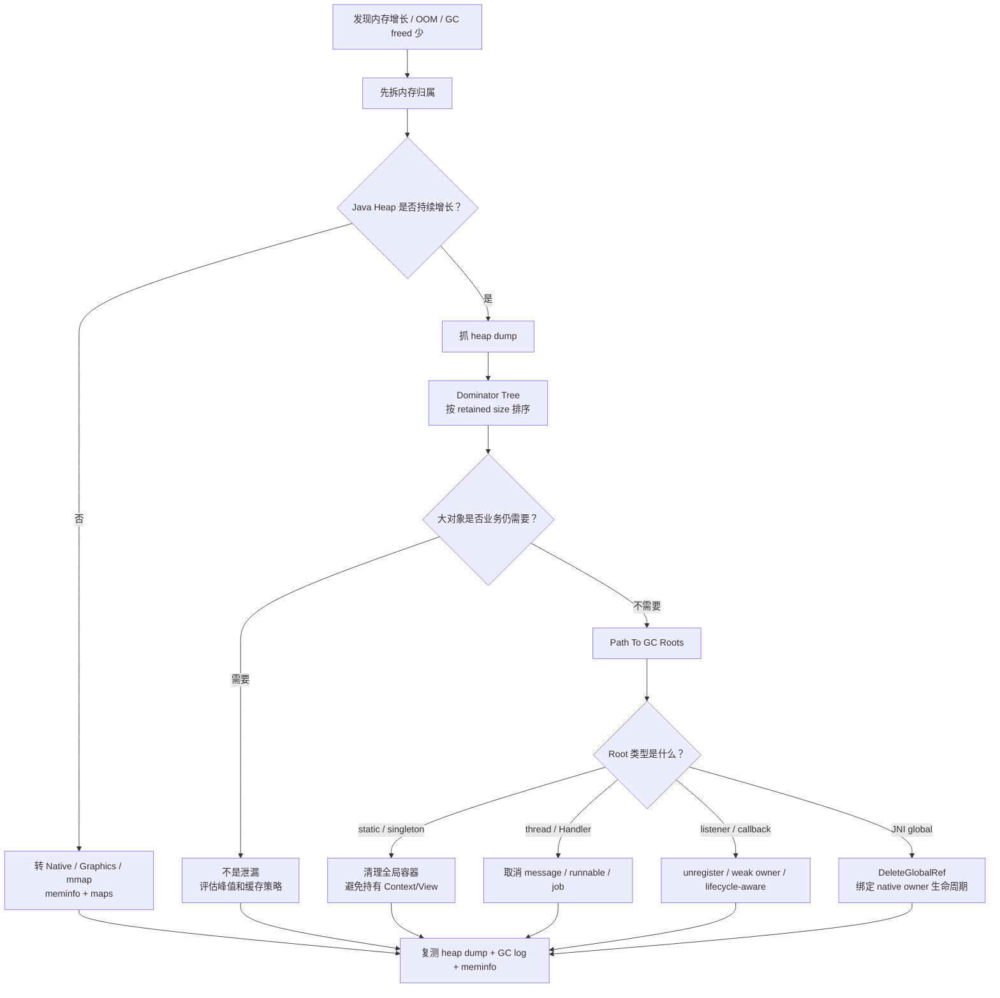
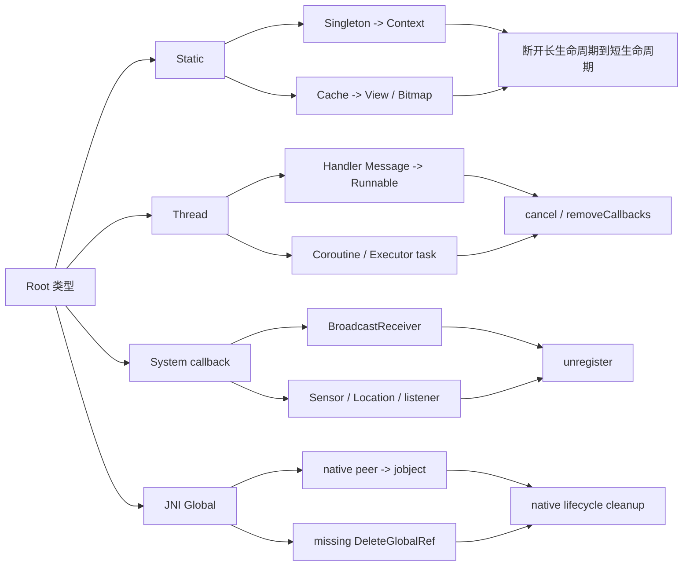

# Day 15：内存泄漏的本质：GC Roots 持有链分析
> 系列第 15 篇。目标不是把泄漏理解成“GC 没有回收”，而是用 **GC Roots、生命周期边界、retained path、支配树、可观测证据** 判断：对象为什么仍然强可达，谁应该释放 ownership。

---

## 一句话结论

- **Android 内存泄漏的本质是：业务生命周期已经结束，但对象仍然能从某个 GC Root 走强引用链到达。**
- **GC 只能回收不可达对象；只要 retained path 仍然存在，频繁 GC、手动 GC、调 collector 都不是根因修复。**
- **排查泄漏先画“Root -> owner -> callback/container -> victim”的路径，再用 heap dump、Dominator Tree、Path To GC Roots 证明。**
- **Day 14 的 retained-path fallback 在这里落地：GC freed 少时，优先查 ownership 链，而不是继续怀疑 generational GC。**

---

## 图 1：泄漏不是 GC 失败，而是强可达路径仍存在



### 读图规则

| 判断点 | 不是问什么 | 应该问什么 |
|---|---|---|
| GC 后对象还在 | “GC 为什么没收？” | “哪条 GC Root 强引用链还通着？” |
| Activity destroyed 后仍在 | “Activity 太大吗？” | “谁跨过了 Activity 生命周期边界？” |
| freed bytes 很少 | “collector 是否失效？” | “堆里哪些对象仍被支配、仍可达？” |
| OOM 前多次 GC | “要不要手动 GC？” | “增长对象是短命 churn 还是长期 retained？” |

---

## 泄漏的最小模型

| 角色 | 含义 | 常见 Android 形态 |
|---|---|---|
| Root | GC 起点，不由普通对象支配 | thread、static、JNI global、system class、native peer |
| Owner | 本来应该管理生命周期的对象 | Activity、Fragment、ViewModel、Repository、Service |
| Bridge | 把长生命周期连到短生命周期 | callback、listener、Handler message、coroutine、singleton cache |
| Victim | 业务已结束但仍被保留的对象 | destroyed Activity、old View tree、Bitmap、Adapter、Context |
| Evidence | 证明 retained path 的材料 | HPROF、Dominator Tree、Path To GC Roots、LeakCanary trace |

### 一条典型泄漏链

```text
GC Root: static field
  -> AppSingleton.instance
  -> listeners: ArrayList
  -> DetailActivity$listener
  -> this$0
  -> DetailActivity
  -> DecorView / Fragment / Bitmap / Adapter
```

这个链条只要不断，`DetailActivity` 就是可达对象。GC 没有犯错。

---

## 图 2：从症状到 retained path 的排障决策流



---

## 工程证据链

| 步骤 | 命令/工具 | 看什么 | 结论边界 |
|---|---|---|---|
| 1 | `adb shell dumpsys meminfo <package>` | Java Heap 是否是主增长项 | Java Heap 不高时不要硬讲 Java 泄漏 |
| 2 | `adb logcat -v time \| rg -n "GC\|freed\|paused\|Alloc"` | GC 是否频繁且 freed 少 | freed 少只说明对象仍可达或非 Java 压力高 |
| 3 | `adb shell am dumpheap <package> /data/local/tmp/app.hprof` | 导出堆快照 | dump 会暂停进程，避免在线上误操作 |
| 4 | MAT / Android Studio Profiler | Dominator Tree retained size | retained size 高不等于 bug，要结合生命周期 |
| 5 | Path To GC Roots | 第一条不该存在的 ownership 边 | 修复持有者，不是修复 victim |
| 6 | 复测同一路径 | before/after retained size | 只接受可重复下降作为修复证据 |

```bash
# 1. 先确认 Java Heap 是否是主压力
adb shell dumpsys meminfo <package> | head -n 180

# 2. 看 GC 是否在努力但回收少
adb logcat -v time | rg -n "GC|freed|paused|Alloc|Background|Explicit"

# 3. 导出 HPROF，后续用 MAT / Android Studio / LeakCanary 分析 retained path
adb shell am dumpheap <package> /data/local/tmp/app.hprof
adb pull /data/local/tmp/app.hprof .

# 4. 如果 Java Heap 不高，转系统归属
adb shell cat /proc/$(adb shell pidof <package>)/maps | head
adb shell dumpsys meminfo <package>
```

---

## 图 3：引用链类型速查



---

## 泄漏类型对照矩阵

| 泄漏形态 | Root 常见入口 | Path To GC Roots 里常见片段 | 修复点 |
|---|---|---|---|
| Activity 被 static 持有 | Static field | `Singleton -> field -> Activity` | 不存 Activity；改用 application context 或弱化 owner |
| Handler 延迟消息 | Thread / MessageQueue | `Message -> callback -> outer Activity` | `removeCallbacksAndMessages(null)` 或 lifecycle-bound job |
| Listener 未注销 | System service / static registry | `Manager -> listeners -> listener -> Activity` | `onStop/onDestroy` unregister |
| Fragment View 泄漏 | Fragment manager / adapter | `Fragment -> binding -> root View` | `onDestroyView` 清空 binding |
| JNI GlobalRef 泄漏 | JNI global root | `JNI global -> Java object` | `DeleteGlobalRef`，绑定 native close |
| Bitmap 被缓存误持有 | Static cache / singleton | `Cache -> BitmapDrawable -> Bitmap` | 限定缓存大小，按 lifecycle 清理 |

---

## AOSP 与工具源码入口

| 目标 | 搜索路径 | 为什么和泄漏有关 |
|---|---|---|
| GC Root 枚举 | `art/runtime/gc/heap.*`、`root_visitor` | 解释 Root 是从哪里开始遍历的 |
| Java 引用处理 | `art/runtime/gc/reference_processor.*` | 区分强引用链和 Soft/Weak/Phantom 处理 |
| HPROF 导出 | `art/runtime/hprof/` | 理解 heap dump 为什么能看到对象图 |
| JNI 引用表 | `art/runtime/jni/`、`indirect_reference_table.*` | 解释 local/global ref 的生命周期 |
| LeakCanary retained path | `shark`、`HeapAnalyzer`、`ShortestPathFinder` | 工具如何从 HPROF 找到泄漏链 |

```bash
cd <aosp>

# GC root / heap traversal
rg -n "RootVisitor|VisitRoots|VisitObjects|ProcessReferences" art/runtime

# HPROF dump 入口
rg -n "hprof|DumpHeap|Hprof" art/runtime

# JNI reference 生命周期
rg -n "GlobalRef|DeleteGlobalRef|IndirectReferenceTable" art/runtime
```

---

## 把 Day 14 的 retained-path fallback 落到动作

| Day 14 现象 | Day 15 的解释 | 工程动作 |
|---|---|---|
| young GC freed 少 | 对象仍被强可达路径保留 | 抓 HPROF，走 Path To GC Roots |
| full GC 后 heap 仍高 | 可达对象或非 Java 内存才是主因 | meminfo 拆 Java / Native / Graphics |
| 频繁 For Alloc | 可能是 churn，也可能是 retained 增长 | Allocation 视图 + Dominator Tree 对照 |
| LOS 压力大 | 大对象可能被 owner 链保留 | 查 Bitmap、byte[]、large arrays 的支配者 |
| 手动 GC 无改善 | 请求 GC 不能切断引用链 | 删除错误 owner 或取消异步任务 |

---

## 修复 checklist

| 检查项 | 通过标准 |
|---|---|
| 生命周期边界已定义 | 明确对象应该在 `onDestroy`、`onDestroyView`、`onCleared` 还是 `close` 后释放 |
| Root 类型已定位 | Path To GC Roots 能指出 static、thread、system callback 或 JNI global |
| 第一条错误边已命名 | 知道是哪个 field、list、message、callback、native ref 不该存在 |
| 修复点在 owner 侧 | 修改持有方，而不是只把 victim 字段设空 |
| before/after 可比较 | retained size、实例数、meminfo 或 LeakCanary trace 有下降 |
| 复发路径被覆盖 | rotation、back press、process background、logout、repeat open 都测过 |

---

## 边界记录

| 边界 | 本文处理方式 |
|---|---|
| Android / ROM 差异 | GC 日志字段和 HPROF 行为可能变化，结论要绑定目标设备和工具版本。 |
| LeakCanary 结果 | LeakCanary 是线索，不替代工程判断；仍要看业务生命周期是否真的结束。 |
| WeakReference | 弱引用不是通用修复，真正目标是消除错误 owner 或缩短 owner 生命周期。 |
| GitHub Issues | 本次 `gh issue list` 因未认证被阻塞，不能声称吸收了 open Issue 反馈。 |

---

## 这篇要记住的 5 句工程话术

| 场景 | 更好的表达 |
|---|---|
| 解释泄漏 | “这是生命周期结束后的强可达路径问题。” |
| GC 后对象还在 | “先看 Path To GC Roots，不先怀疑 GC。” |
| 评审修复方案 | “修复点应该在持有者，而不是受害对象。” |
| 对比优化收益 | “用 retained size、实例数和 meminfo 前后对比。” |
| 面试回答 | “泄漏 = Root 可达性存在 + 业务生命周期已结束。” |
