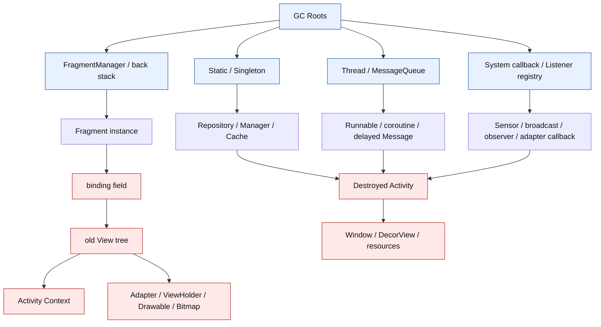
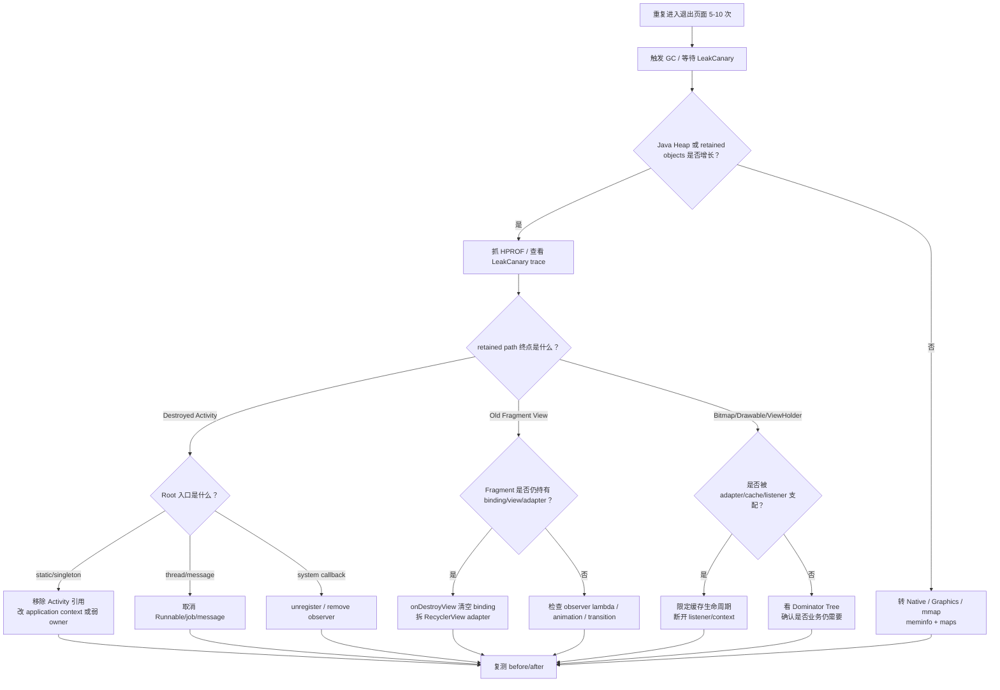
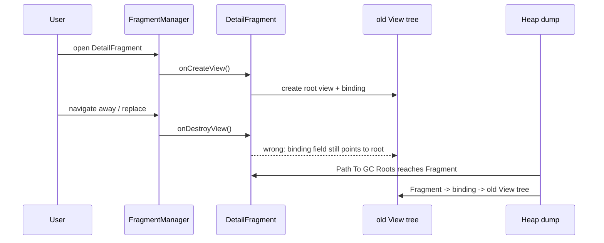

# Day 16：Activity/Fragment 泄漏的常见模式
> 系列第 16 篇。今天把 Day 15 的 **Root -> owner -> bridge -> victim** 模型落到 Activity 和 Fragment：不是背“不要持有 Context”，而是能从 HPROF、LeakCanary、生命周期日志和源码路径证明哪条边跨过了销毁边界。

---

## 一句话结论

- **Activity 泄漏的核心边界是 `onDestroy()`；Fragment View 泄漏的核心边界通常是 `onDestroyView()`，不是 `Fragment.onDestroy()`。**
- **最危险的 bridge 是长生命周期对象保存了短生命周期对象：static/singleton、message/coroutine、adapter/listener、binding/root View、transition/animation callback。**
- **修复点优先放在 owner 或 bridge：取消任务、注销回调、清空 view binding、拆掉 adapter/listener，而不是只把 Activity 字段设空。**
- **验收必须有 before/after 证据：重复打开关闭、强制 GC、heap dump retained path、LeakCanary trace、`dumpsys meminfo` Java Heap 趋势。**

---

## 图 1：Activity/Fragment 泄漏的生命周期结构



### 读图规则

| 对象 | 生命周期结束点 | 泄漏判断 |
|---|---|---|
| `Activity` | `onDestroy()` 后不应再被业务强持有 | retained path 仍到达 Activity，就是 Activity 泄漏候选 |
| `Fragment` | 是否泄漏要看 Fragment 是否仍在 back stack 或 manager 中 | Fragment 活着不一定错，旧 View tree 活着更常见 |
| `Fragment View` | `onDestroyView()` 后应释放 | `Fragment -> binding -> root View` 是高频错误边 |
| `Adapter` | 跟随 View 或 RecyclerView 生命周期 | Adapter 间接持有 View/Context/listener 时要拆 |
| `Observer/listener` | 注册在哪，就必须在对应边界注销 | 系统 registry 或 singleton registry 是常见 Root 入口 |

---

## Day 15 模型落地：先命名 4 个角色

| 场景 | Root | Owner | Bridge | Victim |
|---|---|---|---|---|
| static 保存 Activity | Static field | singleton/cache | field/list | destroyed Activity |
| 延迟 Runnable | Main thread | MessageQueue | `Message.callback` / inner Runnable | Activity/Fragment |
| Fragment binding 未清空 | FragmentManager | Fragment instance | `binding` field | old View tree + Activity Context |
| Adapter 保存 Fragment callback | RecyclerView/Fragment | Adapter | listener/callback | Fragment view or Activity |
| LiveData/Flow observer 错绑 | ViewModel/store | observer registry | observer lambda captures View | old View tree |
| 动画/transition callback | Choreographer/thread | Animator/Transition | listener | View/Activity |

这就是本篇对 Day 15 反思的实际应用：每个 leak 都先拆成可验证的 retained path，而不是只列“常见写法”。

---

## 图 2：Activity/Fragment 泄漏排障决策流



---

## 高频模式矩阵

| 模式 | retained path 片段 | 错误边 | 修复动作 | 验证信号 |
|---|---|---|---|---|
| companion/static 保存 `Activity` | `static -> manager -> activity` | 全局对象持有页面 | 不保存 Activity；需要 Context 时用 `applicationContext` | Path To GC Roots 不再经过 static |
| 匿名内部类 Runnable | `Thread -> MessageQueue -> Message -> callback -> this$0` | delayed callback 捕获外部类 | `removeCallbacksAndMessages(null)` 或生命周期绑定任务 | 退出页后 Message 不再支配 Activity |
| coroutine 未取消 | `Job -> continuation -> lambda -> Fragment` | job 生命周期长于 view/page | 使用 `viewLifecycleOwner.lifecycleScope` 或取消 job | trace 不再出现旧 Fragment/View |
| Fragment binding 未清空 | `Fragment -> binding -> root View -> mContext` | Fragment 生命周期长于 View 生命周期 | `onDestroyView { binding = null }` | old View tree retained size 下降 |
| RecyclerView adapter 未解绑 | `Fragment -> adapter -> observer/listener -> View` | adapter 跨 view 生命周期保存 View callback | `recyclerView.adapter = null`，清 callback | old ViewHolder/View 不再被 adapter 支配 |
| LiveData observer 用错 owner | `LiveData -> ObserverWrapper -> lambda -> View` | 用 Fragment 当 owner 捕获 View | 用 `viewLifecycleOwner` 观察 UI | `onDestroyView` 后 observer 自动移除 |
| Animator/Transition listener | `Thread/Choreographer -> Animator -> listener -> View` | 动画回调长于 View | cancel/end/removeListener | Animator 不再支配 View |

---

## 两个边界最容易混

| 边界 | 正确理解 | 常见误判 |
|---|---|---|
| `Activity.onDestroy()` | Activity 退出后，业务层不应再强持有它 | 以为 Activity 大所以 OOM，其实是 Root path 没断 |
| `Fragment.onDestroyView()` | View tree 已销毁，但 Fragment 实例可能还活着 | 以为 Fragment 没销毁所以 binding 可以保留 |

### Fragment View 的最小错误链

```text
GC Root: FragmentManager / retained Fragment
  -> DetailFragment
  -> binding
  -> root: ConstraintLayout
  -> mContext
  -> DetailActivity
```

这个链条的第一条错误边通常是 `DetailFragment.binding`。修复点是 `onDestroyView()`，不是等到 `onDestroy()`。

---

## 图 3：Fragment View binding 泄漏路径



---

## 代码形态：错在哪条边

| 写法 | 问题 | 更稳的边界 |
|---|---|---|
| `object Holder { var activity: Activity? = null }` | static Root 直接到 Activity | 不保存页面；保存 application context 或业务 id |
| `Handler().postDelayed { render() }` | lambda/inner class 捕获页面 | 在 `onDestroy`/`onDestroyView` 移除，或用 lifecycle coroutine |
| `private var _binding: XBinding?` 但不清空 | Fragment 长于 View | `onDestroyView` 设空并解绑 adapter |
| `liveData.observe(this) { binding.text... }` | observer 跟 Fragment 生命周期，不跟 View | `observe(viewLifecycleOwner)` |
| `adapter.onClick = { binding... }` | adapter 保存 View callback | `onDestroyView` 清 callback 和 adapter |

```kotlin
// Fragment view lifecycle 边界：View 销毁时释放 View 相关引用
override fun onDestroyView() {
    recyclerView.adapter = null
    adapter.onClick = null
    _binding = null
    super.onDestroyView()
}
```

```kotlin
// Activity lifecycle 边界：退出页面时取消排队任务
override fun onDestroy() {
    handler.removeCallbacksAndMessages(null)
    manager.removeListener(listener)
    super.onDestroy()
}
```

---

## 工程证据表

| 证据入口 | 命令/路径 | 看什么 | 能证明什么 |
|---|---|---|---|
| Java Heap 归属 | `adb shell dumpsys meminfo <package>` | Java Heap、Objects、Views、Activities | 是否该进入 HPROF 泄漏分析 |
| GC 行为 | `adb logcat -v time \| rg -n "GC\|freed\|paused"` | 退出页面后 GC freed 是否低 | GC 没回收通常意味着仍可达 |
| HPROF | `adb shell am dumpheap <package> /data/local/tmp/app.hprof` | Dominator Tree、Path To GC Roots | 找第一条错误 ownership 边 |
| LeakCanary | retained trace | `Leaking: YES/UNKNOWN`、reference name | 快速定位 Activity/View retained path |
| Activity 数 | `adb shell dumpsys activity activities` | destroyed/old Activity 是否仍被引用 | 辅助判断页面实例是否堆积 |
| View 数 | Profiler / heap dump class histogram | `View`、`RecyclerView`、`ViewHolder` 实例 | 判断 Fragment View 是否复用失败 |
| AOSP Activity 生命周期 | `frameworks/base/core/java/android/app/Activity.java` | `performDestroy()`、`onDestroy()` | 明确 Activity 销毁边界 |
| AOSP Fragment 生命周期 | AndroidX Fragment source | `performDestroyView()`、`mView` | 明确 view lifecycle 与 Fragment lifecycle 分离 |

```bash
# 页面反复打开关闭后，先看 Java Heap 和 Activity/View 数
adb shell dumpsys meminfo <package> | head -n 180
adb shell dumpsys activity activities | rg -n "<package>|Hist|ActivityRecord"

# 看 GC 是否发生但回收很少
adb logcat -v time | rg -n "GC|freed|paused|Alloc"

# 抓 HPROF，进入 Path To GC Roots
adb shell am dumpheap <package> /data/local/tmp/day16.hprof
adb pull /data/local/tmp/day16.hprof .

# AOSP / AndroidX 源码阅读入口
rg -n "performDestroy|onDestroy\\(" frameworks/base/core/java/android/app/Activity.java
rg -n "performDestroyView|onDestroyView|mView" <androidx-fragment-source>
```

---

## LeakCanary trace 读法

| Trace 行 | 先问 | 动作 |
|---|---|---|
| `GC Root: System class` | 是否 static/singleton 入口 | 查全局 field/list/cache |
| `Thread object` | 是否有 Message/Runnable/Coroutine | 查取消点和 lifecycle scope |
| `Leaking: NO` | 这个 owner 是否应长期存在 | 不急着删 owner，继续向下找错误边 |
| `Leaking: YES` | 这个 victim 生命周期是否结束 | 找上一条仍持有它的 reference |
| `this$0` | 是否匿名内部类捕获页面 | 改 static/顶层类或取消任务 |
| `mContext` | View 是否间接回到 Activity | 回查谁留住了 View |

---

## 修复验收 checklist

| 检查项 | 通过标准 |
|---|---|
| 复现场景固定 | 同一页面重复打开关闭、旋转、返回、切后台都有脚本或步骤 |
| 边界明确 | Activity 用 `onDestroy()`；Fragment View 用 `onDestroyView()` |
| 第一条错误边命名 | 能指出具体 field/list/message/observer/listener |
| 修复点在持有方 | owner/bridge 释放引用，不只清 victim 内部资源 |
| before/after 可比 | retained size、实例数、LeakCanary trace 或 meminfo 下降 |
| 非 Java 边界已排除 | Java Heap 不高时转 Native/Graphics/mmap，不硬套 Activity 泄漏 |

---

## 边界记录

| 边界 | 本文处理方式 |
|---|---|
| AndroidX Fragment 版本差异 | Fragment 内部字段和方法名可能随版本变化；用目标项目依赖源码确认。 |
| LeakCanary 判断 | LeakCanary 是线索；最终仍要用业务生命周期和 retained path 验证。 |
| Compose 页面 | Compose 的 `remember`、effect、scope 泄漏应单独展开；本文只覆盖 Activity/Fragment/View 体系。 |
| GitHub Issues | 本次 `gh issue list` 因未认证被阻塞，不能声称吸收 open Issue 反馈。 |

---

## 这篇要记住的 5 句工程话术

| 场景 | 更好的表达 |
|---|---|
| Activity 泄漏 | “先证明 destroyed Activity 仍从 GC Root 强可达。” |
| Fragment 泄漏 | “先区分 Fragment 实例泄漏和 Fragment View 泄漏。” |
| binding 修复 | “`onDestroyView()` 是 View 引用释放点。” |
| adapter 修复 | “adapter 和 callback 跟 View 生命周期一起拆。” |
| 验收修复 | “没有 before/after retained path，就不要说泄漏已修复。” |
