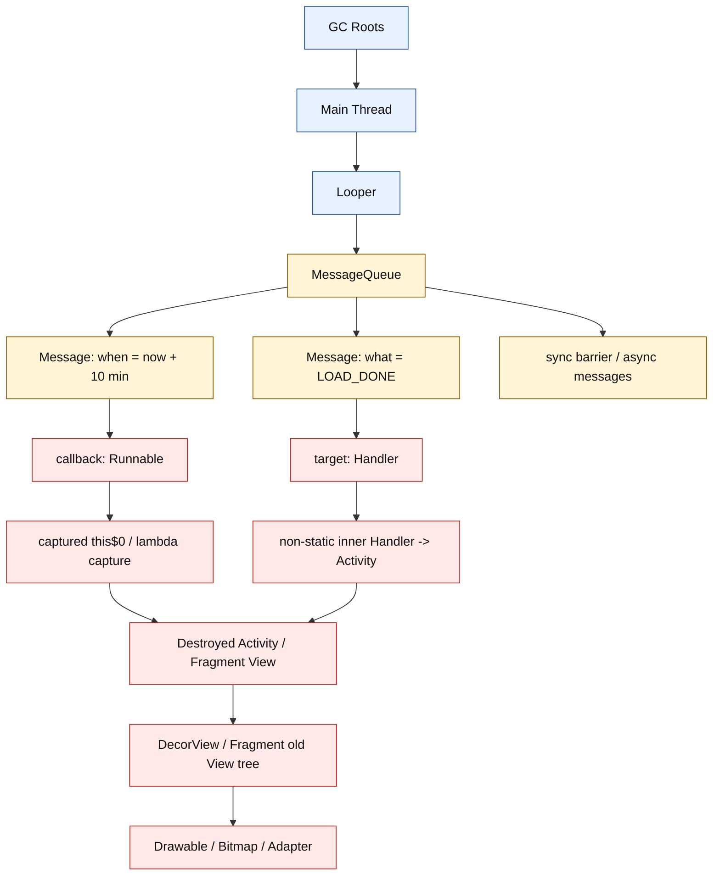
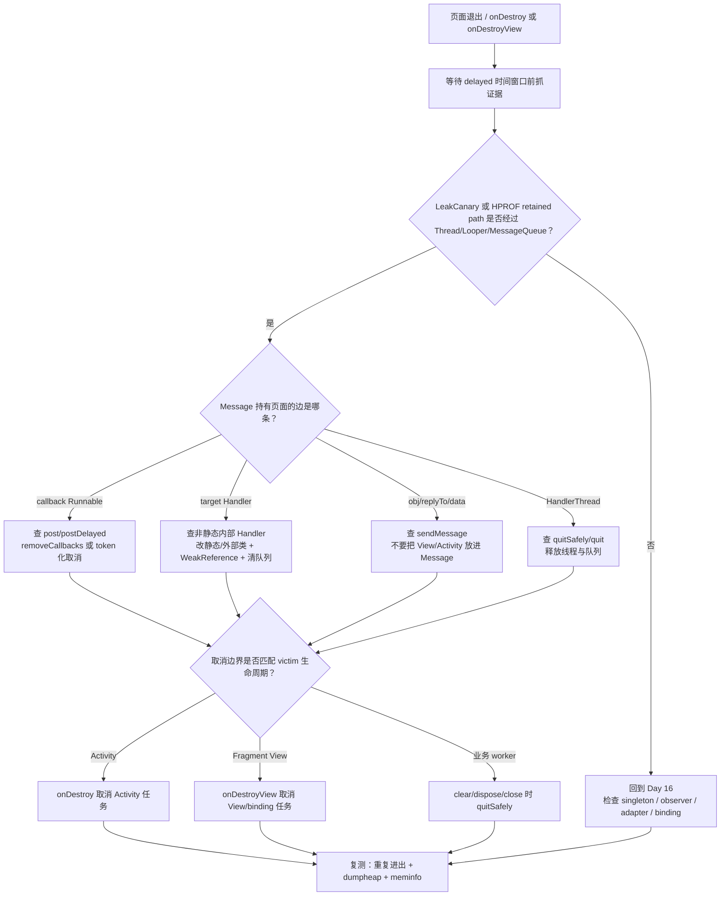
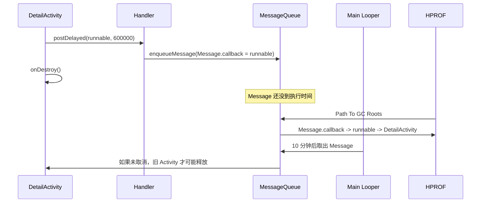

# Day 17：Handler 泄漏：消息队列与生命周期的冲突
> 系列第 17 篇。今天把 Day 16 留下的 `Thread / MessageQueue / Message / Runnable` 分支拆开：Handler 泄漏不是 Handler 这个类“有毒”，而是 **MessageQueue 里尚未执行的 Message/Runnable 把已销毁页面继续强可达**。

---

## 一句话结论

- **Handler 泄漏的关键路径通常是 `Thread -> Looper -> MessageQueue -> Message -> callback/target -> Activity/Fragment/View`。**
- **延迟越久，泄漏窗口越长；主线程不退出，所以 Main Looper 是非常稳定的 GC Root 入口。**
- **修复点优先在生命周期边界取消排队任务：`removeCallbacks`、`removeMessages`、`removeCallbacksAndMessages(token)`。**
- **验收不能只看代码改了；要看退出页面后 MessageQueue、LeakCanary retained path、HPROF、Java Heap 趋势是否消失。**

---

## 图 1：Handler 泄漏的运行时结构



### 读图规则

| 节点 | 生命周期 | 泄漏判断 |
|---|---|---|
| `Main Thread` | 进程存活期间通常不退出 | 不能指望线程结束来释放页面 |
| `Looper` | 绑定线程，一直轮询 MessageQueue | 主线程 Looper 是稳定 Root 入口 |
| `MessageQueue` | 按 `when` 时间保存未来任务 | delayed message 会延长引用存活 |
| `Message.callback` | `post(Runnable)` 的 Runnable | lambda/匿名类容易捕获页面 |
| `Message.target` | `sendMessage` 的 Handler | 非静态内部 Handler 会隐式持有外部类 |

---

## Day 16 反思落地：Root-owner-bridge-victim

| 场景 | Root | Owner | Bridge | Victim |
|---|---|---|---|---|
| Activity 里 `postDelayed` | Main Thread | MessageQueue | `Message.callback -> Runnable -> this$0` | destroyed Activity |
| 非静态内部 Handler | Main Thread | MessageQueue | `Message.target -> Handler.this$0` | Activity/Fragment |
| Fragment View 延迟刷新 | Main Thread | MessageQueue | Runnable captures `binding` / View | old View tree |
| 静态 Handler + Message.obj | Main Thread | MessageQueue | `Message.obj` 保存 View/Activity | Activity/View |
| 子线程 HandlerThread 未停 | Java Thread | Looper + MessageQueue | pending Message/Runnable | Repository/Activity callback |

Day 16 要求把 Thread/MessageQueue 分支讲清楚。本篇的可见变化是：每个 Handler 风险都被落到 `Message.callback`、`Message.target`、`Message.obj` 或 `HandlerThread` 这条可验证边上。

---

## 图 2：Handler 泄漏排障决策流



---

## 图 3：延迟消息如何跨过生命周期边界



---

## 源码入口表

| 目标 | AOSP 路径 | 搜索词 | 关注点 |
|---|---|---|---|
| Handler 入队 | `frameworks/base/core/java/android/os/Handler.java` | `enqueueMessage`、`postDelayed`、`sendMessageAtTime` | `msg.target = this` |
| MessageQueue 排队 | `frameworks/base/core/java/android/os/MessageQueue.java` | `enqueueMessage`、`next`、`removeMessages` | 按 `when` 排序与移除 |
| Looper 轮询 | `frameworks/base/core/java/android/os/Looper.java` | `loopOnce`、`loop`、`msg.target.dispatchMessage` | Message 执行前一直在队列 |
| Message 字段 | `frameworks/base/core/java/android/os/Message.java` | `callback`、`target`、`obj`、`recycleUnchecked` | 哪个字段持有页面 |
| HandlerThread 生命周期 | `frameworks/base/core/java/android/os/HandlerThread.java` | `run`、`getLooper`、`quitSafely` | 子线程队列是否退出 |

```bash
# 在 AOSP checkout 中验证 Handler 入队与清理路径
rg -n "enqueueMessage|postDelayed|sendMessageAtTime|removeCallbacksAndMessages" frameworks/base/core/java/android/os/Handler.java
rg -n "enqueueMessage|removeMessages|next\\(" frameworks/base/core/java/android/os/MessageQueue.java
rg -n "loopOnce|dispatchMessage|recycleUnchecked" frameworks/base/core/java/android/os/Looper.java frameworks/base/core/java/android/os/Message.java
rg -n "quitSafely|getLooper|Looper.prepare|Looper.loop" frameworks/base/core/java/android/os/HandlerThread.java
```

---

## `post` 与 `sendMessage` 的保留边

| API | Message 字段 | 常见错误 | 更稳的做法 |
|---|---|---|---|
| `handler.post { render() }` | `callback` | lambda 捕获 `this`、`binding`、`view` | 保存 Runnable 引用并在边界 `removeCallbacks` |
| `postDelayed(r, 10 * 60_000)` | `callback + when` | 页面销毁后 Message 仍排队 | 使用 token 分组，退出时按 token 清理 |
| `sendMessage(msg)` | `target` | 非静态内部 Handler 隐式持有 Activity | Handler 不依赖页面，或生命周期清队列 |
| `msg.obj = activity/view` | `obj` | Message 直接保存短生命周期对象 | 传 id/data，不传 View/Context |
| `HandlerThread` + Handler | worker Looper | 线程不退出，队列保留 callback | `quitSafely()`，并清 pending task |

---

## 代码形态：错在哪条边

| 写法 | 错误边 | 修复点 |
|---|---|---|
| `private val handler = Handler(Looper.getMainLooper())` + `postDelayed { title.text = ... }` | `Message.callback -> lambda -> Activity/View` | 保存 Runnable，`onDestroy/onDestroyView` 移除 |
| `inner class UiHandler : Handler()` | `Message.target -> Handler -> this$0` | 避免 inner；清队列仍必须做 |
| `message.obj = binding.root` | `Message.obj -> View -> Activity` | Message 只传稳定数据 |
| `HandlerThread("worker").start()` 但不 quit | `Thread -> Looper -> MessageQueue` 长期存在 | owner 结束时 `quitSafely()` |

```kotlin
private val uiHandler = Handler(Looper.getMainLooper())
private val pageToken = Any()

private val refreshRunnable = Runnable {
    renderLatestState()
}

fun scheduleRefresh() {
    val message = Message.obtain(uiHandler, refreshRunnable)
    message.obj = pageToken
    uiHandler.sendMessageDelayed(message, 10 * 60_000L)
}

override fun onDestroy() {
    uiHandler.removeCallbacksAndMessages(pageToken)
    super.onDestroy()
}
```

> 边界：`removeCallbacksAndMessages(null)` 会移除该 Handler 的全部 callback/message。页面专属 Handler 可以这么做；共享 Handler 更建议使用 token，避免误删其他业务任务。

---

## Fragment View 的取消边界

| victim | 取消位置 | 原因 |
|---|---|---|
| Activity 页面任务 | `Activity.onDestroy()` | Activity 生命周期结束 |
| Fragment 实例任务 | `Fragment.onDestroy()` | Fragment 本身结束 |
| Fragment View / binding / adapter 更新 | `Fragment.onDestroyView()` | View tree 已销毁，Fragment 可能仍在 back stack |
| RecyclerView item 延迟刷新 | `onViewRecycled` 或 adapter detach | ViewHolder 可能复用到别处 |

```kotlin
private val viewToken = Any()

override fun onViewCreated(view: View, savedInstanceState: Bundle?) {
    val msg = Message.obtain(uiHandler) {
        binding.title.text = "loaded"
    }
    msg.obj = viewToken
    uiHandler.sendMessageDelayed(msg, 5_000L)
}

override fun onDestroyView() {
    uiHandler.removeCallbacksAndMessages(viewToken)
    recyclerView.adapter = null
    _binding = null
    super.onDestroyView()
}
```

---

## 工程证据表

| 证据入口 | 命令/路径 | 看什么 | 能证明什么 |
|---|---|---|---|
| Java Heap 趋势 | `adb shell dumpsys meminfo <package>` | Java Heap、Objects、Views、Activities | 是否存在 Java retained 增长 |
| GC 日志 | `adb logcat -v time \| grep -E "GC|freed|paused"` | GC 后 freed 很低 | 对象仍强可达，继续看 retained path |
| HPROF | `adb shell am dumpheap <package> /data/local/tmp/day17.hprof` | Path To GC Roots | 是否经过 Thread/Looper/MessageQueue |
| LeakCanary | retained trace | `Thread`、`MessageQueue`、`Message.callback`、`this$0` | 快速定位错误边 |
| 主线程消息 | Perfetto main thread slices | delayed task 执行点、卡顿点 | 泄漏任务是否还执行旧页面逻辑 |
| 源码验证 | AOSP `Handler.java` / `MessageQueue.java` | target、callback、obj、remove 逻辑 | 解释 retained path 为什么成立 |
| 线程退出 | `adb shell ps -T -p <pid>` 或 Studio thread view | HandlerThread 是否仍存活 | worker 队列是否释放 |

```bash
# 1. 重复打开关闭页面后看 Java Heap 和 Activity/View 数
adb shell dumpsys meminfo <package> | head -n 180
adb shell dumpsys activity activities | grep -E "<package>|Hist|ActivityRecord"

# 2. 抓 HPROF，重点查 Thread -> Looper -> MessageQueue
adb shell am dumpheap <package> /data/local/tmp/day17.hprof
adb pull /data/local/tmp/day17.hprof .

# 3. 看 GC 发生后是否仍低回收
adb logcat -v time | grep -E "GC|freed|paused|Alloc"

# 4. worker HandlerThread 场景，确认线程是否退出
adb shell pidof <package>
adb shell ps -T -p <pid>
```

---

## LeakCanary trace 读法

| Trace 片段 | 含义 | 下一步 |
|---|---|---|
| `GC Root: Thread object` | 线程是 Root 入口 | 看线程名：main 还是 HandlerThread |
| `Looper.mQueue` | 进入消息队列 | 查 pending Message |
| `Message.callback` | `post(Runnable)` 路径 | 找 Runnable 捕获了谁 |
| `Message.target` | `sendMessage` / Handler 路径 | 查 Handler 是否 inner 或持有 owner |
| `this$0` | 匿名/内部类捕获外部类 | 改写捕获或生命周期取消 |
| `Message.obj` | 业务数据字段保留对象 | 不传 Activity/View/Binding |
| `Leaking: UNKNOWN` 的 Handler | Handler 不是终点 | 继续向下找 destroyed Activity / old View |

---

## 修复策略对照

| 策略 | 能解决什么 | 不能解决什么 |
|---|---|---|
| `removeCallbacks(runnable)` | 精确移除某个 Runnable | 找不到同一个 Runnable 实例就无效 |
| `removeMessages(what)` | 移除某类 Message | callback Runnable 不受 `what` 控制 |
| `removeCallbacksAndMessages(token)` | 移除页面/视图分组任务 | 必须入队时就设置同一个 token |
| `removeCallbacksAndMessages(null)` | 清空该 Handler 全部任务 | 共享 Handler 可能误删其他任务 |
| 静态 Handler + WeakReference | 避免 Handler 隐式持有外部类 | Message 仍可能持有 Runnable/obj；任务仍会执行 |
| `lifecycleScope` / `repeatOnLifecycle` | 对 coroutine 更自然 | 不能自动取消普通 Handler Message |
| `HandlerThread.quitSafely()` | 释放 worker Looper | 已经分发中的任务仍要自己处理取消语义 |

---

## 验收 checklist

| 检查项 | 通过标准 |
|---|---|
| 复现固定 | 页面重复进入退出 5-10 次，delayed 时间窗口内抓证据 |
| 错误边命名 | 能指出 `callback`、`target`、`obj` 或 HandlerThread |
| 生命周期匹配 | Activity 用 `onDestroy`；Fragment View 用 `onDestroyView` |
| 队列清理可证明 | token/Runnable/what 与入队代码一一对应 |
| before/after 可比 | retained path 消失，实例数或 Java Heap 趋势下降 |
| 共享 Handler 风险已排除 | 没有用 `null` token 误删其他业务消息 |
| worker 线程退出 | HandlerThread 不再出现在 thread view / `ps -T` |

---

## 边界记录

| 边界 | 本文处理方式 |
|---|---|
| Android 版本差异 | Handler/MessageQueue 核心字段长期稳定，但具体源码方法名要以目标 AOSP branch 为准。 |
| `removeCallbacksAndMessages` 语义 | 本文强调 token 化；共享 Handler 不默认推荐传 `null`。 |
| Compose | Compose 的 effect/scope 泄漏不等同于 Handler 泄漏，后续应单独讲。 |
| 真实 HPROF | 本文仍使用代表性路径；后续工具篇需要用真实 HPROF 逐行验证。 |
| GitHub Issues | 本次 `gh issue list` 因未认证被阻塞，不能声称吸收 open Issue 反馈。 |

---

## 这篇要记住的 5 句工程话术

| 场景 | 更好的表达 |
|---|---|
| Handler 泄漏 | “先证明 retained path 经过 `Thread -> Looper -> MessageQueue -> Message`。” |
| delayed 风险 | “延迟消息把页面引用延长到执行或移除之前。” |
| 修复位置 | “取消点必须落在 victim 的生命周期边界。” |
| token 使用 | “共享 Handler 用 token 分组，避免清错队列。” |
| 验收修复 | “没有 before/after retained path，就不要说 Handler 泄漏已修复。” |
