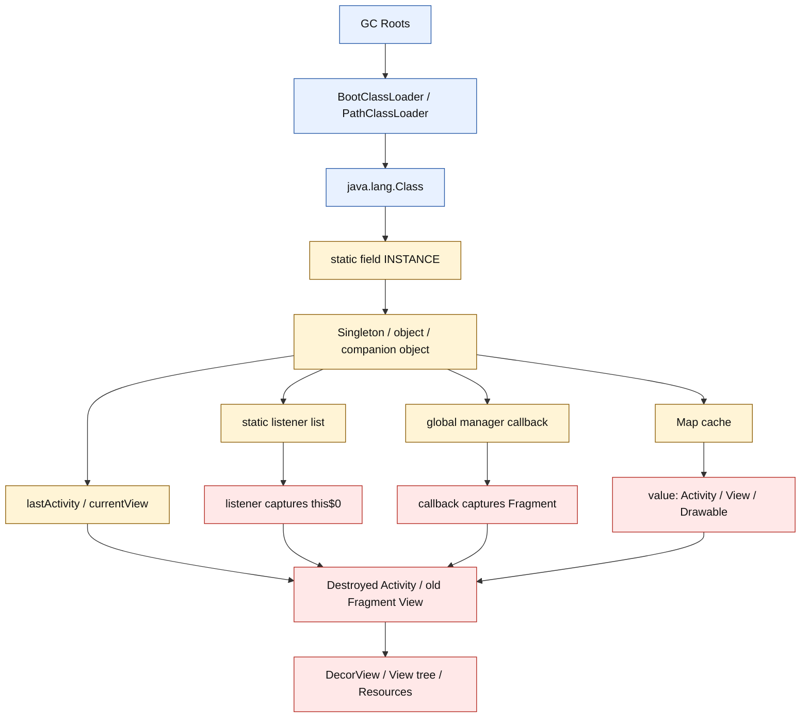
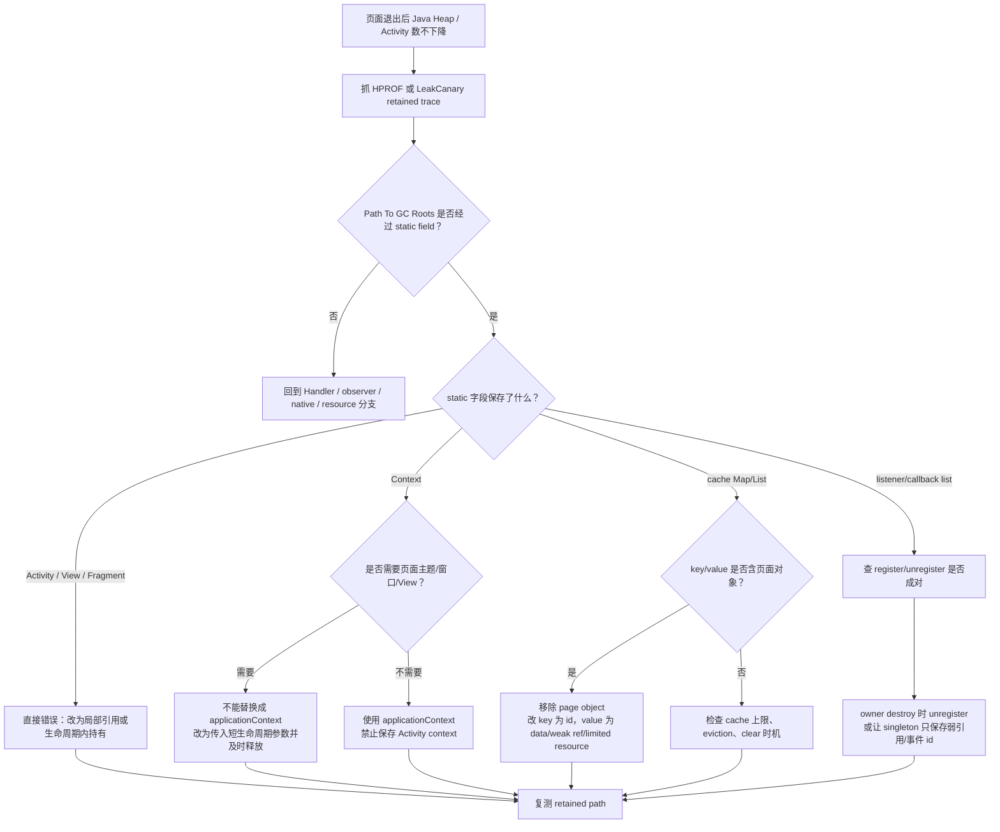
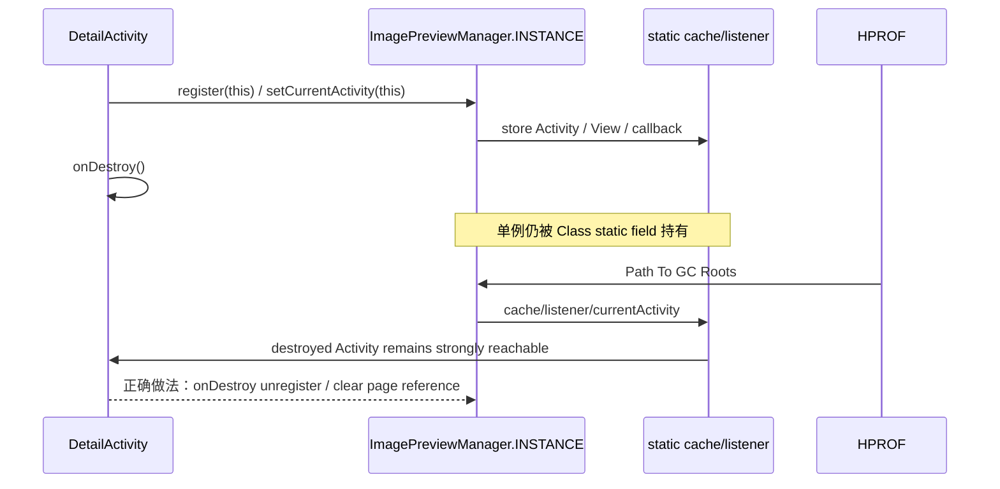
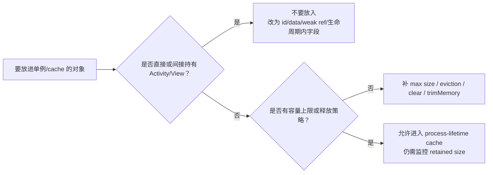

# Day 18：静态持有、单例泄漏的排查路径
> 系列第 18 篇。Day 17 的 Handler 泄漏来自“队列还没消费完”；今天换成更稳定的 owner：`static field`、`object singleton`、进程级 registry、全局 cache。它们的危险点不是延迟时间，而是 **进程生命周期远长于页面生命周期**。

---

## 一句话结论

- **静态/单例泄漏的关键路径通常是 `GC Root -> Class / ClassLoader -> static field -> singleton/cache/list -> Activity/View/Fragment`。**
- **`applicationContext` 不是万能修复；它只适合不需要页面、主题、窗口、View 树的进程级依赖。**
- **单例可以持有 process-lifetime 对象，不能持有 page-lifetime 对象。**
- **验收必须看 retained path 的静态字段名、缓存 key/value、listener list、before/after HPROF 或 LeakCanary trace。**

---

## 图 1：静态/单例泄漏的运行时结构



### 读图规则

| 节点 | 生命周期 | 泄漏判断 |
|---|---|---|
| `ClassLoader` / `Class` | App 进程内通常长期存活 | 静态字段天然接近进程生命周期 |
| `INSTANCE` / `object` | 初始化后常驻 | 只能持有同等或更长生命周期对象 |
| `Map cache` | 由业务策略决定 | key/value 不能直接保存 Activity/View |
| `listener list` | 注册容易，注销常漏 | listener 捕获页面就是桥接边 |
| `lastActivity` / `currentView` | 最危险 | 明确把短生命周期对象升格为全局对象 |

---

## Day 17 反思落地：队列 owner vs 全局 owner

| 维度 | Day 17 Handler 泄漏 | Day 18 静态/单例泄漏 |
|---|---|---|
| Root 入口 | `Thread -> Looper -> MessageQueue` | `ClassLoader -> Class -> static field` |
| Owner | pending `Message` | singleton / companion / static registry |
| Bridge | `callback`、`target`、`obj` | field、cache value、listener、callback |
| 泄漏窗口 | 到 Message 执行或移除为止 | 到进程结束或显式 clear/unregister 为止 |
| 修复动作 | 生命周期边界清队列 | 降级引用、解绑注册、限定 cache、移除 page 对象 |
| 验收证据 | retained path 经过 MessageQueue | retained path 指向具体 static field |

可见承接：Day 17 要求 Day 18 “分离 global owner fields 与 queued Message owners”。本篇把 owner 类型、桥接字段、泄漏窗口、修复动作和验收证据拆成对照表，而不是只说“也是 GC Root 持有链”。

---

## 图 2：静态/单例泄漏排障决策流



---

## 图 3：页面对象如何被单例升格



---

## Root-owner-bridge-victim

| 场景 | Root | Owner | Bridge | Victim |
|---|---|---|---|---|
| `object SessionManager { var activity: Activity? }` | ClassLoader | `SessionManager.INSTANCE` | `activity` field | destroyed Activity |
| `companion object { val views = mutableListOf<View>() }` | Class | companion object | `views[index]` | old View tree |
| 全局 listener registry | Class | singleton registry | listener captures `this$0` | Activity/Fragment |
| 静态 LruCache | Class | cache | value is Drawable/View/Context wrapper | Activity/View |
| SDK 初始化保存 Context | Class | SDK singleton | `context` field | Activity context |
| DI container singleton | Class / app component | singleton scoped binding | page-scoped object injected into singleton | Activity / ViewModel / Fragment |

---

## 源码入口表

| 目标 | 路径/仓库 | 搜索词 | 关注点 |
|---|---|---|---|
| 静态字段引用 | App 代码 | `static`、`companion object`、`object `、`INSTANCE` | 是否保存页面对象 |
| Kotlin 单例生成 | 反编译 class / bytecode | `INSTANCE` | Kotlin `object` 也是静态入口 |
| Android Context 边界 | `frameworks/base/core/java/android/content/Context.java` | `getApplicationContext` | application context 能力边界 |
| Activity 主题/窗口 | `frameworks/base/core/java/android/app/Activity.java` | `getWindow`、`getTheme` | 页面 context 才有的能力 |
| View 持有 Context | `frameworks/base/core/java/android/view/View.java` | `mContext`、`getContext` | 保存 View 等于间接保存 Context |
| LruCache | `frameworks/base/core/java/android/util/LruCache.java` | `sizeOf`、`entryRemoved`、`trimToSize` | cache 是否有上限与淘汰 |
| LeakCanary watcher | LeakCanary repo | `ObjectWatcher`、`KeyedWeakReference` | 如何确认 destroyed object 仍被保留 |

```bash
# App 代码中优先搜全局 owner
rg -n "static .*Activity|static .*View|static .*Context|companion object|object [A-Z]|INSTANCE|mutableListOf|HashMap|LruCache" app src

# 搜 listener 注册不注销
rg -n "register|unregister|addListener|removeListener|observeForever|removeObserver" app src

# AOSP checkout 中验证 Context/View/cache 边界
rg -n "getApplicationContext|getWindow|getTheme" frameworks/base/core/java/android/app frameworks/base/core/java/android/content
rg -n "mContext|getContext" frameworks/base/core/java/android/view/View.java
rg -n "trimToSize|entryRemoved|sizeOf" frameworks/base/core/java/android/util/LruCache.java
```

---

## `applicationContext` 边界表

| 依赖想做什么 | 能否用 `applicationContext` | 原因 |
|---|---:|---|
| 读 SharedPreferences / database / app files | 可以 | 进程级资源，不需要页面窗口 |
| 初始化网络、日志、埋点 SDK | 通常可以 | 只需要 app-level Context |
| inflate 带 Activity theme 的布局 | 不建议 | 主题、样式、Window 依赖页面 |
| 弹 Dialog / 启动页面 UI | 不可以 | 需要 Activity window token |
| 保存 View / binding / adapter | 不可以 | View 持有 Context 和整棵视图树 |
| Toast / notification channel | 多数可用 | 但仍不要保存 Activity |

> 工程边界：把 `Activity` 替换成 `applicationContext` 只解决“Context 生命周期过短”的问题；如果单例保存的是 View、callback、Drawable callback、listener 或 Fragment，仍然会泄漏。

---

## 高危代码形态

| 写法 | 错误边 | 更稳的做法 |
|---|---|---|
| `static Activity currentActivity` | static field -> Activity | 不保存；需要前台页面时用 lifecycle callback + weak ref + 及时清 |
| `object ToastCenter { lateinit var context: Context }` 传入 Activity | singleton -> Activity context | 初始化时传 `applicationContext` |
| `object EventBus { val listeners = mutableListOf<Listener>() }` | listener -> `this$0` | `onStart/onStop` 或 `onCreate/onDestroy` 成对注册 |
| `static Map<String, View>` | cache value -> View -> Activity | value 改为纯数据、id、弱引用或可释放资源 |
| singleton 持有 `FragmentBinding` | field -> View tree | binding 只存在 `onCreateView` 到 `onDestroyView` |
| singleton scope 注入 Activity object | scope mismatch | page-scoped 依赖不能进入 singleton scope |

```kotlin
// 错误：把页面 Context 升格到进程级单例
object AnalyticsBridge {
    private var context: Context? = null

    fun init(context: Context) {
        this.context = context
    }
}

// 更稳：只保存进程级 Context；页面相关信息按调用传入，不缓存页面对象
object AnalyticsBridge {
    private lateinit var appContext: Context

    fun init(context: Context) {
        appContext = context.applicationContext
    }

    fun trackScreen(screenName: String) {
        // no Activity/View reference stored
    }
}
```

```kotlin
// 错误：listener list 持有 Activity 的匿名内部类/lambda
object DownloadRegistry {
    private val listeners = mutableSetOf<(Int) -> Unit>()
    fun add(listener: (Int) -> Unit) { listeners += listener }
    fun remove(listener: (Int) -> Unit) { listeners -= listener }
}

class DetailActivity : Activity() {
    private val listener: (Int) -> Unit = { progress ->
        render(progress)
    }

    override fun onStart() {
        super.onStart()
        DownloadRegistry.add(listener)
    }

    override fun onStop() {
        DownloadRegistry.remove(listener)
        super.onStop()
    }
}
```

---

## cache 不是泄漏豁免牌

| cache 类型 | 可持有 | 不应持有 | 必须证明 |
|---|---|---|---|
| process memory cache | immutable data、DTO、bitmap/resource with clear policy | Activity、View、binding、Fragment | max size、eviction、clear |
| page cache | page-owned UI state | static/global map | 生命周期结束会释放 |
| image cache | bitmap/resource abstraction | ImageView、Activity context | trimMemory、entryRemoved |
| callback registry | stable service listener id | anonymous Activity callback without unregister | register/unregister 对称 |



---

## 工程证据表

| 证据入口 | 命令/路径 | 看什么 | 能证明什么 |
|---|---|---|---|
| Java Heap 趋势 | `adb shell dumpsys meminfo <package>` | Java Heap、Objects、Views、Activities | 页面退出后是否持续增长 |
| Activity 栈 | `adb shell dumpsys activity activities` | destroyed/历史 Activity | 是否存在页面残留 |
| HPROF | `adb shell am dumpheap <package> /data/local/tmp/day18.hprof` | Path To GC Roots | 是否经过 static field |
| LeakCanary | retained trace | `static`、`INSTANCE`、`listeners`、`mContext` | 快速锁定全局 owner 字段 |
| MAT OQL | `SELECT * FROM INSTANCEOF android.app.Activity` | Activity 实例数与 retained size | 哪些 Activity 未释放 |
| source search | `rg` 静态字段/listener/cache | 注册点、字段名、clear 点 | 错误边是否真实存在 |
| before/after | 同一复现场景重复抓 heap | retained path 消失 | 修复验收 |

```bash
# 1. 复现：重复打开关闭目标页面 5-10 次后看总体趋势
adb shell dumpsys meminfo <package> | head -n 180
adb shell dumpsys activity activities | grep -E "<package>|ActivityRecord|Hist"

# 2. 抓 heap，查 static field retained path
adb shell am dumpheap <package> /data/local/tmp/day18.hprof
adb pull /data/local/tmp/day18.hprof .

# 3. GC 后仍低回收时，不调 GC，转 retained path
adb logcat -v time | grep -E "GC|freed|paused|Alloc"

# 4. 代码侧定位全局 owner 与释放点
rg -n "static|companion object|object |INSTANCE|addListener|removeListener|register|unregister|clear\\(" app src
```

---

## LeakCanary trace 读法

| Trace 片段 | 含义 | 下一步 |
|---|---|---|
| `GC Root: System class` | Class 是 Root 入口 | 往下找 static field |
| `static ... INSTANCE` | Kotlin object / Java singleton | 查 singleton 字段 |
| `static ... currentActivity` | 直接保存页面 | 删除该字段或改生命周期内传参 |
| `ArrayList.elementData` | listener/list/cache 保存对象 | 找 add/remove 是否成对 |
| `View.mContext` | 保存 View 间接保存 Activity | 禁止全局保存 View |
| `ContextThemeWrapper.mBase` | 主题 context 包装链 | 不能用 applicationContext 简单替代所有 UI 场景 |
| `this$0` | callback/内部类捕获页面 | listener unregister 或改捕获方式 |

---

## 修复策略对照

| 策略 | 能解决什么 | 不能解决什么 |
|---|---|---|
| 保存 `applicationContext` | SDK/app service 持有 Activity context | View、listener、Fragment、window 相关泄漏 |
| `unregister/removeListener` | registry/listener 泄漏 | 已经进入 cache 的 page object |
| singleton `clear()` | 退出登录、模块销毁、测试 reset | 忘记调用仍会泄漏 |
| WeakReference | 降低保留强度 | 不能替代生命周期设计；可能丢事件 |
| LruCache max size | 控制容量 | 不允许 value 是 Activity/View |
| page scope / ViewModel scope | 限定对象生命周期 | scope 错配时仍会泄漏 |
| 静态分析/grep | 快速找高危点 | 不能证明运行时 retained path |

---

## 验收 checklist

| 检查项 | 通过标准 |
|---|---|
| Root 命名 | retained path 明确经过 `Class -> static field` |
| owner 命名 | 能指出具体 singleton/cache/listener 字段 |
| victim 命名 | destroyed Activity、old Fragment View、View/binding 被识别 |
| 生命周期匹配 | register/unregister 或 set/clear 成对 |
| Context 边界清楚 | 只在进程级能力使用 `applicationContext` |
| cache 有策略 | max size、eviction、trim/clear 可说明 |
| before/after 可比 | 同场景下 retained path 或实例数下降 |
| 代码搜索闭环 | 静态字段、注册点、释放点都有 source path |

---

## 边界记录

| 边界 | 本文处理方式 |
|---|---|
| Android 版本差异 | 静态字段的 GC Root 语义稳定，但具体 AOSP 方法名仍需目标 branch 验证。 |
| ROM / SDK 差异 | 第三方 SDK 可能内部保存 Context 或 listener，只能通过 heap trace 和 SDK 文档确认。 |
| `applicationContext` | 只作为进程级依赖修复，不作为 UI 对象泄漏的通用答案。 |
| 真实 HPROF | 本文仍使用代表性路径；后续工具篇需要用真实 HPROF 逐行解码。 |
| GitHub Issues | 本次 `gh issue list` 因未认证被阻塞，不能声称吸收 open Issue 反馈。 |

---

## 这篇要记住的 5 句工程话术

| 场景 | 更好的表达 |
|---|---|
| 静态泄漏 | “先找 retained path 里的 `Class -> static field`，再命名具体字段。” |
| 单例边界 | “单例只能持有进程级对象，不能保存页面对象。” |
| Context 修复 | “`applicationContext` 只解决 app-level Context，不解决 View/listener/callback 泄漏。” |
| cache 审查 | “cache value 不能是 Activity/View；容量策略也必须可证明。” |
| 验收修复 | “没有 before/after retained path，就不要说单例泄漏已修复。” |
