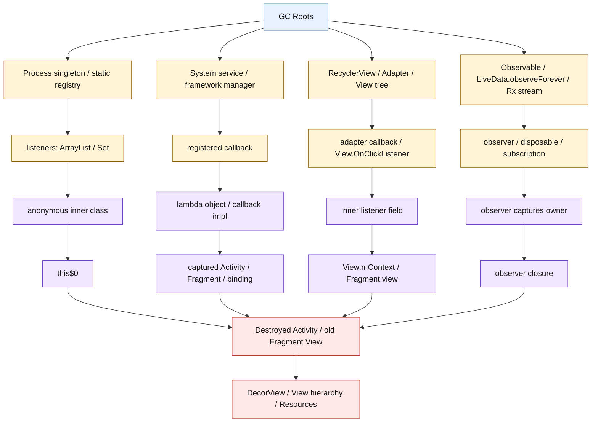
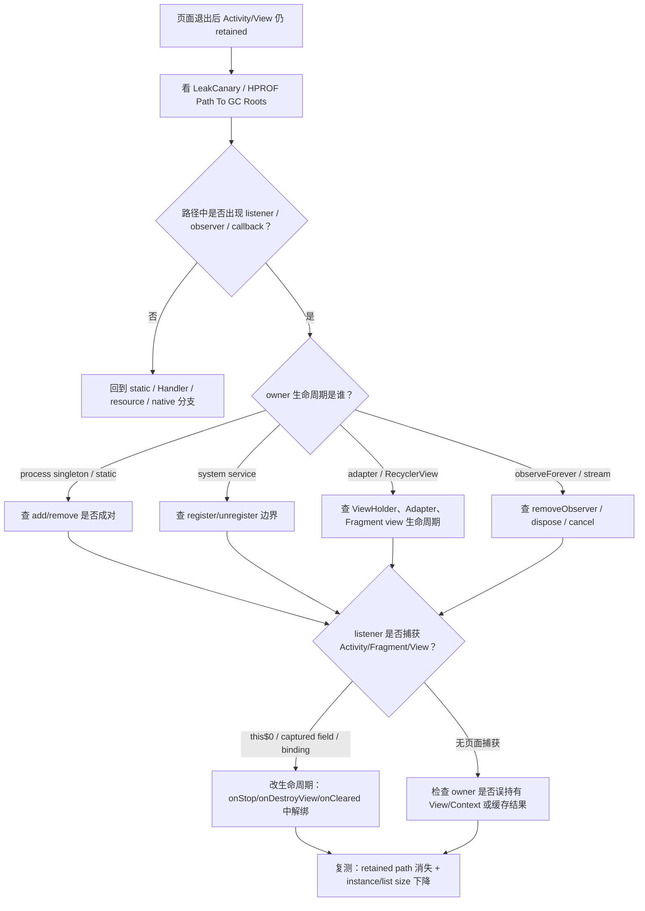
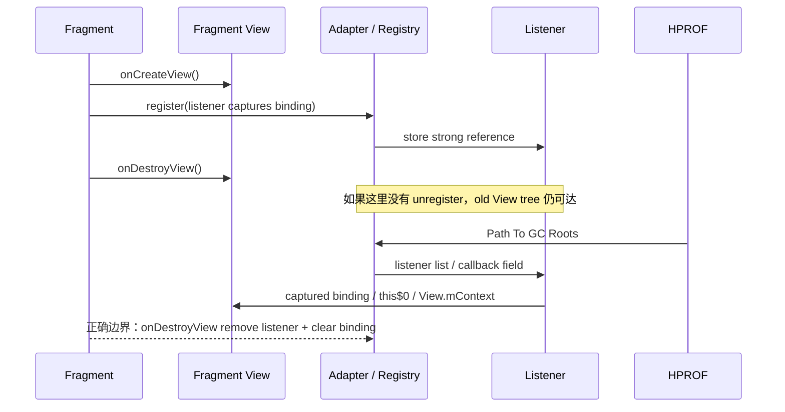
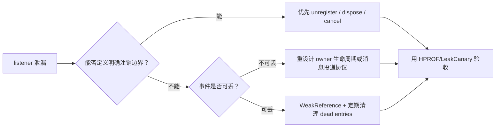

# Day 19：Listener 未注销与匿名内部类泄漏
> 系列第 19 篇。Day 18 讲的是 `static field / singleton / listener list` 把页面对象升格到进程生命周期；今天把其中最常见的一条边展开：**listener、observer、adapter callback、匿名内部类、lambda capture** 如何把 `Activity / Fragment / View` 留在堆里。

---

## 一句话结论

- **Listener 泄漏的关键路径通常是 `GC Root -> owner registry/list -> callback/listener -> this$0/captured field -> destroyed page`。**
- **匿名内部类不是问题本身；问题是它捕获了外部页面对象，并被更长生命周期的 owner 保存。**
- **`removeListener / unregister / removeObserver / clear callback` 必须和注册生命周期对齐。**
- **验收不能只看代码改了；要看 retained path 消失、listener list 变空、Activity/View 实例数下降。**

---

## 图 1：Listener 泄漏的运行时结构



### 读图规则

| 层级 | 典型对象 | 排查问题 |
|---|---|---|
| Root | Thread、Class、system service、active View tree | 谁仍然活着 |
| Owner | registry、manager、adapter、observable | 谁保存 listener |
| Bridge | listener、observer、callback、lambda | 是否捕获页面 |
| Capture | `this$0`、captured field、`View.mContext` | 页面如何被带上 |
| Victim | destroyed Activity、old Fragment View、binding | 生命周期是否已经结束 |

---

## Day 18 反思落地：把 listener-list 分支展开

| Day 18 留下的点 | Day 19 的可见变化 |
|---|---|
| 静态 listener list 只是高危形态之一 | 拆成 singleton registry、system callback、adapter callback、observer stream 四类 owner |
| `this$0` 只在 trace 表里出现 | 单独解释匿名内部类、lambda、inner class 的捕获路径 |
| 需要 before/after 证据 | 增加 unregister 验收表、heap/listener/source 三线验证 |
| 需要更具体 source path | 增加 App `rg`、AOSP `View`、AndroidX `LiveData`、RecyclerView、Rx/Flow 搜索入口 |

这不是“复述上一章”：本篇把 Day 18 的 `listener list -> this$0` 边变成可执行排查路径。

---

## 图 2：Listener 泄漏排障决策流



---

## 图 3：注册与注销必须落在同一生命周期窗口



---

## Root-owner-bridge-victim

| 场景 | Root | Owner | Bridge | Victim |
|---|---|---|---|---|
| 单例事件中心 | `ClassLoader -> Class` | `EventBus.INSTANCE.listeners` | anonymous listener `this$0` | destroyed Activity |
| `observeForever` | active LiveData / process owner | observer list | Observer captures Fragment | Fragment / ViewModel |
| 系统 callback | system service binder/native peer | registered callback | callback impl field | Activity / Context |
| Adapter callback | RecyclerView / Adapter | callback/listener field | lambda captures binding | old Fragment View |
| View listener | active View tree | `View.mListenerInfo` | `OnClickListener` inner class | Activity via `this$0` |
| Rx / coroutine stream | scheduler / job / subscription | observer/action | closure captures View | destroyed page |

---

## 捕获形态速查

| 写法 | 编译/运行时形态 | 泄漏边 |
|---|---|---|
| Java 匿名内部类 | synthetic `this$0` 指向外部类 | listener -> `this$0` -> Activity |
| Kotlin `inner class` | 保留 outer instance 引用 | inner -> outer Fragment/Activity |
| Kotlin lambda 调用页面成员 | lambda object 捕获 `this` 或字段 | registry -> lambda -> Activity/binding |
| 方法引用 `this::render` | callable reference 捕获 receiver | observer -> receiver -> Fragment |
| `object : Listener` 写在 Fragment 中 | anonymous class 捕获 Fragment | owner -> listener -> Fragment |
| static nested class + WeakReference | 不隐式捕获 outer | 仍需及时 remove，避免弱引用列表膨胀 |

```kotlin
// 错误：进程级 registry 保存 listener，listener 捕获 Activity(this)
object PriceRegistry {
    private val listeners = mutableSetOf<(Int) -> Unit>()
    fun add(listener: (Int) -> Unit) { listeners += listener }
    fun remove(listener: (Int) -> Unit) { listeners -= listener }
}

class DetailActivity : Activity() {
    private val priceListener: (Int) -> Unit = { price ->
        renderPrice(price) // captures this
    }

    override fun onStart() {
        super.onStart()
        PriceRegistry.add(priceListener)
    }

    override fun onStop() {
        PriceRegistry.remove(priceListener)
        super.onStop()
    }
}
```

```kotlin
// Fragment View 边界：listener 捕获 binding，就必须在 onDestroyView 解绑
class DetailFragment : Fragment() {
    private var binding: DetailBinding? = null
    private val callback = Adapter.Callback { item ->
        binding?.title?.text = item.title
    }

    override fun onViewCreated(view: View, savedInstanceState: Bundle?) {
        binding = DetailBinding.bind(view)
        adapter.callback = callback
    }

    override fun onDestroyView() {
        adapter.callback = null
        binding = null
        super.onDestroyView()
    }
}
```

---

## 生命周期边界表

| 注册位置 | 正确注销位置 | 适用对象 | 常见错误 |
|---|---|---|---|
| `Activity.onCreate` | `Activity.onDestroy` | 页面整个生命周期监听 | 旋转屏幕后旧 Activity 留在 registry |
| `Activity.onStart` | `Activity.onStop` | 可见期间事件 | 后台仍收事件并保留 UI |
| `Fragment.onViewCreated` | `Fragment.onDestroyView` | View/binding/adapter callback | Fragment 活着但旧 View 泄漏 |
| `ViewHolder.bind` | `ViewHolder.unbind` / recycle | item View listener | listener 持有旧 item 或 Fragment callback |
| `observeForever` | `removeObserver` | 无 LifecycleOwner 的 observer | 以为 LiveData 会自动解绑 |
| Rx `subscribe` | `Disposable.dispose` | stream callback | subscription 生命周期超过页面 |
| Flow `launchIn(scope)` | cancel scope/job | coroutine collector | 使用 process/global scope 收集 UI |
| system `registerCallback` | `unregisterCallback` | sensor/location/window callback | 系统服务仍持有 callback |

---

## 源码入口表

| 目标 | 路径/仓库 | 搜索词 | 关注点 |
|---|---|---|---|
| App 注册点 | App 代码 | `addListener`、`register`、`observeForever`、`subscribe` | 注册生命周期 |
| App 注销点 | App 代码 | `removeListener`、`unregister`、`removeObserver`、`dispose` | 是否成对 |
| Java/Kotlin 捕获 | build output / LeakCanary trace | `this$0`、`$receiver`、`captured` | listener 是否带外部对象 |
| View listener | `frameworks/base/core/java/android/view/View.java` | `ListenerInfo`、`mOnClickListener` | View 如何保存 listener |
| Activity lifecycle | `frameworks/base/core/java/android/app/Activity.java` | `performDestroy`、`onDestroy` | 页面释放边界 |
| AndroidX Fragment | `androidx/fragment/app/Fragment.java` | `performDestroyView`、`mView` | View 生命周期释放点 |
| AndroidX LiveData | `androidx/lifecycle/LiveData.java` | `observeForever`、`removeObserver` | forever observer 不是自动解绑 |
| RecyclerView | `androidx/recyclerview/widget/RecyclerView.java` | `onViewRecycled`、`AdapterDataObserver` | Adapter / ViewHolder callback |

```bash
# 1. App 代码中找注册但可能没有注销的点
rg -n "addListener|removeListener|register|unregister|observeForever|removeObserver|subscribe\\(|dispose\\(|launchIn\\(|callback\\s*=" app src

# 2. 找匿名内部类、inner class、lambda 捕获 UI 的高危写法
rg -n "object\\s*:\\s*.*Listener|inner class|this::|binding\\.|requireActivity\\(|activity\\.|view\\." app src

# 3. AOSP / AndroidX checkout 中验证保存 listener 的字段和生命周期边界
rg -n "ListenerInfo|mOnClickListener|setOnClickListener" frameworks/base/core/java/android/view/View.java
rg -n "performDestroy|onDestroy" frameworks/base/core/java/android/app/Activity.java
rg -n "observeForever|removeObserver" lifecycle-livedata*/src/main/java
rg -n "performDestroyView|onDestroyView|mView" fragment*/src/main/java
```

---

## 高危 API 矩阵

| API / 模式 | 为什么危险 | 稳定写法 | 验收证据 |
|---|---|---|---|
| `addListener(listener)` | owner 可能是 singleton | 同生命周期 `removeListener` | listener list size 回落 |
| `observeForever(observer)` | 不绑定 LifecycleOwner | 优先 `observe(owner)`；否则 `removeObserver` | HPROF 不再经过 LiveData observer |
| `setCallback(callback)` | callback field 覆盖但不清理 | `onDestroyView { callback = null }` | adapter callback 为空 |
| `View.setOnClickListener` | active View 保存 listener | View 生命周期内使用；不要放进全局 View | old View tree 不 retained |
| Rx `subscribe` | upstream/scheduler 持有 observer | `CompositeDisposable.clear/dispose` | subscription disposed |
| Flow + `GlobalScope` | collector 生命周期过长 | `viewLifecycleOwner.lifecycleScope` | Job cancelled |
| system callback | 系统服务强持有 callback | matching unregister | callback 不在系统/manager path |

---

## LeakCanary trace 读法

| Trace 片段 | 含义 | 下一步 |
|---|---|---|
| `GC Root: System class` | 可能是 static registry | 找 `INSTANCE` / `listeners` 字段 |
| `ArrayList.elementData` | list 保存 listener | 回代码查 add/remove 对称性 |
| `...Listener.this$0` | 匿名内部类捕获外部类 | 改为解绑或避免捕获页面 |
| `kotlin.jvm.internal.Lambda` | lambda 对象 | 看 captured receiver/field |
| `LiveData$AlwaysActiveObserver` | `observeForever` 分支 | 必须 `removeObserver` |
| `RecyclerView$AdapterDataObservable` | Adapter observer 分支 | 检查 adapter 与 view lifecycle |
| `View.mContext` | listener 或 View 链到 Activity | 不要全局保存 View/listener |

---

## 三线验证：heap、代码、运行时

| 线索 | 命令/操作 | 看什么 | 通过标准 |
|---|---|---|---|
| Heap | `adb shell am dumpheap <package> /data/local/tmp/day19.hprof` | Path To GC Roots | 不再经过 listener/observer/callback |
| Heap count | MAT / Profiler 查 Activity、Fragment、View | 实例数、retained size | 重复进退页面后稳定回落 |
| LeakCanary | retained trace | `this$0`、observer、listener list | destroyed object 不再 retained |
| Runtime | debug 暴露 listener count | registry/listener set size | `onStop/onDestroyView` 后归零 |
| Source | `rg add/remove register/unregister` | 注册点与释放点 | 生命周期成对 |
| System trend | `adb shell dumpsys meminfo <package>` | Java Heap、Objects、Views、Activities | 修复后峰值可回收 |

```bash
# before/after 都跑同一组动作：打开目标页 -> 触发注册 -> 退出 -> 手动 GC/等待 -> dump
adb shell am dumpheap <package> /data/local/tmp/day19-before.hprof
adb pull /data/local/tmp/day19-before.hprof .

adb shell dumpsys meminfo <package> | head -n 180
adb shell dumpsys activity activities | grep -E "<package>|ActivityRecord|Hist"
adb logcat -v time | grep -E "LeakCanary|retained|GC|freed|paused"

# 修复后重复
adb shell am dumpheap <package> /data/local/tmp/day19-after.hprof
adb pull /data/local/tmp/day19-after.hprof .
```

---

## 修复策略对照

| 策略 | 适合 | 风险 |
|---|---|---|
| 成对 unregister | registry、system callback、adapter callback | 最可靠，但要选对生命周期边界 |
| LifecycleOwner 绑定 | LiveData、lifecycle-aware API | 不适用于 `observeForever` |
| `viewLifecycleOwner` | Fragment View/binding callback | 用 Fragment 本身做 owner 会泄漏旧 View |
| `CompositeDisposable` / Job cancel | Rx、coroutine stream | 必须在正确边界 clear/cancel |
| static nested class | Java listener 类 | 内部仍不能保存 Activity 强引用 |
| WeakReference listener | 非关键事件、容错 registry | 不能替代 unregister；列表仍需清理 |
| callback = null | Adapter/ViewModel bridge | 需要 owner 暴露明确清理 API |

---

## `WeakReference` 不是默认答案



| 判断 | 结论 |
|---|---|
| 业务必须收到回调 | 不要弱引用，应该让 owner 生命周期正确 |
| listener 只用于 UI 刷新 | 可考虑弱引用，但仍要 unregister |
| registry 长期运行 | 需要清理 cleared WeakReference，否则 list 膨胀 |
| trace 中仍有 Activity | 说明还有强引用路径，弱引用没有解决根因 |

---

## 验收 checklist

| 检查项 | 通过标准 |
|---|---|
| owner 命名 | 能指出具体 registry、manager、adapter、observable |
| bridge 命名 | 能指出 listener、observer、callback、lambda 字段 |
| capture 命名 | trace 中明确 `this$0`、captured receiver、binding 或 View |
| 生命周期匹配 | 注册与注销落在同一生命周期窗口 |
| Fragment View | View/binding callback 在 `onDestroyView` 清理 |
| forever observer | `observeForever` 必须有 `removeObserver` |
| stream | Rx disposed；coroutine Job cancelled |
| before/after | retained path 消失或实例数/listener count 回落 |

---

## 边界记录

| 边界 | 本文处理方式 |
|---|---|
| 真实 HPROF | 本文仍使用代表性路径；后续 LeakCanary/HPROF 工具篇需要逐行解码真实 trace。 |
| Android / AndroidX 版本 | `this$0` 捕获语义稳定，但具体 AndroidX Fragment、LiveData、RecyclerView 字段名需按依赖版本验证。 |
| Kotlin 编译细节 | lambda 是否捕获 `this` 取决于代码是否访问外部成员；不能只凭 lambda 语法判断。 |
| WeakReference | 只作为弱化引用策略，不替代生命周期注销。 |
| GitHub Issues | 本次 `gh issue list` 因未认证被阻塞，不能声称吸收 open Issue 反馈。 |

---

## 这篇要记住的 5 句工程话术

| 场景 | 更好的表达 |
|---|---|
| Listener 泄漏 | “先找 owner list，再找 listener capture，再确认 victim 生命周期。” |
| 匿名内部类 | “`this$0` 是证据，不是猜测。” |
| Fragment View | “捕获 binding 的 callback 必须在 `onDestroyView` 清掉。” |
| Forever observer | “`observeForever` 的名字已经说明不会自动跟生命周期走。” |
| 修复验收 | “没有 before/after retained path 或 listener count，就不要说已修复。” |
