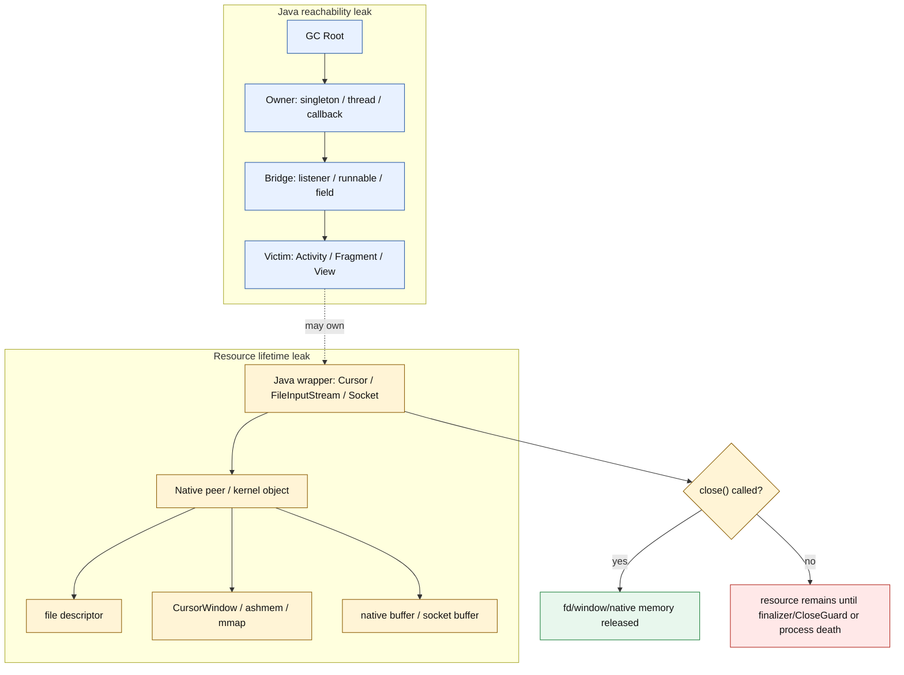
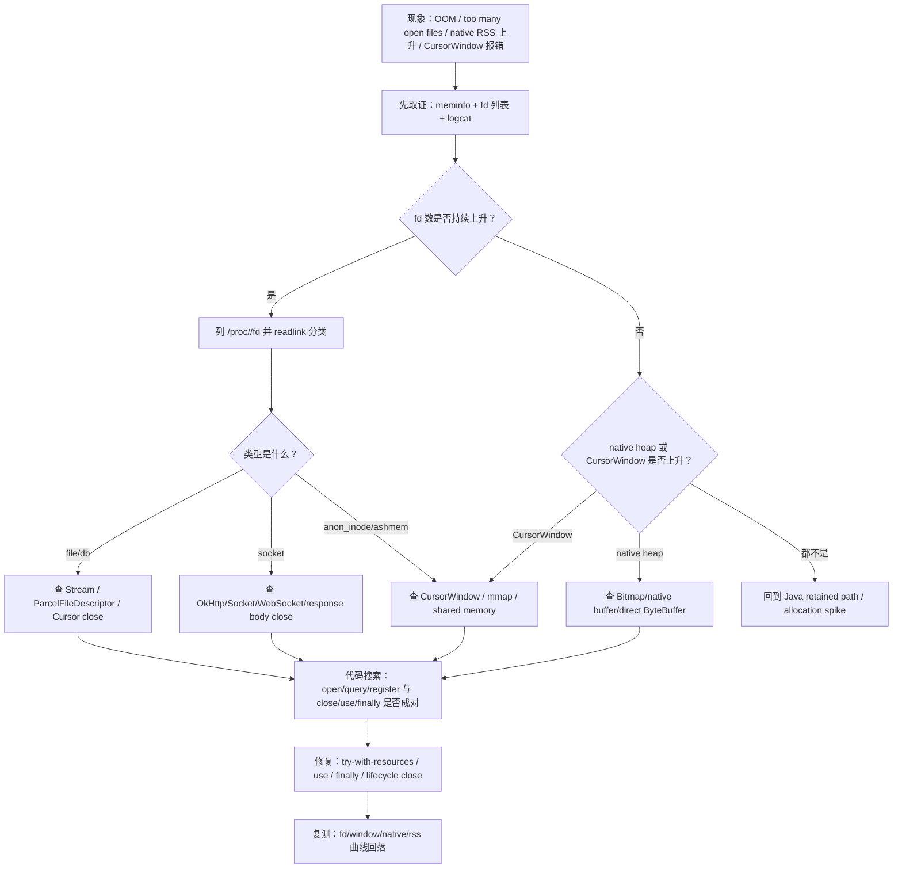
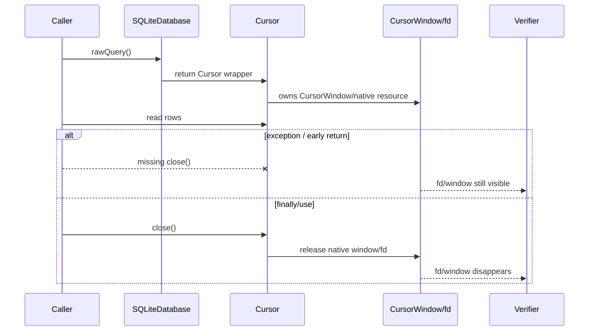
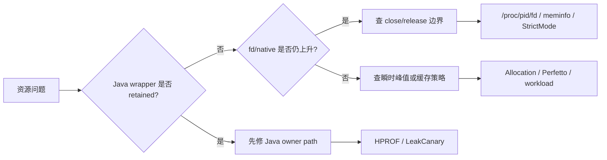

# Day 20：Cursor、Stream 等资源未关闭的泄漏场景
> 系列第 20 篇。Day 19 讲的是 listener / callback 通过 Java 强引用把页面对象留在堆里；今天切到另一类问题：**Java 对象可能已经不大，但它背后的 fd、CursorWindow、socket、mmap、native buffer 仍然活着**。

---

## 一句话结论

- **资源未关闭不是单纯的 GC 问题；核心是 ownership 的 `close()` 边界。**
- **Java retained path 解释“对象为何还活着”，`/proc/<pid>/fd`、StrictMode、CloseGuard、CursorWindow 才解释“资源为何还占着”。**
- **`finally`、Kotlin `use {}`、Java try-with-resources 是资源生命周期的默认写法。**
- **验收必须看 before/after：fd 数下降、CursorWindow 释放、socket/file 消失、native/rss 不再爬升。**

---

## 图 1：两条泄漏链要分开看



### Day 19 反思落地：不再只看 retained path

| Day 19 留下的点 | Day 20 的可见变化 |
|---|---|
| 需要 before/after 验证 | 增加 fd、CursorWindow、StrictMode、dumpsys meminfo 四线验收 |
| listener 泄漏依赖 Java 引用链 | 明确拆开 Java reachability 与 OS/native handle lifetime |
| 需要更具体 tooling commands | 增加 `/proc/<pid>/fd`、`readlink`、`lsof` 等价命令、StrictMode、CloseGuard、SQLite/Cursor 搜索入口 |
| 需要边界更清晰 | 用表格区分“必须 close 的资源”和“只靠 GC 不可靠的资源” |

这篇承接 Day 19 的 before/after 思路，但验收对象从 listener list 变成 **fd/window/socket/native allocation**。

---

## 图 2：资源泄漏排障决策流



---

## 图 3：`close()` 必须支配所有返回路径



---

## 必须 close 的资源速查

| 资源 | 背后占用 | 常见泄漏写法 | 正确边界 | 主要证据 |
|---|---|---|---|---|
| `Cursor` | `CursorWindow`、fd、native memory | `query()` 后异常返回 | `use {}` / `finally close()` | logcat CursorWindow、fd、meminfo |
| `InputStream` / `OutputStream` | file fd、socket fd、buffer | 只 close 外层或提前 return | try-with-resources / Kotlin `use` | `/proc/<pid>/fd` |
| `FileDescriptor` / `ParcelFileDescriptor` | kernel fd | 传给别处后 owner 不清 | 明确单一 owner close | fd link 仍存在 |
| `Socket` / `ServerSocket` | socket fd、kernel buffer | 连接失败分支不 close | finally close / client shutdown | fd socket 数 |
| OkHttp `Response` | body stream/socket connection | 只读 status 不关 body | `response.use {}` | connection/fd 不回落 |
| `ZipFile` / `AssetFileDescriptor` | file fd | 当普通对象等 GC | `close()` | apk/zip fd 残留 |
| `MediaExtractor` / `MediaCodec` | native codec/buffer/fd | 只 stop 不 release | `release()` | native heap/rss |
| `BitmapRegionDecoder` | native decoder/input | 切图后不 recycle/close 输入 | release/recycle + close input | native/rss |

---

## CursorWindow：它不像普通 Java 对象

| 层 | 你看到的对象 | 真正要确认的事 |
|---|---|---|
| Java | `Cursor` / `SQLiteCursor` | 是否所有路径都调用 `close()` |
| Framework | `CursorWindow` | window 是否在 close 后释放 |
| Native / kernel | ashmem/mmap/fd | `/proc/<pid>/fd` 或 meminfo 是否下降 |
| 症状 | `CursorWindowAllocationException`、native RSS 上升 | 不是调大 heap 就能解决 |

```kotlin
// 错误：异常或 early return 会跳过 close
fun loadName(db: SQLiteDatabase, id: Long): String? {
    val c = db.rawQuery("select name from user where id=?", arrayOf(id.toString()))
    if (!c.moveToFirst()) return null
    return c.getString(0)
}
```

```kotlin
// 正确：Kotlin use 让 close 支配所有路径
fun loadName(db: SQLiteDatabase, id: Long): String? {
    db.rawQuery("select name from user where id=?", arrayOf(id.toString())).use { c ->
        if (!c.moveToFirst()) return null
        return c.getString(0)
    }
}
```

```java
// 正确：Java try-with-resources
String loadName(SQLiteDatabase db, long id) {
    try (Cursor c = db.rawQuery("select name from user where id=?", new String[]{String.valueOf(id)})) {
        if (!c.moveToFirst()) return null;
        return c.getString(0);
    }
}
```

---

## 四线取证：heap、fd、log、source

| 线索 | 命令/操作 | 看什么 | 通过标准 |
|---|---|---|---|
| fd 总数 | `ls /proc/$PID/fd | wc -l` | 是否随页面进退持续增长 | 修复后回到稳定区间 |
| fd 类型 | `for f in /proc/$PID/fd/*; do readlink $f; done` | db、socket、pipe、ashmem、apk | 泄漏类型消失 |
| meminfo | `adb shell dumpsys meminfo <package>` | Native Heap、SQL、Cursor、Objects | 峰值后可回落 |
| logcat | `StrictMode`、`CloseGuard`、`CursorWindow` | 未关闭资源警告 | 不再出现同类警告 |
| heap dump | Profiler / MAT / LeakCanary | wrapper 是否被 Java 强引用 | retained path 消失或 wrapper 数下降 |
| source | `rg "rawQuery|openInputStream|new Socket|execute\\("` | open 与 close 是否成对 | 所有 exit path close |

```bash
# 1. 找 pid
adb shell pidof <package>

# 2. before：进入页面前记录 fd 与 meminfo
adb shell 'PID=$(pidof <package>); echo fd_count=$(ls /proc/$PID/fd | wc -l); ls -l /proc/$PID/fd | head -n 40'
adb shell dumpsys meminfo <package> | head -n 180

# 3. 分类 fd：Android shell 没有 lsof 时，用 readlink 近似
adb shell 'PID=$(pidof <package>); for f in /proc/$PID/fd/*; do echo "$(basename $f) -> $(readlink $f)"; done' | sort

# 4. 触发页面进退 10 次后重复
adb shell 'PID=$(pidof <package>); echo fd_count=$(ls /proc/$PID/fd | wc -l); for f in /proc/$PID/fd/*; do echo "$(basename $f) -> $(readlink $f)"; done' | sort
adb shell dumpsys meminfo <package> | head -n 180

# 5. 同时抓未关闭告警
adb logcat -v time | grep -E "StrictMode|CloseGuard|CursorWindow|SQLite|too many open files|EMFILE"
```

---

## StrictMode：把“忘记 close”变成可见错误

| 配置 | 作用 | 适用阶段 |
|---|---|---|
| `detectLeakedClosableObjects()` | 发现未关闭 `Closeable` | debug / dogfood |
| `detectLeakedSqlLiteObjects()` | 发现 SQLite 对象泄漏 | debug / dogfood |
| `penaltyLog()` | 先记录，不中断流程 | 日常开发 |
| `penaltyDeath()` | 让违规直接失败 | 小范围测试 / CI smoke |

```kotlin
if (BuildConfig.DEBUG) {
    StrictMode.setVmPolicy(
        StrictMode.VmPolicy.Builder()
            .detectLeakedSqlLiteObjects()
            .detectLeakedClosableObjects()
            .penaltyLog()
            .build()
    )
}
```

### CloseGuard 的边界

| 判断 | 结论 |
|---|---|
| logcat 出现 CloseGuard | 已经晚了，资源靠 finalizer 路径被发现 |
| 没有 CloseGuard 日志 | 不代表没泄漏，可能类型不支持或未触发 GC |
| 只依赖 finalizer | 不可接受，释放时机不可控 |
| 最小验收 | `close()` 路径明确 + fd/meminfo before-after 稳定 |

---

## 源码入口表

| 目标 | 路径/仓库 | 搜索词 | 关注点 |
|---|---|---|---|
| SQLite Cursor | `frameworks/base/core/java/android/database` | `CursorWindow`、`close` | Cursor 与 window 释放 |
| SQLite DB | `frameworks/base/core/java/android/database/sqlite` | `rawQuery`、`SQLiteClosable` | close guard / ref count |
| StrictMode | `frameworks/base/core/java/android/os/StrictMode.java` | `detectLeakedClosableObjects` | 泄漏如何报告 |
| CloseGuard | `libcore/dalvik/src/main/java/dalvik/system/CloseGuard.java` | `open`、`warnIfOpen` | 未关闭告警机制 |
| File stream | `libcore/ojluni/src/main/java/java/io` | `FileInputStream`、`close` | fd 归属 |
| Socket | `libcore/ojluni/src/main/java/java/net` | `Socket`、`close` | socket fd 释放 |
| App 代码 | app/src | `query`、`open`、`execute`、`new Socket` | open/close 对称性 |

```bash
# App 侧：找打开资源的位置
rg -n "rawQuery|query\\(|openInputStream|openOutputStream|FileInputStream|FileOutputStream|ParcelFileDescriptor|ZipFile|new Socket|ServerSocket|ResponseBody|execute\\(" app src

# App 侧：找释放路径
rg -n "\\.use\\s*\\{|try\\s*\\(|finally|\\.close\\(|\\.release\\(|\\.disconnect\\(|dispose\\(" app src

# AOSP / libcore：验证资源保存与告警路径
rg -n "detectLeakedClosableObjects|detectLeakedSqlLiteObjects" frameworks/base/core/java/android/os/StrictMode.java
rg -n "CursorWindow|close\\(" frameworks/base/core/java/android/database frameworks/base/core/java/android/database/sqlite
rg -n "warnIfOpen|CloseGuard" libcore/dalvik/src/main/java/dalvik/system/CloseGuard.java
```

---

## 修复策略矩阵

| 场景 | 首选写法 | 不推荐写法 | 验收 |
|---|---|---|---|
| Cursor 查询 | `query().use {}` | 手动 close 写在末尾 | 异常路径也释放 |
| Java IO | try-with-resources | `close()` 分散在多个 return 前 | fd 数回落 |
| 嵌套 stream | 关闭最外层且确认 owner | 内外层重复不清晰 | fd link 消失 |
| OkHttp response | `client.newCall(req).execute().use {}` | 只读 `code` 不关 body | socket/fd 稳定 |
| Socket 长连接 | owner lifecycle 明确 close | 靠 Activity destroy 间接回收 | 连接状态消失 |
| Media/native resource | `release()` in finally | 只调用 `stop()` | native/rss 回落 |
| Fragment View 资源 | `onDestroyView` close/release | 等 Fragment `onDestroy` | old view 不带资源 |

---

## 什么时候看 heap，什么时候看 fd



| 现象 | 优先工具 | 原因 |
|---|---|---|
| destroyed Activity retained | LeakCanary / HPROF | 先找 Java 强引用 |
| `EMFILE` / too many open files | `/proc/<pid>/fd` | heap 不一定大 |
| CursorWindow allocation failed | logcat + meminfo + fd | 可能是 window/native 资源 |
| Native Heap 持续涨 | meminfo + maps + native tools | Java heap 可能正常 |
| 短时间峰值后回落 | allocation / Perfetto | 可能不是泄漏 |

---

## 验收 checklist

| 检查项 | 通过标准 |
|---|---|
| owner 命名 | 能说清谁负责 close/release |
| 所有路径 | 正常、异常、early return 都会 close |
| fd before/after | 重复进退页面后 fd 数不持续增长 |
| fd 类型 | db/socket/file/ashmem 残留项消失 |
| StrictMode | 不再报 leaked closable / sqlite object |
| CursorWindow | window 相关错误不再复现 |
| meminfo | Native Heap / SQL / Objects 不持续爬升 |
| heap | wrapper 不再被长生命周期 owner retained |

---

## 边界记录

| 边界 | 本文处理方式 |
|---|---|
| 真实设备差异 | fd 名称、CursorWindow 统计、meminfo 字段会随 Android 版本和 ROM 变化，必须以目标设备输出为准。 |
| 真实 HPROF | 本文仍使用代表性资源路径；后续工具篇需要逐行对照真实 HPROF 与 fd 列表。 |
| StrictMode 覆盖范围 | StrictMode 只能覆盖部分 closable/sqlite 泄漏，不能替代 fd 和 meminfo 取证。 |
| finalizer / CloseGuard | 只能作为告警与兜底，不是释放策略。 |
| GitHub Issues | 本次 `gh issue list` 因未认证被阻塞，不能声称吸收 open Issue 反馈。 |

---

## 这篇要记住的 5 句工程话术

| 场景 | 更好的表达 |
|---|---|
| 资源泄漏 | “先区分 Java retained path 和 OS/native handle lifetime。” |
| Cursor | “Cursor 小不代表 CursorWindow 小。” |
| IO | “`close()` 要支配所有返回路径。” |
| 取证 | “fd 列表比 heap 更能解释 too many open files。” |
| 验收 | “修复后必须看到 fd/window/native/rss 回落或稳定。” |
