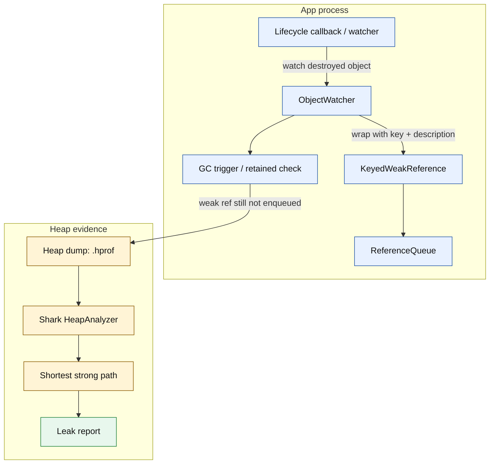
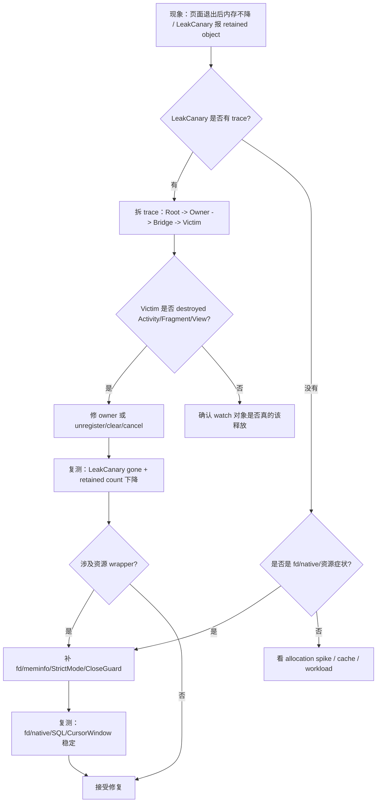
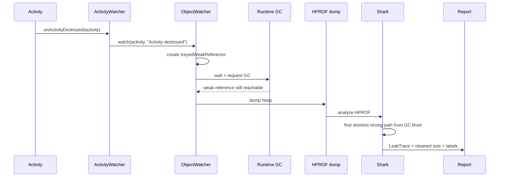
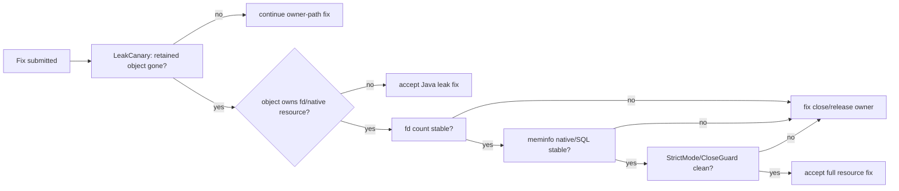

# Day 21：LeakCanary 源码与泄漏引用链检测
> 系列第 21 篇。Day 20 把资源泄漏拆成 Java retained path 与 fd/native lifetime 两条线；今天专门看 LeakCanary：它擅长证明 **Java 对象为什么还被 GC Root 留住**，但不能单独证明 fd、CursorWindow、socket、native buffer 已经释放。

---

## 一句话结论

- **LeakCanary 的核心链路是：watch 弱引用 -> 等待 GC -> dump HPROF -> Shark 计算 shortest strong path。**
- **它回答“谁还强引用了这个对象”，不是回答“底层 fd/native 资源是否关闭”。**
- **读报告时先找 Root、Owner、Bridge、Victim，再看 retained size 和 lifecycle marker。**
- **验收不能只看 leak gone；资源类问题还要补 `/proc/<pid>/fd`、`dumpsys meminfo`、StrictMode 或 CloseGuard。**

---

## 图 1：LeakCanary 运行时结构



| 环节 | 目的 | 失败时的误判 |
|---|---|---|
| lifecycle watcher | 知道哪个对象“应该死” | 没有 watch 就不会报告 |
| `ObjectWatcher` | 保存弱引用和 key | retained 阈值太短会放大噪声 |
| `KeyedWeakReference` | GC 后判断是否入队 | 弱引用没入队只说明还可达 |
| heap dump | 固化当时堆图 | dump 本身会暂停并改变时序 |
| Shark analyzer | 找 shortest strong path | shortest path 不一定是唯一 owner |
| report | 给出 trace 与 retained size | 不能替代 fd/native 证据 |

---

## Day 20 反思落地：LeakCanary 的边界

| Day 20 留下的点 | Day 21 的可见变化 |
|---|---|
| 资源泄漏要分 Java reachability 与 fd/native lifetime | 增加 LeakCanary 能/不能证明矩阵 |
| 需要 source paths | 增加 LeakCanary、Shark、Android lifecycle watcher 源码入口 |
| 需要 before/after evidence | 增加 leak trace、HPROF、fd、meminfo、StrictMode 联合验收表 |
| 需要更少 prose、更多图表 | 增加 4 张 Mermaid、多个 trace 解码表和决策矩阵 |

---

## 图 2：排障决策流



---

## 源码入口表

| 目标 | 典型路径/模块 | 搜索词 | 关注点 |
|---|---|---|---|
| watch 入口 | `leakcanary-object-watcher-android` | `ActivityWatcher`、`FragmentAndViewModelWatcher` | 谁在生命周期结束时调用 watch |
| retained 判断 | `leakcanary-object-watcher` | `ObjectWatcher`、`KeyedWeakReference` | 弱引用、key、ReferenceQueue |
| dump 触发 | `leakcanary-android-core` | `HeapDumpTrigger`、`GcTrigger` | 何时 dump、阈值、前后台 |
| 分析入口 | `leakcanary-android-core` / `shark` | `HeapAnalyzer` | HPROF 到 leak trace |
| 图遍历 | `shark` | `ShortestPathFinder`、`PathFinder` | GC Roots 到 retained object |
| 报告 | `leakcanary-android-core` | `HeapAnalysisSuccess`、`LeakTrace` | leak trace、retained size |
| App 侧 | `app/src` | `objectWatcher.watch`、`AppWatcher` | 自定义 watch 与误报边界 |

```bash
# LeakCanary 源码验证入口
rg -n "class ObjectWatcher|KeyedWeakReference|ReferenceQueue" leakcanary*/ shark*/
rg -n "class HeapDumpTrigger|GcTrigger|HeapAnalyzer|ShortestPath" leakcanary*/ shark*/
rg -n "ActivityWatcher|FragmentAndViewModelWatcher|watch\\(" leakcanary*/

# App 侧：找自定义 watch 和高危 owner
rg -n "AppWatcher|objectWatcher|watch\\(|observeForever|add.*Listener|register.*Callback|static|object " app src

# 设备侧：与 Day 20 的资源证据联动
adb shell pidof <package>
adb shell dumpsys meminfo <package> | head -n 180
adb shell 'PID=$(pidof <package>); ls /proc/$PID/fd | wc -l'
adb logcat -v time | grep -E "LeakCanary|StrictMode|CloseGuard|CursorWindow|too many open files|EMFILE"
```

---

## 图 3：从 destroyed Activity 到报告



---

## Trace 解码：先分四段

| 段 | 问题 | 常见形态 | 修复方向 |
|---|---|---|---|
| Root | 谁从 GC Root 出发 | System class、Thread、JNI global、local variable | 确认长生命周期是否合理 |
| Owner | 谁持有集合/字段 | singleton、manager、MessageQueue、registry | 缩短 owner 或清字段 |
| Bridge | 哪条边跨生命周期 | `static INSTANCE`、`ArrayList.elementData`、`this$0`、callback field | unregister、cancel、clear、弱化 |
| Victim | 谁本应释放 | destroyed Activity、Fragment view、old binding、resource wrapper | lifecycle 边界释放 |

### Activity trace 读法

| Leak trace 片段 | 解释 | 下一步 |
|---|---|---|
| `GC Root: System class` | 静态字段或单例路径 | 查 `static` / Kotlin `object` |
| `Singleton.INSTANCE` | 进程级 owner | 禁止持有 Activity/View |
| `ArrayList.elementData` | listener/cache/list 持有 | 找 add/remove 对称性 |
| `callback.this$0` | 内部类捕获外部类 | 改静态类、取消注册、拆 context |
| `MainActivity instance` + destroyed marker | victim 已越过生命周期 | 修复后必须不再 retained |

### Fragment view trace 读法

| Leak trace 片段 | 解释 | 下一步 |
|---|---|---|
| `Fragment.mView` 或 binding 字段 | view 生命周期晚于 `onDestroyView` | `onDestroyView` 置空 |
| `AdapterDataObservable` | RecyclerView/adapter callback | detach 或 clear adapter |
| `LiveData AlwaysActiveObserver` | `observeForever` 未 remove | `removeObserver` |
| `View.mContext` | View 反持 Activity | 不把旧 View 放进长生命周期 owner |

---

## LeakCanary 能证明什么

| 问题 | LeakCanary 证据 | 还需要补什么 |
|---|---|---|
| Activity 泄漏 | destroyed Activity 的 shortest path | 页面进退后 retained count 归零 |
| Fragment view 泄漏 | old View/binding path | `onDestroyView` 后引用置空 |
| listener 泄漏 | registry/listener/captured owner path | listener count 或 add/remove 日志 |
| Handler 泄漏 | MessageQueue -> Message -> callback/target | pending message 数或取消逻辑 |
| resource wrapper retained | wrapper 到 Activity 或 singleton path | fd、meminfo、StrictMode 证明资源释放 |
| native/fd 泄漏 | 通常不能直接证明 | `/proc/<pid>/fd`、`dumpsys meminfo`、native tools |

---

## 图 4：Java path 与资源 path 联合验收



---

## 报告阅读 checklist

| 检查项 | 通过标准 |
|---|---|
| watch 对象 | 确认对象真的已经越过生命周期 |
| shortest path | 能标出 Root、Owner、Bridge、Victim |
| suspect edge | 找到第一条跨生命周期强引用 |
| retained size | 理解它是影响面，不是唯一优先级 |
| excluded refs | 确认不是已知 framework leak 被过滤 |
| fix boundary | 修 owner，不只是在 victim 里补空判断 |
| before/after | 同路径不再出现，retained count 回落 |
| resource wrapper | 额外验证 fd/native/meminfo/StrictMode |

---

## 常见误读矩阵

| 误读 | 更准确的判断 |
|---|---|
| “LeakCanary 报 Activity，所以 Activity 自己错了” | 先看谁持有 Activity；victim 往往不是 owner |
| “没有 LeakCanary 报告就没有资源泄漏” | fd/native 泄漏可能不表现为 Java retained path |
| “shortest path 就是全部原因” | shortest path 是最短强引用链，不代表唯一链 |
| “retained size 小就不用修” | 小对象可能持有 listener、fd 或后续大对象入口 |
| “WeakReference 可以修所有 leak” | 正确生命周期释放优先；弱引用只是降级策略 |

---

## 边界记录

| 边界 | 本文处理方式 |
|---|---|
| 真实 HPROF | 本文使用代表性 trace 解码；后续 Day 23/24 需要用真实 HPROF 逐行验证。 |
| 源码版本 | LeakCanary、Shark、AndroidX watcher 类名可能随版本变化，必须以项目依赖版本为准。 |
| fd/native 资源 | LeakCanary 只能证明 Java wrapper 是否 retained；资源释放必须补 fd、meminfo、StrictMode 或 native evidence。 |
| dump 副作用 | HPROF dump 会暂停进程并改变时序，性能问题不能只靠 dump 判断。 |
| GitHub Issues | 本次 `gh issue list` 因未认证被阻塞，不能声称吸收 open Issue 反馈。 |

---

## 这篇要记住的 5 句工程话术

| 场景 | 更好的表达 |
|---|---|
| 读 LeakCanary | “先拆 Root、Owner、Bridge、Victim。” |
| 修泄漏 | “修第一条跨生命周期强引用，不修受害对象。” |
| 资源类问题 | “LeakCanary 证明 wrapper reachability，fd 证明资源 lifetime。” |
| 误报判断 | “先确认 watched object 是否真的应该释放。” |
| 验收 | “同一路径不再 retained，资源指标也不再爬升。” |
