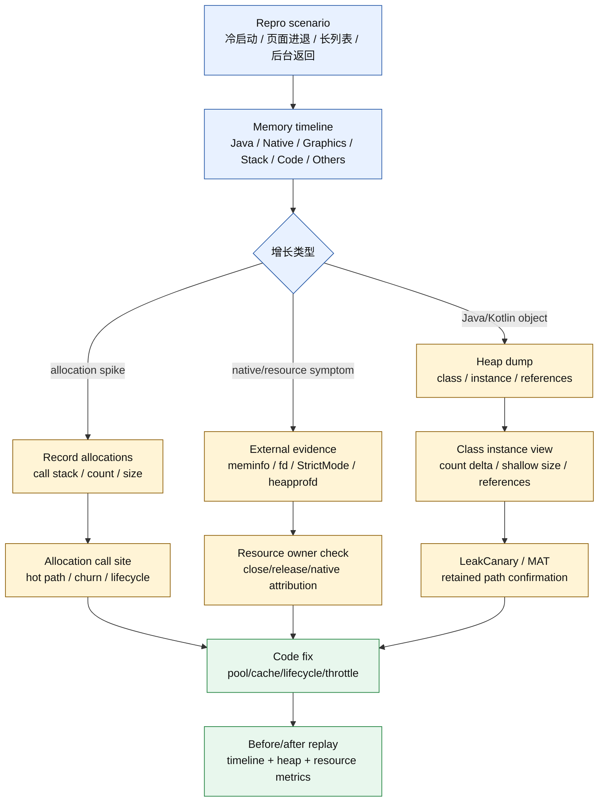
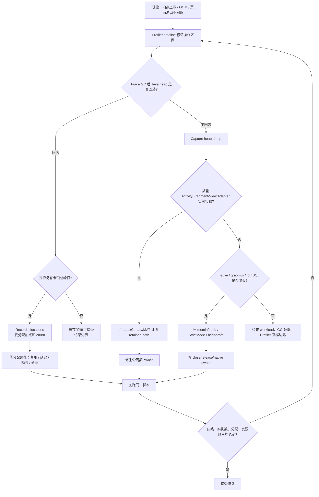
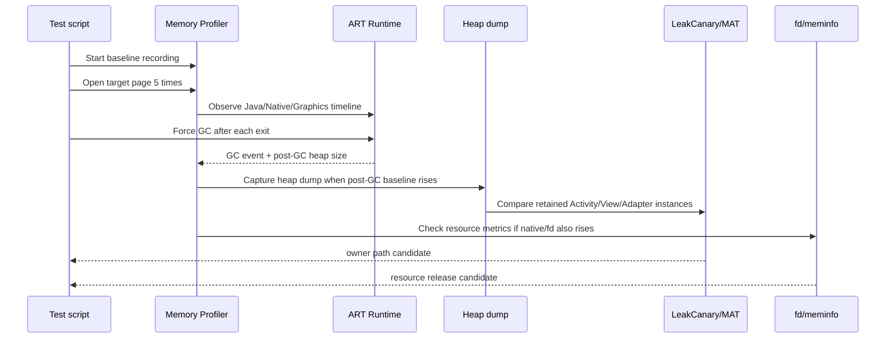
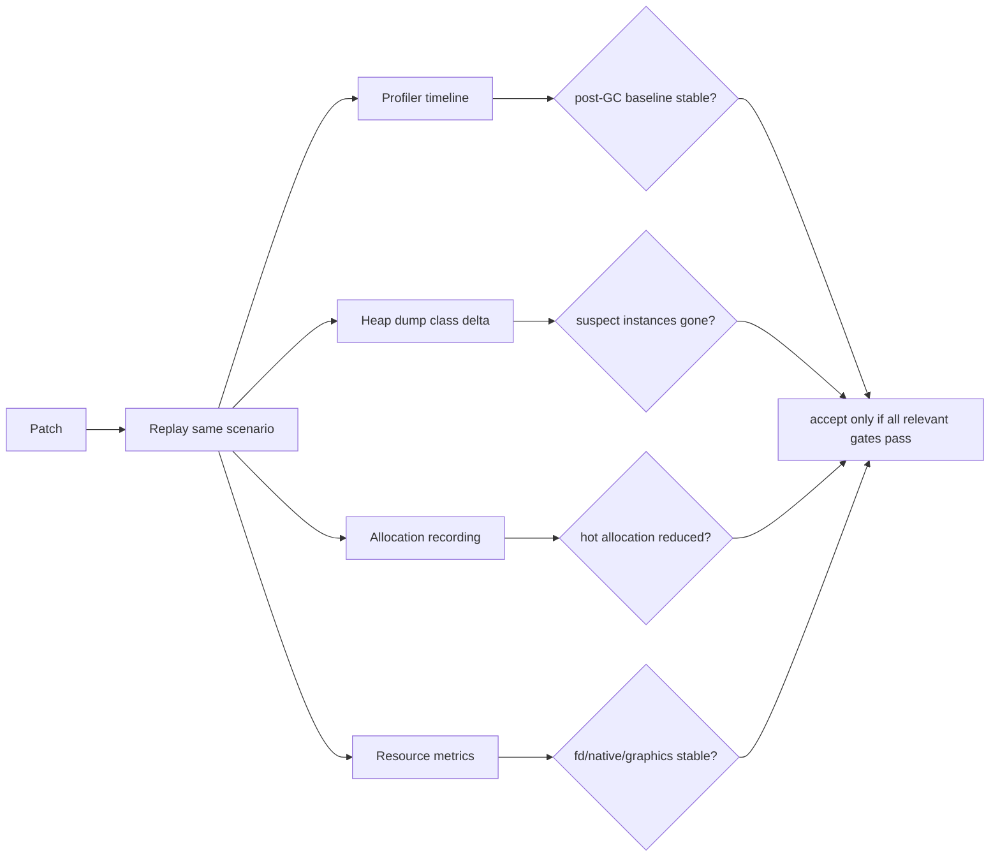

# Day 22：Android Studio Memory Profiler 核心工作流
> 系列第 22 篇。Day 21 说明 LeakCanary 擅长证明 **Java retained path**；今天把 Android Studio Memory Profiler 放进同一条证据链：它擅长看 **趋势、堆对象、分配热点、类实例**，但不能单独证明 fd、socket、CursorWindow 或 native resource 已经释放。

---

## 一句话结论

- **Profiler 先回答“什么时候涨、哪类对象涨、谁在分配”，再交给 LeakCanary/MAT/HPROF 证明“谁还持有”。**
- **Memory timeline 是入口，不是结论；必须继续落到 heap dump、allocation records、GC 事件和外部指标。**
- **Java/Kotlin 对象问题看 heap/class/allocation；fd/native/resource 问题要补 `/proc/<pid>/fd`、`dumpsys meminfo`、StrictMode、CloseGuard 或 heapprofd。**
- **验收标准不是截图好看，而是同一场景复跑后曲线回落、实例数回落、分配热点消失、资源账单稳定。**

---

## 图 1：Memory Profiler 证据链



| Profiler 视图 | 最适合回答 | 不能单独回答 |
|---|---|---|
| Timeline | 哪个操作让内存开始涨 | 谁强引用了对象 |
| Force GC | GC 后 Java heap 是否回落 | native/fd 是否释放 |
| Heap dump | 哪些类/实例还活着 | 资源句柄是否关闭 |
| Class list | 类实例数和浅大小变化 | retained owner 是否唯一 |
| Instance/reference view | 某实例的引用方向 | 所有可疑路径的业务语义 |
| Allocation recording | 谁在频繁创建对象 | 对象是否最终泄漏 |

---

## Day 21 反思落地：不要让工具越界

| Day 21 留下的点 | Day 22 的可见变化 |
|---|---|
| 需要同一 HPROF 对比 LeakCanary、MAT、Android Studio | 增加 Profiler 与 LeakCanary/MAT 分工矩阵 |
| LeakCanary 不能证明 fd/native resource release | 把 fd、meminfo、StrictMode、heapprofd 放进 Profiler 决策流 |
| 需要更具体的工具命令 | 增加 dumpheap、am profile、meminfo、fd、logcat、Perfetto 命令 |
| 需要更多图、更少 prose | 增加 4 张 Mermaid、多个短表和 checklist |

---

## 图 2：排障决策流



---

## 核心工作流：4 步闭环

| 步骤 | 操作 | 看什么 | 产物 |
|---|---|---|---|
| 1. 标记场景 | 录屏或手工记录时间点 | 哪个交互触发增长 | 时间窗口 |
| 2. 看 timeline | 观察 Java/Native/Graphics 走势和 GC 点 | 回落、阶梯、尖峰、平台期 | 初始假设 |
| 3. 抓证据 | Heap dump 或 allocation recording | 类实例、引用、分配栈 | 可复查文件 |
| 4. 复跑验收 | 同脚本 before/after | 曲线和指标是否稳定 | 接受/回退结论 |

### 最小命令组

```bash
# 1. 找 pid
adb shell pidof <package>

# 2. Profiler 外部基线：进程内存账单
adb shell dumpsys meminfo <package>

# 3. Java heap dump：可导入 Android Studio / MAT / Shark
adb shell am dumpheap <package> /sdcard/day22-before.hprof
adb pull /sdcard/day22-before.hprof .

# 4. fd 资源：Day 21 边界的补充证据
adb shell 'PID=$(pidof <package>); ls -l /proc/$PID/fd | head -n 80'
adb shell 'PID=$(pidof <package>); ls /proc/$PID/fd | wc -l'

# 5. 运行时日志：GC、StrictMode、CloseGuard、OOM
adb logcat -v time | grep -E "art|GC|StrictMode|CloseGuard|CursorWindow|OutOfMemory|EMFILE"
```

---

## 图 3：一次页面进退的 Profiler 读法



| 观察形状 | 第一判断 | 下一证据 |
|---|---|---|
| 每次进入尖峰，退出+GC 后回到基线 | 临时峰值，不一定泄漏 | allocation recording 看是否可优化 |
| 每次退出+GC 后基线阶梯上涨 | retained object 或 cache 扩张 | heap dump + class instance delta |
| Java 平稳，Native/Graphics 上涨 | native/bitmap/GPU/resource 方向 | `dumpsys meminfo`、heapprofd、Perfetto |
| Java 小涨，fd 数持续上涨 | wrapper 可能小，资源泄漏大 | `/proc/<pid>/fd` + StrictMode |
| GC 很频繁但 retained 不高 | 分配 churn 或内存压力 | allocation recording + Perfetto |

---

## Profiler 与 LeakCanary/MAT 的分工

| 问题 | Profiler 负责 | LeakCanary 负责 | MAT/HPROF 负责 | 外部工具负责 |
|---|---|---|---|---|
| Activity 泄漏 | 发现实例数累积 | 自动报告 retained path | 交叉验证 Path To GC Roots | `dumpsys activity` 确认生命周期 |
| Fragment view 泄漏 | 发现 View/binding 类累积 | watcher 报 destroyed view | 对比 dominator/retained size | AndroidX 版本源码 |
| 分配抖动 | 找 call stack、分配次数 | 通常不负责 | 可看大量短命对象残留 | Perfetto 看帧和 GC pause |
| Cursor/Stream 未关闭 | 只能看到 wrapper 或趋势 | 只证明 wrapper 是否 retained | 可看 wrapper 引用 | fd、StrictMode、CloseGuard |
| Native heap 上涨 | 只给分类趋势 | 不负责 | 不完整 | meminfo、heapprofd、malloc_debug |
| Bitmap/GPU | 看 Java wrapper/Graphics | 可报 wrapper retained | 看 Bitmap owner | meminfo Graphics/dma-buf |

---

## 源码与工具入口

| 层级 | 路径/入口 | 搜索词 | 目的 |
|---|---|---|---|
| Android Studio 文档 | `developer.android.com/studio/profile` | Memory Profiler | 确认功能边界和 UI 字段 |
| ART dumpheap | `art/runtime`、`frameworks/base/cmds/am` | `dumpheap`、`Hprof` | 了解 HPROF 生成路径 |
| GC 日志 | `art/runtime/gc` | `GC freed`、`GcCause` | 对齐 timeline 的 GC 事件 |
| App 源码 | `app/src` | `onCreate`、`onDestroy`、`observeForever`、`add.*Listener` | 找生命周期不对称 |
| Resource 证据 | `/proc/<pid>/fd`、`dumpsys meminfo` | fd、CursorWindow、Native Heap | 证明 Profiler 看不到的资源账单 |
| Native 分配 | Perfetto heapprofd | `heapprofd` | 追 native call stack |

```bash
# App 侧：找生命周期和注册/释放不对称
rg -n "observeForever|add.*Listener|register.*Callback|setAdapter|postDelayed|launch\\{|GlobalScope|static|object " app src
rg -n "onDestroy|onDestroyView|onStop|remove.*Listener|unregister.*Callback|removeObserver|cancel\\(|close\\(|use\\(" app src

# AOSP/Android checkout：找 dumpheap、HPROF、GC 入口
rg -n "dumpheap|DumpHeap|hprof|Hprof" frameworks art
rg -n "GcCause|CollectGarbage|RequestConcurrentGC|Heap::" art/runtime

# Profiler 外：native/resource 归因
adb shell dumpsys meminfo <package> | sed -n '1,180p'
adb shell 'PID=$(pidof <package>); cat /proc/$PID/status | grep -E "VmRSS|Threads"'
adb shell 'PID=$(pidof <package>); ls -l /proc/$PID/fd | sort | tail -n 40'
```

---

## 图 4：验收矩阵



| 修复类型 | 必须通过 | 可选补强 |
|---|---|---|
| 生命周期泄漏 | suspect class 实例数回落、LeakCanary 不再报同路径 | MAT 同 HPROF 交叉验证 |
| 分配热点 | allocation count/size 明显下降、帧期间 GC 减少 | Perfetto frame + GC slice |
| 缓存策略 | 峰值受控、退出后基线稳定 | cache hit/miss 业务指标 |
| fd/resource | fd count 稳定、StrictMode/CloseGuard clean | `dumpsys meminfo` SQL/native 稳定 |
| native heap | Native Heap 或 heapprofd call stack 收敛 | malloc_debug / Perfetto 对比 |

---

## 常见误读矩阵

| 误读 | 更准确的判断 |
|---|---|
| “Profiler 曲线涨了，所以一定泄漏” | 先 Force GC；看 post-GC baseline 是否阶梯上涨。 |
| “Heap dump 里实例多，所以就是 owner” | 实例多只说明活着；还要看引用路径和生命周期语义。 |
| “Allocation recording 热点就是泄漏” | 热点说明创建频繁；泄漏要看对象是否长期 retained。 |
| “Java heap 不涨，所以没有问题” | fd、native、Graphics、dma-buf 可能在 Java heap 外增长。 |
| “LeakCanary 没报，Profiler 也不用看” | LeakCanary 依赖 watcher；Profiler 可发现未 watch 的对象和分配峰值。 |

---

## 官方文档入口

| 入口 | 用途 |
|---|---|
| Android Studio Profiler 文档：`https://developer.android.com/studio/profile` | Profiler 总览、运行条件、工具入口 |
| Memory Profiler 文档：`https://developer.android.com/studio/profile/memory-profiler` | Heap dump、allocation recording、Memory timeline 字段 |
| Inspect heap dump 文档：`https://developer.android.com/studio/profile/memory-profiler#inspect_heap_dump` | 类列表、实例、引用、retained 信息入口 |
| Record allocations 文档：`https://developer.android.com/studio/profile/memory-profiler#record_allocations` | 分配记录、调用栈、对象 churn 分析 |

---

## 边界记录

| 边界 | 本文处理方式 |
|---|---|
| Android Studio 版本 | Profiler UI 和字段会随版本变化，本文按官方 Profiler/Memory Profiler 文档抽象工作流。 |
| 真实 HPROF | 本文仍使用代表性流程；Day 23 应打开同一个 HPROF 解释 record/class/instance/reference。 |
| 同 HPROF 对比 | 本文给出分工矩阵；Day 24 应把 MAT dominator/path 与 Profiler/LeakCanary 放在同一文件上验证。 |
| fd/native resource | Profiler 的 Java heap 视图不能证明资源释放，必须补 fd、meminfo、StrictMode、CloseGuard 或 heapprofd。 |
| GitHub Issues | 本次 `gh issue list` 因未认证被阻塞，不能声称吸收 open Issue 反馈。 |

---

## 这篇要记住的 5 句工程话术

| 场景 | 更好的表达 |
|---|---|
| 看到曲线涨 | “先看 GC 后基线，不看单点峰值。” |
| 看到类实例多 | “实例数是线索，引用路径才是证据。” |
| 对比分配热点 | “allocation 证明 churn，不直接证明 leak。” |
| 资源类问题 | “Profiler 看 wrapper，fd/meminfo 看 resource lifetime。” |
| 验收修复 | “同场景复跑，timeline、heap、allocation、资源账单一起过。” |
