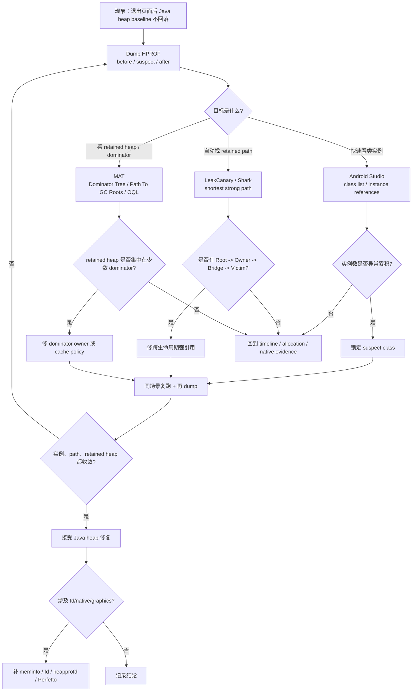
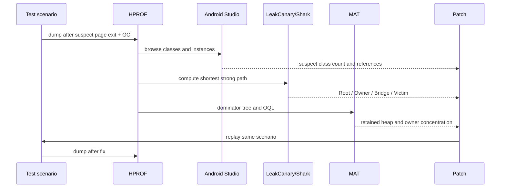
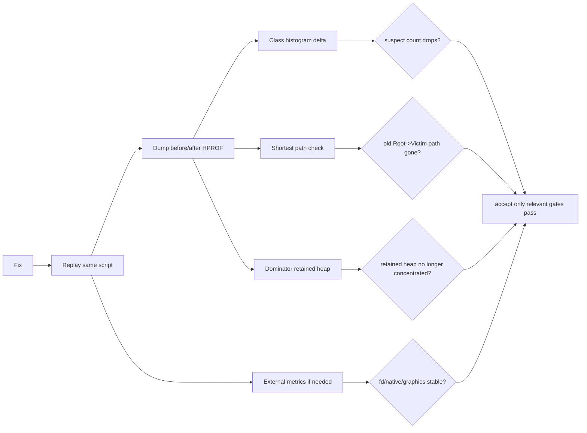

# Day 23：Heap Dump 与 HPROF 文件结构
> 系列第 23 篇。Day 22 把 Android Studio Memory Profiler 放进证据链；今天把同一个 heap dump 拆开看：HPROF 不是“截图”，而是一份对象图快照。Android Studio、LeakCanary/Shark、MAT 都是在这份记录上提取不同视角。

---

## 一句话结论

- **HPROF 的核心价值是固化某一刻的 Java heap object graph：class、instance、array、field、reference、GC root。**
- **看 HPROF 先分层：文件 record -> heap dump sub-record -> object id -> field/reference -> root path。**
- **Android Studio 更适合入口浏览，LeakCanary/Shark 更适合自动 shortest path，MAT 更适合 dominator/retained heap 和批量查询。**
- **HPROF 只能证明 Java heap 可达性；fd、native heap、Graphics、dma-buf 仍要补 meminfo、fd、Perfetto/heapprofd 等证据。**

---

## 图 1：HPROF 结构与解析路径

```mermaid
flowchart TD
  A["adb am dumpheap / Android Studio Capture Heap Dump"] --> B["HPROF file<br/>header + id size + timestamp"]
  B --> C["Top-level records<br/>STRING / LOAD_CLASS / STACK_TRACE / HEAP_DUMP"]
  C --> D["Heap dump sub-records"]

  D --> E["GC Roots<br/>JNI global / Java frame / thread / system class"]
  D --> F["CLASS_DUMP<br/>static fields / instance fields"]
  D --> G["INSTANCE_DUMP<br/>object id / class id / field values"]
  D --> H["OBJECT_ARRAY_DUMP<br/>element object ids"]
  D --> I["PRIMITIVE_ARRAY_DUMP<br/>byte/int/char/... payload"]

  E --> J["Root set"]
  F --> K["Type schema"]
  G --> L["Object nodes"]
  H --> L
  I --> L
  J --> M["Reference graph"]
  K --> M
  L --> M
  M --> N["Tools<br/>Android Studio / Shark / MAT"]

  classDef file fill:#e8f1ff,stroke:#2457a6,color:#111;
  classDef record fill:#fff4d6,stroke:#8a5a00,color:#111;
  classDef graph fill:#e8f7ed,stroke:#1b7f3a,color:#111;
  class A,B,C file;
  class D,E,F,G,H,I record;
  class J,K,L,M,N graph;
```

| 层 | 你看到的内容 | 工程含义 |
|---|---|---|
| Header | magic、identifier size、timestamp | 确认工具能否正确解析 object id 宽度 |
| Top-level record | string、class、stack、heap dump | 建立名称、类、栈和堆段索引 |
| Heap sub-record | root、class、instance、array | 真正的对象图来源 |
| Object id | 每个对象/类/字符串的稳定编号 | 引用关系靠 id 串起来 |
| Field value | primitive 或 object id | object id 字段才形成强引用边 |
| Root | JNI/global/thread/frame/system class | 可达性起点 |

---

## Day 22 反思落地：同一个 HPROF，不同工具视角

| Day 22 留下的点 | Day 23 的可见变化 |
|---|---|
| 需要 same-HPROF 对比 Android Studio、LeakCanary/Shark、MAT | 增加同一 HPROF 的工具分工表和证据流图 |
| 需要解释 records、classes、instances、references、GC roots | 直接拆 HPROF record/sub-record/object graph |
| 需要更具体 source/tooling 命令 | 增加 dumpheap、hprof-conv、MAT OQL、Shark、AOSP rg 命令 |
| 需要更多图、更少 prose | 增加 4 张 Mermaid、多个矩阵和 checklist |

---

## 图 2：排障决策流



---

## HPROF 里最重要的 6 类证据

| 证据 | 来自哪里 | 说明什么 | 不说明什么 |
|---|---|---|---|
| GC Root | root sub-record | 对象图可达性的起点 | root 是否业务上合理 |
| Class schema | `CLASS_DUMP` | 某类有哪些 static/instance fields | 字段语义是否越界 |
| Object instance | `INSTANCE_DUMP` | 某个对象和字段值 | 谁应该释放它 |
| Object array | `OBJECT_ARRAY_DUMP` | list/map/array 持有了哪些 object id | 集合语义是否过期 |
| Primitive array | `PRIMITIVE_ARRAY_DUMP` | byte/char/int 等 payload 大小 | owner 是否正确 |
| String table | `STRING_IN_UTF8` | id 到类名/字段名/线程名 | 引用强弱和生命周期 |

### Record 到引用边

| 字段形态 | 是否形成 Java 强引用边 | 例子 |
|---|---|---|
| object id field | 是 | `Activity.mWindow -> PhoneWindow` |
| object array element | 是 | `ArrayList.elementData[i] -> Listener` |
| static object field | 是 | `Singleton.INSTANCE -> Manager` |
| primitive field | 否 | `int size`、`boolean destroyed` |
| null object id | 否 | 已置空字段 |
| weak reference referent | 工具通常特殊处理 | Shark/MAT 会区分弱可达边 |

---

## 图 3：同一 HPROF 的三种打开方式



| 工具 | 最适合 | 最容易误读 |
|---|---|---|
| Android Studio | 快速找类实例、字段引用、heap overview | 把 instance count 当成 owner 证据 |
| LeakCanary/Shark | 自动生成 destroyed object retained path | 把 shortest path 当成唯一原因 |
| MAT | dominator tree、retained heap、OQL 批量查询 | 把最大 retained heap 当成一定要删的缓存 |
| Raw HPROF/脚本 | 批量 diff、CI 检查、格式边界确认 | 忽略工具对弱引用、软引用、excluded refs 的策略 |

---

## 最小命令组

```bash
# 1. 找 pid，触发可重复场景
adb shell pidof <package>

# 2. 强制 GC 后 dump，降低短命对象噪声
adb shell am dumpheap <package> /sdcard/day23-suspect.hprof
adb pull /sdcard/day23-suspect.hprof .

# 3. 旧 Android HPROF 兼容 MAT 时可能需要转换；现代工具先尝试直接打开
hprof-conv day23-suspect.hprof day23-suspect-converted.hprof

# 4. 外部资源边界：HPROF 之外仍要补
adb shell dumpsys meminfo <package> | sed -n '1,180p'
adb shell 'PID=$(pidof <package>); ls -l /proc/$PID/fd | head -n 80'

# 5. AOSP/ART 源码入口
rg -n "DumpHeap|dumpheap|Hprof|hprof" frameworks art
rg -n "CLASS_DUMP|INSTANCE_DUMP|ROOT_JNI|HPROF" art libcore dalvik
```

---

## 对象图读法：从 Root 到 Victim

| 段 | 在 HPROF 中的形态 | 读法 | 修复方向 |
|---|---|---|---|
| Root | GC root sub-record | 谁天然长生命周期 | 确认 root 类型是否可避开 |
| Owner | class static、thread、singleton、manager | 谁拥有容器或字段 | 缩短 owner 生命周期或清理字段 |
| Bridge | object field、array element、callback | 哪条边跨了生命周期 | unregister、remove、clear、cancel |
| Victim | destroyed Activity/View/Fragment/resource wrapper | 谁本应不可达 | 修 owner，不在 victim 里掩盖 |

### 常见 root 类型与排查方向

| Root 类型 | 常见来源 | 第一反应 |
|---|---|---|
| System class | `static` 字段、Kotlin `object` | 查进程级 owner 是否持有页面对象 |
| Thread object / Java frame | HandlerThread、线程局部变量、栈帧 | 看任务是否未结束或 runnable 捕获 |
| JNI global | native 层全局引用 | 转 JNI Local/Global Reference 主题继续追 |
| Monitor used | synchronized/锁相关对象 | 看锁等待或线程栈上下文 |
| Sticky class | framework/classloader 相关 | 先确认是否工具过滤或 framework leak |

---

## MAT OQL 与脚本化检查

| 目标 | 查询/动作 | 用途 |
|---|---|---|
| 找 Activity 残留 | `SELECT * FROM INSTANCEOF android.app.Activity` | 快速列出页面实例 |
| 找 Fragment view 残留 | 查询项目 binding/View 类型 | 对齐 `onDestroyView` |
| 找大 byte array | `SELECT * FROM byte[] b WHERE b.@length > 1048576` | 图片、buffer、序列化峰值 |
| 找 listener 集合 | 查 `ArrayList`/业务 manager | 看 `elementData` 是否跨生命周期 |
| 对比 before/after | 导出 class histogram | 验证实例数和浅大小回落 |

```bash
# App 侧高危引用边搜索
rg -n "static|object |companion object|observeForever|add.*Listener|register.*Callback|postDelayed|ThreadLocal" app src
rg -n "onDestroy|onDestroyView|remove.*Listener|unregister.*Callback|removeObserver|removeCallbacks|clear\\(|close\\(" app src

# 生成 before/after dump 命名，避免覆盖证据
adb shell am dumpheap <package> /sdcard/day23-before.hprof
adb shell am dumpheap <package> /sdcard/day23-after.hprof
adb pull /sdcard/day23-before.hprof .
adb pull /sdcard/day23-after.hprof .
```

---

## 图 4：HPROF 验收矩阵



| 修复类型 | HPROF 必看 | HPROF 之外 |
|---|---|---|
| Activity/Fragment 泄漏 | suspect instance count、path to roots | lifecycle log、LeakCanary watcher |
| listener/callback 泄漏 | registry/list/array element path | add/remove 日志或计数 |
| cache 过大 | dominator retained heap、entry count | 命中率、业务上限、trim 策略 |
| allocation churn | heap dump 只能看残留 | allocation recording、Perfetto、GC pause |
| resource wrapper | wrapper 是否 retained | fd、meminfo、StrictMode、CloseGuard |
| native/graphics 增长 | Java wrapper 线索 | heapprofd、meminfo、dma-buf、Perfetto |

---

## 常见误读矩阵

| 误读 | 更准确的判断 |
|---|---|
| “HPROF 大，所以一定泄漏严重” | 文件大小受 dump 时机、对象数量、字符串和数组影响，要看 retained path 和趋势。 |
| “某类实例最多，就是泄漏 owner” | 数量多可能是正常缓存或短命残留；owner 要靠 root path 和生命周期语义确认。 |
| “shortest path 消失就完全修好了” | 还要看是否有第二条 path、retained heap 是否回落、资源账单是否稳定。 |
| “MAT 和 LeakCanary 结果不同，肯定一个错了” | 它们的过滤、弱引用处理、excluded refs 和展示目标不同，要回到同一 object id/field 验证。 |
| “HPROF 能解释 native heap” | HPROF 只能给 Java wrapper 和引用线索，native attribution 需要外部工具。 |

---

## 边界记录

| 边界 | 本文处理方式 |
|---|---|
| 真实 HPROF | 本文仍是结构化工作流，没有附带真实 dump；后续需要用目标 App 的 before/after HPROF 做逐对象验证。 |
| Android 版本 | ART dumpheap 输出和工具兼容性会随版本变化，必要时用目标版本验证。 |
| 工具策略差异 | Android Studio、Shark、MAT 对弱引用、excluded refs、retained size 的处理不同，不能混用结论。 |
| resource/native | HPROF 只能证明 Java heap 可达性，不替代 fd、meminfo、heapprofd、Perfetto。 |
| GitHub Issues | 本次 `gh issue list` 因未认证被阻塞，不能声称吸收 open Issue 反馈。 |

---

## 这篇要记住的 5 句工程话术

| 场景 | 更好的表达 |
|---|---|
| 打开 heap dump | “先看对象图，不先看截图。” |
| 找泄漏 | “Root path 证明谁持有，instance count 只负责报警。” |
| 对比工具 | “同一个 HPROF，三个工具问三个问题。” |
| 看 retained heap | “Dominator 说明影响面，不自动等于错误。” |
| 验收 | “before/after HPROF 加外部资源指标一起过。” |
