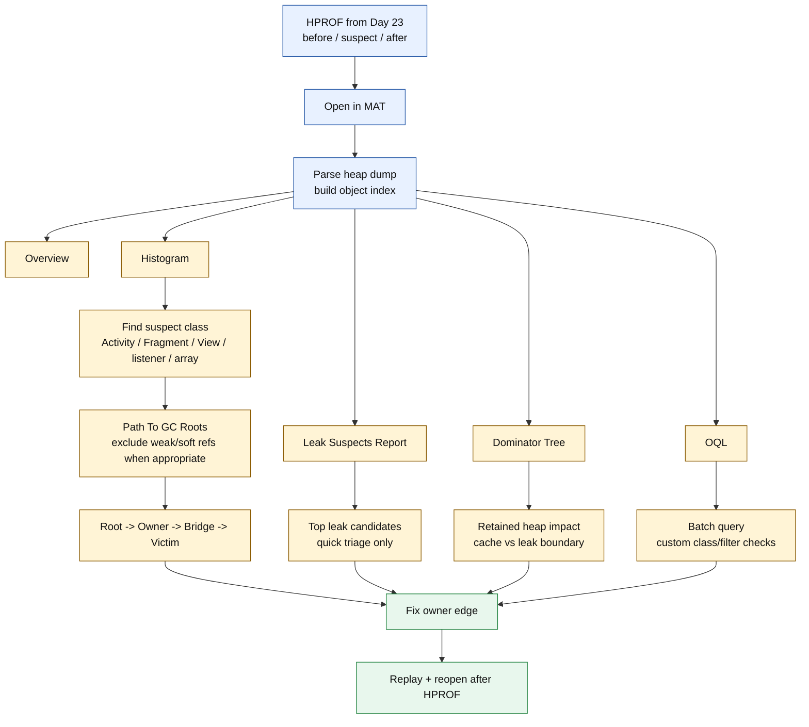
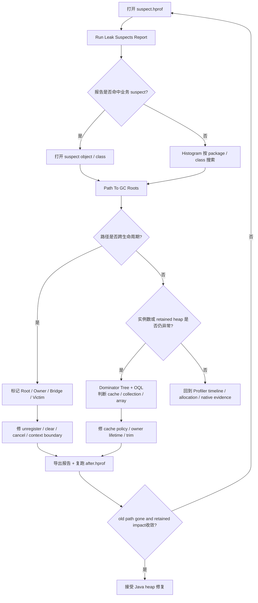
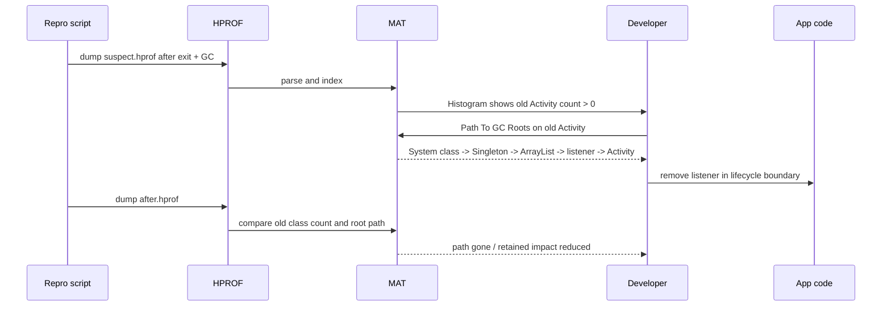
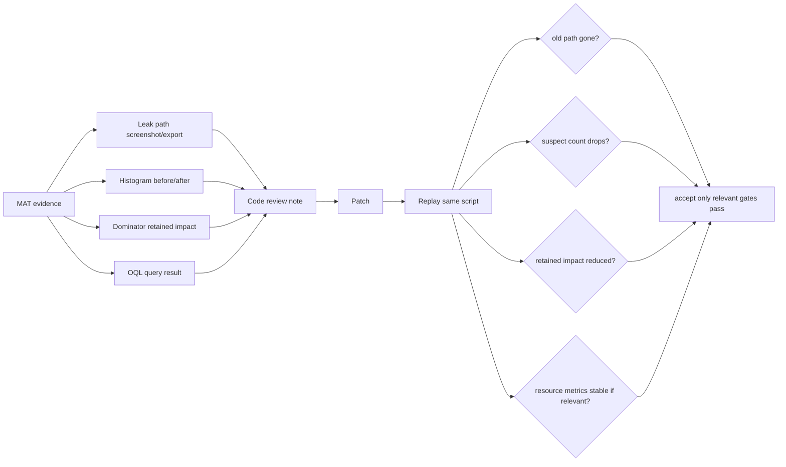

# Day 24：MAT 入门与泄漏分析实战
> 系列第 24 篇。Day 23 把 HPROF 拆成 object graph；今天把这份图交给 Eclipse MAT：从 Histogram、Path To GC Roots、Leak Suspects、OQL 到报告导出，建立一条可复查的泄漏分析流程。

---

## 一句话结论

- **MAT 的入口不是“点 Leak Suspects 就收工”，而是 Histogram -> suspect class -> Path To GC Roots -> retained impact -> OQL/报告交叉验证。**
- **Path To GC Roots 证明“谁还持有”，Dominator/Retained Heap 证明“影响面多大”，二者不能互相替代。**
- **同一个 HPROF 应该同时用 Android Studio 快速定位、LeakCanary/Shark 自动报告、MAT 深挖引用图与 retained heap。**
- **MAT 仍然只看 Java heap；fd、native heap、Graphics、CursorWindow、dma-buf 必须补外部证据。**

---

## 图 1：MAT 实战工作台



| MAT 视图 | 第一用途 | 不能单独证明 |
|---|---|---|
| Overview | heap 总览、最大对象、入口导航 | 具体泄漏 owner |
| Histogram | 哪些类实例数/浅大小异常 | root path 与生命周期语义 |
| Path To GC Roots | 谁从 root 强引用到 suspect | retained 影响面和业务合理性 |
| Leak Suspects | 自动聚合可疑 retained owner | 唯一根因 |
| Dominator Tree | 哪些 owner 保留了大块对象 | 是否一定是泄漏 |
| OQL | 批量查询、按业务类过滤 | 工具策略之外的真实生命周期 |

---

## Day 23 反思落地：HPROF 对象图变成 MAT 操作

| Day 23 留下的点 | Day 24 的可见变化 |
|---|---|
| HPROF records/classes/instances/references/root 需要落到工具 | 用 Histogram、Path To GC Roots、Dominator、OQL 对应对象图 |
| same-HPROF 需要多工具分工 | 增加 Android Studio/LeakCanary/MAT/fd-native 分工表 |
| 需要可操作命令和流程 | 增加 dump、转换、MAT 打开、OQL、报告导出、before/after checklist |
| 需要更多图、更少 prose | 增加 4 张 Mermaid 和多个短表 |

---

## 图 2：排障决策流



---

## MAT 最小实战流程

| 步骤 | 操作 | 产物 | 决策 |
|---|---|---|---|
| 1. 准备 dump | 复现场景后 `am dumpheap` | `before.hprof`、`suspect.hprof`、`after.hprof` | dump 命名不能覆盖 |
| 2. 打开 MAT | 导入 HPROF，等待 index 完成 | `.index` 文件和 Overview | 确认 dump 可读 |
| 3. 看 Histogram | 按 package/class 过滤 | suspect class 列表 | 找实例数异常 |
| 4. 查 Path | 对 suspect instance 运行 Path To GC Roots | root path | 找跨生命周期强引用边 |
| 5. 看 retained | Dominator/Retained Heap 交叉 | owner 影响面 | 判断优先级和缓存边界 |
| 6. 写报告 | 导出 Leak Suspects 或手工记录 path | 证据包 | 支持 code review |
| 7. 复跑 | 修复后重新 dump | `after.hprof` | 验收 old path 消失 |

```bash
# 1. 采集三个时间点，避免只看单一 dump
adb shell am dumpheap <package> /sdcard/day24-before.hprof
adb shell am dumpheap <package> /sdcard/day24-suspect.hprof
adb shell am dumpheap <package> /sdcard/day24-after.hprof
adb pull /sdcard/day24-before.hprof .
adb pull /sdcard/day24-suspect.hprof .
adb pull /sdcard/day24-after.hprof .

# 2. 兼容性：老工具打开失败时再转换
hprof-conv day24-suspect.hprof day24-suspect-converted.hprof

# 3. 外部边界：MAT 之外的资源证据
adb shell dumpsys meminfo <package> | sed -n '1,180p'
adb shell 'PID=$(pidof <package>); ls /proc/$PID/fd | wc -l'
adb logcat -v time | grep -E "StrictMode|CloseGuard|CursorWindow|OutOfMemory|GC"
```

---

## Path To GC Roots：读路径而不是读对象名

| 路径段 | MAT 中常见显示 | 工程问题 | 修复方向 |
|---|---|---|---|
| Root | System Class、Thread、JNI Global、Java Local | 长生命周期起点 | 确认是否能避开或等待线程结束 |
| Owner | singleton、manager、MessageQueue、cache | 谁拥有容器/字段 | 缩短 owner 或改变持有对象 |
| Bridge | field、array element、listener、callback | 哪条边跨生命周期 | remove、clear、cancel、unregister |
| Victim | destroyed Activity/View/Fragment | 谁应该死 | 不在 victim 内做假释放 |

### Path To GC Roots 选项

| 选项 | 适用 | 风险 |
|---|---|---|
| Include all references | 想看完整对象图 | 弱/软引用会制造噪声 |
| Exclude weak/soft references | 分析强引用泄漏 | 可能隐藏自定义引用语义 |
| Exclude phantom/finalizer | 减少回收队列噪声 | finalizer 相关问题要单独看 |
| Merge shortest paths | 多实例同类泄漏 | 可能压扁不同 owner |

---

## 图 3：从 Histogram 到修复的时序



---

## OQL：把人工点击变成批量筛选

| 目标 | OQL 示例 | 用途 |
|---|---|---|
| 列出 Activity | `SELECT * FROM INSTANCEOF android.app.Activity` | 查页面实例残留 |
| 查业务包对象 | `SELECT * FROM INSTANCEOF com.example.ui.DetailActivity` | 精确定位 suspect |
| 找大 byte array | `SELECT * FROM byte[] b WHERE b.@length > 1048576` | 图片/缓存/buffer |
| 找 HashMap | `SELECT * FROM java.util.HashMap` | 进入 cache owner |
| 找 Thread | `SELECT * FROM java.lang.Thread` | 看线程 root 和任务 |
| 找 classloader | `SELECT * FROM java.lang.ClassLoader` | 插件/动态加载泄漏 |

| OQL 结果 | 下一步 |
|---|---|
| 实例数异常但 path 正常 | 看是否 cache 或仍在生命周期内 |
| 多个实例共享同一路径 | Merge shortest paths + 修同一 owner |
| 大数组由同一 owner retained | Day 25 用 dominator 深挖影响面 |
| 只看到 resource wrapper | 补 fd/meminfo/StrictMode，不让 MAT 越界 |

---

## 同一 HPROF 的工具分工

| 任务 | Android Studio | LeakCanary/Shark | MAT | 外部工具 |
|---|---|---|---|---|
| 快速看类实例 | 强 | 中 | 强 | 弱 |
| 自动找 destroyed object path | 弱 | 强 | 中 | 弱 |
| retained heap 影响面 | 中 | 中 | 强 | 弱 |
| OQL/批量查询 | 弱 | 中 | 强 | 弱 |
| 分配热点 | 强 | 弱 | 弱 | Perfetto 强 |
| fd/native/Graphics | 弱 | 弱 | 弱 | meminfo/fd/heapprofd 强 |

---

## 图 4：报告与验收流



| 验收项 | 接受标准 |
|---|---|
| Root path | 原跨生命周期路径消失，或 owner 变成合理生命周期 |
| Histogram | suspect class before/suspect/after 有明确回落 |
| Retained heap | 大 owner 不再保留旧页面/旧缓存 |
| OQL | 查询结果不再出现旧实例或异常数组 |
| 外部资源 | fd/native/Graphics/SQL 指标稳定 |
| 复现脚本 | 同一操作次数、同一设备、同一构建变体 |

---

## 常见误读矩阵

| 误读 | 更准确的判断 |
|---|---|
| “Leak Suspects 报谁，谁就是 bug” | 报告是候选列表，必须回到 Path To GC Roots 和业务生命周期确认。 |
| “Retained Heap 最大的一定要删” | 大缓存可能是合理设计；要看上限、trim、命中率和生命周期。 |
| “Path To GC Roots 里 victim 名字最明显，所以修 victim” | 修第一条跨生命周期强引用边，victim 通常只是受害对象。 |
| “MAT 没看到就没有资源泄漏” | MAT 只看 Java heap；fd/native/GPU 必须走外部工具。 |
| “一次 after dump 干净就结束” | 需要同脚本多轮复跑，避免时序和 GC 偶然性。 |

---

## 边界记录

| 边界 | 本文处理方式 |
|---|---|
| MAT 版本 | 不同版本 UI 和报告名称可能变化，本文按核心能力抽象流程。 |
| 真实 HPROF | 本文仍是代表性流程，没有附带实际 MAT `.index`、report 和截图。 |
| Dominator 细节 | Day 25 专门展开 immediate dominator、retained heap、shallow heap 和 cache/leak 边界。 |
| Android HPROF 兼容性 | 现代工具通常可直接打开，旧工具失败时再尝试 `hprof-conv`。 |
| GitHub Issues | 本次 `gh issue list` 因未认证被阻塞，不能声称吸收 open Issue 反馈。 |

---

## 这篇要记住的 5 句工程话术

| 场景 | 更好的表达 |
|---|---|
| 用 MAT 入门 | “Histogram 找对象，Path 找 owner，Dominator 看影响面。” |
| 看自动报告 | “Leak Suspects 是入口，不是判决书。” |
| 修泄漏 | “修跨生命周期边，不修受害者名字。” |
| 看大对象 | “Retained heap 说明影响，不直接说明错误。” |
| 验收 | “before/suspect/after 三份 HPROF 加外部指标一起看。” |
