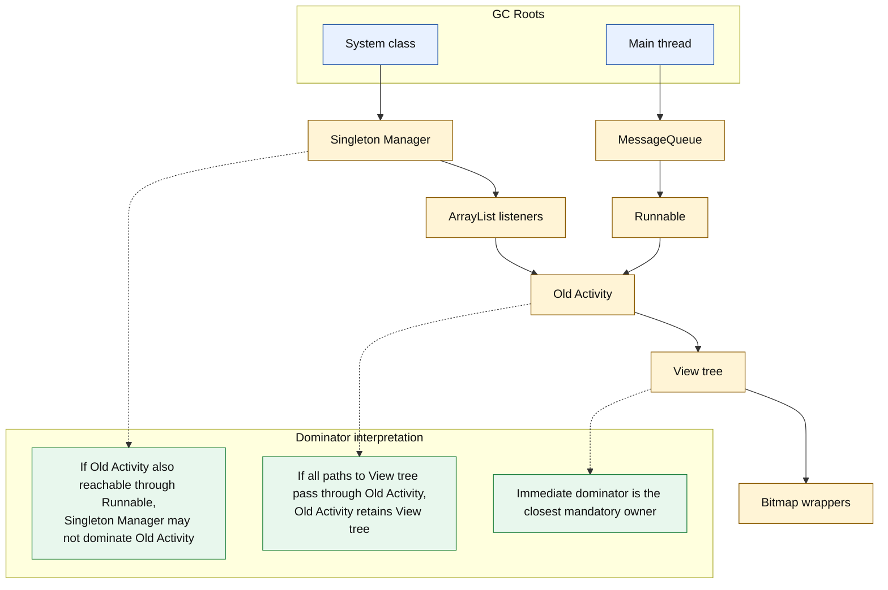
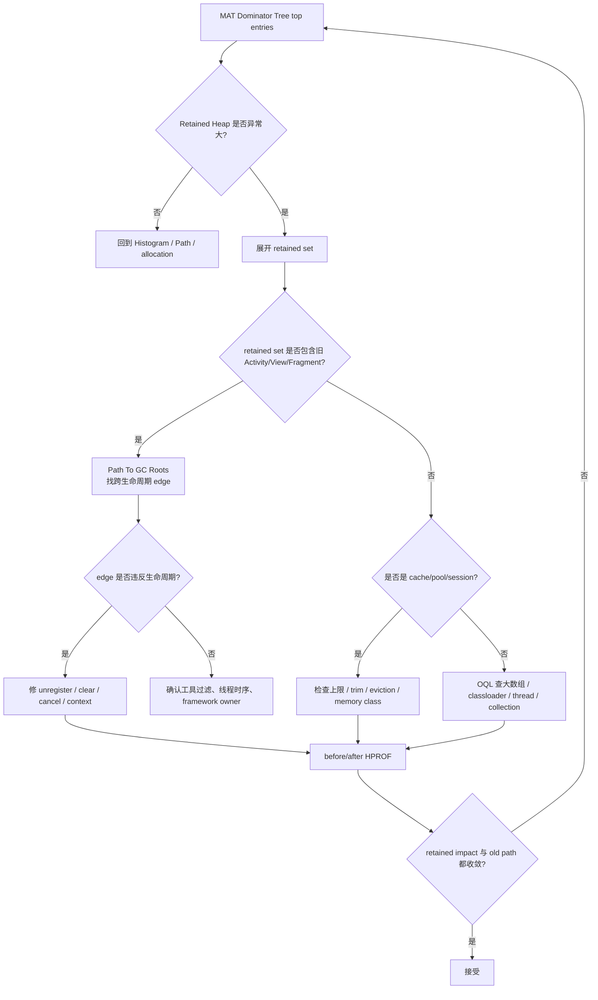
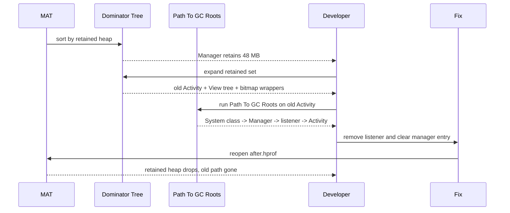
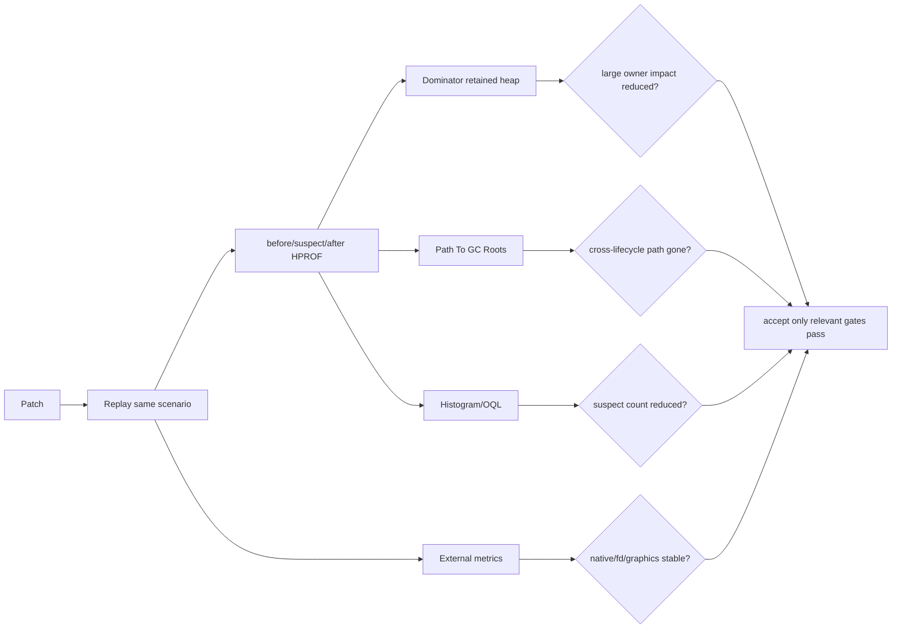

# Day 25：MAT Dominator Tree 与 Retained Heap 解读
> 系列第 25 篇。Day 24 用 MAT 完成入门排查；今天专门拆 Dominator Tree：它回答“删掉谁会释放一大片对象”，但不直接回答“谁违反生命周期”。工程上要把 retained impact、Path To GC Roots 和 cache policy 放在一起读。

---

## 一句话结论

- **Dominator 的定义是：从 GC Roots 到对象 B 的所有路径都必须经过对象 A，则 A dominates B。**
- **Retained Heap 是“如果 A 不可达，理论上随之可回收的对象集合大小”，不是 A 自己占用的 shallow heap。**
- **Dominator Tree 用来排序影响面；Path To GC Roots 用来证明跨生命周期 owner。两者必须交叉验证。**
- **大 retained heap 可能是泄漏，也可能是合理 cache、bitmap pool、classloader、thread queue 或业务会话对象。**

---

## 图 1：对象图到 Dominator Tree



| 概念 | 工程翻译 | 常见误用 |
|---|---|---|
| Shallow Heap | 对象本体大小 | 把小 owner 误判为影响小 |
| Retained Heap | 该对象独占保留的可回收影响面 | 把合理缓存误判为泄漏 |
| Dominator | 所有 root path 必经的对象 | 忽略另一路 root path |
| Immediate Dominator | 离目标最近的必经 owner | 只看最顶层大 owner |
| Dominator Tree | 按“独占保留”重排对象图 | 当成真实字段树 |
| Dominance frontier | 共享可达边开始分叉的位置 | 对共享对象强行归因给单一 owner |

---

## Day 24 反思落地：所有权路径和影响面分开

| Day 24 留下的点 | Day 25 的可见变化 |
|---|---|
| Path To GC Roots 证明 ownership，Dominator 证明 impact | 增加二者分工和交叉验证矩阵 |
| 需要解释 shallow/retained/immediate dominator | 增加定义、图示和典型读法 |
| 需要 cache-versus-leak 边界 | 增加大 owner 分类、cache policy 验收表 |
| 需要 before/after retained-impact validation | 增加复跑矩阵和接受门槛 |

---

## 图 2：排障决策流



---

## Shallow Heap 与 Retained Heap

| 对象 | Shallow Heap 直觉 | Retained Heap 直觉 | 排查方向 |
|---|---|---|---|
| `ArrayList` | 本体很小 | 可能保留大量 element | 看 `elementData` 里的业务对象 |
| `Activity` | 本体中等 | 可能保留 View tree、adapter、bitmap wrapper | Path To GC Roots |
| `HashMap` cache | 本体小 | 可能保留整个缓存值集合 | 看上限、eviction、trim |
| `byte[]` | 本体就是大 payload | retained 可能接近 shallow | 找 owner 和生命周期 |
| `Thread` | 本体不大 | 可能保留 Runnable、ThreadLocal、栈对象 | 看任务退出和队列 |
| `ClassLoader` | 本体不大 | 可能保留类、静态字段、插件对象 | 看卸载边界 |

### 读 retained heap 的 4 个问题

| 问题 | 目的 |
|---|---|
| 这块 retained set 是谁独占保留的？ | 找 immediate dominator |
| retained set 里有没有越过生命周期的对象？ | 判断 leak 候选 |
| retained set 是否是有边界的 cache/pool？ | 判断是否合理 |
| 修复后 retained impact 是否下降？ | 验证不是只改了展示路径 |

---

## 图 3：Dominator 与 Path To GC Roots 的配合



| 组合 | 结论强度 |
|---|---|
| Dominator 大，Path 也越界 | 强泄漏候选，优先修 |
| Dominator 大，Path 合理 | 可能是 cache/pool/session，评估上限和 trim |
| Dominator 小，Path 越界 | 小泄漏也要修，尤其会重复累积 |
| Dominator 小，Path 合理 | 通常不是当前主因 |
| Path 消失，retained 仍大 | 还有第二 owner 或 cache 未收敛 |
| retained 降低，Path 仍在 | 影响变小但生命周期问题未修完 |

---

## Cache 不是免死金牌

| 大 owner 类型 | 合理条件 | 危险信号 | 验收 |
|---|---|---|---|
| LruCache | 有 max size、命中率收益、trim 响应 | key/value 持有 Activity/View | after HPROF 不含旧页面 |
| Bitmap pool | 尺寸受控、按内存级别清理 | retained set 混入页面 wrapper | meminfo Graphics/Java 都稳定 |
| Repository/session | 与登录会话同寿命 | 持有短生命周期 callback/context | logout/exit 后 path 消失 |
| Thread queue | 任务有限、可取消 | Runnable 捕获旧页面 | queue drain 后 old path gone |
| ClassLoader/plugin | 卸载策略明确 | 静态字段持有 Activity | unload 后 classloader 不再 retained |
| Global registry | 明确注册/注销协议 | listener 只 add 不 remove | listener count before/after 稳定 |

```bash
# App 侧：查大 owner 的边界代码
rg -n "LruCache|LinkedHashMap|HashMap|ArrayList|SparseArray|BitmapPool|object |companion object|static" app src
rg -n "trimMemory|onTrimMemory|evict|remove|clear|unregister|dispose|cancel|close" app src

# 设备侧：cache/native/graphics 边界补证
adb shell dumpsys meminfo <package> | sed -n '1,220p'
adb shell am send-trim-memory <package> MODERATE
adb shell am dumpheap <package> /sdcard/day25-after-trim.hprof
adb pull /sdcard/day25-after-trim.hprof .
```

---

## OQL 辅助 retained set 解释

| 目标 | OQL/动作 | 用途 |
|---|---|---|
| 找旧 Activity | `SELECT * FROM INSTANCEOF android.app.Activity` | 看是否仍被 retained |
| 找大数组 | `SELECT * FROM byte[] b WHERE b.@length > 1048576` | 定位 payload |
| 找缓存 owner | 查询业务 cache/manager class | 看 retained set 根 |
| 找 View tree | 查询 `android.view.View` 子类 | 判断页面树是否残留 |
| 找 ThreadLocal | 查询 `java.lang.ThreadLocal`/`Thread` | 判断线程保留 |
| 对比 class histogram | 导出 before/after | 量化修复收益 |

| MAT 动作 | 配套检查 |
|---|---|
| 展开 Dominator Tree | 看 retained set 是否包含 victim |
| Run Path To GC Roots | 看 owner edge 是否跨生命周期 |
| Merge shortest paths | 多个 victim 是否共享同一 owner |
| Group by package/classloader | 插件/模块边界是否异常 |
| Export report | code review 可复查 |

---

## 图 4：Retained Impact 验收矩阵



| 修复目标 | 必须看 | 接受标准 |
|---|---|---|
| Activity leak | Path + Dominator + Histogram | old Activity gone，View tree 不再被 retained |
| Cache too large | Dominator + cache policy | retained set 有上限，trim 后下降 |
| Listener leak | Path + listener registry | registry 不再保留 old listener/victim |
| Thread queue | Path + thread/runnable | queue drain 或 cancel 后 old path gone |
| Bitmap wrapper | Dominator + meminfo | Java wrapper 和 Graphics/native 指标都稳定 |
| ClassLoader leak | Dominator + classloader grouping | unload 后 classloader retained set 消失 |

---

## 常见误读矩阵

| 误读 | 更准确的判断 |
|---|---|
| “Retained Heap 最大的对象就是 bug” | 最大只是优先级入口，仍要看生命周期、cache policy 和 root path。 |
| “Shallow Heap 很小，所以这个 owner 不重要” | 小 owner 可以通过字段或集合保留巨大对象树。 |
| “Dominator Tree 展开的父子关系就是 Java 字段关系” | 它是独占保留关系，不等于源码字段树。 |
| “Path To GC Roots 干净就不用看 retained heap” | 可能还有合理但过大的 cache 或第二条 owner path。 |
| “Retained heap 降了就完全修复” | 旧跨生命周期 path 仍存在时，泄漏模型还没闭环。 |

---

## 边界记录

| 边界 | 本文处理方式 |
|---|---|
| 计算细节 | MAT 的 retained size 依赖解析和引用策略，本文讲工程读法，不替代工具内部实现验证。 |
| 真实 dump | 本文没有实际 before/after retained tree 导出，需要后续样例仓库补齐。 |
| Weak/soft refs | Dominator 和 Path 结果受弱/软引用排除策略影响，必须记录选项。 |
| Native/resource | Dominator Tree 只覆盖 Java heap object graph，不解释 fd/native/Graphics/dma-buf lifetime。 |
| GitHub Issues | 本次 `gh issue list` 因未认证被阻塞，不能声称吸收 open Issue 反馈。 |

---

## 这篇要记住的 5 句工程话术

| 场景 | 更好的表达 |
|---|---|
| 看 Dominator | “它给优先级，不给最终罪名。” |
| 看 Retained Heap | “这是独占影响面，不是对象本体大小。” |
| 看大 cache | “先问上限、trim、命中率，再问是否泄漏。” |
| 修复验证 | “Path gone 和 retained drop 要一起过。” |
| 多工具对比 | “Dominator 看面积，Path 看链路，外部指标看 Java heap 之外。” |
