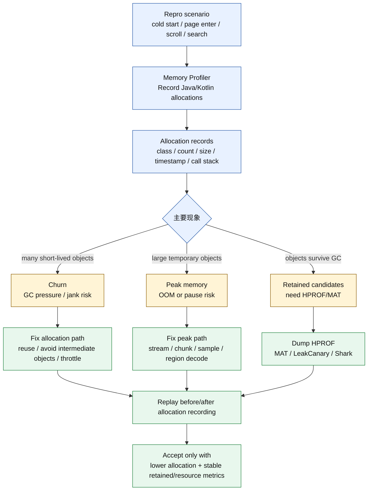
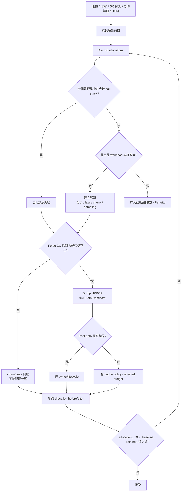
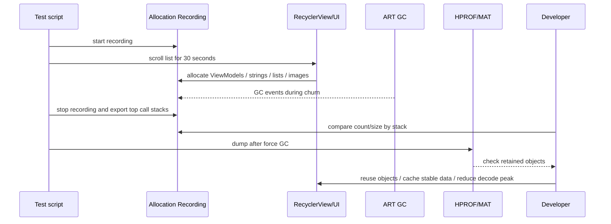
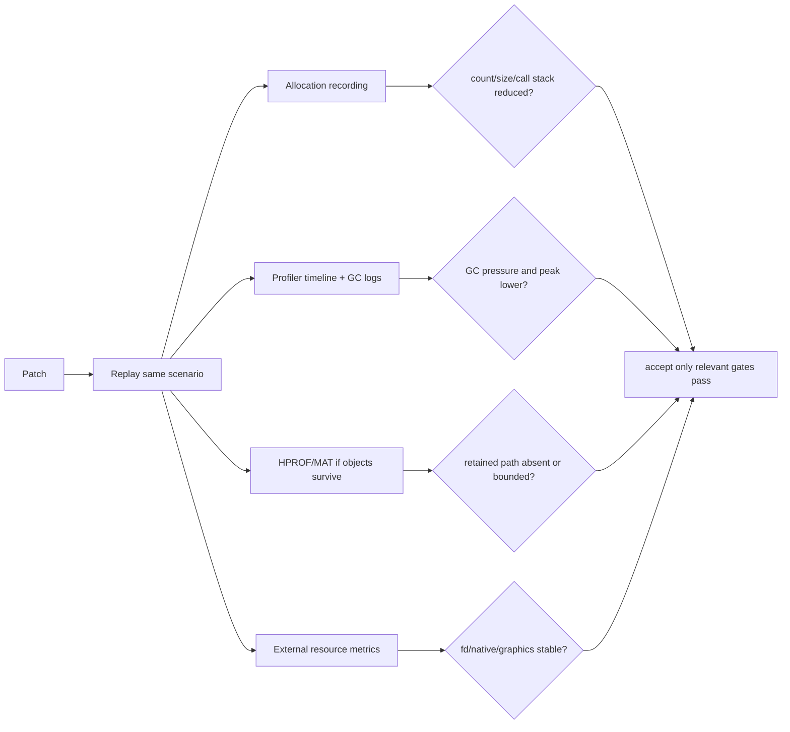

# Day 26：Allocation Tracker 与对象分配热点定位
> 系列第 26 篇。Day 25 看的是“对象留下来了多少”；今天看“对象是怎么被频繁创建出来的”。Allocation Tracker / Allocation Recording 解决的是 churn、峰值、调用栈和 GC 压力，不等同于泄漏证据。

---

## 一句话结论

- **Allocation Tracker 回答“谁在分配、分配多少、调用栈在哪里、是否造成 churn/GC 压力”。**
- **HPROF/MAT 回答“哪些对象在 GC 后仍被 retained”。分配热点和泄漏是两类问题。**
- **冷启动、页面切换、列表滚动、图片解码、JSON/字符串处理，是最常见的 allocation spike 场景。**
- **验收要用 before/after allocation count/size、GC 次数、帧时间、post-GC heap baseline 和 retained evidence 一起看。**

---

## 图 1：Allocation 证据链



| 证据 | 最适合回答 | 不能单独回答 |
|---|---|---|
| Allocation class/count | 哪类对象创建最多 | 是否最终泄漏 |
| Allocation size | 哪些分配贡献峰值 | retained heap 影响 |
| Call stack | 哪条代码路径在创建 | 对象是否应该长期存在 |
| Timestamp range | 哪个交互触发 spike | root owner |
| GC log/timeline | churn 是否带来 GC 压力 | exact owner path |
| HPROF after GC | 对象是否留下 | 谁在频繁创建 |

---

## Day 25 反思落地：churn、retained heap、leak ownership 分开

| Day 25 留下的点 | Day 26 的可见变化 |
|---|---|
| allocation churn 不能混同 retained heap | 增加 churn/peak/retained 三分法 |
| 需要 call stack 和热点定位 | 增加 allocation record 字段表、调用栈读法 |
| 需要 before/after allocation budgets | 增加场景预算表和验收矩阵 |
| 需要和 HPROF/MAT/Profiler 联动 | 增加 allocation -> HPROF/MAT 决策流 |

---

## 图 2：排障决策流



---

## 记录一次 allocation 的最小流程

| 步骤 | 操作 | 产物 | 判断 |
|---|---|---|---|
| 1. 固定场景 | 冷启动、进入页面、滚动 30 秒、搜索 10 次 | 可复现脚本/录屏时间点 | 结果可比较 |
| 2. 记录分配 | Android Studio Memory Profiler 录 allocation | class/count/size/call stack | 找热点 |
| 3. 标注窗口 | 只看交互窗口，不混入准备阶段 | 时间范围 | 降低噪声 |
| 4. 排序 | 按 count、size、call stack 聚合 | top allocators | 判断 churn/peak |
| 5. 验证 retained | Force GC + dump HPROF | MAT/LeakCanary/Shark | 判断是否泄漏 |
| 6. 复跑 | 修复前后同脚本 | allocation delta + GC delta | 验收 |

```bash
# Allocation recording 主要在 Android Studio Memory Profiler UI 中完成；
# 下面这些命令用于建立同场景外部证据和 after-GC heap dump。

adb shell pidof <package>
adb logcat -c
adb logcat -v time | grep -E "GC|art|Choreographer|Skipped|OutOfMemory"

# 场景后 dump：判断 allocation hotspot 是否变成 retained object
adb shell am dumpheap <package> /sdcard/day26-after-window.hprof
adb pull /sdcard/day26-after-window.hprof .

# 对照内存账单和资源边界
adb shell dumpsys meminfo <package> | sed -n '1,220p'
adb shell 'PID=$(pidof <package>); cat /proc/$PID/status | grep -E "VmRSS|Threads"'
adb shell 'PID=$(pidof <package>); ls /proc/$PID/fd | wc -l'
```

---

## Call Stack 读法

| 栈形态 | 常见问题 | 优先修法 |
|---|---|---|
| `onBindViewHolder` 高频创建对象 | 列表滚动 churn | 预计算、复用、Diff、避免临时集合 |
| `TextWatcher`/搜索每次创建字符串 | 输入 churn | debounce、StringBuilder、缓存解析结果 |
| JSON decode 大量 model/list | 解析峰值 | streaming、分页、按需字段 |
| Bitmap decode 大数组 | 内存峰值 | inSampleSize、region decode、复用 buffer |
| Compose/视图构建重复分配 | UI 重组/重绘 churn | 稳定参数、remember/cache、减少中间对象 |
| logging/formatting | debug build 噪声 | lazy log、关闭热路径格式化 |
| coroutine/runnable 大量 task | 调度 churn | 合并任务、取消旧任务、背压 |

### 排序不能只看一个维度

| 排序维度 | 适合发现 | 风险 |
|---|---|---|
| Count | 小对象 churn | 忽略少量大对象峰值 |
| Size | 大数组/bitmap/model 峰值 | 忽略高频小对象造成 GC |
| Call stack | 代码热点 | 混入 framework/工具栈噪声 |
| Time window | 交互触发点 | 窗口太大稀释问题 |
| Live objects | retained 候选 | 不等同于 Path To GC Roots |

---

## 图 3：滚动场景热点定位



| 滚动证据 | 更可能的问题 | 下一步 |
|---|---|---|
| 每帧大量小对象，GC 后不留 | churn | 优化热路径分配 |
| 每次滚动后 Activity/View 仍留 | leak | MAT/LeakCanary path |
| 图片相关大数组峰值 | peak | 采样、tile、复用、缓存上限 |
| Native/Graphics 同时涨 | bitmap/GPU/native | meminfo、Perfetto、后续 bitmap 主题 |
| fd 也增长 | resource leak | Day 20 资源证据链 |

---

## 热点类型与修复策略

| 热点 | 证据 | 修复 |
|---|---|---|
| 中间集合 | `map/filter/toList`、大量 `ArrayList` | 合并遍历、sequence 谨慎、复用 buffer |
| 字符串拼接 | `String`、`char[]`、formatter | `StringBuilder`、lazy log、避免热路径格式化 |
| adapter 绑定 | `onBindViewHolder` call stack | 预格式化、payload update、减少匿名对象 |
| 图片解码 | `byte[]`、Bitmap wrapper、大峰值 | 下采样、region decode、复用、限并发 |
| JSON/序列化 | model/list/string 大量分配 | streaming、分页、字段裁剪 |
| 任务调度 | Runnable/Continuation 大量创建 | 合并、取消、debounce、背压 |
| cache miss | 重复构建同一对象 | cache key、生命周期、上限、trim |

```bash
# App 侧：找高风险 allocation 热点
rg -n "onBindViewHolder|TextWatcher|afterTextChanged|BitmapFactory|decode|JSONObject|Gson|Moshi|kotlinx.serialization|map\\{|filter\\{|toList\\(|String.format|Formatter|ByteArray|copyOf|GlobalScope|launch\\{" app src

# 生命周期和 retained 验证入口
rg -n "onDestroy|onDestroyView|onStop|remove.*Listener|unregister.*Callback|removeObserver|cancel\\(|clear\\(|close\\(" app src

# AOSP/ART allocation/GC 源码入口，用于对齐日志和分配路径
rg -n "AllocObject|Heap::AllocObject|RecordAllocation|Allocation|VisitObjects" art/runtime
rg -n "GcCause|CollectGarbage|ConcurrentCopying|MarkSweep" art/runtime/gc
```

---

## Allocation budget：把优化变成门槛

| 场景 | 预算维度 | 示例门槛 |
|---|---|---|
| 冷启动 | total allocations、peak Java heap、GC 次数 | 首屏前不触发多次 GC |
| 页面进入 | allocation size、post-GC baseline | 退出后 baseline 回落 |
| 列表滚动 | allocations/sec、GC pause、jank frame | 滚动窗口内无明显 GC 抖动 |
| 搜索输入 | allocations/keystroke | debounce 后热点下降 |
| 图片列表 | decode peak、Graphics/native | 峰值受控，缓存命中稳定 |
| 后台返回 | retained objects、cache growth | 缓存有上限，旧页面不 retained |

---

## 图 4：最终验收矩阵



| 问题类型 | 必须通过 | 可选补强 |
|---|---|---|
| churn | allocation count/size 下降，GC 频率下降 | Perfetto frame/GC slice |
| peak | 峰值 Java heap 降低，OOM 风险下降 | heap dump after peak |
| leak | retained path 消失，MAT retained heap 收敛 | LeakCanary same path gone |
| cache | allocation miss 降低，上限/trim 生效 | hit-rate、business metric |
| resource/native | fd/native/Graphics 稳定 | heapprofd、Perfetto、meminfo diff |

---

## 常见误读矩阵

| 误读 | 更准确的判断 |
|---|---|
| “分配最多的类就是泄漏” | 分配多说明 churn；泄漏要看 GC 后是否 retained。 |
| “优化掉所有 allocation 才算好” | 目标是降低热路径无效分配和峰值，不是消灭正常对象创建。 |
| “Allocation recording 没看到 retained path，所以没泄漏” | Allocation 不是 root-path 工具，泄漏仍要 HPROF/MAT/LeakCanary。 |
| “GC 多就是 GC 算法差” | 先看 app 是否在热路径制造对象 churn。 |
| “只看平均值就够” | 峰值、窗口、P95/P99 交互才决定 OOM 和 jank 风险。 |

---

## 边界记录

| 边界 | 本文处理方式 |
|---|---|
| Android Studio 版本 | Allocation Recording UI、字段和导出能力随版本变化，本文按核心证据模型描述。 |
| 真实 trace | 本文没有附带实际 allocation export，需要后续样例补齐。 |
| Native allocation | Java/Kotlin allocation recording 不能完整归因 native heap，需要 heapprofd/Perfetto/malloc 工具。 |
| Compose/框架细节 | 本文只给对象分配模型，具体 Compose 重组和 runtime 分配需后续专题验证。 |
| GitHub Issues | 本次 `gh issue list` 因未认证被阻塞，不能声称吸收 open Issue 反馈。 |

---

## 这篇要记住的 5 句工程话术

| 场景 | 更好的表达 |
|---|---|
| 看 allocation | “它证明谁在创建，不证明谁留下。” |
| 看热点 | “count 看 churn，size 看峰值，stack 看代码入口。” |
| 判断泄漏 | “GC 后还在，再进 HPROF/MAT。” |
| 优化验收 | “before/after 同场景、同窗口、同预算。” |
| 系统联动 | “allocation 降了，还要看 GC、帧、baseline 和资源账单。” |
