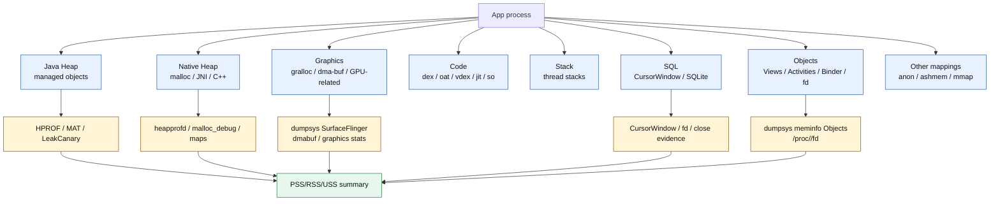
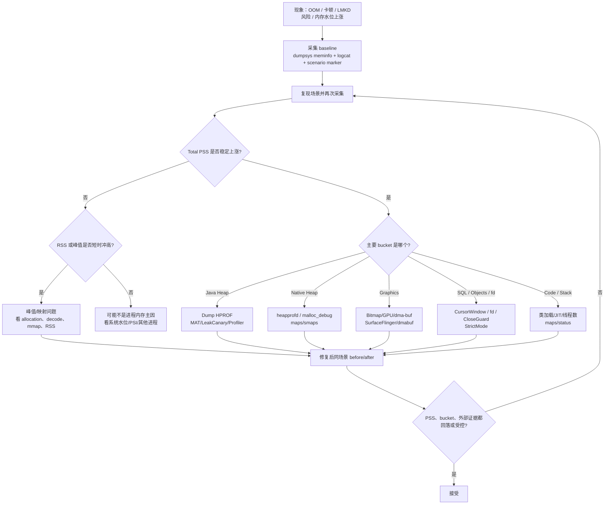
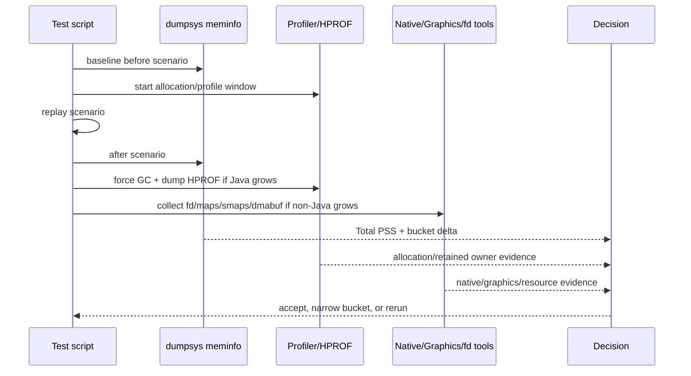

# Day 27：dumpsys meminfo 输出字段解读：PSS/RSS/USS
> 系列第 27 篇。Day 26 看 allocation recording 里的“谁在分配”；今天把这些对象、native buffer、Graphics、CursorWindow、fd 和进程总账放回 `dumpsys meminfo`。核心目标不是背字段，而是知道每一行能证明什么、不能证明什么。

---

## 一句话结论

- **RSS 是进程映射进来的物理页总量，容易重复计算共享页。**
- **PSS 把共享页按进程分摊，更适合看系统视角下的进程内存成本。**
- **USS 近似只属于该进程的私有页，更适合估算 kill 后能回收多少。**
- **`Java Heap / Native Heap / Graphics / Stack / Code / Others / SQL / Objects` 是归因入口，不是最终判决。**
- **验收必须做 before/after：同场景、同时间窗、同 GC/trim 条件、同 `meminfo` + HPROF/Profiler/fd 证据。**

---

## 图 1：进程内存账单结构



| 字段 | 更适合回答 | 不能单独回答 |
|---|---|---|
| PSS Total | 这个进程对系统内存压力贡献多大 | Java 对象是谁持有 |
| RSS Total | 进程当前映射/驻留了多少物理页 | kill 后能回收多少 |
| USS/Private Dirty | 私有、较可能随进程退出释放的页 | 共享库和共享 buffer 成本 |
| Java Heap | managed heap 是否增长 | native/graphics 是否泄漏 |
| Native Heap | malloc/JNI 是否增长 | 哪条 C++ 栈分配 |
| Graphics | 图像/GPU/buffer 成本 | Bitmap Java wrapper 是否泄漏 |
| SQL | CursorWindow/SQLite 成本 | Cursor 是谁没关 |
| Objects/fd | 资源和 framework 对象线索 | retained owner path |

---

## Day 26 反思落地：allocation 只是入口，meminfo 是总账

| Day 26 留下的点 | Day 27 的可见变化 |
|---|---|
| allocation churn、peak、retained 要分开 | 增加 `meminfo` 字段到诊断问题的映射表 |
| 需要连接 Java Heap、Native Heap、Graphics、SQL、Objects | 用结构图把各 bucket 和外部工具连起来 |
| 需要 before/after allocation budget | 增加 `meminfo` before/after 验收矩阵 |
| 需要更强证据链 | 每个 bucket 都给出配套命令和反证路径 |

---

## PSS / RSS / USS 的读法

| 指标 | 简化定义 | 典型用途 | 常见误读 |
|---|---|---|---|
| RSS | resident set size；进程映射到的驻留物理页 | 看进程“碰过并驻留”的页规模 | 多个进程共享页会重复算 |
| PSS | proportional set size；共享页按引用进程数分摊 | 比较进程对系统压力的贡献 | 不能直接定位 owner |
| USS | unique set size；私有页规模 | 估算进程退出后可回收部分 | Android 输出不一定直接叫 USS |
| Private Dirty | 私有且脏的页 | 接近 USS 的常用近似 | 不包含所有可回收成本 |
| SwapPss | 被换出的分摊页 | 看 ZRAM/swap 压力 | 不代表当前 RAM 驻留 |

```bash
adb shell dumpsys meminfo <package>
adb shell dumpsys meminfo <package> -d

PID=$(adb shell pidof <package>)
adb shell cat /proc/$PID/status
adb shell cat /proc/$PID/smaps_rollup
adb shell cat /proc/$PID/smaps | head -n 80
```

---

## 图 2：排障决策流



---

## `dumpsys meminfo` bucket 到证据路径

| Bucket | 常见来源 | 配套证据 | 修复方向 |
|---|---|---|---|
| Java Heap | Kotlin/Java 对象、集合、Activity/View、Bitmap wrapper | HPROF、MAT、LeakCanary、Profiler live objects | 生命周期释放、缓存上限、减少 retained |
| Native Heap | JNI、C++ malloc、Skia、第三方 SDK | heapprofd、malloc_debug、`/proc/<pid>/maps`、`smaps` | free、RAII、限并发、复用 native buffer |
| Graphics | Bitmap pixel、HardwareBuffer、纹理、surface | `dumpsys meminfo` Graphics、SurfaceFlinger、dma-buf | 下采样、tile、释放 surface、降低缓存 |
| Stack | Java/native thread stack | `/proc/<pid>/status` Threads、thread dump | 降低线程数、线程池复用 |
| Code | dex/oat/vdex/jit、native `.so` | `/proc/<pid>/maps` code mappings | 延迟加载、拆包、减少不必要类加载 |
| SQL | CursorWindow、SQLite page cache | CursorWindow 日志、fd、StrictMode | 关闭 Cursor、分页查询、减少列 |
| Objects | View/Activity/Binder/fd 计数 | `meminfo Objects`、fd count、`dumpsys activity` | unregister、close、解绑、减少 Binder 对象 |
| Other | anon mmap、ashmem/memfd、unknown mapping | `maps/smaps/showmap` | 按 mapping name 归因 |

---

## 图 3：同场景 before/after 验收



| 场景 | 观察重点 | 接受条件 |
|---|---|---|
| Java 泄漏修复 | Java Heap PSS、HPROF retained path | 退出页面 + GC 后 old owner 不再持有 victim |
| allocation churn 优化 | Java Heap 峰值、GC 次数、Profiler allocation count | count/size 下降，post-GC baseline 不升 |
| native 泄漏修复 | Native Heap PSS、heapprofd stack、maps/smaps | 对应 stack/bucket 回落或稳定 |
| 图片峰值优化 | Graphics/Native/Java Heap、decode allocation | 峰值降低，缓存命中仍可接受 |
| Cursor/resource 修复 | SQL、Objects、fd count、StrictMode | CursorWindow/fd 不随场景次数线性增长 |
| 线程治理 | Stack、Threads、RSS | 线程数和 stack cost 有上限 |

---

## 常用采集模板

```bash
PKG=com.example.app
OUT=meminfo-$(date +%Y%m%d-%H%M%S)
mkdir -p "$OUT"

adb shell am force-stop "$PKG"
adb shell monkey -p "$PKG" 1
sleep 5

PID=$(adb shell pidof "$PKG" | tr -d '\r')
adb shell dumpsys meminfo "$PKG" > "$OUT/before-meminfo.txt"
adb shell cat /proc/$PID/status > "$OUT/before-status.txt"
adb shell cat /proc/$PID/smaps_rollup > "$OUT/before-smaps-rollup.txt"
adb shell ls /proc/$PID/fd > "$OUT/before-fd.txt"

# 手动或脚本复现场景后：
adb shell dumpsys meminfo "$PKG" > "$OUT/after-meminfo.txt"
adb shell cat /proc/$PID/status > "$OUT/after-status.txt"
adb shell cat /proc/$PID/smaps_rollup > "$OUT/after-smaps-rollup.txt"
adb shell ls /proc/$PID/fd > "$OUT/after-fd.txt"
adb shell am dumpheap "$PKG" /sdcard/after.hprof
adb pull /sdcard/after.hprof "$OUT/after.hprof"
```

### AOSP/工具源码入口

```bash
# Android framework meminfo dump 入口
rg -n "dumpApplicationMemoryUsage|MemInfoReader|Debug.MemoryInfo|getMemoryInfo" frameworks/base

# libmeminfo / procfs 解析
rg -n "smaps_rollup|ProcMemInfo|Pss|Private_Dirty|SwapPss" system/memory/libmeminfo system/core

# ART heap / native allocation 关联入口
rg -n "Heap::|DumpForSigQuit|native heap|mallinfo|malloc_info" art/runtime bionic
```

---

## 读数优先级：先定位 bucket，再找 owner

| 问题 | 先看 | 再看 | 不要直接下结论 |
|---|---|---|---|
| 页面退出后总内存不降 | Total PSS + Java Heap | HPROF Path To GC Roots | 只凭 PSS 说 Activity 泄漏 |
| 滚动时卡顿 | Java Heap peak + GC log | Allocation recording + frame timeline | 把所有 GC 都当泄漏 |
| 拍照/图片页 OOM | Graphics/Native/Java Heap | Bitmap、dmabuf、maps、HPROF | 只看 Java Heap |
| 搜索页越用越高 | Java Heap/SQL/fd | HPROF、CursorWindow、fd count | 忽略 CursorWindow |
| 后台被杀 | PSS/oom_adj/LMKD log | meminfo history、PSI、系统水位 | 只看单进程 Java Heap |

---

## 边界和 blocker

- `dumpsys meminfo` 字段和展示顺序会随 Android 版本、厂商 ROM、debuggable 状态变化；结论要绑定设备、系统版本和采集命令。
- Java Heap 的增长需要 HPROF/MAT/LeakCanary 证明 owner path。
- Native Heap、Graphics、dma-buf、ashmem/memfd 需要 `maps/smaps/showmap/heapprofd/SurfaceFlinger` 等外部证据。
- 本次仍无法读取 GitHub Issues：`gh issue list --repo hello-he/android-memory-expert --state open --limit 50 --json number,title,body,url` 提示需要 `gh auth login` 或 `GH_TOKEN`。

---

## 今日检查清单

- [ ] 同场景采集 before/after `dumpsys meminfo`。
- [ ] 记录 `PSS Total`、`Java Heap`、`Native Heap`、`Graphics`、`SQL`、`Objects/fd` delta。
- [ ] Java 增长用 HPROF/MAT/LeakCanary 找 owner。
- [ ] Native/Graphics 增长用 `maps/smaps/heapprofd/dmabuf` 反查。
- [ ] resource 增长用 fd、StrictMode、CloseGuard、CursorWindow 证明。
- [ ] 修复后复跑同脚本，确认 bucket 和外部证据都回落或受控。
