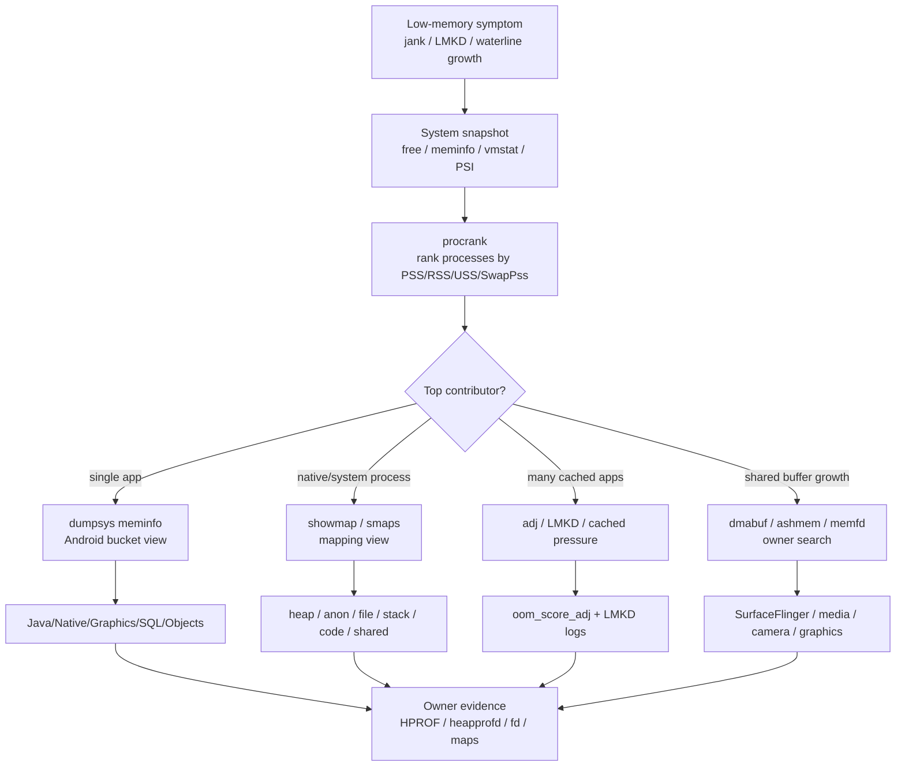
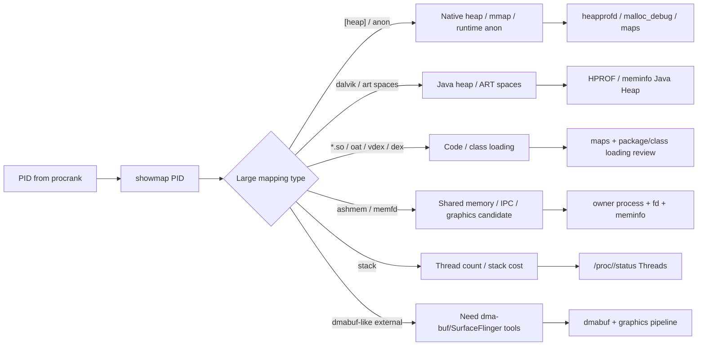
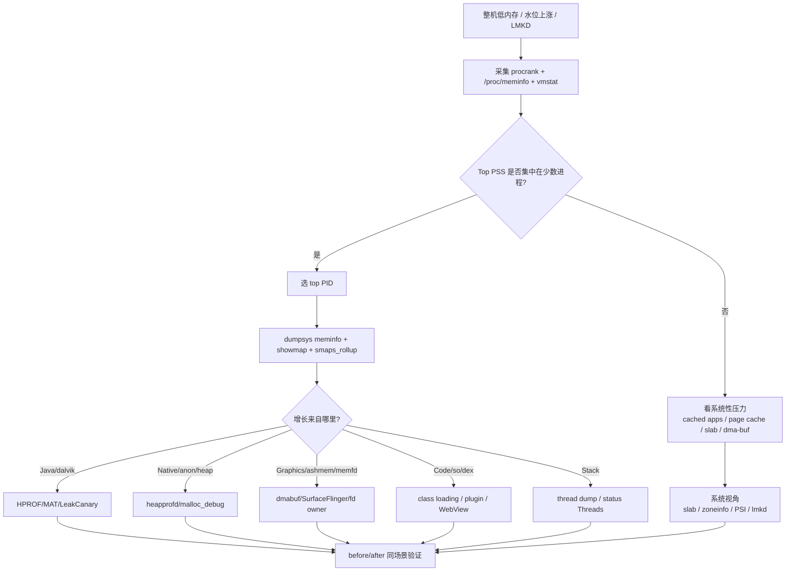

# Day 28：procrank、showmap 与系统内存全局视图
> 系列第 28 篇。Day 27 用 `dumpsys meminfo` 看单进程账单；今天把视角拉到整机：`procrank` 回答“谁在消耗系统内存”，`showmap`/`smaps` 回答“这个进程的哪些 mapping 在消耗内存”。

---

## 一句话结论

- **`procrank` 是进程排名工具：优先看 PSS，再用 RSS/USS/SwapPss 辅助判断共享、私有和换出成本。**
- **`showmap` 是 mapping 拆账工具：把一个进程的 `.so`、dex/oat、anon、ashmem、memfd、heap、stack、dmabuf 候选拆开看。**
- **`dumpsys meminfo` 更像 Android 分类账，`showmap/smaps` 更像 Linux mapping 明细账。**
- **低内存排查要先排名，再拆账，再回到 owner：进程 -> bucket/mapping -> Java/native/graphics/resource 证据。**

---

## 图 1：整机到 mapping 的证据路径



| 工具 | 粒度 | 最适合回答 | 典型下一步 |
|---|---|---|---|
| `procrank` | 全系统进程 | 哪些进程 PSS/RSS/USS 最高 | 选目标 PID |
| `dumpsys meminfo` | 单进程 Android bucket | Java/Native/Graphics/SQL/Objects 哪类涨 | 选证据工具 |
| `showmap <pid>` | 单进程 mapping | 哪些地址段、文件、anon mapping 涨 | 反查 native/mmap/source |
| `/proc/<pid>/smaps` | mapping 详细页统计 | PSS、Private_Dirty、SwapPss、名字 | 精准归因 |
| `/proc/<pid>/smaps_rollup` | 单进程汇总 | 快速对齐 PSS/RSS/Swap | before/after 对照 |

---

## Day 27 反思落地：PSS/RSS/USS 不能停在单进程

| Day 27 留下的点 | Day 28 的可见变化 |
|---|---|
| 需要系统级 PSS/RSS/shared/private accounting | 增加 `procrank` 排名和 `showmap` mapping 拆账 |
| 需要 `meminfo` 与 `smaps_rollup` 对照 | 增加工具责任矩阵和采集模板 |
| 需要 native/graphics/shared memory 证据 | 增加 ashmem/memfd/dma-buf 候选 mapping 读法 |
| 需要低内存 triage | 增加整机压力到进程 owner 的决策流 |

---

## procrank：先找“谁最贵”

| 列 | 读法 | 决策意义 |
|---|---|---|
| PID | 目标进程 | 后续 `showmap`、`smaps`、`status` 输入 |
| Vss | 虚拟地址空间 | 通常不代表实际压力 |
| Rss | 驻留物理页 | 共享页重复算，适合看映射/驻留规模 |
| Pss | 分摊后物理页 | 排名主指标 |
| Uss | 私有页 | kill 后更可能回收的部分 |
| SwapPss | 换出分摊页 | ZRAM/swap 压力线索 |
| cmdline | 进程名 | 识别 app、system_server、media、webview 等 |

```bash
adb shell procrank
adb shell procrank | head -n 30
adb shell procrank | sort -nr -k 4 | head -n 20

# 没有 procrank 时，用 smaps_rollup 自己做近似采样
adb shell 'for p in /proc/[0-9]*; do pid=${p##*/}; name=$(cat $p/cmdline 2>/dev/null | tr "\0" " "); pss=$(grep -s "^Pss:" $p/smaps_rollup | awk "{print \$2}"); [ -n "$pss" ] && echo "$pss $pid $name"; done | sort -nr | head'
```

---

## showmap：再拆“贵在哪里”



| Mapping 形态 | 常见含义 | 配套验证 |
|---|---|---|
| `[heap]` | native malloc heap | heapprofd、malloc_debug、Native Heap bucket |
| `anon:libc_malloc` / anon | allocator arena、mmap、runtime buffer | `smaps` Private_Dirty/PSS、heapprofd |
| `dalvik-main space` / `zygote space` | ART managed heap spaces | HPROF、GC log、Java Heap bucket |
| `.dex` / `.oat` / `.vdex` | code/class metadata mapping | Code bucket、class loading |
| `.so` | native library code/data | RSS/PSS shared-private split |
| `[stack]` | thread stack | Threads count、thread pool policy |
| `/dev/ashmem` / `memfd:` | shared memory | fd owner、IPC/graphics/media path |
| `CursorWindow` | SQLite result window | SQL bucket、Cursor close evidence |

---

## 图 2：排障决策流



---

## 采集模板：一次低内存快照

```bash
OUT=system-memory-$(date +%Y%m%d-%H%M%S)
mkdir -p "$OUT"

adb shell cat /proc/meminfo > "$OUT/proc-meminfo.txt"
adb shell vmstat 1 5 > "$OUT/vmstat.txt"
adb shell cat /proc/pressure/memory > "$OUT/psi-memory.txt"
adb shell procrank > "$OUT/procrank.txt"
adb shell dumpsys meminfo > "$OUT/dumpsys-meminfo-all.txt"

PID=$(adb shell pidof <package> | tr -d '\r')
adb shell dumpsys meminfo <package> > "$OUT/app-meminfo.txt"
adb shell showmap "$PID" > "$OUT/app-showmap.txt"
adb shell cat /proc/$PID/smaps_rollup > "$OUT/app-smaps-rollup.txt"
adb shell cat /proc/$PID/maps > "$OUT/app-maps.txt"
adb shell ls -l /proc/$PID/fd > "$OUT/app-fd.txt"
```

| 文件 | 用途 |
|---|---|
| `procrank.txt` | 找 top PSS/RSS/USS 进程 |
| `dumpsys-meminfo-all.txt` | Android 全局 bucket 摘要 |
| `app-meminfo.txt` | 目标进程 Java/Native/Graphics/SQL/Objects |
| `app-showmap.txt` | 目标进程 mapping 明细 |
| `app-smaps-rollup.txt` | 对齐 PSS/RSS/SwapPss 汇总 |
| `app-maps.txt` | mapping 名称和地址段 |
| `app-fd.txt` | ashmem/memfd/CursorWindow/file/socket owner 线索 |

---

## 组合判断矩阵

| procrank 现象 | showmap 现象 | 更可能问题 | 下一步 |
|---|---|---|---|
| 单 app PSS 高 | `dalvik-*` 高 | Java retained 或 heap baseline 高 | HPROF/MAT/LeakCanary |
| 单 app RSS 高但 PSS 不高 | 大量共享 `.so`/dex | 共享映射重复计入 RSS | 用 PSS 评估系统成本 |
| Native PSS 高 | `[heap]`/anon 高 | C++/JNI/malloc/mmap | heapprofd、malloc_debug |
| Graphics 高 | ashmem/memfd/buffer 线索 | Bitmap/GPU/surface/dma-buf | dmabuf、SurfaceFlinger |
| 多进程 PSS 都高 | cached app 排名靠前 | 系统回收/LMKD策略问题 | adj、lmkd、PSI |
| SwapPss 高 | smaps_rollup SwapPss 高 | ZRAM/swap 压力 | mm_stat、vmstat、Perfetto |
| Stack 高 | `[stack]` 多 | 线程过多 | thread dump、线程池治理 |
| SQL/Objects 高 | CursorWindow/fd 多 | resource leak | StrictMode、fd diff、close |

---

## 和 Day 27 的边界对照

| 问题 | Day 27 单进程 meminfo | Day 28 全局/映射视角 |
|---|---|---|
| 这个 app 是否涨了 | 看 Total PSS 和 bucket delta | 看它在全系统排名是否危险 |
| Java 还是 native | 看 Java Heap/Native Heap bucket | 看 dalvik mapping、heap、anon mapping |
| 共享库是否被重复算 | meminfo 能提示 shared/private | procrank PSS vs RSS 更直观 |
| mmap/ashmem 谁持有 | meminfo 只给粗 bucket | showmap/maps/fd 给名字和 owner 线索 |
| 低内存是否由别的进程导致 | 单进程看不到 | procrank 排名直接暴露 |

---

## AOSP/系统源码入口

```bash
# procrank/showmap/libmeminfo 路径随分支可能调整
rg -n "procrank|showmap|ProcMemInfo|ReadSmaps|SmapsRollup|Pss|Private_Dirty|SwapPss" system/memory system/core

# dumpsys meminfo framework 侧入口
rg -n "dumpApplicationMemoryUsage|Debug.MemoryInfo|getMemoryInfo|MemInfoReader" frameworks/base

# low-memory 后续专题入口
rg -n "psi|vmpressure|lmkd|oom_score_adj|killinfo" system/memory/lmkd frameworks/base/services
```

---

## 边界和 blocker

- `procrank`、`showmap` 在不同 Android 版本、user/userdebug 构建、厂商 ROM 上可用性和输出字段可能不同。
- `showmap` mapping 名称只能缩小范围，不能替代 HPROF、heapprofd、fd、dmabuf owner 等 owner 证据。
- RSS 高不等于该进程独占成本高；共享页必须优先看 PSS/USS/private dirty。
- 本次仍无法读取 GitHub Issues：`gh issue list --repo hello-he/android-memory-expert --state open --limit 50 --json number,title,body,url` 提示需要 `gh auth login` 或 `GH_TOKEN`。

---

## 今日检查清单

- [ ] 先用 `procrank` 找 top PSS/USS/SwapPss 进程。
- [ ] 对目标 PID 采集 `dumpsys meminfo`、`showmap`、`smaps_rollup`、`maps`、`fd`。
- [ ] 用 PSS 评估系统成本，用 RSS 判断映射/驻留规模，用 USS/private dirty 估算私有回收。
- [ ] Java/dalvik mapping 走 HPROF/MAT；native/anon 走 heapprofd；ashmem/memfd/dma-buf 走 owner 工具。
- [ ] 修复后用同一脚本复采 `procrank` 和 `showmap`，确认排名和 mapping delta 都改善。
