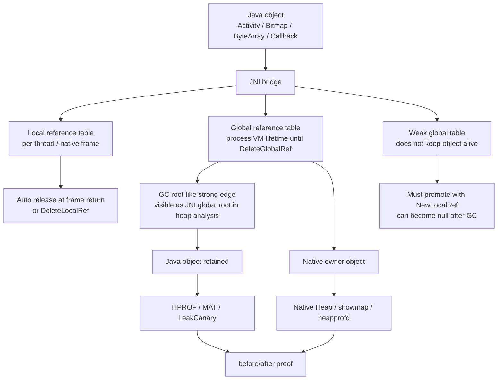
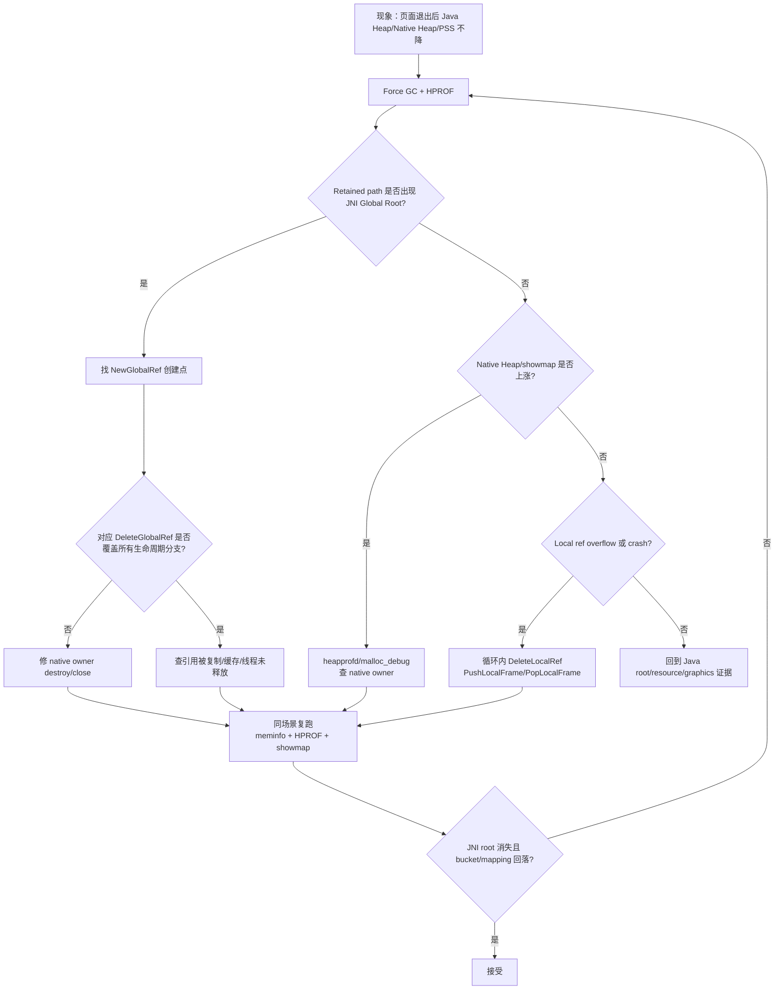
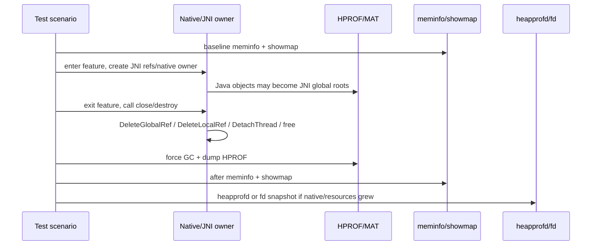

# Day 29：JNI Local/Global Reference 与跨边界泄漏
> 系列第 29 篇。Day 28 用 `procrank/showmap` 把进程和 mapping 找出来；今天进入 JNI 边界：Java 对象可能被 native 全局引用留住，native 对象也可能被 Java wrapper 生命周期拖住。跨边界问题必须同时看 reference table、HPROF、`meminfo`、`showmap` 和 native owner。

---

## 一句话结论

- **Local reference 默认随 native frame 返回释放，但循环内大量创建仍可能触发 local reference table overflow。**
- **Global reference 会跨 native call 生命周期保活 Java 对象，不调用 `DeleteGlobalRef` 就是典型 JNI 泄漏入口。**
- **Weak global reference 不阻止 GC，但使用前必须 `NewLocalRef`/判空，不能当强引用缓存。**
- **JNI 泄漏经常表现为 Java Heap retained path + Native Heap/mapping/fd/Graphics 其中一项同步异常。**
- **排查顺序：先看 HPROF 是否有 JNI global root，再看 native owner 是否释放，再用 `meminfo/showmap` 验证账单回落。**

---

## 图 1：JNI 引用表与对象保活结构



| 引用类型 | 生命周期 | 是否阻止 GC | 典型风险 | 必要动作 |
|---|---|---|---|---|
| Local ref | 当前 native frame / 当前线程局部 | 是，直到释放点 | 循环创建导致 table overflow | `DeleteLocalRef` 或 `Push/PopLocalFrame` |
| Global ref | VM 进程内，直到显式删除 | 是 | 持有 Activity/View/Callback/ByteArray | `DeleteGlobalRef` |
| Weak global ref | VM 进程内，直到显式删除或目标被 GC | 否 | 使用时目标已被回收 | `NewLocalRef` 后判空 |
| Native pointer | C++ owner 生命周期 | 不直接阻止 Java GC | Java wrapper/native owner 互相拖住 | 明确 close/destroy/free |
| Attached thread | `AttachCurrentThread` 到 detach | 线程可访问 JNIEnv | thread-local/JNI state 泄漏 | `DetachCurrentThread` |

---

## Day 28 反思落地：从 mapping 回到跨边界 owner

| Day 28 留下的点 | Day 29 的可见变化 |
|---|---|
| `showmap` mapping 名称不能证明 owner | 增加 JNI reference table -> Java object -> native owner 图 |
| native/Java 账单要联动 | 增加 HPROF + Native Heap + showmap 验收矩阵 |
| ashmem/memfd/dma-buf owner 需要后续深化 | 标出 ByteArray/DirectBuffer/Bitmap/Callback 跨边界场景，为 Day 30/33 铺垫 |
| 需要 before/after 证据 | 增加 DeleteLocalRef/DeleteGlobalRef 后的同场景复采流程 |

---

## 图 2：JNI 泄漏排障决策流



---

## 典型跨边界泄漏图谱

| 场景 | Java 侧现象 | Native 侧现象 | 关键证据 |
|---|---|---|---|
| native 持有 Activity callback | Activity 退出后 retained | Native Heap 不一定明显涨 | HPROF `JNI global` root -> callback -> Activity |
| native 缓存 `jbyteArray` | Java Heap byte[] 留下 | PSS/Java Heap 上涨 | HPROF byte[] retained + NewGlobalRef |
| C++ owner 持有 Java wrapper | wrapper retained | Native Heap 同步上涨 | JNI global root + heapprofd stack |
| Java wrapper 忘记 native destroy | Java 对象可能已释放 | Native Heap/mapping 继续涨 | Cleaner/finalize 不可靠 + showmap/heapprofd |
| attached native thread 未 detach | 线程/stack/JNI state 留下 | Stack/Thread count 上涨 | `/proc/<pid>/status` Threads + stack mapping |
| weak global 使用错误 | crash/null/use-after-free | 不一定涨 | GC 后 `NewLocalRef` 返回 null |

---

## 代码模式：红线和修法

| 模式 | 问题 | 修法 |
|---|---|---|
| `g_callback = env->NewGlobalRef(callback)` 无 delete | Java callback 永久 retained | owner `destroy()` 中 `DeleteGlobalRef` |
| loop 中反复 `NewObject/NewStringUTF` | local ref table overflow | 每轮 `DeleteLocalRef` 或 `PushLocalFrame` |
| native thread attach 后不 detach | 线程/JNI state 生命周期越界 | RAII guard 调 `DetachCurrentThread` |
| weak global 直接当 jobject 用 | GC 后悬空/空对象风险 | `jobject local = env->NewLocalRef(weak)` 并判空 |
| Java `close()` 可选 | native owner 无确定释放点 | `Closeable` + try/finally + lifecycle close |
| DirectBuffer/native pointer 无边界 | Java/native ownership 不清 | 单一 owner + 明确 free 时机 |

```cpp
class NativeCallbackOwner {
 public:
  void SetCallback(JNIEnv* env, jobject callback) {
    Clear(env);
    callback_ = env->NewGlobalRef(callback);
  }

  void Clear(JNIEnv* env) {
    if (callback_ != nullptr) {
      env->DeleteGlobalRef(callback_);
      callback_ = nullptr;
    }
  }

 private:
  jobject callback_ = nullptr;
};
```

---

## 图 3：before/after 验收链路



| 验收对象 | before | after | 接受条件 |
|---|---|---|---|
| JNI Global Root | HPROF 中存在 retained callback/object | 修复后同路径消失 | 不再通过 JNI global 保活页面对象 |
| Java Heap | `dumpsys meminfo` Java Heap 高 | 退出 + GC 后回落 | baseline 稳定 |
| Native Heap | showmap `[heap]`/anon 或 Native Heap 高 | destroy 后回落或平台缓存受控 | heapprofd stack 消失/下降 |
| Local refs | 循环/批处理溢出 | DeleteLocalRef/LocalFrame 后不溢出 | 压测不再出现 table overflow |
| Threads/Stack | Threads/stack mapping 上涨 | detach/退出后下降 | thread count 有上限 |

---

## 采集命令

```bash
PKG=com.example.app
OUT=jni-ref-$(date +%Y%m%d-%H%M%S)
mkdir -p "$OUT"

PID=$(adb shell pidof "$PKG" | tr -d '\r')
adb shell dumpsys meminfo "$PKG" > "$OUT/before-meminfo.txt"
adb shell showmap "$PID" > "$OUT/before-showmap.txt"
adb shell cat /proc/$PID/status > "$OUT/before-status.txt"
adb shell ls -l /proc/$PID/fd > "$OUT/before-fd.txt"

# 场景退出后
adb shell am dumpheap "$PKG" /sdcard/jni-after.hprof
adb pull /sdcard/jni-after.hprof "$OUT/jni-after.hprof"
adb shell dumpsys meminfo "$PKG" > "$OUT/after-meminfo.txt"
adb shell showmap "$PID" > "$OUT/after-showmap.txt"
adb shell cat /proc/$PID/status > "$OUT/after-status.txt"
adb shell ls -l /proc/$PID/fd > "$OUT/after-fd.txt"
```

### 源码/工程搜索入口

```bash
# App/NDK 侧高风险 JNI 引用
rg -n "NewGlobalRef|DeleteGlobalRef|NewWeakGlobalRef|DeleteWeakGlobalRef|NewLocalRef|DeleteLocalRef|PushLocalFrame|PopLocalFrame|AttachCurrentThread|DetachCurrentThread" app src .

# Java wrapper 释放边界
rg -n "external fun|native |System\\.loadLibrary|close\\(|destroy\\(|release\\(|Cleaner|finalize" app src .

# ART JNI reference table / indirect reference table 入口
rg -n "IndirectReferenceTable|JNIEnvExt|NewGlobalRef|DeleteGlobalRef|PushLocalFrame|CheckJNI|ReferenceTable" art/runtime
```

---

## 边界和 blocker

- HPROF 中看到 JNI global root 只能说明 Java 对象被 native global reference 保活；native owner 的创建栈仍要靠代码搜索、日志、heapprofd 或 malloc 调试确认。
- Local reference overflow 是生命周期过短但数量过多的问题，不等同于长期内存泄漏。
- Weak global reference 不阻止 GC，不能用来保证 callback 必然可用。
- Android 版本、ART 分支、CheckJNI 开关和厂商 ROM 会影响日志和 reference table 诊断信息。
- 本次仍无法读取 GitHub Issues：`gh issue list --repo hello-he/android-memory-expert --state open --limit 50 --json number,title,body,url` 提示需要 `gh auth login` 或 `GH_TOKEN`。

---

## 今日检查清单

- [ ] 搜索 `NewGlobalRef`，确认每条路径有对应 `DeleteGlobalRef`。
- [ ] 搜索循环中的 `NewObject/NewStringUTF/NewByteArray`，确认有 local ref 释放策略。
- [ ] native thread 使用 RAII 或 finally-like guard 做 `DetachCurrentThread`。
- [ ] HPROF 检查是否存在 JNI global root 到页面对象的 retained path。
- [ ] `meminfo/showmap` 检查 Java Heap、Native Heap、stack、anon mapping 是否回落。
- [ ] 修复后用同一场景复采，避免只凭代码审查接受。
