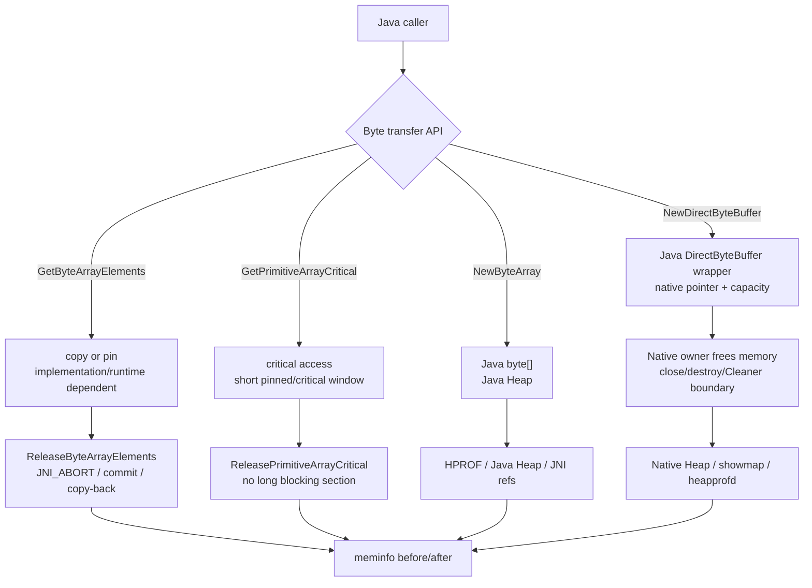
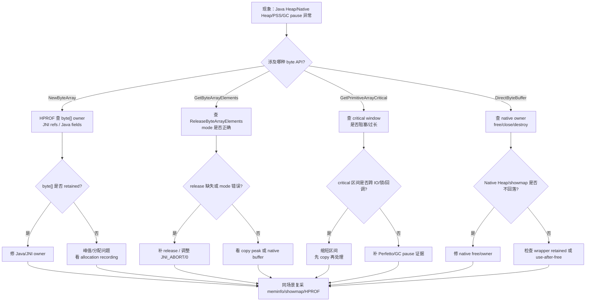
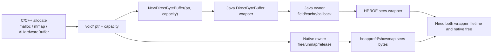

# Day 30：NewByteArray、GetPrimitiveArrayCritical 与 DirectByteBuffer 内存归属
> 系列第 30 篇。Day 29 讲 JNI 引用表；今天聚焦字节本身住在哪里：`NewByteArray` 是 Java Heap 对象，`GetByteArrayElements` 可能 copy 或 pin，`GetPrimitiveArrayCritical` 要尽快释放，`DirectByteBuffer` 背后通常是 native memory。

---

## 一句话结论

- **`NewByteArray` 分配的是 Java `byte[]`，长期持有要用 HPROF 找 owner。**
- **`GetByteArrayElements` 可能返回 copy，也可能 pin 原数组；必须配对 `ReleaseByteArrayElements`。**
- **`GetPrimitiveArrayCritical` 的 critical 区间要极短，期间不能做阻塞、复杂 JNI 调用或长时间持有。**
- **`DirectByteBuffer` 的 Java wrapper 在堆上，真实 bytes 通常在 native heap 或 mmap；释放边界必须明确。**
- **验收要同时看 Java Heap、Native Heap、showmap mapping、GC/暂停、HPROF owner 和 release 调用。**

---

## 图 1：JNI 字节路径与内存归属



| API | Bytes 主要归属 | 必须释放什么 | 主要风险 |
|---|---|---|---|
| `NewByteArray` | Java Heap | local/global ref 生命周期 | 大数组 retained、JNI global 保活 |
| `SetByteArrayRegion` | 写入 Java array | 无额外 native pointer | 峰值来自 Java array 本身 |
| `GetByteArrayElements` | copy 或 pinned Java array | `ReleaseByteArrayElements` | 忘记 release、copy-back 语义错误 |
| `GetPrimitiveArrayCritical` | critical/pinned-like access | `ReleasePrimitiveArrayCritical` | 阻塞 GC 或造成 pause 风险 |
| `NewDirectByteBuffer` | native memory + Java wrapper | native memory free + wrapper owner | native memory 泄漏或 wrapper 悬空 |
| `GetDirectBufferAddress` | native pointer | 不拥有，不 free Java 不拥有的内存 | owner 边界混乱 |

---

## Day 29 反思落地：引用保活之外，还要证明 bytes 归属

| Day 29 留下的点 | Day 30 的可见变化 |
|---|---|
| JNI reference table 只能证明 Java object 保活 | 增加 byte[]、copy/pin、direct buffer 的归属拆分 |
| native owner 需要 cleanup proof | 增加 release/free/close 验收矩阵 |
| 需要 HPROF + heapprofd + showmap 联动 | 每种 API 都映射到 Java Heap、Native Heap、showmap、HPROF |
| 需要更具体 JNI 场景 | 增加 release modes、critical window、DirectBuffer owner 表 |

---

## Release mode 速查

| Release 调用 | mode | 语义 | 常见用途 |
|---|---|---|---|
| `ReleaseByteArrayElements(array, ptr, 0)` | `0` | copy back 并释放 | native 修改了 Java array |
| `ReleaseByteArrayElements(array, ptr, JNI_COMMIT)` | `JNI_COMMIT` | copy back 但不释放 copy buffer | 极少需要，后续仍要释放 |
| `ReleaseByteArrayElements(array, ptr, JNI_ABORT)` | `JNI_ABORT` | 不 copy back，只释放 | 只读输入 |
| `ReleasePrimitiveArrayCritical(array, ptr, 0)` | `0` | 结束 critical 区间，必要时写回 | 短写入 |
| `ReleasePrimitiveArrayCritical(array, ptr, JNI_ABORT)` | `JNI_ABORT` | 结束 critical 区间，不写回 | 短只读 |

```cpp
// 只读输入：优先避免 copy-back。
jbyte* bytes = env->GetByteArrayElements(input, nullptr);
if (bytes == nullptr) return;
Process(bytes, env->GetArrayLength(input));
env->ReleaseByteArrayElements(input, bytes, JNI_ABORT);

// critical 区间必须短：不要在中间做 IO、锁等待、回调 Java、复杂分配。
jbyte* critical = static_cast<jbyte*>(
    env->GetPrimitiveArrayCritical(input, nullptr));
if (critical != nullptr) {
  FastCopyOnly(critical, len);
  env->ReleasePrimitiveArrayCritical(input, critical, JNI_ABORT);
}
```

---

## 图 2：排障决策流



---

## DirectByteBuffer：Java wrapper 和 native bytes 分开看



| 失误 | 表现 | 证据 |
|---|---|---|
| Java wrapper retained | Java Heap 有 DirectByteBuffer/owner | HPROF Path To GC Roots |
| native memory never freed | Native Heap/showmap 上涨 | heapprofd stack、showmap delta |
| Java wrapper 释放但 native owner 未释放 | Java Heap 回落，Native Heap 不回落 | meminfo Java/Native 分叉 |
| native free 过早 | crash/UAF/数据损坏 | tombstone、ASan/HWASan、后续 Day 36+ |
| capacity/offset 错误 | 越界读写风险 | native sanitizer、bounds check |

---

## 采集和代码搜索模板

```bash
PKG=com.example.app
OUT=jni-bytes-$(date +%Y%m%d-%H%M%S)
mkdir -p "$OUT"

PID=$(adb shell pidof "$PKG" | tr -d '\r')
adb shell dumpsys meminfo "$PKG" > "$OUT/before-meminfo.txt"
adb shell showmap "$PID" > "$OUT/before-showmap.txt"

# 场景退出 + GC 后
adb shell am dumpheap "$PKG" /sdcard/jni-bytes-after.hprof
adb pull /sdcard/jni-bytes-after.hprof "$OUT/after.hprof"
adb shell dumpsys meminfo "$PKG" > "$OUT/after-meminfo.txt"
adb shell showmap "$PID" > "$OUT/after-showmap.txt"

# GC / pause / JNI 异常线索
adb logcat -v time | grep -E "JNI|CheckJNI|GC|art|OutOfMemory|critical"
```

```bash
# App/NDK 侧
rg -n "NewByteArray|SetByteArrayRegion|GetByteArrayElements|ReleaseByteArrayElements|GetPrimitiveArrayCritical|ReleasePrimitiveArrayCritical|NewDirectByteBuffer|GetDirectBufferAddress" app src .

rg -n "malloc|calloc|realloc|free|mmap|munmap|AHardwareBuffer|ByteBuffer|DirectByteBuffer|close\\(|destroy\\(|release\\(" app src .

# ART/JNI 实现与检查入口
rg -n "NewByteArray|GetPrimitiveArrayCritical|ReleasePrimitiveArrayCritical|GetByteArrayElements|NewDirectByteBuffer|GetDirectBufferAddress|CheckJNI" art/runtime
```

---

## 验收矩阵

| 问题类型 | 必看证据 | 修复后目标 |
|---|---|---|
| Java `byte[]` retained | HPROF byte[] owner、JNI global root、Java Heap | owner path 消失，Java Heap baseline 回落 |
| `GetByteArrayElements` 未 release | 代码搜索、Native Heap/copy peak、CheckJNI | release 覆盖所有 return/error path |
| release mode 错误 | 数据正确性、copy-back 语义 | 只读用 `JNI_ABORT`，写入才 copy back |
| critical 区间过长 | GC pause、Perfetto、代码审查 | 区间只做快速内存访问 |
| DirectBuffer native 泄漏 | heapprofd、showmap、Native Heap | native owner free/unmap 后回落 |
| wrapper/native 生命周期错位 | HPROF + Native Heap 分叉 | Java close/destroy 与 native release 绑定 |

---

## 边界和 blocker

- JNI 是否 copy 或 pin 是实现和运行时状态相关的，不要写依赖“必然 copy”或“必然 zero-copy”的业务逻辑。
- `GetPrimitiveArrayCritical` 的核心约束是临界区短且简单；具体 GC 影响需要目标 Android 版本和真实 trace 验证。
- `DirectByteBuffer` 只把 native pointer 暴露给 Java；它不自动定义 native memory 的所有权协议。
- 本次仍无法读取 GitHub Issues：`gh issue list --repo hello-he/android-memory-expert --state open --limit 50 --json number,title,body,url` 提示需要 `gh auth login` 或 `GH_TOKEN`。

---

## 今日检查清单

- [ ] 每个 `Get*ArrayElements` 都有所有路径上的 `Release*ArrayElements`。
- [ ] 只读路径优先使用 `JNI_ABORT`，避免无意义 copy-back。
- [ ] `GetPrimitiveArrayCritical` 区间内不做 IO、锁等待、Java 回调、复杂分配。
- [ ] `NewByteArray` 大对象有 HPROF owner 验证，不被 JNI global 或 cache 长期持有。
- [ ] `DirectByteBuffer` 有明确 native owner 和 `free/unmap/release` 时机。
- [ ] before/after 同场景采集 `meminfo`、`showmap`、HPROF，必要时补 heapprofd/Perfetto。
