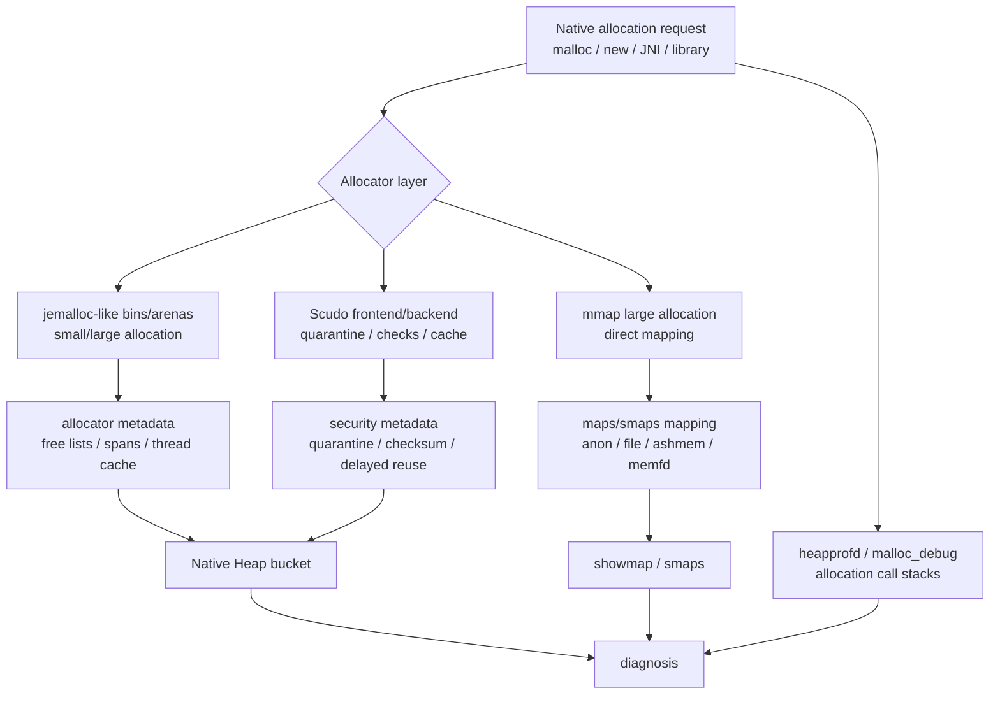
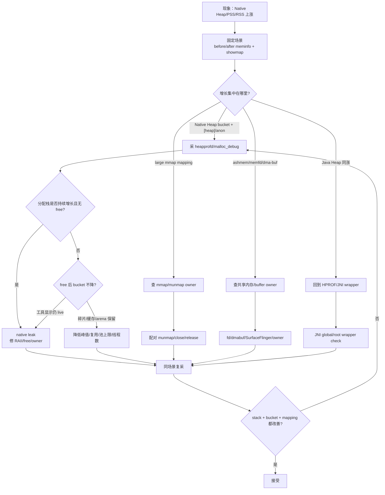
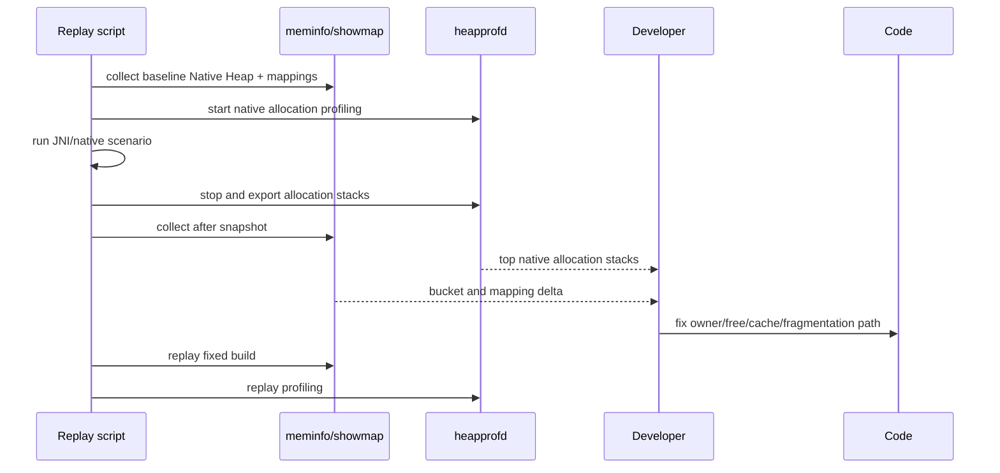

# Day 31：Native Heap 分配器：jemalloc、Scudo 与 malloc 调试
> 系列第 31 篇。Day 30 解决“JNI bytes 归谁释放”；今天看释放以后 allocator 怎么记账：Native Heap 变高可能是泄漏，也可能是碎片、线程缓存、arena 保留、mmap 大块或调试工具自身开销。

---

## 一句话结论

- **Native Heap 不是一个对象图；它是 allocator 管理的地址空间、span/chunk、cache 和 mmap 的组合。**
- **泄漏、碎片、缓存保留、峰值未归还 OS，现象都可能是 Native Heap/PSS 不降。**
- **`dumpsys meminfo` 看 bucket，`showmap/smaps` 看 mapping，heapprofd/malloc_debug 看分配栈。**
- **Scudo 更强调安全检测和隔离，jemalloc 更强调通用分配性能；具体 Android 版本和进程选择要以目标设备验证为准。**
- **修复验收要同时看 native allocation stack、Native Heap bucket、showmap/smaps delta 和场景 replay。**

---

## 图 1：Native Heap 证据结构



| 层级 | 主要回答 | 主要工具 |
|---|---|---|
| `dumpsys meminfo` Native Heap | 进程 native bucket 是否涨 | `adb shell dumpsys meminfo <pkg>` |
| mapping | 涨在 `[heap]`、anon、mmap、ashmem 还是 file | `showmap`、`/proc/<pid>/maps`、`smaps` |
| allocation stack | 哪条 native 调用栈分配 | heapprofd、malloc_debug |
| allocator behavior | free 后是否保留、碎片、cache | malloc_info、debug allocator、复现场景 |
| ownership | 谁应该释放 | C++ RAII、JNI wrapper、close/destroy |

---

## Day 30 反思落地：native bytes 释放后，还要看 allocator 是否归还

| Day 30 留下的点 | Day 31 的可见变化 |
|---|---|
| DirectByteBuffer wrapper 和 native bytes 分离 | 增加 Java wrapper 外的 allocator/mapping 证据链 |
| 需要 heapprofd/showmap/HPROF 联动 | 增加 bucket/mapping/stack 三层定位表 |
| release 之后 Native Heap 仍可能不降 | 明确泄漏、碎片、cache、arena 保留四分法 |
| 需要 allocator 级别证据 | 增加 jemalloc/Scudo/malloc_debug 对照和命令模板 |

---

## jemalloc、Scudo、malloc_debug 怎么分工

| 项 | 重点 | 适合发现 | 边界 |
|---|---|---|---|
| jemalloc | bins、arenas、thread cache、低碎片策略 | 分配模式、碎片、arena 保留 | 不直接给业务 owner |
| Scudo | hardened allocator、隔离、校验、quarantine | UAF/double free/overflow 类风险线索 | 安全开销可能改变内存形态 |
| malloc_debug | Android malloc 调试选项、backtrace、guard | 泄漏栈、越界、释放错误 | 开销高，不代表线上性能 |
| heapprofd | 低开销采样 native allocation profiler | native 分配热点和增长栈 | 采样/配置会影响完整性 |
| showmap/smaps | mapping 和 PSS/private dirty 明细 | `[heap]`、anon、mmap、ashmem 归因 | 不知道 C++ owner |

---

## 图 2：Native Heap 排障决策流



---

## 四类 Native Heap 上涨不要混判

| 类型 | 典型表现 | 证明方法 | 修复方向 |
|---|---|---|---|
| 真泄漏 | heapprofd/malloc_debug live allocation stack 持续增长 | 场景退出后同 stack 仍 live | RAII、`free/delete`、生命周期 owner |
| 碎片 | 总量高，live payload 不高，mapping 不易回落 | 大小混合分配、峰值后不归还 | 降低大小离散度、复用、分阶段释放 |
| 缓存/池 | 退出后保留，命中率/上限可解释 | cache policy、trim 后下降 | 上限、trim、按 memoryClass 调整 |
| allocator 保留 | free 后进程 RSS/PSS 不立刻降 | allocation stack 已释放但 mapping 保留 | 接受边界或降低峰值/线程缓存 |

---

## 图 3：同场景证据闭环



| 验收项 | before | after |
|---|---|---|
| Native allocation stack | top stack 持续增长 | stack 消失、下降或 bounded |
| Native Heap bucket | 场景后不回落 | 退出/trim 后稳定 |
| showmap/smaps | `[heap]`/anon/mmap PSS 增长 | mapping delta 受控 |
| Java wrapper | DirectByteBuffer/JNI wrapper retained | HPROF owner path 消失 |
| 低内存影响 | PSS 排名上升、LMKD 风险 | procrank 排名和 PSS 改善 |

---

## 采集命令

```bash
PKG=com.example.app
OUT=native-heap-$(date +%Y%m%d-%H%M%S)
mkdir -p "$OUT"

PID=$(adb shell pidof "$PKG" | tr -d '\r')
adb shell dumpsys meminfo "$PKG" > "$OUT/before-meminfo.txt"
adb shell showmap "$PID" > "$OUT/before-showmap.txt"
adb shell cat /proc/$PID/smaps_rollup > "$OUT/before-smaps-rollup.txt"
adb shell cat /proc/$PID/maps > "$OUT/before-maps.txt"

# heapprofd 配置建议后续按场景细化；这里先保留采集入口。
adb shell perfetto -c /data/misc/perfetto-configs/heapprofd.pbtxt -o /data/misc/perfetto-traces/native-heap.pftrace
adb pull /data/misc/perfetto-traces/native-heap.pftrace "$OUT/native-heap.pftrace"

# 场景后复采
adb shell dumpsys meminfo "$PKG" > "$OUT/after-meminfo.txt"
adb shell showmap "$PID" > "$OUT/after-showmap.txt"
adb shell cat /proc/$PID/smaps_rollup > "$OUT/after-smaps-rollup.txt"
```

### 代码和 AOSP 搜索入口

```bash
# App/NDK 侧 native owner
rg -n "malloc|calloc|realloc|free|new |delete |mmap|munmap|std::vector|std::string|DirectByteBuffer|GetDirectBufferAddress|close\\(|destroy\\(|release\\(" app src .

# Android allocator / malloc debug / heapprofd 入口
rg -n "malloc_debug|heapprofd|Scudo|jemalloc|mallinfo|malloc_info|native heap|MemInfo" bionic system/memory external art

# JNI wrapper 交叉验证
rg -n "NewDirectByteBuffer|GetDirectBufferAddress|NewGlobalRef|DeleteGlobalRef|native |external fun" app src .
```

---

## 诊断矩阵

| 现象 | 优先假设 | 下一步 |
|---|---|---|
| Native Heap 上涨，heapprofd top stack 同步涨 | native leak 或热点 | 查 owner/free path |
| Native Heap 上涨，top stack 不再 live | 碎片/cache/allocator 保留 | 看峰值、线程数、池上限 |
| RSS 高，PSS 不高 | 共享映射多 | 用 PSS 评估系统成本 |
| showmap 大块 anon/mmap | 自管 buffer 或 mmap | 查 mmap/munmap、DirectBuffer |
| Java Heap 和 Native Heap 同涨 | wrapper/native 双边界 | HPROF + native stack |
| fd/ashmem/memfd 同涨 | 共享资源未释放 | fd diff、owner、close |

---

## 边界和 blocker

- Android 版本、进程类型、构建类型和 libc allocator 配置会影响 jemalloc/Scudo/malloc_debug 的可用性和输出。
- heapprofd 是采样/配置驱动工具；没有看到某个分配栈不等于一定不存在。
- allocator free 后不立刻还给 OS 不必然是泄漏；必须结合 live allocation、mapping delta、场景重放判断。
- 本次仍无法读取 GitHub Issues：`gh issue list --repo hello-he/android-memory-expert --state open --limit 50 --json number,title,body,url` 提示需要 `gh auth login` 或 `GH_TOKEN`。

---

## 今日检查清单

- [ ] 先用 `meminfo/showmap/smaps_rollup` 定位 Native Heap 或 anon/mmap 增长。
- [ ] 用 heapprofd/malloc_debug 找 native allocation stack。
- [ ] 区分泄漏、碎片、cache、allocator 保留。
- [ ] DirectByteBuffer/JNI wrapper 同时用 HPROF 验证 Java owner。
- [ ] 修复后同场景复采 bucket、mapping、allocation stack。
