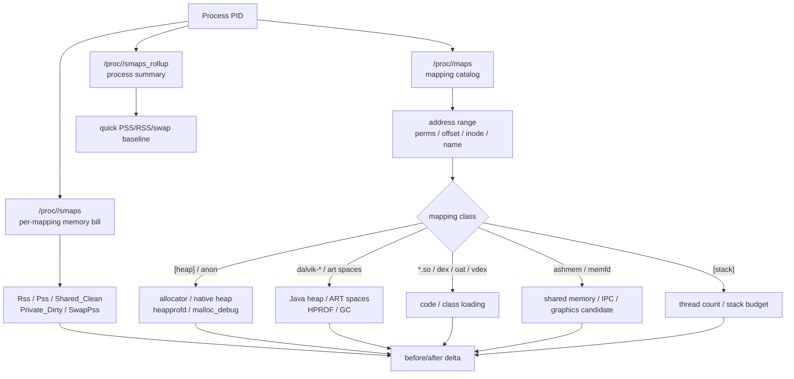
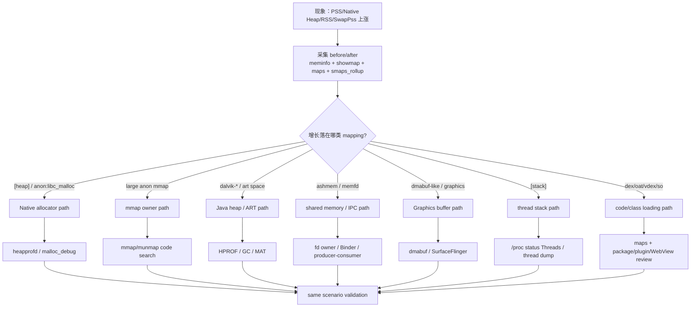
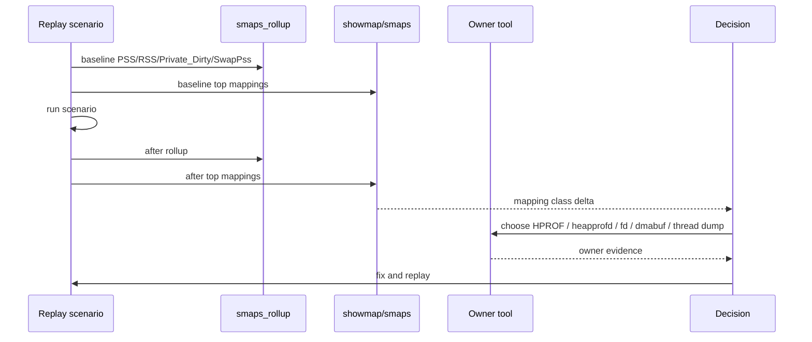

# Day 32：/proc/<pid>/maps、smaps 与 native 内存映射全貌
> 系列第 32 篇。Day 31 看 Native Heap allocator；今天把 allocator、mmap、ashmem、memfd、stack、code、dalvik space 都放到 `/proc/<pid>/maps` 和 `smaps` 里看。核心不是背字段，而是把“哪块地址段变大”变成“哪个 owner 要负责”。

---

## 一句话结论

- **`maps` 是地址段目录：看范围、权限、偏移、设备、inode 和 mapping 名称。**
- **`smaps` 是每个地址段的页级账单：看 PSS、RSS、Private_Dirty、Shared_Clean、SwapPss。**
- **`smaps_rollup` 是快速总账：适合 before/after 对齐 `dumpsys meminfo` 和 `showmap`。**
- **Native Heap 上涨要先落到 mapping：`[heap]`、anon、mmap、ashmem、memfd、file、stack、dex/oat/vdex/so。**
- **mapping 名称只能缩小范围，不能替代 HPROF、heapprofd、fd、dmabuf、owner 代码路径。**

---

## 图 1：maps/smaps 证据层级



| 文件 | 粒度 | 主要用途 |
|---|---|---|
| `/proc/<pid>/maps` | 每个 VMA 一行 | 识别 mapping 类型、权限、文件名、地址范围 |
| `/proc/<pid>/smaps` | 每个 VMA 多字段 | 看 PSS/RSS/private/shared/swap 账单 |
| `/proc/<pid>/smaps_rollup` | 进程汇总 | 快速对齐 `meminfo`、`showmap`、before/after |
| `showmap <pid>` | mapping 汇总视图 | 比 raw smaps 更易排序查看 |
| `dumpsys meminfo <pkg>` | Android bucket | Java/Native/Graphics/SQL/Objects 分类入口 |

---

## Day 31 反思落地：allocator 证据必须落到具体 mapping

| Day 31 留下的点 | Day 32 的可见变化 |
|---|---|
| Native Heap 不是对象图 | 用 VMA/mapping 结构解释 native 地址空间 |
| 泄漏、碎片、cache、allocator 保留不能混判 | 增加 mapping delta 到诊断类型矩阵 |
| 需要 meminfo/showmap/smaps/heapprofd 联动 | 增加采集模板和工具对照 |
| 需要 owner 边界 | 明确 mapping name 不是 owner proof |

---

## maps 一行怎么读

```text
start-end perms offset dev inode pathname
```

| 字段 | 示例 | 读法 |
|---|---|---|
| address range | `7a12300000-7a12400000` | 虚拟地址范围；大小是 `end - start` |
| perms | `rw-p` / `r-xp` / `r--s` | 读写执行、private/shared |
| offset | `00000000` | file-backed mapping 的文件偏移 |
| dev/inode | `103:12 12345` | 对应文件设备和 inode |
| pathname | `/apex/.../libc.so`、`[heap]`、`[anon:...]` | mapping 来源线索 |

| 权限 | 常见含义 | 风险线索 |
|---|---|---|
| `rw-p` | private writable data/heap/anon | native heap、cache、mmap buffer |
| `r-xp` | executable code | `.so`、oat、jit code |
| `r--p` | read-only private | dex/oat/vdex/file data |
| `rw-s` / `r--s` | shared mapping | ashmem、memfd、shared file |
| `---p` | guard/reserved | stack guard、reserved address space |

---

## smaps 关键字段

| 字段 | 含义 | 用途 |
|---|---|---|
| `Size` | 虚拟地址段大小 | 不能直接当物理内存压力 |
| `Rss` | 驻留物理页 | 看实际驻留，但共享页会重复算 |
| `Pss` | 分摊后的物理页 | 评估系统成本主指标 |
| `Shared_Clean` | 共享干净页 | 常见于 `.so`、dex/oat、可回收文件页 |
| `Shared_Dirty` | 共享脏页 | 共享可写页压力 |
| `Private_Clean` | 私有干净页 | 私有但可回收/可重载可能性 |
| `Private_Dirty` | 私有脏页 | 更接近进程退出可回收成本 |
| `Swap` | 换出页 | 是否进入 swap |
| `SwapPss` | 分摊 swap 页 | ZRAM/swap 压力线索 |
| `VmFlags` | VMA flags | 深入判断映射行为 |

---

## 图 2：mapping 排障决策流



---

## mapping 类型速查

| mapping 名称 | 常见来源 | 不能直接证明 | 下一步 |
|---|---|---|---|
| `[heap]` | native malloc brk heap | 哪个 C++ owner | heapprofd/malloc_debug |
| `[anon:libc_malloc]` | malloc mmap arena/large allocation | 是否泄漏还是缓存 | allocation stack + replay |
| `[anon:scudo:*]` | Scudo allocator 区域 | 具体业务对象 | allocator/tool validation |
| `dalvik-main space` | ART managed heap | Java owner path | HPROF/MAT/LeakCanary |
| `dalvik-zygote space` | zygote shared Java heap | 当前 app 独占 | PSS/shared split |
| `.so` | native library code/data | 业务泄漏 | RSS/PSS/private split |
| `.dex/.oat/.vdex` | code/class metadata | 对象泄漏 | class loading/plugin review |
| `[stack]` | thread stack | 哪条业务创建线程 | thread dump + status |
| `/dev/ashmem` | shared memory | producer/consumer owner | fd diff + service owner |
| `memfd:*` | shared anonymous file | 生命周期 owner | fd owner + close |
| `CursorWindow` | SQLite result window | Cursor owner | fd/StrictMode/close path |

---

## 图 3：before/after mapping delta 闭环



| Delta 形态 | 更可能问题 | 反证/确认 |
|---|---|---|
| `Pss` 和 `Private_Dirty` 同涨 | 私有内存增长 | owner 工具必须找到责任方 |
| `Rss` 涨但 `Pss` 小 | 共享页/文件页多 | 不按独占泄漏处理 |
| `Size` 很大但 `Rss/Pss` 小 | 预留地址空间 | 不能直接当 OOM 根因 |
| `SwapPss` 涨 | swap/ZRAM 压力 | 结合 vmstat、PSI、Perfetto |
| `Shared_Clean` 高 | `.so`/dex/oat/file-backed | 常可回收或共享 |
| anon mapping 线性涨 | native buffer/mmap 泄漏候选 | heapprofd 或 mmap code path |

---

## 采集模板

```bash
PKG=com.example.app
OUT=maps-smaps-$(date +%Y%m%d-%H%M%S)
mkdir -p "$OUT"

PID=$(adb shell pidof "$PKG" | tr -d '\r')
adb shell dumpsys meminfo "$PKG" > "$OUT/before-meminfo.txt"
adb shell showmap "$PID" > "$OUT/before-showmap.txt"
adb shell cat /proc/$PID/maps > "$OUT/before-maps.txt"
adb shell cat /proc/$PID/smaps_rollup > "$OUT/before-smaps-rollup.txt"
adb shell cat /proc/$PID/smaps > "$OUT/before-smaps.txt"
adb shell ls -l /proc/$PID/fd > "$OUT/before-fd.txt"

# 复现场景后
adb shell dumpsys meminfo "$PKG" > "$OUT/after-meminfo.txt"
adb shell showmap "$PID" > "$OUT/after-showmap.txt"
adb shell cat /proc/$PID/maps > "$OUT/after-maps.txt"
adb shell cat /proc/$PID/smaps_rollup > "$OUT/after-smaps-rollup.txt"
adb shell cat /proc/$PID/smaps > "$OUT/after-smaps.txt"
adb shell ls -l /proc/$PID/fd > "$OUT/after-fd.txt"
```

### 快速筛选

```bash
# 看 mapping 名称分布
adb shell cat /proc/$PID/maps | grep -E "heap|anon|dalvik|ashmem|memfd|CursorWindow|\\.so|\\.dex|\\.oat|\\.vdex|stack"

# smaps_rollup 对齐总量
adb shell cat /proc/$PID/smaps_rollup | grep -E "Rss|Pss|Private_Dirty|Swap|SwapPss"

# fd 帮助反查 ashmem/memfd/CursorWindow/file/socket
adb shell ls -l /proc/$PID/fd | grep -E "ashmem|memfd|CursorWindow|dmabuf|socket"
```

### AOSP/源码入口

```bash
# libmeminfo / showmap / smaps 解析
rg -n "showmap|smaps_rollup|ProcMemInfo|Vma|Pss|Private_Dirty|SwapPss|ReadMaps" system/memory system/core

# framework meminfo 分类
rg -n "Debug.MemoryInfo|dumpApplicationMemoryUsage|MemInfoReader|getMemoryInfo" frameworks/base

# App/NDK owner 搜索
rg -n "malloc|free|new |delete |mmap|munmap|memfd_create|ashmem|CursorWindow|DirectByteBuffer|Thread\\(|Executors|HandlerThread" app src .
```

---

## 工具组合矩阵

| 目标问题 | maps/smaps 能做 | 还需要 |
|---|---|---|
| Native leak | 定位 `[heap]`/anon/mmap delta | heapprofd/malloc_debug stack |
| Java retained | 定位 dalvik mapping/Java bucket | HPROF/MAT/LeakCanary |
| DirectByteBuffer | 看 native mapping 和 Java wrapper 分叉 | HPROF + native owner |
| CursorWindow | 看到 fd/mapping 名称 | Cursor close path、StrictMode |
| Thread stack | 看到 `[stack]` 和 stack PSS | thread dump、线程创建点 |
| Code bloat | 看到 dex/oat/vdex/so mapping | class loading、dynamic feature、WebView |
| Shared buffer | 看到 ashmem/memfd 候选 | fd owner、dmabuf、producer/consumer |

---

## 边界和 blocker

- `/proc/<pid>/smaps` 读取权限、字段、mapping 名称会随 Android 版本、SELinux、user/userdebug、厂商 ROM 变化。
- mapping 名称不是 owner proof；它只能决定下一步该用 HPROF、heapprofd、fd、dmabuf、thread dump 还是代码搜索。
- `Size` 是虚拟地址范围，不是物理内存压力；低内存判断优先看 PSS、Private_Dirty、SwapPss 和系统 PSI/vmstat。
- 本次仍无法读取 GitHub Issues：`gh issue list --repo hello-he/android-memory-expert --state open --limit 50 --json number,title,body,url` 提示需要 `gh auth login` 或 `GH_TOKEN`。

---

## 今日检查清单

- [ ] 采集同场景 before/after `maps`、`smaps`、`smaps_rollup`、`showmap`、`meminfo`。
- [ ] 先看 `smaps_rollup` 的 PSS、RSS、Private_Dirty、SwapPss delta。
- [ ] 用 `showmap/smaps` 找 top delta mapping，不只看 `Size`。
- [ ] 将 mapping 分类为 Native Heap、anon mmap、dalvik、ashmem、memfd、stack、code、file。
- [ ] 每类 mapping 选择对应 owner 工具：HPROF、heapprofd、malloc_debug、fd、dmabuf、thread dump。
- [ ] 修复后复跑同脚本，确认 mapping delta 和 owner 证据一起改善。
