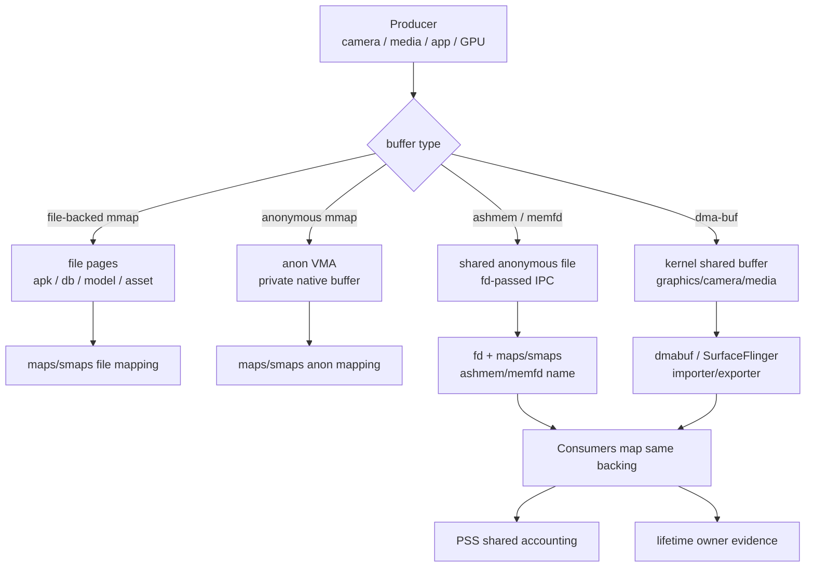
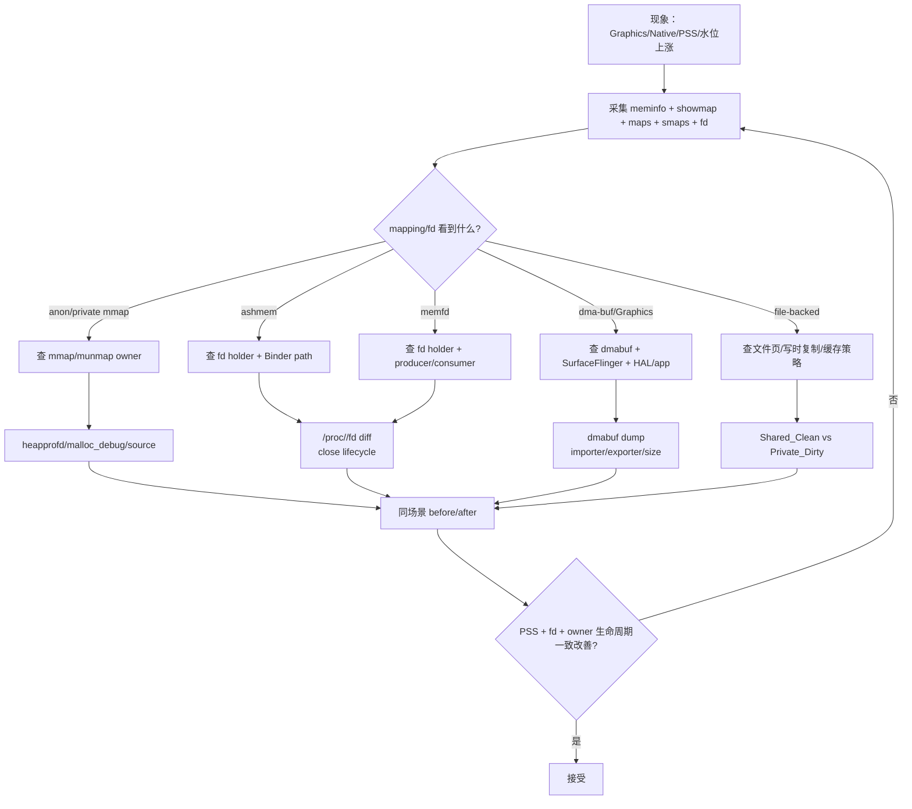
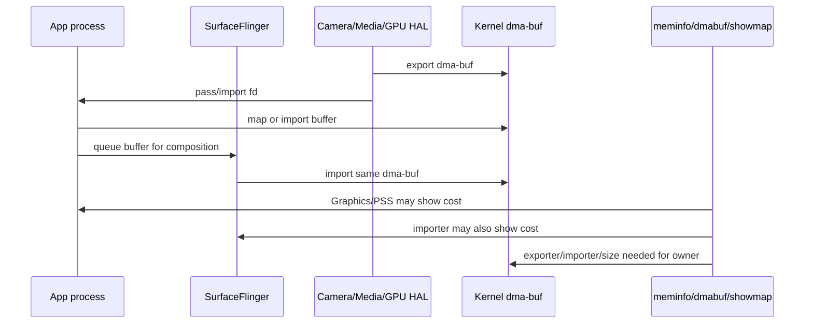

# Day 33：mmap、ashmem、memfd 与 dma-buf 的内存账单
> 系列第 33 篇。Day 32 讲 mapping 怎么读；今天专门拆共享/映射内存：`mmap` 决定地址空间怎么映射，ashmem/memfd 提供可共享匿名文件，dma-buf 常出现在图形、相机、视频等跨进程 buffer。重点：**映射者、持有 fd 的进程、生产者、消费者、最终 owner 可能不是同一个。**

---

## 一句话结论

- **file-backed mmap 更像“把文件页映射进来”，anonymous mmap 更像“申请一段匿名虚拟内存”。**
- **ashmem 和 memfd 都常用于跨进程共享匿名内存；Android 新系统更常看到 memfd 语义。**
- **dma-buf 是跨驱动/跨进程共享 buffer 的核心形态，常见于 Graphics、Camera、Media。**
- **`maps/showmap/smaps` 只能说明当前进程映射了什么；owner 还要看 fd、producer-consumer、SurfaceFlinger/dmabuf 工具和调用路径。**
- **PSS 会分摊共享页，不等于“谁应该负责释放”；责任判断要回到 buffer 生命周期。**

---

## 图 1：共享 buffer 账单结构



| 类型 | 常见入口 | 账单线索 | owner 证据 |
|---|---|---|---|
| file-backed mmap | model、asset、db、dex、so | pathname、Shared_Clean、PSS | 文件 owner、mapping 生命周期 |
| anonymous mmap | native large buffer、allocator arena | anon mapping、Private_Dirty | mmap/munmap 调用栈 |
| ashmem | legacy shared anonymous memory | `/dev/ashmem`、fd name | fd holder、Binder 传递、close |
| memfd | modern shared anonymous file | `memfd:*`、fd link | fd holder、seals、close |
| dma-buf | GraphicBuffer、HardwareBuffer、camera/video | Graphics、dmabuf dump、fd | exporter/importer、SurfaceFlinger、HAL |

---

## Day 32 反思落地：mapping name 不是 owner proof

| Day 32 留下的点 | Day 33 的可见变化 |
|---|---|
| ashmem/memfd/dma-buf 需要 owner 深化 | 增加 producer/consumer/fd/exporter 结构图 |
| mapping 名称只能缩小范围 | 增加“映射者 vs 责任 owner”矩阵 |
| 需要 shared/private/PSS 边界 | 增加 PSS、Private_Dirty、Shared_Clean、fd 生命周期对照 |
| 需要低端机水位证据链 | 增加 Graphics/dma-buf 与系统水位排查入口 |

---

## mmap：file-backed 和 anonymous 分开看

| 形态 | maps 线索 | smaps 重点 | 常见误判 |
|---|---|---|---|
| file-backed readonly | pathname + `r--p`/`r-xp` | `Shared_Clean`、PSS | 把共享代码页当私有泄漏 |
| file-backed writable | pathname + `rw-p`/`rw-s` | dirty/private/shared split | 忽略写时复制成本 |
| anonymous private | `[anon:*]`、无 pathname、`rw-p` | `Private_Dirty`、PSS | 只看 Size 不看 RSS/PSS |
| large mmap | 大地址段 | RSS/PSS 是否真的驻留 | 把预留地址空间当物理内存 |
| allocator mmap | `anon:libc_malloc`/Scudo 名称 | Native Heap + mapping delta | 把 allocator 保留页直接判泄漏 |

```bash
PID=$(adb shell pidof <package> | tr -d '\r')
adb shell cat /proc/$PID/maps | grep -E "anon|memfd|ashmem|dmabuf|\\.so|\\.dex|\\.oat|\\.db|model|asset"
adb shell cat /proc/$PID/smaps_rollup
adb shell showmap "$PID" | head -n 80
```

---

## 图 2：共享内存排障决策流



---

## ashmem vs memfd vs dma-buf

| 对比 | ashmem | memfd | dma-buf |
|---|---|---|---|
| 本质 | Android legacy 匿名共享内存 | Linux 匿名内存文件 fd | 跨设备/驱动共享 buffer |
| 常见场景 | Binder 共享块、旧组件 | 新系统共享匿名文件、IPC | 图形、相机、视频、HardwareBuffer |
| maps/fd 线索 | `/dev/ashmem`、ashmem name | `memfd:name` | fd 可能显示 dmabuf/anon inode，工具差异大 |
| 账单难点 | 多进程映射分摊 | fd 生命周期和映射分离 | exporter/importer 和实际释放责任分离 |
| owner 证据 | fd holder、Binder、close | fd holder、close、seals | dmabuf dump、SurfaceFlinger、HAL/app |

---

## 图 3：dma-buf producer-consumer 账单



| 问题 | 只看 app 会怎样 | 需要补什么 |
|---|---|---|
| App 没 release surface/buffer | Graphics 或 fd 增长 | lifecycle + fd diff + SurfaceFlinger |
| HAL/exporter 持有 | App 可能只是 importer | dmabuf exporter/importer |
| 多进程共享同一 buffer | PSS 被分摊 | 总 size + holder 列表 |
| Buffer cache 合理保留 | 退出后不立刻归零 | cache policy、trim、场景复跑 |
| fd 泄漏 | maps 可能不明显 | `/proc/<pid>/fd` before/after |

---

## 采集模板

```bash
PKG=com.example.app
OUT=shared-memory-$(date +%Y%m%d-%H%M%S)
mkdir -p "$OUT"

PID=$(adb shell pidof "$PKG" | tr -d '\r')
adb shell dumpsys meminfo "$PKG" > "$OUT/before-meminfo.txt"
adb shell showmap "$PID" > "$OUT/before-showmap.txt"
adb shell cat /proc/$PID/maps > "$OUT/before-maps.txt"
adb shell cat /proc/$PID/smaps > "$OUT/before-smaps.txt"
adb shell ls -l /proc/$PID/fd > "$OUT/before-fd.txt"
adb shell dumpsys SurfaceFlinger > "$OUT/before-surfaceflinger.txt"

# 设备支持时补充 dma-buf 视图，路径和权限随版本/ROM 变化。
adb shell cat /sys/kernel/debug/dma_buf/bufinfo > "$OUT/before-dmabuf-bufinfo.txt"

# 场景退出后复采同一组。
adb shell dumpsys meminfo "$PKG" > "$OUT/after-meminfo.txt"
adb shell showmap "$PID" > "$OUT/after-showmap.txt"
adb shell cat /proc/$PID/maps > "$OUT/after-maps.txt"
adb shell cat /proc/$PID/smaps > "$OUT/after-smaps.txt"
adb shell ls -l /proc/$PID/fd > "$OUT/after-fd.txt"
adb shell dumpsys SurfaceFlinger > "$OUT/after-surfaceflinger.txt"
adb shell cat /sys/kernel/debug/dma_buf/bufinfo > "$OUT/after-dmabuf-bufinfo.txt"
```

### 源码/工程搜索入口

```bash
# App/NDK owner
rg -n "mmap|munmap|memfd_create|ashmem|ASharedMemory|AHardwareBuffer|GraphicBuffer|HardwareBuffer|ImageReader|Surface|SurfaceTexture|MediaCodec|Camera|close\\(|release\\(" app src .

# Android shared memory / graphics / native paths
rg -n "ashmem|memfd|ASharedMemory|dma_buf|dmabuf|GraphicBuffer|HardwareBuffer|gralloc|SurfaceFlinger" frameworks native system hardware

# fd/resource 生命周期
rg -n "ParcelFileDescriptor|FileDescriptor|dup\\(|close\\(|release\\(|onDestroy|onStop|onTrimMemory" app src .
```

---

## 组合判断矩阵

| 现象 | 更可能问题 | 需要证据 |
|---|---|---|
| `memfd` fd 数随场景线性增长 | fd/resource leak | fd diff + close path |
| ashmem mapping PSS 高 | 共享内存保留 | fd holder + producer/consumer |
| Graphics 高但 Java Heap 稳定 | native/graphics buffer | dmabuf + SurfaceFlinger + lifecycle |
| RSS 高但 PSS 分摊小 | 多进程共享页 | procrank + smaps shared fields |
| Private_Dirty 高 | 私有写入或匿名 buffer | owner stack / mmap path |
| file-backed Shared_Clean 高 | 共享文件页/cache | 不按私有泄漏处理 |
| process 退出后系统水位不降 | producer/HAL/system owner | system-wide dmabuf/procrank |

---

## 边界和 blocker

- ashmem、memfd、dma-buf 的可见名称、debugfs 路径和读取权限随 Android 版本、内核配置、SELinux、user/userdebug 和厂商 ROM 变化。
- PSS 是成本分摊，不是释放责任；释放责任要看 fd 生命周期、producer-consumer、exporter/importer 和业务 owner。
- dma-buf 常常不能只靠 app 进程 `maps` 判断，需要系统级 dmabuf、SurfaceFlinger、HAL 和场景生命周期证据。
- 本次仍无法读取 GitHub Issues：`gh issue list --repo hello-he/android-memory-expert --state open --limit 50 --json number,title,body,url` 提示需要 `gh auth login` 或 `GH_TOKEN`。

---

## 今日检查清单

- [ ] 同场景采集 `meminfo`、`showmap`、`maps`、`smaps`、`fd`、SurfaceFlinger、可用的 dmabuf 视图。
- [ ] 区分 file-backed mmap、anonymous mmap、ashmem、memfd、dma-buf。
- [ ] 不用 `Size` 判断物理压力，优先看 PSS、Private_Dirty、Shared_Clean、SwapPss。
- [ ] 对 ashmem/memfd 做 fd before/after diff，并找到 close/release 生命周期。
- [ ] 对 dma-buf 同时看 app、SurfaceFlinger、HAL/exporter/importer，而不只看 app mapping。
- [ ] 修复后复跑同场景，确认 PSS、fd、buffer owner 和生命周期证据一致改善。
