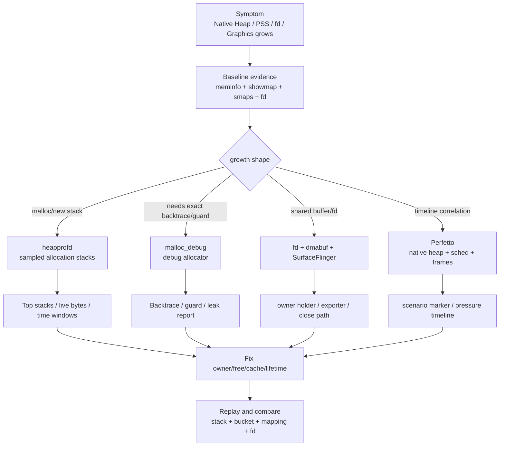
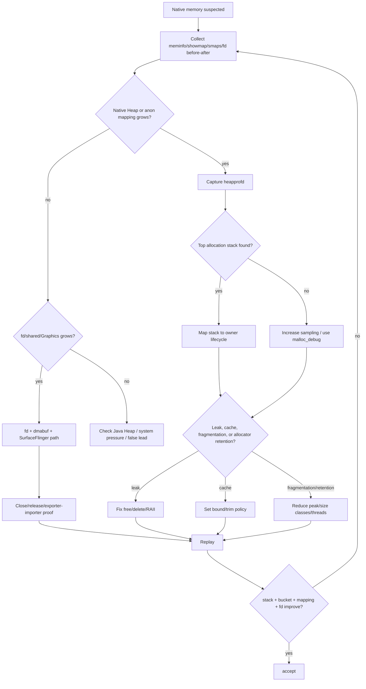
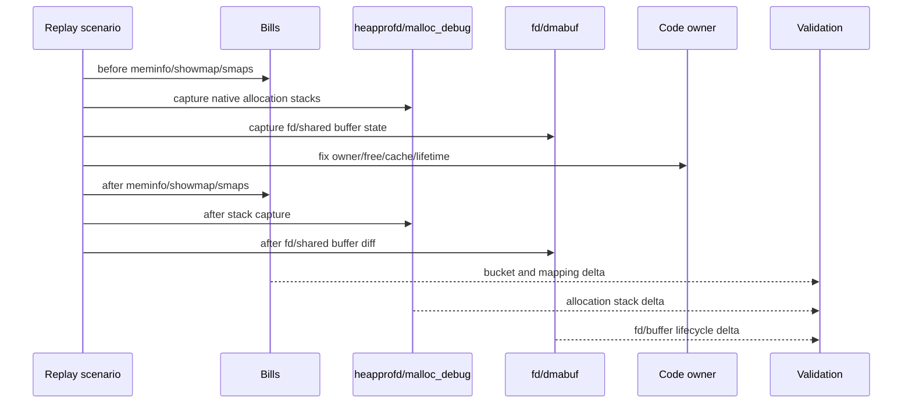

# Day 34：Native 内存泄漏工具链：heapprofd、malloc_debug、Perfetto
> 系列第 34 篇。Day 33 讲共享 buffer 的 owner proof；今天把 native 泄漏工具链串起来：`heapprofd` 找 native allocation stack，`malloc_debug` 做强诊断，Perfetto 对齐时间线，`meminfo/showmap/smaps/fd` 证明账单和 owner 是否一起改善。

---

## 一句话结论

- **heapprofd 适合低开销采样和时间线分析，先回答“哪条 native 栈在涨”。**
- **malloc_debug 适合强诊断和 backtrace/guard 场景，但开销高，不能代表线上性能。**
- **Perfetto 把 native allocation、RSS/PSS、GC、frame、线程和系统压力放到同一时间线。**
- **`meminfo/showmap/smaps/fd` 是账单证据；allocation stack 是 owner 证据；两者必须闭环。**
- **native 泄漏修复验收不能只看 free 代码存在，要看同场景 replay 后 stack、bucket、mapping、fd 一起回落或受控。**

---

## 图 1：Native leak 工具链结构



| 工具 | 最适合回答 | 不适合单独回答 |
|---|---|---|
| heapprofd | 哪条 native allocation stack 在时间窗内贡献增长 | 所有小分配的精确完整列表 |
| malloc_debug | 强诊断、backtrace、guard、特定进程复现 | 线上低开销长期监控 |
| Perfetto | 分配增长与交互、线程、帧、GC、系统压力的时间关系 | owner 生命周期语义 |
| `dumpsys meminfo` | Native Heap/Graphics/Objects bucket 是否涨 | 哪条 native 栈负责 |
| `showmap/smaps` | 增长在哪类 mapping | C++ owner 是谁 |
| `/proc/<pid>/fd` | fd/ashmem/memfd/dma-buf 是否泄漏 | malloc 栈 |

---

## Day 33 反思落地：账单和 owner 必须合并

| Day 33 留下的点 | Day 34 的可见变化 |
|---|---|
| PSS 不是释放责任 | 增加 bucket/mapping/fd 与 allocation stack 的闭环 |
| shared buffer 要看 producer/consumer | 将 fd/dmabuf 分支放入 native leak 流程 |
| 需要工具联动 | 用 heapprofd、malloc_debug、Perfetto、meminfo、showmap、smaps 组合矩阵 |
| 需要 before/after | 增加同场景 replay 验收表 |

---

## 选择工具：先轻后重

| 现象 | 首选 | 加码条件 | 加码工具 |
|---|---|---|---|
| Native Heap 缓慢上涨 | heapprofd | 栈不稳定或采样不够 | malloc_debug |
| 场景窗口内 native spike | Perfetto + heapprofd | 需要准确 backtrace | malloc_debug |
| fd/ashmem/memfd 增长 | fd diff + maps | 涉及 graphics/media | dmabuf/SurfaceFlinger |
| crash 或内存破坏 | tombstone | 怀疑越界/UAF | ASan/HWASan/GWP-ASan 后续专题 |
| Native Heap 不降但 live stack 少 | showmap/smaps | 怀疑碎片/cache | allocator/缓存策略复核 |

---

## 图 2：排障决策流



---

## heapprofd 读法

| 视图 | 看什么 | 判断 |
|---|---|---|
| allocation stack | top stack、library、symbol | owner 候选 |
| live bytes over time | 场景退出后是否回落 | 泄漏 vs 峰值 |
| sampled allocations | 分配频率和大小 | 热点和采样偏差 |
| process/thread | 哪个进程/线程分配 | 生命周期边界 |
| time correlation | 分配与页面、输入、滚动、媒体事件 | 复现窗口 |

```bash
# 实际 config 需按 Android 版本、包名、sampling interval 调整。
adb shell perfetto -c /data/misc/perfetto-configs/heapprofd.pbtxt -o /data/misc/perfetto-traces/native-leak.pftrace
adb pull /data/misc/perfetto-traces/native-leak.pftrace .

# 配套账单快照
adb shell dumpsys meminfo <package>
PID=$(adb shell pidof <package> | tr -d '\r')
adb shell showmap "$PID"
adb shell cat /proc/$PID/smaps_rollup
```

---

## malloc_debug 读法

| 能力 | 价值 | 风险 |
|---|---|---|
| allocation backtrace | 更直接定位分配点 | 开销高 |
| guard/fill | 发现越界/释放后使用线索 | 改变内存布局 |
| leak report | 复现结束时输出未释放块 | 依赖配置和退出路径 |
| target process | 针对性强 | user build/权限/属性限制 |

```bash
# 具体属性和包装方式随系统版本变化，需先查目标设备支持。
adb shell getprop | grep malloc
adb shell setprop libc.debug.malloc.options backtrace
adb shell setprop libc.debug.malloc.program <process-name>
adb shell stop
adb shell start

adb logcat -v time | grep -E "malloc_debug|libc|leak|backtrace"
```

---

## 图 3：before/after 验收链



| 验收项 | 接受条件 |
|---|---|
| heapprofd top stack | 场景退出后 live bytes 不再线性增长 |
| malloc_debug leak report | 目标泄漏 backtrace 消失 |
| Native Heap bucket | 同场景后 baseline 下降或 bounded |
| showmap/smaps | 对应 mapping PSS/Private_Dirty delta 下降 |
| fd/dmabuf | holder/exporter/importer 生命周期正常 |
| 产品场景 | 无新 crash、卡顿、缓存命中率回退 |

---

## 源码/工程搜索入口

```bash
# App native owner
rg -n "malloc|calloc|realloc|free|new |delete |mmap|munmap|close\\(|release\\(|destroy\\(|shared_ptr|unique_ptr|DirectByteBuffer|AHardwareBuffer" app src .

# heapprofd / malloc_debug / Perfetto / bionic
rg -n "heapprofd|malloc_debug|MallocDebug|malloc_info|mallinfo|Perfetto|NativeHeap|Scudo|jemalloc" bionic system external frameworks

# fd/shared buffer branch from Day 33
rg -n "memfd|ashmem|ASharedMemory|dma_buf|dmabuf|GraphicBuffer|HardwareBuffer|SurfaceFlinger" frameworks native system hardware
```

---

## 边界和 blocker

- heapprofd 采样和配置会影响结果；没有看到某个栈不等于它不存在。
- malloc_debug 会改变性能和内存布局，适合复现诊断，不适合当线上常态指标。
- fd/dma-buf/shared buffer 泄漏可能不出现在 malloc 栈里，要沿 Day 33 的 owner-proof 分支查。
- 本次仍无法读取 GitHub Issues：`gh issue list --repo hello-he/android-memory-expert --state open --limit 50 --json number,title,body,url` 提示需要 `gh auth login` 或 `GH_TOKEN`。

---

## 今日检查清单

- [ ] 先采集 before/after `meminfo`、`showmap`、`smaps_rollup`、`fd`。
- [ ] Native Heap/anon 增长优先用 heapprofd 找 top allocation stack。
- [ ] heapprofd 不足以定位时，再用 malloc_debug 做强诊断。
- [ ] shared buffer/fd/Graphics 增长沿 fd、dmabuf、SurfaceFlinger 分支查 owner。
- [ ] 将问题分成泄漏、cache、碎片、allocator retention，再决定修法。
- [ ] 修复后同场景复采，确认 stack、bucket、mapping、fd 同时改善。
