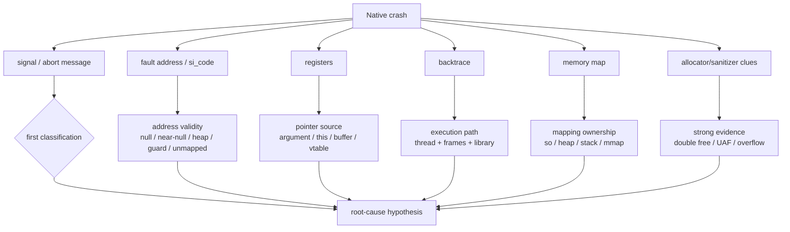
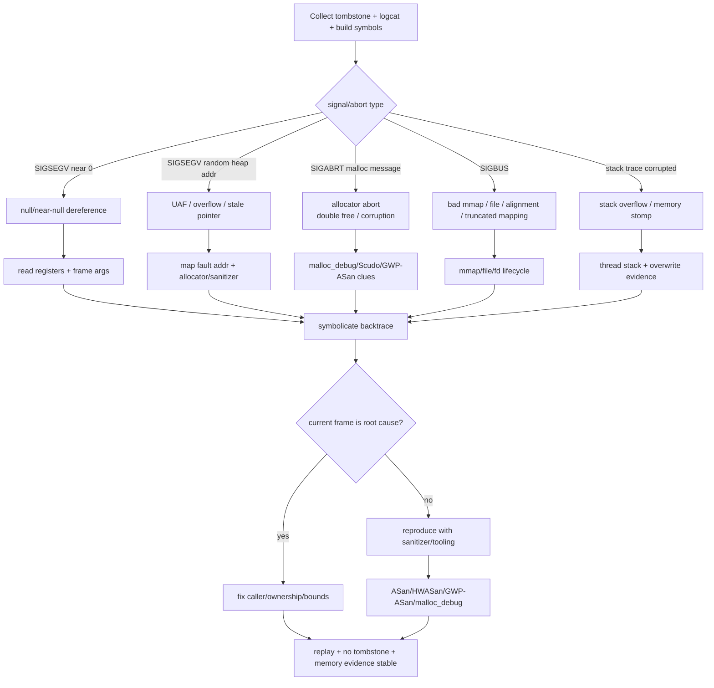
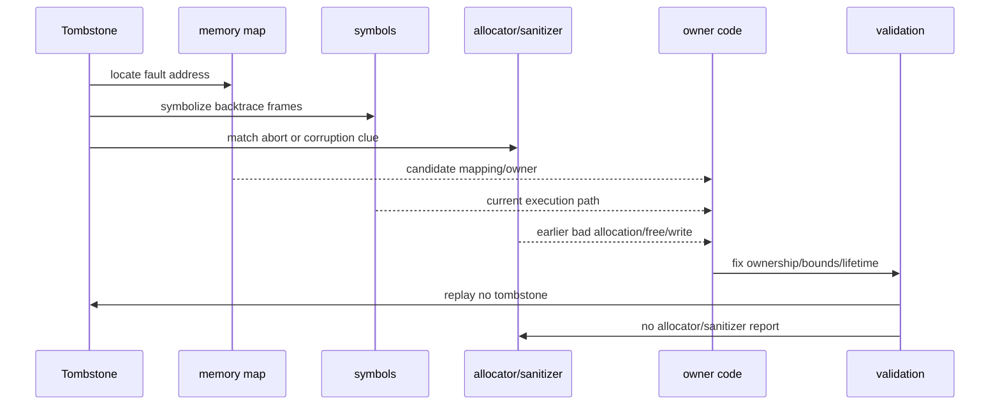

# Day 35：Native Crash 与 tombstone：从 signal 到 backtrace
> 系列第 35 篇。Day 34 讲 native 泄漏工具链；今天看问题已经变成 crash 时怎么读证据。tombstone 的价值不是“看到 backtrace 就修”，而是把 signal、fault address、registers、memory map、allocator/sanitizer 线索和代码 owner 串起来。

---

## 一句话结论

- **signal/abort reason 先判断 crash 类型：空指针、权限错误、abort、UAF、double free、越界、栈破坏。**
- **fault address 要和 registers、memory map、backtrace 一起读，单独地址没有结论。**
- **backtrace 是执行路径，不一定是根因 owner；内存破坏经常在更早的位置发生。**
- **memory map 能判断 fault address 是否落在 heap、stack、so、mmap、guard、freed/quarantine 附近。**
- **allocator/sanitizer 证据比裸 tombstone 更强：malloc_debug、Scudo、GWP-ASan、ASan/HWASan 后续要联动。**

---

## 图 1：tombstone 证据结构



| Tombstone 区块 | 主要回答 | 不能单独回答 |
|---|---|---|
| signal / code | 崩溃类别入口 | 谁破坏了内存 |
| abort message | libc/allocator/业务主动 abort 原因 | 所有上下文 |
| fault addr | 访问了哪个地址 | 地址为何无效 |
| registers | 哪个寄存器携带可疑指针 | 指针何时被写坏 |
| backtrace | 当前执行路径 | 早期写坏点 |
| memory map | 地址属于哪个 mapping | C++ owner 生命周期 |
| logcat | crash 前事件 | 精确内存 owner |

---

## Day 34 反思落地：crash 也要保留 owner-proof 边界

| Day 34 留下的点 | Day 35 的可见变化 |
|---|---|
| heapprofd/malloc_debug 证明 allocation owner | tombstone 中加入 allocator/sanitizer evidence 分支 |
| shared/fd 问题不一定在 malloc 栈 | memory map 和 fd/lifecycle 仍作为反证路径 |
| leak/cache/fragmentation 要分开 | crash 分类改为 null/UAF/double free/overflow/abort/stack |
| 需要时间线和场景 | 增加 crash 前后 logcat、symbols、复现矩阵 |

---

## 图 2：Native crash 排障决策流



---

## signal 速查

| Signal | 常见含义 | 优先证据 |
|---|---|---|
| `SIGSEGV` | 无效内存访问 | fault addr、registers、maps、backtrace |
| `SIGABRT` | 主动 abort | abort message、allocator/libc log |
| `SIGBUS` | mmap/file/alignment/bus error | mapping、file/fd 生命周期 |
| `SIGILL` | 非法指令 | ABI、代码破坏、跳转地址 |
| `SIGFPE` | 算术异常 | 当前 frame 参数 |
| stack overflow | 栈耗尽或递归 | thread stack、guard、backtrace 形态 |

| fault address 形态 | 倾向判断 | 下一步 |
|---|---|---|
| `0x0` 或很小 | null/near-null | 查寄存器来源和空值路径 |
| 像 heap 地址 | UAF/overflow/stale pointer | maps + sanitizer |
| 落在 unmapped | 已释放或非法地址 | allocator evidence |
| 落在 guard page | 越界/栈溢出 | bounds + stack |
| 落在 `.so` text | 函数指针/vtable/代码跳转错误 | symbols + CFI/ABI |

---

## 图 3：从 tombstone 回到内存 owner



| 结论 | 必备证据 |
|---|---|
| 空指针 | near-null fault + register/caller path |
| UAF | stale heap addr + allocator/sanitizer/free history |
| double free | allocator abort message + same pointer free path |
| overflow | guard/sanitizer/write site + buffer bound |
| bad mmap | SIGBUS + file/fd/mapping lifecycle |
| stack overflow | recursive/deep backtrace + stack mapping/guard |

---

## 采集和符号化模板

```bash
PKG=com.example.app
OUT=native-crash-$(date +%Y%m%d-%H%M%S)
mkdir -p "$OUT"

adb logcat -d -v threadtime > "$OUT/logcat.txt"
adb shell ls -lt /data/tombstones | head
adb root
adb pull /data/tombstones "$OUT/tombstones"

PID=$(adb shell pidof "$PKG" | tr -d '\r')
adb shell cat /proc/$PID/maps > "$OUT/live-maps.txt"
adb shell dumpsys meminfo "$PKG" > "$OUT/live-meminfo.txt"

# 符号化路径依赖本地 unstripped symbols 和 NDK/Android build 环境。
ndk-stack -sym <unstripped-symbol-dir> -dump "$OUT/logcat.txt"
```

### 源码/工程搜索入口

```bash
# crash 高风险 native 代码
rg -n "memcpy|memmove|strcpy|sprintf|reinterpret_cast|static_cast|delete |free\\(|mmap|munmap|close\\(|abort\\(|CHECK|LOG_FATAL|DirectByteBuffer|GetDirectBufferAddress" app src .

# allocator/sanitizer/tombstone 入口
rg -n "tombstone|debuggerd|crash_dump|malloc_debug|Scudo|GWP-ASan|HWASan|ASan|signal|backtrace" system bionic external
```

---

## 边界和 blocker

- 当前 backtrace 不一定是写坏内存的位置；UAF/overflow 常需要 sanitizer 或 malloc_debug 找更早的写/释放点。
- tombstone 的字段和可读性依赖 Android 版本、符号、strip 状态、ABI、ROM 和权限。
- 没有 unstripped symbols 时，只能得到粗粒度库/偏移，不能可靠定位源码行。
- 本次仍无法读取 GitHub Issues：`gh issue list --repo hello-he/android-memory-expert --state open --limit 50 --json number,title,body,url` 提示需要 `gh auth login` 或 `GH_TOKEN`。

---

## 今日检查清单

- [ ] 保存 tombstone、logcat、构建号、ABI、symbols 目录和复现步骤。
- [ ] 先按 signal/abort message 分类，不直接从 backtrace 下结论。
- [ ] 用 fault address + registers + memory map 判断地址归属。
- [ ] 对 SIGABRT/malloc 错误补 malloc_debug、Scudo、GWP-ASan 或 sanitizer 证据。
- [ ] 对疑似 UAF/overflow 追更早的写坏点，而不只修当前崩溃帧。
- [ ] 修复后复跑，确认无 tombstone、无 sanitizer 报告，相关内存账单稳定。
