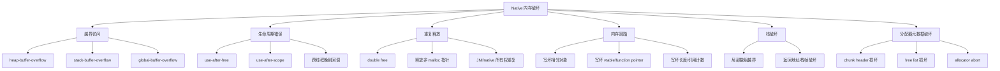
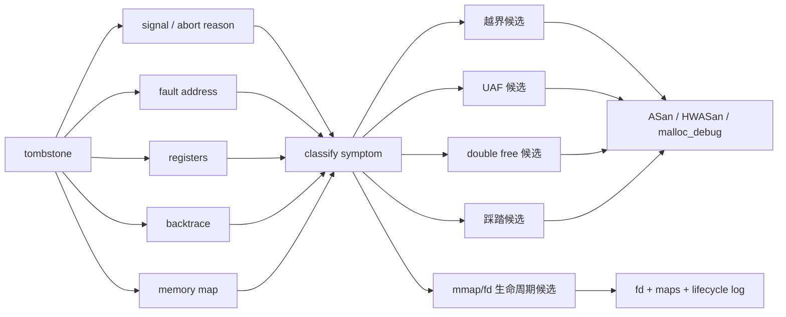
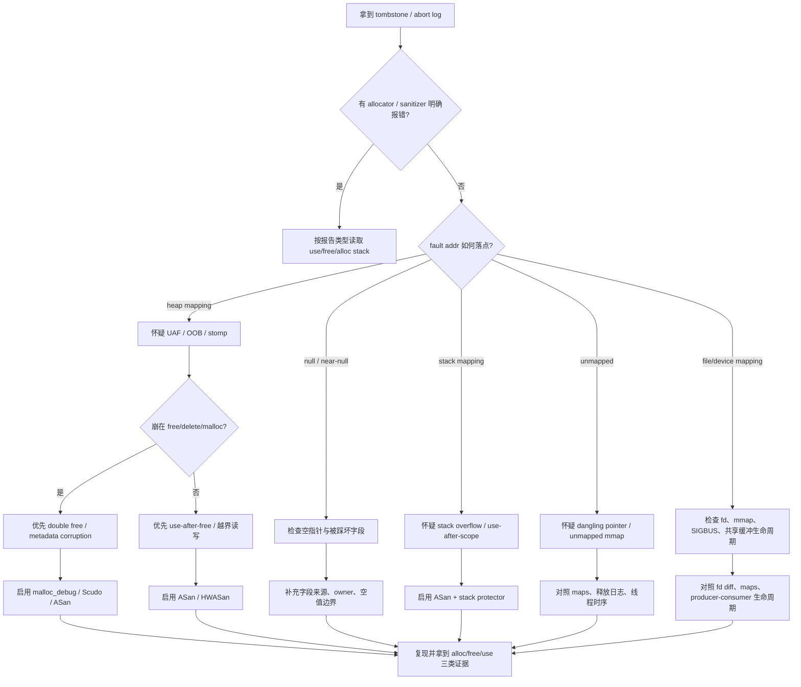
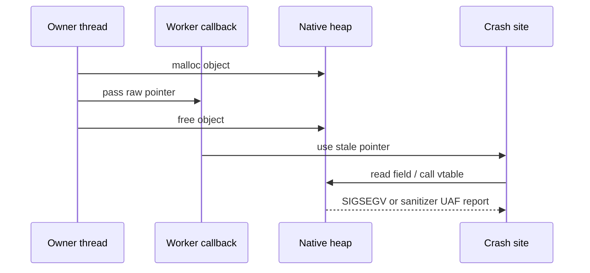
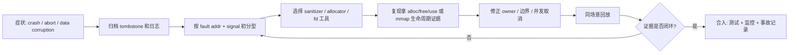

# Day 36: 内存越界、内存踩踏、UAF 与 double free 问题模型

> 目标：把 Day 35 的 tombstone 证据继续向前推进。今天不只看“在哪里崩”，而是判断“哪一种内存破坏模型最可能发生、还缺哪类证据、下一步用什么工具确认”。

---

## 1. 一张图先分类

Native 内存错误的难点是：**崩溃点经常不是破坏点**。



| 类型 | 最常见根因 | 常见崩溃位置 | tombstone 可信度 | 需要补强证据 |
|---|---|---|---|---|
| heap 越界写 | `memcpy` 长度错误、数组下标错误 | 后续 `free`、相邻对象访问、随机线程 | 中 | ASan/HWASan/malloc_debug guard |
| heap 越界读 | 长度计算错误、协议解析错误 | 读指令当前行 | 中高 | fault addr + maps + sanitizer |
| UAF | owner 释放后仍有回调/线程使用 | stale pointer 解引用、虚函数调用 | 中 | free stack + use stack |
| double free | 所有权不清、错误 cleanup 路径 | `free/delete` 或 allocator abort | 高 | allocator abort + free stack |
| 内存踩踏 | 写坏相邻结构但不立刻崩 | 任意位置 | 低 | sanitizer、watchpoint、最小复现 |
| 栈破坏 | 栈数组越界、变长 buffer | 函数返回、异常 backtrace | 低中 | stack protector、ASan、反汇编 |
| allocator metadata | 越界写到 chunk header | `malloc/free/realloc` | 中 | Scudo/malloc_debug/ASan |

---

## 2. Day 35 证据怎么继续用

Day 35 建立了 `signal -> fault address -> registers -> backtrace -> maps -> allocator/sanitizer evidence` 的 tombstone 读法。Day 36 把它转成判定矩阵。

| Day 35 线索 | 今天的解释方式 | 下一步 |
|---|---|---|
| `SIGSEGV` + `fault addr 0x0` | 可能是 null dereference，也可能是被踩坏的指针归零 | 先看寄存器来源和最近 owner |
| `SIGSEGV` + heap 区地址 | UAF、越界、对象内部字段损坏 | ASan/HWASan 或 malloc_debug |
| `SIGABRT` + allocator message | double free、invalid free、heap corruption | 保留 abort message 和 allocator 日志 |
| backtrace 停在 `free/delete` | 释放路径暴露问题，不一定是第一次错误 | 找 previous free 或越界写 |
| fault addr 不在 maps | dangling pointer、已解除映射、坏偏移 | 对照 maps、fd、mmap 生命周期 |
| backtrace 源码行只是普通访问 | 访问点可能无辜 | 找对象创建、释放、跨线程转移路径 |



---

## 3. 排障决策流



---

## 4. 四类高频模型

### 4.1 Heap out-of-bounds

```cpp
void bad_copy(const uint8_t* src, size_t len) {
    auto* dst = static_cast<uint8_t*>(malloc(128));
    memcpy(dst, src, len); // len > 128 时写坏相邻 chunk
    free(dst);
}
```

| 观察点 | 越界读 | 越界写 |
|---|---|---|
| 当前崩溃点 | 通常更接近错误访问 | 可能延迟到后续代码 |
| fault addr | 可能在对象尾部附近 | 可能完全不在出错行 |
| 后续症状 | `SIGSEGV`、`SIGBUS` | allocator abort、随机崩溃、数据异常 |
| 优先工具 | ASan/HWASan | ASan/HWASan/malloc_debug guard |
| 修复重点 | 长度、边界、解析状态机 | 容量、写入上限、结构所有权 |

**工程边界：** tombstone 只说明最后一次非法访问或 abort；越界写的根因经常早于崩溃数百毫秒甚至数分钟。

### 4.2 Use-after-free



| UAF 线索 | 解释 | 证据需求 |
|---|---|---|
| crash in virtual call | vtable 指针可能来自已释放对象 | use stack + free stack |
| crash in worker thread | owner 生命周期跨线程 | 线程移交和取消路径 |
| address 曾在 heap | maps 当前可能仍覆盖该地址 | allocator quarantine/sanitizer |
| crash 不稳定 | freed chunk 被复用时表现变化 | 多次复现和最小化 |

修复模式：

| 场景 | 不稳定写法 | 更稳妥写法 |
|---|---|---|
| 回调持有 raw pointer | worker 保存裸指针 | owner 取消回调或传递 `shared_ptr/weak_ptr` 语义 |
| JNI 保存 native handle | Java 生命周期结束但 native 仍被用 | `close()/release()` 幂等化并切断回调 |
| 异步任务 | destroy 后任务仍运行 | scope-bound task、token cancel、join |
| C API owner 不明 | 多处都调用 `free` | 单 owner，转移后置空，析构集中 |

### 4.3 Double free / invalid free

```cpp
void cleanup(Buffer* b) {
    if (!b) return;
    free(b->data);
    free(b->data); // double free
    free(b);
}
```

| 日志/崩溃 | 更可能的模型 | 下一步 |
|---|---|---|
| `double free` / `invalid pointer` | 重复释放或非 malloc 指针释放 | 搜索所有 release 路径 |
| `corrupted size` / allocator abort | 越界写破坏 metadata | 用 ASan/malloc_debug 找第一次写 |
| `free(): invalid address` | 指针偏移后释放 | 检查 pointer arithmetic |
| `SIGABRT` in Scudo | Scudo 检测到 allocator 约束破坏 | 保存完整 abort message |

Source search：

```bash
rg -n "free\\(|delete |Release|destroy|close\\(" app/src/main cpp src
rg -n "std::move|unique_ptr|shared_ptr|weak_ptr|nativeHandle|nativePtr" app/src/main cpp src
rg -n "malloc\\(|calloc\\(|realloc\\(|new\\[|new " app/src/main cpp src
```

### 4.4 Memory stomping

踩踏不是一个单独 API 错误，而是一类结果：A 写坏 B，B 在另一个地方崩。

| 被踩坏对象 | 崩溃表现 | 工具优先级 |
|---|---|---|
| 长度字段 | 之后循环越界 | ASan/HWASan |
| vtable / function pointer | 间接调用跳到异常地址 | HWASan/ASan + 符号 |
| ref count | 提前释放或永不释放 | 生命周期日志 + sanitizer |
| allocator header | `free/malloc` abort | malloc_debug/Scudo/ASan |
| mmap 管理结构 | SIGBUS/SIGSEGV | maps + fd + lifecycle log |

---

## 5. 工具证据矩阵

| 工具 | 最擅长 | 输出重点 | 代价/边界 |
|---|---|---|---|
| ASan | heap/stack/global OOB、UAF、double free | alloc/free/use stack、redzone、shadow memory | 需要特殊构建，开销较高 |
| HWASan | UAF/OOB，尤其 64-bit Android | tag mismatch、access stack、allocation stack | 需要硬件/系统/构建支持 |
| GWP-ASan | 低开销抽样 UAF/OOB | sampled allocation crash report | 不是每次都命中 |
| Scudo | allocator hardening、invalid free、metadata corruption | abort reason、allocator check | 不总能指出第一次写坏位置 |
| malloc_debug | exact allocation backtrace、guard、fill | backtrace、guard violation | 开销大，适合小范围复现 |
| tombstone | 最终崩溃现场 | signal、fault addr、register、backtrace、maps | 常常不是根因现场 |
| Perfetto/heapprofd | 时间线和分配增长 | allocation stack、线程、场景 | 对瞬时踩踏不一定直接有效 |

---

## 6. 从症状到修复的闭环



| 闭环节点 | 必须留下的证据 |
|---|---|
| 初分型 | 原始 tombstone、logcat、构建号、ABI、符号版本 |
| 工具复现 | ASan/HWASan/GWP-ASan/malloc_debug/Scudo 原始报告 |
| 所有权判断 | alloc stack、free stack、use stack、线程/回调时序 |
| 修复 | 边界检查、owner 转移、幂等 release、取消异步任务 |
| 验证 | 同场景无 crash、无 sanitizer 报告、相关内存账单稳定 |

---

## 7. 采集命令模板

```bash
adb logcat -b crash -b main -b system -d > crash-logcat.txt
adb shell ls -t /data/tombstones
adb pull /data/tombstones/tombstone_XX .
ndk-stack -sym app/build/intermediates/cxx/RelWithDebInfo/<abi>/obj -dump tombstone_XX
```

```bash
adb shell run-as <package> ls files
adb shell cat /proc/<pid>/maps > maps.txt
adb shell cat /proc/<pid>/smaps_rollup > smaps_rollup.txt
adb shell dumpsys meminfo <package> > meminfo.txt
```

Build/source 检查：

```bash
rg -n "memcpy|memmove|strcpy|strncpy|sprintf|snprintf|operator\\[\\]|data\\(\\)" .
rg -n "free\\(|delete |delete\\[\\]|release\\(|close\\(|destroy\\(" .
rg -n "pthread_create|std::thread|detach\\(|post\\(|callback|nativePtr|nativeHandle" .
rg -n "mmap\\(|munmap\\(|ASharedMemory|AHardwareBuffer|dup\\(|close\\(" .
```

---

## 8. 修复策略速查

| 模型 | 首选修复 | 必须避免 |
|---|---|---|
| OOB read/write | 用容量驱动写入，集中校验长度 | 只在调用点零散补 `if` |
| UAF | 明确 owner，取消异步引用，使用 RAII | “free 后置空”但其他线程仍持有副本 |
| double free | 单一释放路径，release 幂等化 | 多层 cleanup 都释放同一资源 |
| memory stomping | 找第一次写坏点，缩小复现窗口 | 只修最后崩溃行 |
| stack corruption | 限制栈大对象，边界检查 | 在栈上放不可控长度 buffer |
| mmap/fd lifetime | owner 负责 `munmap/close`，消费者不越权 | fd 复制后无人记录 owner |

---

## 今日检查清单

- [ ] 已保存原始 tombstone、完整 logcat、构建号、ABI、符号目录。
- [ ] 已用 fault address 对照 maps，区分 null、heap、stack、mmap、unmapped、file/device mapping。
- [ ] 已判断当前 backtrace 是“访问点/释放点/allocator 检测点”，没有直接当成根因。
- [ ] 已为 OOB/UAF/double free/踩踏分别列出最可能证据和下一步工具。
- [ ] 已尝试用 ASan、HWASan、GWP-ASan、Scudo 或 malloc_debug 获取更早的 alloc/free/use 证据。
- [ ] 已搜索 `memcpy/free/delete/release/callback/nativePtr/mmap/close` 等高风险代码路径。
- [ ] 已检查跨线程、JNI handle、回调、fd/mmap 的 owner 转移和取消路径。
- [ ] 已用同一场景回放验证：无 crash、无 sanitizer/allocator 报告、内存账单不继续异常增长。

---

## 9. 今天的结论

内存破坏分析的核心不是给 tombstone 起名字，而是建立证据闭环：

| 问题 | 正确追问 |
|---|---|
| 崩在这里 | 谁第一次写坏或释放了这块内存？ |
| 地址非法 | 这个地址曾经属于 heap、stack、mmap 还是 fd-backed buffer？ |
| allocator abort | 是 double free，还是更早的越界写破坏了 metadata？ |
| 修了不崩 | sanitizer/allocator 报告和内存账单是否也消失？ |

Day 37 将进入 ASan：用 redzone、shadow memory、alloc/free/use stack 把今天的模型变成可复现、可定位、可验收的 Native 内存错误报告。
