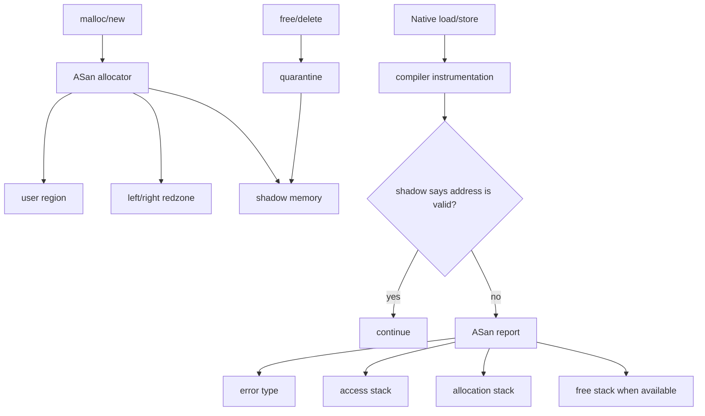
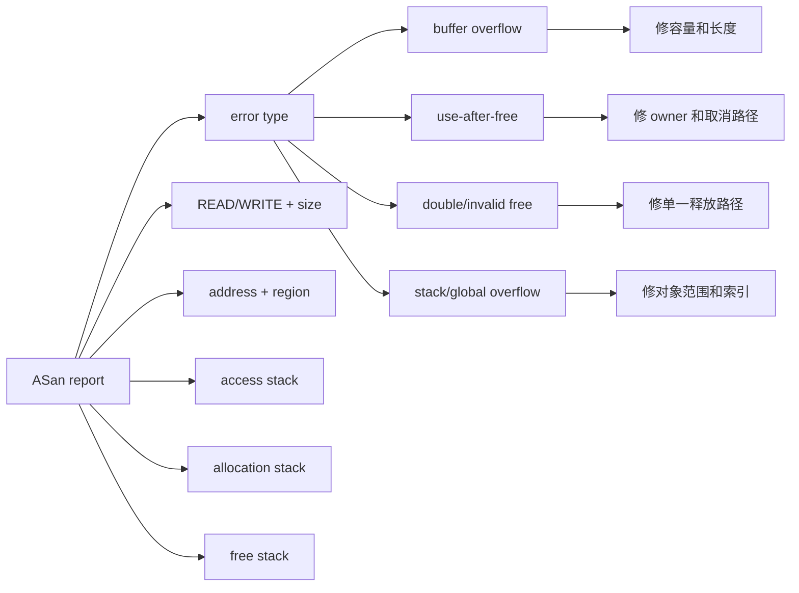
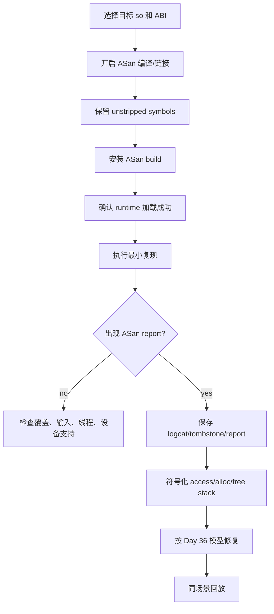
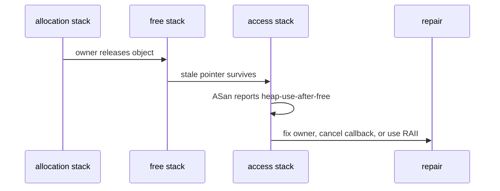

# Day 37: ASan 检测 Native 内存错误：构建、运行与报告解读

> 目标：把 Day 36 的 OOB/UAF/double free 模型落到 ASan 报告。ASan 的价值不是让程序崩得更早，而是把错误改写成可定位的 `access stack + allocation stack + free stack + redzone` 证据。

---

## 1. ASan 运行结构



| 组件 | 回答的问题 | 对 Day 36 的价值 |
|---|---|---|
| load/store 插桩 | 哪一行非法访问 | 找 use site |
| ASan allocator | 谁分配这块内存 | 找 alloc owner |
| redzone | 是否越过对象边界 | 确认 OOB |
| shadow memory | 地址当前是否可访问 | 把非法访问转成报告 |
| quarantine | free 后延迟复用 | 提高 UAF 命中率 |
| symbolizer | 地址转源码行 | 让报告可修 |

---

## 2. 报告字段映射 Day 36 模型



| ASan 文案 | 错误模型 | 必看字段 | 修复方向 |
|---|---|---|---|
| `heap-buffer-overflow` | heap 越界 | access addr、region、redzone offset、alloc stack | 长度和容量一致 |
| `stack-buffer-overflow` | 栈越界 | frame object、offset | 减少栈 buffer，校验索引 |
| `global-buffer-overflow` | 全局表越界 | global symbol、module | 表大小和索引约束 |
| `heap-use-after-free` | UAF | access stack、free stack、alloc stack | owner/cancel/RAII |
| `double-free` | 重复释放 | first free、second free | 幂等 release，单 owner |
| `bad-free` / invalid free | 释放非法地址 | pointer offset、valid region | 不释放偏移/栈/外部内存 |

---

## 3. Android 接入检查



| 层级 | 检查点 | 证据 |
|---|---|---|
| Native build | 目标 so 是否真的插桩 | build log、`readelf`、符号目录 |
| Packaging | ASan runtime 是否可加载 | APK/lib、logcat |
| Device/runtime | ROM 是否允许 sanitizer runtime | 启动日志、崩溃前日志 |
| Symbolization | unstripped so 是否匹配 | build id、符号路径 |
| Repro | 输入、ABI、线程是否一致 | 复现步骤和原始日志 |

---

## 4. 报告阅读顺序

| 顺序 | 看什么 | 目的 |
|---|---|---|
| 1 | error type | 先定 OOB/UAF/free 模型 |
| 2 | READ/WRITE 和 size | 判断读写方向和访问宽度 |
| 3 | access stack | 找非法访问点 |
| 4 | allocation stack | 找容量和 owner |
| 5 | free stack | 判断 UAF/double free |
| 6 | shadow bytes | 看 redzone/freed 状态 |
| 7 | symbols/build id | 防止源码版本错配 |



---

## 5. 命令模板

命令需要按项目构建系统微调；这里固定证据链。

```bash
./gradlew :app:assembleAsanDebug
adb install -r app/build/outputs/apk/asan/debug/app-asan-debug.apk
adb logcat -c
adb shell am force-stop <package>
adb shell am start -n <package>/<activity>
adb logcat -b crash -b main -b system -d > asan-logcat.txt
```

```bash
ndk-stack -sym app/build/intermediates/cxx/RelWithDebInfo/<abi>/obj -dump asan-logcat.txt
rg -n "memcpy|memmove|strcpy|sprintf|operator\\[\\]|free\\(|delete |nativePtr|callback" .
rg -n "sanitize|asan|AddressSanitizer|cflags|cppFlags|ldFlags" .
```

---

## 6. 误判矩阵

| 现象 | 常见误判 | 更稳判断 |
|---|---|---|
| 报在 `memcpy` | `memcpy` 本身错 | 调用者长度/容量不一致 |
| access stack 在 worker | worker 是根因 | owner 可能没取消异步任务 |
| double free 报在析构 | 析构函数错 | 多 owner 语义冲突 |
| OOB 离边界 0 bytes | 小问题 | 正好越界，可能破坏 metadata |
| free 后置空 | UAF 已修 | 其他线程副本仍悬挂 |

---

## 今日检查清单

- [ ] 已确认目标 so、ABI、build variant、符号目录一致。
- [ ] 已保存原始 ASan report、logcat、tombstone 和复现步骤。
- [ ] 已按 error type 映射到 Day 36 的 OOB/UAF/double free/invalid free 模型。
- [ ] 已分别标注 access stack、allocation stack、free stack。
- [ ] 已检查 shadow bytes/redzone，判断越界方向、距离和 freed 状态。
- [ ] 已搜索高风险 API：`memcpy/free/delete/nativePtr/callback/mmap/close`。
- [ ] 已用同一输入、同一 ABI、同一构建回放验证无 ASan 报告。
- [ ] 已记录 ASan 无法启用时的设备、ROM、NDK、构建系统边界。

---

## 7. 今天的结论

| Day 36 模型 | ASan 关键证据 |
|---|---|
| OOB | redzone、access offset、alloc region |
| UAF | access stack、free stack、alloc stack |
| double free | first free、second free |
| invalid free | 非 malloc 指针和有效分配区间 |
| stack/global overflow | frame/global symbol 和 offset |

Day 38 继续看 HWASan：它用 tag mismatch 捕获内存错误，尤其适合 Android 64-bit 场景和更接近整机的排查方式。
