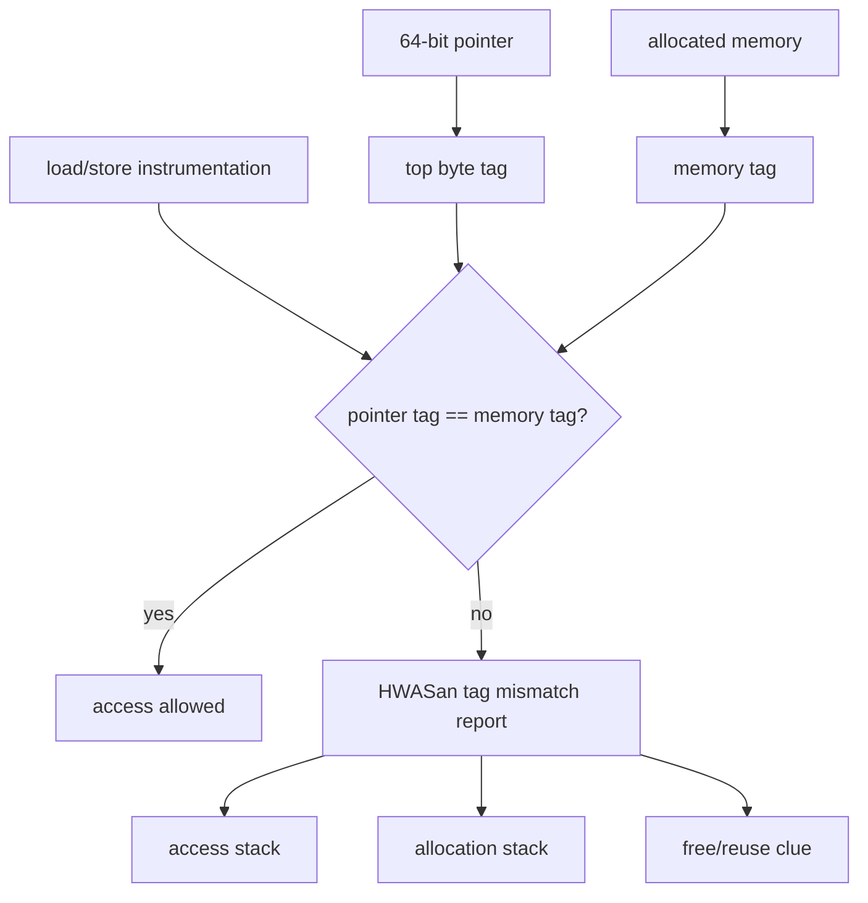
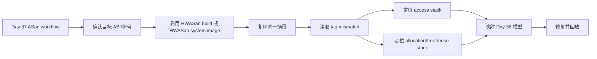
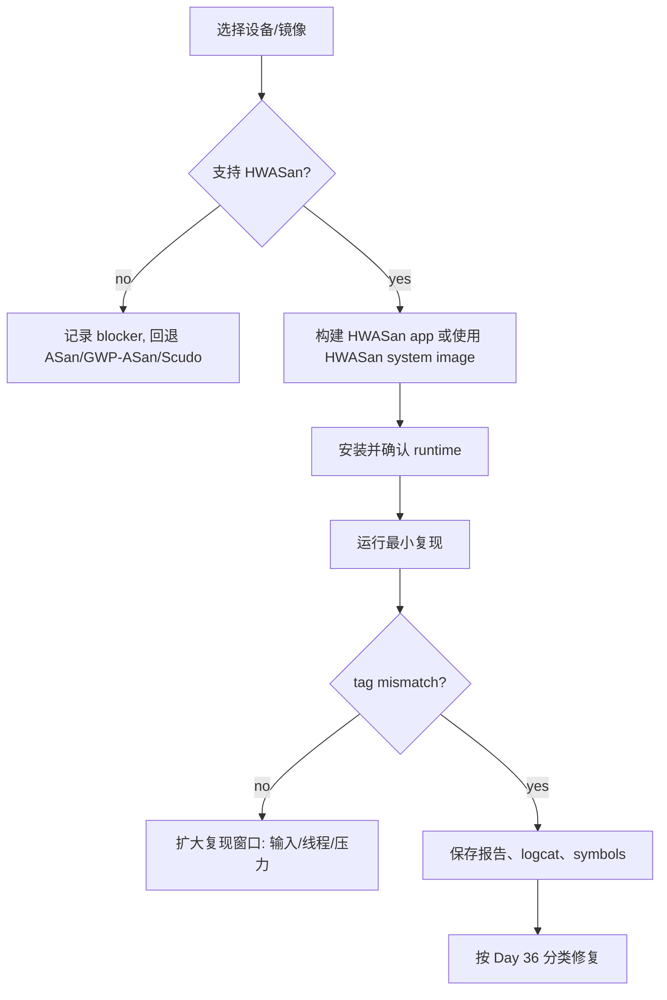
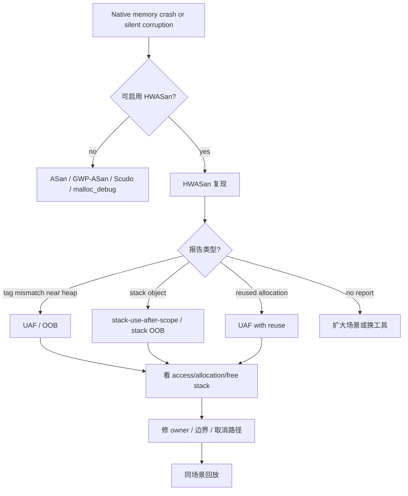

# Day 38: HWASan 与 Android 整机内存错误定位

> 目标：把 Day 37 的 ASan 报告工作流迁移到 HWASan。ASan 依赖 redzone/shadow 状态，HWASan 更强调地址 tag 与内存 tag 是否匹配；这个差异决定了它在 Android 64-bit UAF/OOB 定位中的工程价值。

---

## 1. HWASan 的核心结构



| 概念 | ASan | HWASan |
|---|---|---|
| 核心证据 | redzone/shadow bytes | pointer tag vs memory tag |
| UAF 捕获 | quarantine 提高概率 | tag 变化暴露 stale pointer |
| OOB 捕获 | 访问 redzone | 访问不同 tag 粒度区域 |
| 平台重点 | 多平台 | Android 64-bit 更常见 |
| 报告中心 | region + redzone | tag mismatch + stack |

---

## 2. 从 ASan 报告迁移到 HWASan 报告



| 报告字段 | 读法 | 对应模型 |
|---|---|---|
| `tag-mismatch` | 指针 tag 与内存 tag 不一致 | UAF/OOB |
| access type/size | 读写方向和宽度 | 越界读写、UAF 使用点 |
| pointer tag | stale pointer 持有的 tag | UAF、跨线程晚到 |
| memory tag | 当前内存真实 tag | 已释放复用或邻近对象 |
| allocation stack | 原始 owner | 容量和生命周期 |
| deallocation/reuse clue | 谁释放或复用 | UAF/double free 辅助证据 |

---

## 3. Android 使用边界

| 边界 | 检查 | blocker 记录 |
|---|---|---|
| ABI | 通常关注 64-bit 目标 | 32-bit 不作为主路径 |
| 系统镜像 | 是否有 HWASan system image 或设备支持 | 记录设备和 build fingerprint |
| App 构建 | 目标 native so 是否用 HWASan 插桩 | 记录 build variant 和 flags |
| 符号 | unstripped so 是否匹配 | 记录 build id |
| 性能 | 调试/测试环境优先 | 不直接当生产开关 |



---

## 4. HWASan 更适合的场景

| 场景 | 为什么 HWASan 有优势 | 仍需补充 |
|---|---|---|
| 跨线程 UAF | stale pointer tag 更容易暴露 | 线程时序日志 |
| free 后快速复用 | tag 变化直接暴露旧指针 | alloc/free/reuse stack |
| 大型 native 模块 | 比完整 ASan 某些场景更贴近 Android 调试 | 设备支持和性能评估 |
| 整机/系统组件 | 可覆盖更多 native 进程 | system image 和符号 |
| 难稳定复现 OOB | tag mismatch 可能更早报告 | 最小输入和重复回放 |

---

## 5. 决策流



---

## 6. 命令模板

具体开关依赖 NDK、AGP、AOSP/设备镜像，这里固定采集动作。

```bash
./gradlew :app:assembleHwasanDebug
adb install -r app/build/outputs/apk/hwasan/debug/app-hwasan-debug.apk
adb logcat -c
adb shell am force-stop <package>
adb shell am start -n <package>/<activity>
adb logcat -b crash -b main -b system -d > hwasan-logcat.txt
```

```bash
ndk-stack -sym app/build/intermediates/cxx/RelWithDebInfo/<abi>/obj -dump hwasan-logcat.txt
rg -n "hwasan|HWAddressSanitizer|sanitize|cflags|cppFlags|ldFlags" .
rg -n "nativePtr|callback|std::thread|pthread|free\\(|delete |memcpy|mmap|munmap" .
```

---

## 7. ASan 与 HWASan 选择矩阵

| 目标 | 优先选择 | 理由 |
|---|---|---|
| 快速确认 OOB 报告字段 | ASan | redzone/region 描述直观 |
| Android 64-bit UAF | HWASan | tag mismatch 对 stale pointer 敏感 |
| 需要跨多个系统进程 | HWASan system image | 覆盖更广 |
| 无法换镜像/设备 | ASan 或 GWP-ASan | 接入成本更可控 |
| 生产邻近低开销 | GWP-ASan/Scudo/MTE | Day 39 重点 |

---

## 今日检查清单

- [ ] 已确认设备、系统镜像、ABI 和目标 so 是否支持 HWASan。
- [ ] 已保存 HWASan 原始报告、logcat、tombstone、build fingerprint、符号目录。
- [ ] 已读取 tag mismatch，区分 pointer tag、memory tag、access type 和 access size。
- [ ] 已把报告映射到 Day 36 的 UAF/OOB/stack-use-after-scope/复用模型。
- [ ] 已对照 Day 37 的 ASan 报告，明确 ASan redzone 与 HWASan tag mismatch 的差异。
- [ ] 已搜索跨线程、JNI handle、callback、`free/delete/memcpy/mmap/munmap` 风险路径。
- [ ] 已记录无法启用 HWASan 时的设备/ROM/NDK/构建 blocker。
- [ ] 已用同一场景回放验证无 tag mismatch、无 tombstone、无相关 allocator 报告。

---

## 8. 今天的结论

| 问题 | HWASan 给出的答案 |
|---|---|
| stale pointer 是否还在用 | pointer tag 与 memory tag 不匹配 |
| UAF 是否被复用掩盖 | 新内存 tag 暴露旧指针 |
| OOB 是否越到邻近对象 | tag 粒度帮助识别跨区域访问 |
| 修复是否有效 | 同场景无 tag mismatch，生命周期证据闭合 |

Day 39 进入 GWP-ASan、Scudo 与 MTE：重点从“调试构建强检测”转向“低开销、抽样、硬化和生产邻近保护”。
