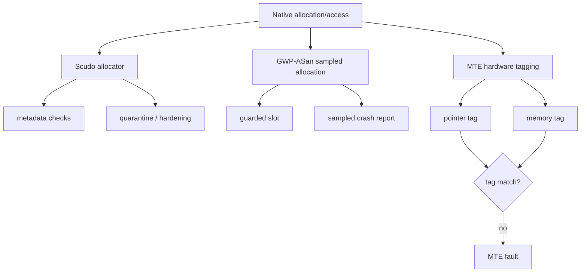
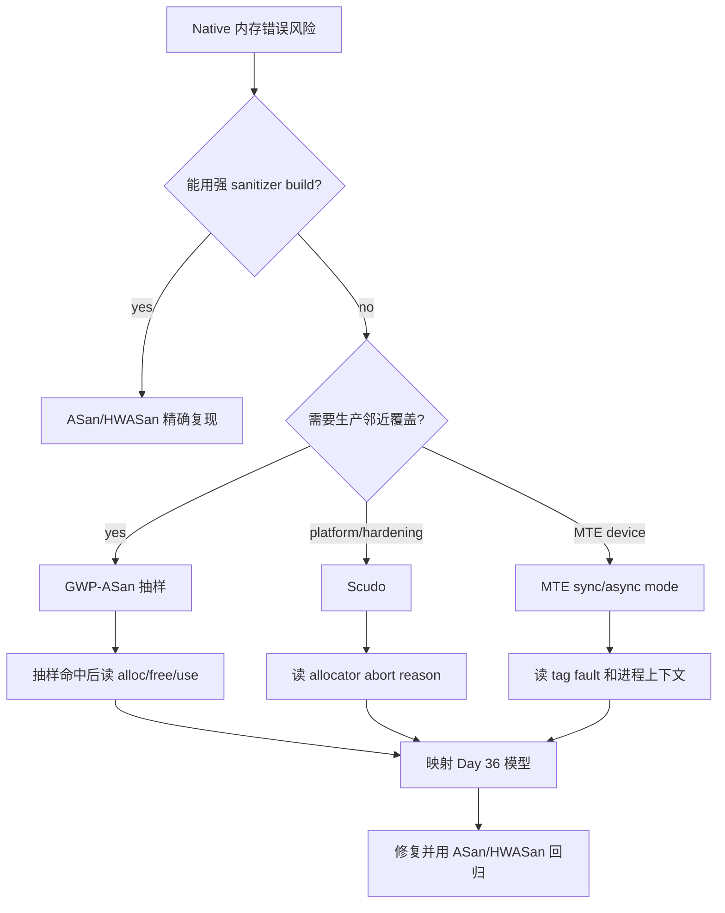
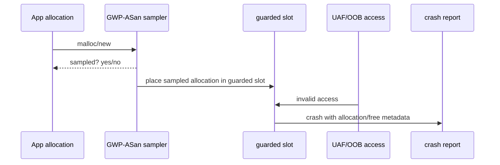
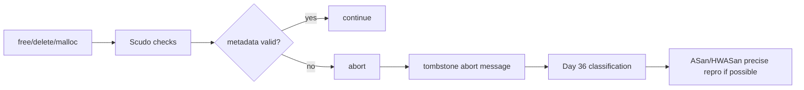

# Day 39: GWP-ASan、Scudo 与 MTE：低开销检测和运行时防护

> 目标：承接 Day 38 的工具边界比较，理解三类生产邻近能力：GWP-ASan 抽样检测、Scudo 分配器硬化、MTE 硬件标签。它们不是 ASan/HWASan 的替代品，而是覆盖更广、开销更低、证据更稀疏的防线。

---

## 1. 三层防护结构



| 机制 | 核心手段 | 最擅长 | 证据密度 | 典型范围 |
|---|---|---|---|---|
| GWP-ASan | 抽样分配 + guard page/元数据 | UAF/OOB 抽样命中 | 低但精 | app/dogfood/beta/部分生产 |
| Scudo | allocator hardening | invalid free、double free、metadata corruption | 中 | Android 默认/平台 allocator 路径 |
| MTE | 硬件内存标签 | UAF/OOB 标签不匹配 | 中高 | 支持 ARM MTE 的设备和系统 |
| ASan | 编译插桩 + redzone | 调试构建强定位 | 高 | dev/test |
| HWASan | 编译插桩 + tag | Android 64-bit 调试 | 高 | dev/system image |

---

## 2. 决策流



| 选择问题 | 推荐路径 |
|---|---|
| 本地稳定复现 | ASan/HWASan |
| 线上偶现 UAF/OOB | GWP-ASan 或 MTE |
| allocator abort/invalid free | Scudo + tombstone |
| 硬件支持且要扩大覆盖 | MTE |
| 无法换构建但可收 crash | GWP-ASan/Scudo 报告 |

---

## 3. GWP-ASan：抽样但证据强



| 字段 | 解释 |
|---|---|
| sampled allocation | 这次是否进入 GWP-ASan 保护池 |
| allocation trace | 谁分配 |
| deallocation trace | 谁释放 |
| fault address | 越界或 UAF 访问地址 |
| guard slot | 为什么访问会立刻崩 |

边界：

| 优点 | 代价 |
|---|---|
| 低开销，适合扩大覆盖 | 抽样，不保证每次命中 |
| 报告比普通 tombstone 更接近根因 | 需要足够样本量 |
| 对线上偶现有价值 | 不适合替代本地强复现 |

---

## 4. Scudo：分配器硬化

| Scudo 线索 | 常见模型 | 下一步 |
|---|---|---|
| invalid chunk state | double free/UAF | 查释放路径 |
| checksum/header mismatch | metadata corruption | 找越界写 |
| invalid pointer | bad free | 查指针偏移和 owner |
| quarantine 相关 abort | UAF/double free | 保留 first/second stack |



Scudo 常常告诉你“allocator 约束被破坏”，但不总能指出“第一次写坏的人”。所以修复流程应是：

| 步骤 | 证据 |
|---|---|
| 保存 abort message | tombstone/logcat |
| 找释放/分配路径 | source search + symbols |
| 用 ASan/HWASan 缩小第一次错误 | sanitizer report |
| 回放验证 | 无 allocator abort |

---

## 5. MTE：硬件标签防线

| 模式 | 特点 | 适合 |
|---|---|---|
| sync | 更接近错误访问点 | 调试、dogfood |
| async | 开销更低，报告可能延后 | 更广覆盖 |
| permissive/disabled | 不阻断或不启用 | 兼容性评估 |

| MTE 与 HWASan | 对比 |
|---|---|
| HWASan | 编译插桩，报告详细，调试构建路径 |
| MTE | 硬件支持，生产邻近潜力更强，依赖设备和系统策略 |

---

## 6. 命令和证据模板

```bash
adb logcat -b crash -b main -b system -d > memory-protection-logcat.txt
adb shell getprop | grep -i "gwp\\|scudo\\|mte\\|memtag"
adb shell cat /proc/<pid>/maps > maps.txt
adb shell dumpsys meminfo <package> > meminfo.txt
```

```bash
rg -n "gwp|GWP|scudo|Scudo|mte|memtag|sanitize" .
rg -n "free\\(|delete |memcpy|nativePtr|callback|mmap|munmap|close\\(" .
```

---

## 今日检查清单

- [ ] 已区分当前目标是精确复现、扩大覆盖、allocator hardening 还是生产邻近防护。
- [ ] 已选择 ASan/HWASan、GWP-ASan、Scudo、MTE 中合适的机制，没有混淆报告语义。
- [ ] 已保存 tombstone、logcat、构建号、ABI、符号目录和设备能力信息。
- [ ] 已将 GWP-ASan/Scudo/MTE 报告映射回 Day 36 的 OOB/UAF/double free/invalid free 模型。
- [ ] 已记录抽样未命中、设备不支持 MTE、ROM 策略不开放等 blocker。
- [ ] 已用 ASan/HWASan 或最小复现补强 GWP-ASan/Scudo 的稀疏证据。
- [ ] 已验证修复后同场景无 sanitizer、allocator、MTE 或 tombstone 报告。

---

## 7. 今天的结论

| 工具 | 不该期待 | 应该期待 |
|---|---|---|
| GWP-ASan | 每次都抓到 | 抽样命中时给强证据 |
| Scudo | 精准指出第一次越界写 | 快速阻断 allocator 破坏 |
| MTE | 跨所有设备无成本启用 | 在支持设备上扩大标签检测覆盖 |
| ASan/HWASan | 生产常开 | 本地和测试强定位 |

Day 40 进入 Kernel 侧：KASAN 与 KFENCE。重点会从用户态 native heap 转到 kernel heap、slab、page allocator 和低开销内核内存错误检测。
