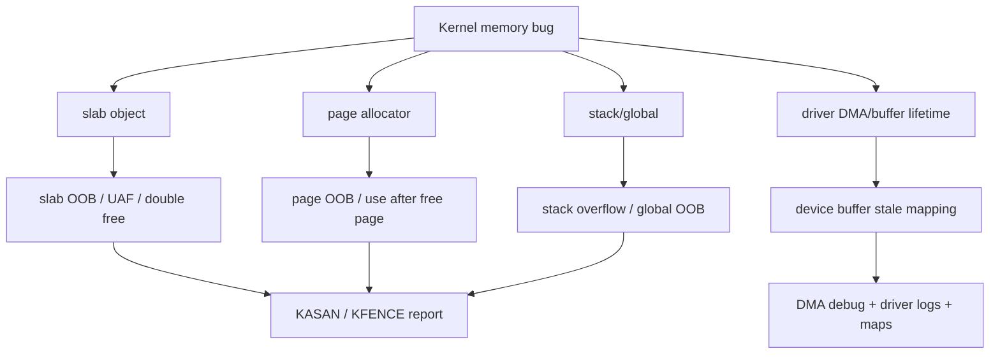
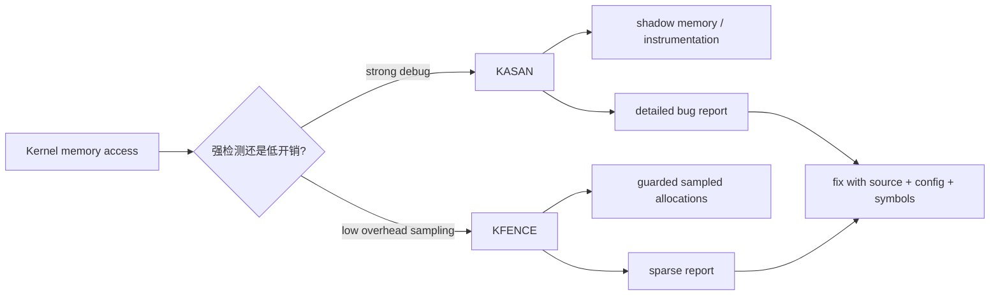
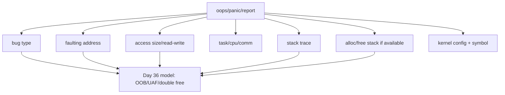
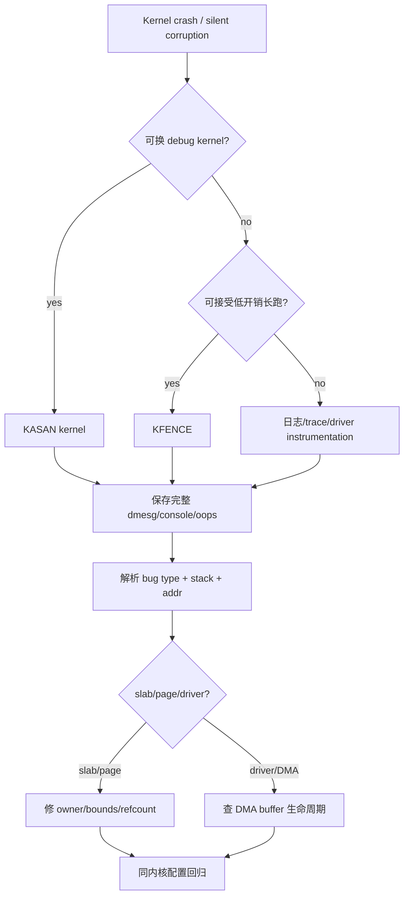

# Day 40: KASAN 与 KFENCE：Kernel 内存越界和 UAF 定位

> 目标：把 Day 39 的“强检测 vs 低开销”比较迁移到 kernel。用户态有 ASan/HWASan/GWP-ASan/Scudo/MTE；内核侧常见的两条线是 KASAN 强检测和 KFENCE 低开销抽样。

---

## 1. Kernel 内存错误在哪里发生



| 内核对象 | 常见错误 | 用户态类比 | 关键证据 |
|---|---|---|---|
| slab object | OOB/UAF/double free | native heap object | KASAN/KFENCE report |
| page allocation | page UAF/OOB | mmap/page buffer | page allocator trace |
| kernel stack | stack overflow | native stack overflow | panic/oops + config |
| driver buffer | DMA/lifetime 错误 | dma-buf/mmap/fd 生命周期 | driver log + IOMMU/DMA evidence |

---

## 2. KASAN 与 KFENCE 对比



| 维度 | KASAN | KFENCE |
|---|---|---|
| 核心思路 | 编译插桩/影子内存检测 | 抽样分配到 guard 对象 |
| 证据质量 | 高 | 中高但稀疏 |
| 开销 | 高，偏调试内核 | 低，适合更长时间运行 |
| 命中方式 | 覆盖到的访问直接检测 | 只有抽样对象被保护 |
| 适合 | 本地复现、CI、debug build | 偶现、长跑、低开销发现 |

---

## 3. 报告阅读结构



| 字段 | 问题 |
|---|---|
| bug type | OOB、UAF、invalid free、double free 还是 wild access |
| access size | 读写宽度和方向 |
| address | slab/page/stack/vmalloc/module 区域 |
| task/cpu | 哪个上下文触发，是否 interrupt/workqueue |
| stack trace | 当前访问点或释放点 |
| alloc/free stack | 生命周期证据 |
| config/build | 是否为可解释的内核构建 |

---

## 4. 排障决策流



---

## 5. Kernel 证据清单

| 证据 | 为什么必须保留 |
|---|---|
| full dmesg/console | report 上下文可能在前后几十行 |
| `uname -a` / build fingerprint | 绑定内核版本 |
| `.config` | 判断 KASAN/KFENCE/slub debug 等开关 |
| `vmlinux` + modules symbols | 符号化栈 |
| repro steps | 区分驱动路径、压力路径、低内存路径 |
| workload timeline | 和 PSI、reclaim、IO、driver interrupt 对齐 |

命令模板：

```bash
adb shell dmesg > dmesg.txt
adb shell uname -a > kernel-version.txt
adb shell cat /proc/config.gz > config.gz
adb shell cat /proc/slabinfo > slabinfo.txt
adb logcat -b kernel -b main -b system -d > kernel-logcat.txt
```

源码搜索：

```bash
rg -n "kzalloc|kmalloc|kfree|devm_kzalloc|vmalloc|vfree|put_page|get_page" kernel drivers
rg -n "memcpy|memmove|copy_from_user|copy_to_user|refcount|atomic_dec|list_del|list_add" kernel drivers
rg -n "dma_alloc|dma_map|dma_unmap|ion|dmabuf|dma_buf|vmap|vunmap" kernel drivers
```

---

## 6. 从报告到修复

| 模型 | Kernel 常见根因 | 修复模式 |
|---|---|---|
| slab OOB | 结构长度、数组索引、copy size 错 | 长度来自对象容量，不来自输入 |
| slab UAF | refcount 错、workqueue 晚到、timer 未取消 | 引用计数、取消异步、RCU/lock 边界 |
| double free | error path 和 normal path 重复释放 | 单 owner，cleanup label 分层 |
| page UAF | page ref 漏增/漏减 | get/put 配对和生命周期审计 |
| DMA stale buffer | unmap/free 后设备仍访问 | DMA sync/unmap 顺序和 device quiesce |

---

## 今日检查清单

- [ ] 已确认目标是 kernel bug，不是用户态 native crash 被误读。
- [ ] 已保存 dmesg/console、kernel logcat、内核版本、`.config`、`vmlinux` 和模块符号。
- [ ] 已确认 KASAN/KFENCE 是否启用，以及当前内核是否为同一复现构建。
- [ ] 已按 report 读取 bug type、address、access size、task/cpu、stack、alloc/free stack。
- [ ] 已把问题映射到 slab/page/stack/driver DMA 生命周期模型。
- [ ] 已搜索 `kmalloc/kfree/refcount/workqueue/timer/DMA/copy_from_user` 等风险路径。
- [ ] 已记录无法换 debug kernel、无法取符号、无法读 config 的 blocker。
- [ ] 已在同一内核配置和同一 workload 下验证无 KASAN/KFENCE/oops 报告。

---

## 7. 今天的结论

| 用户态经验 | Kernel 侧对应 |
|---|---|
| ASan/HWASan 强定位 | KASAN |
| GWP-ASan 抽样低开销 | KFENCE |
| alloc/free/use stack | slab/page alloc/free/access stack |
| fd/mmap 生命周期 | driver DMA/buffer 生命周期 |
| app 符号 | `vmlinux` + module symbols |

Day 41 开始 Bitmap 专题：从 Android 8.0 前后的像素内存归属变化，重新把 Java Heap、Native Heap、Graphics、dma-buf 和图片库缓存放到同一张账单里。
