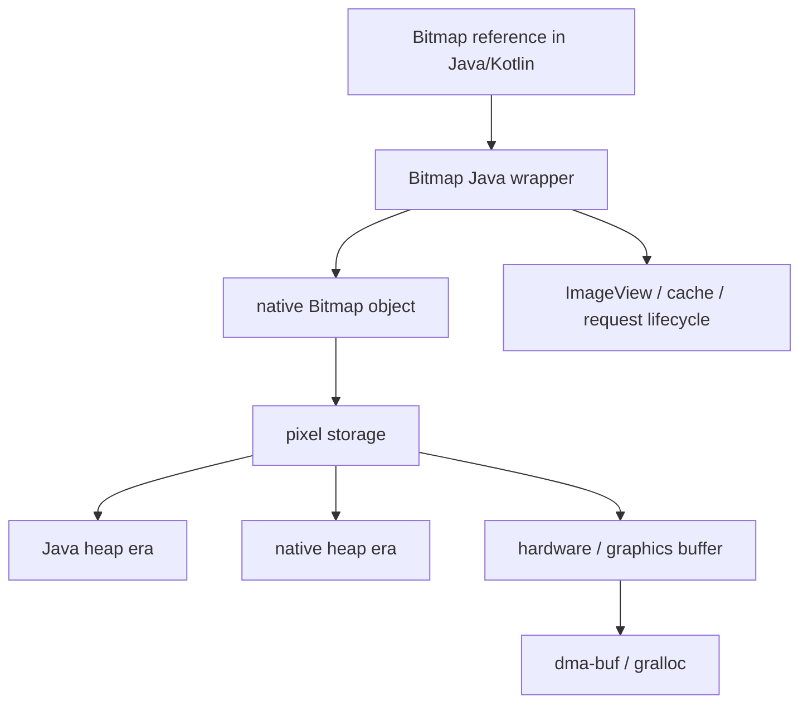
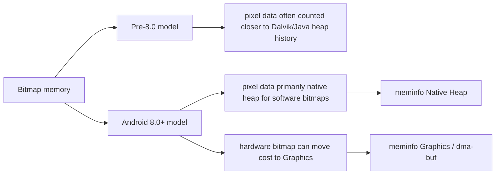
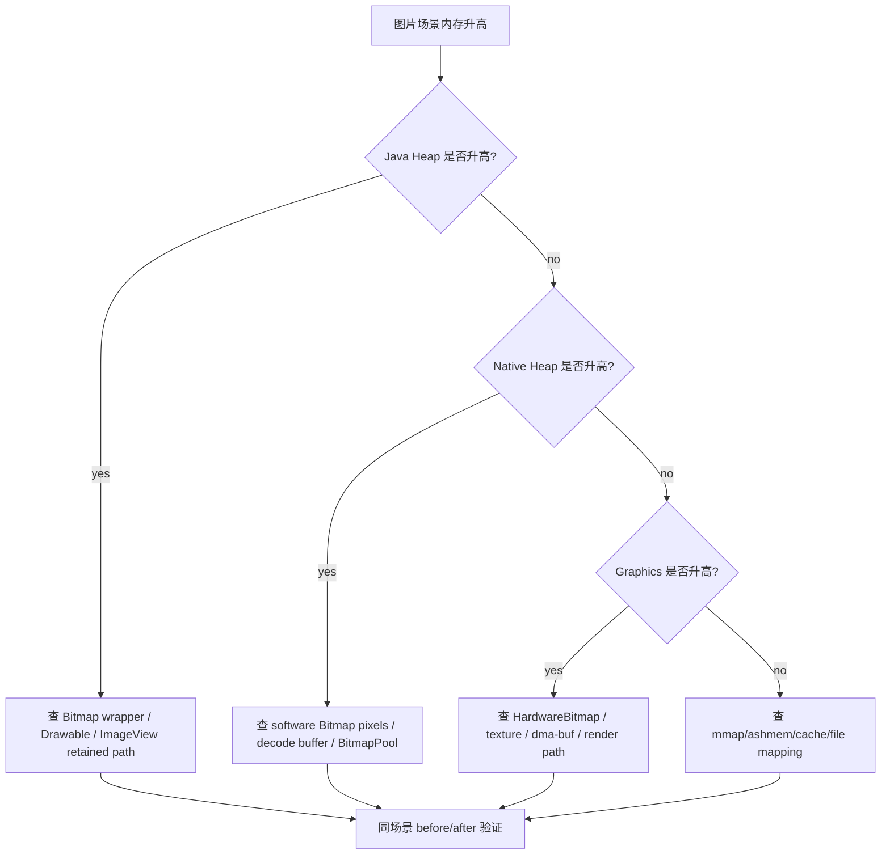
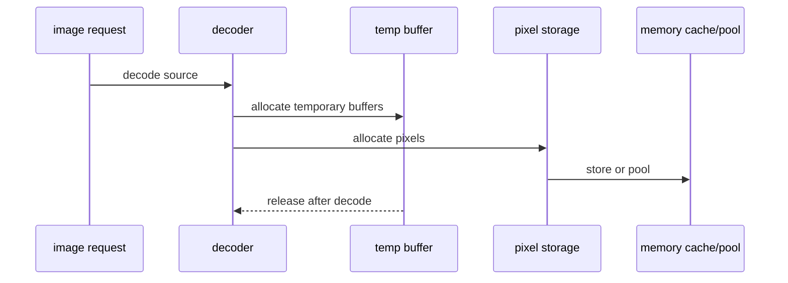

# Day 41: Bitmap 内存模型：Android 8.0 前后的变化

> 目标：把前面 native/system 证据链拉回 App 场景。Bitmap 不是一个简单 Java 对象；它有 Java wrapper、native pixel、Graphics/dma-buf、缓存和解码峰值多条账单。

---

## 1. Bitmap 内存结构



| 层 | 你看到的对象 | 账单位置 | 常见证据 |
|---|---|---|---|
| Java wrapper | `Bitmap`、`Drawable`、`ImageView` | Java Heap | HPROF、LeakCanary |
| native object | Skia/Bitmap native peer | Native Heap | meminfo、heapprofd |
| pixel bytes | ARGB/RGBA 像素 | Native/Graphics/ashmem 视版本和配置 | meminfo、showmap、smaps |
| hardware buffer | `HardwareBuffer`/GPU texture | Graphics/dma-buf | meminfo Graphics、SurfaceFlinger、dmabuf |
| cache | Glide/coil/pool | Java + Native + Graphics | library stats、heap dump |

---

## 2. Android 8.0 前后差异



| 版本/形态 | 像素内存重点 | 排查重点 |
|---|---|---|
| 早期 Android | Bitmap 像素归属随版本变化大 | 不靠单一字段下结论 |
| Android 8.0+ software Bitmap | native pixel storage 更关键 | Native Heap、heapprofd、showmap |
| Hardware Bitmap | GPU/Graphics buffer | Graphics、dma-buf、硬件缓存 |
| 图片库缓存 | wrapper + pixel + pool | HPROF + meminfo + library cache |

边界：版本差异不能靠记忆判断，必须用目标设备 `meminfo/showmap/HPROF` 复核。

---

## 3. 排障流



| 症状 | 更可能归因 | 下一步证据 |
|---|---|---|
| Java Heap 多很多 `BitmapDrawable` | wrapper 或 View 泄漏 | HPROF retained path |
| Native Heap 随加载增长 | software pixel/cache | meminfo + heapprofd |
| Graphics 增长 | hardware bitmap/GPU texture | meminfo Graphics + dmabuf |
| PSS 增长但 heap 不明显 | shared buffer/mmap | showmap/smaps/fd |

---

## 4. 解码峰值模型



| 阶段 | 账单风险 | 观测 |
|---|---|---|
| source read | byte array / stream buffer | Java/Native small spikes |
| decode temp | scanline/temp native buffer | short Native spike |
| pixel allocation | width * height * bpp | Native/Graphics large spike |
| transform | new bitmap + old bitmap coexist | peak doubles |
| cache/pool | intentionally retained | stable high-water mark |

---

## 5. 命令模板

```bash
adb shell dumpsys meminfo <package> > meminfo-before.txt
adb shell am start -n <package>/<activity>
adb shell dumpsys meminfo <package> > meminfo-after.txt
adb shell am dumpheap <package> /data/local/tmp/bitmap.hprof
adb pull /data/local/tmp/bitmap.hprof .
adb shell cat /proc/<pid>/smaps_rollup > smaps_rollup.txt
```

```bash
rg -n "BitmapFactory|ImageDecoder|Bitmap.Config|HARDWARE|ARGB_8888|RGB_565|inBitmap|inSampleSize" .
rg -n "Glide|Coil|Picasso|LruCache|BitmapPool|ImageView|Drawable" .
```

---

## 今日检查清单

- [ ] 已按 Android 版本和 Bitmap 类型区分 software/hardware 路径。
- [ ] 已同时检查 Java Heap、Native Heap、Graphics、PSS，而不是只看一个字段。
- [ ] 已用 HPROF 查 wrapper retained path。
- [ ] 已用 meminfo/showmap/smaps 查 pixel 和 shared buffer 账单。
- [ ] 已区分泄漏、缓存、BitmapPool 和解码峰值。
- [ ] 已记录目标设备版本、ROM、图片库版本和配置。
- [ ] 已用同场景 before/after 验证释放或缓存上限。

---

## 6. 今天的结论

Bitmap 内存分析必须拆成两层问题：

| 问题 | 证据 |
|---|---|
| 谁持有 Bitmap wrapper | HPROF/LeakCanary |
| 像素字节算到哪里 | meminfo/showmap/smaps/Graphics/dma-buf |

Day 42 会继续深入 Bitmap 像素数据、Native Heap 与 Graphics 归因。
