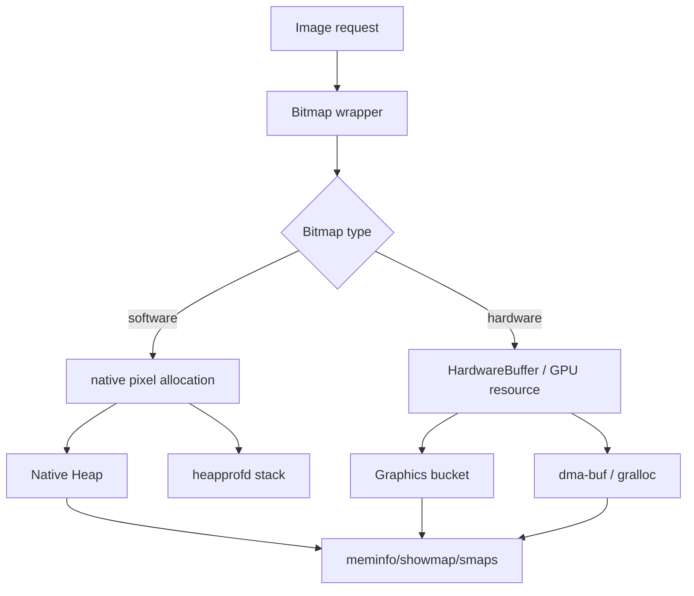
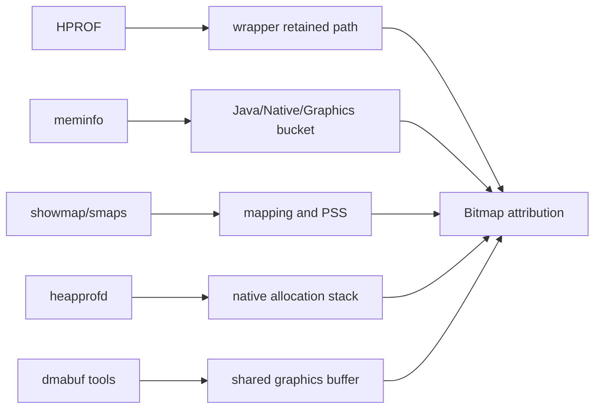
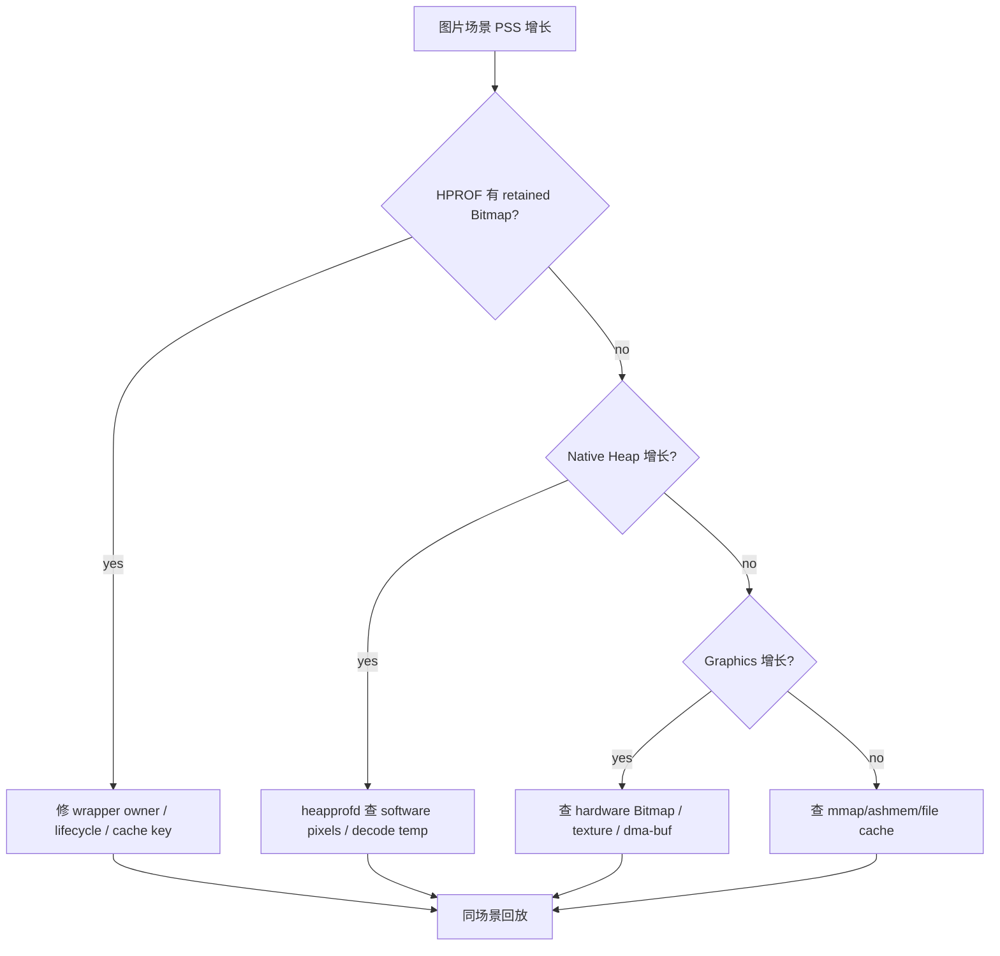
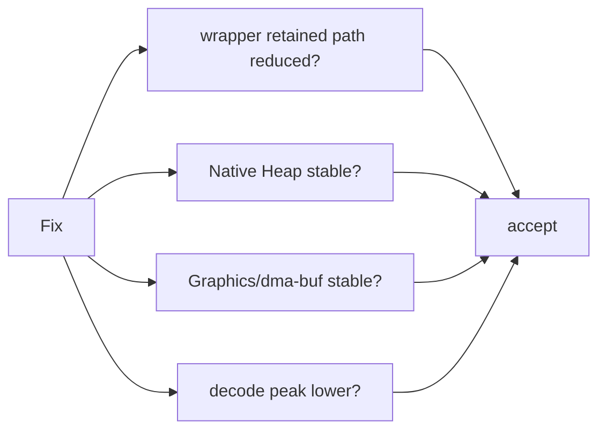

# Day 42: Bitmap 像素数据、Native Heap 与 Graphics 归因

> 目标：承接 Day 41，把 Bitmap 的“谁持有 wrapper”和“像素字节算到哪里”彻底拆开。今天只解决归因：Native Heap、Graphics、dma-buf、showmap、smaps、heapprofd 怎么互相校验。

---

## 1. 像素归因路径



| Bitmap 形态 | 主要账单 | 关键证据 | 常见盲点 |
|---|---|---|---|
| software ARGB_8888 | Native Heap | meminfo Native Heap、heapprofd | HPROF 只看到 wrapper |
| software RGB_565 | Native Heap 较小 | decode config、meminfo delta | 质量和兼容性代价 |
| hardware Bitmap | Graphics/dma-buf | meminfo Graphics、dmabuf、SurfaceFlinger | Native Heap 可能不明显 |
| transformed Bitmap | 新旧像素共存 | before/after + timeline | 峰值被误判为泄漏 |
| cached Bitmap | cache/pool 保留 | cache stats + meminfo plateau | 有意缓存被误判 |

---

## 2. 证据拼接



| 工具 | 证明什么 | 不能证明什么 |
|---|---|---|
| HPROF | 谁持有 Bitmap wrapper | 像素是否在 Graphics |
| meminfo | bucket 级账单变化 | 具体 owner 栈 |
| showmap/smaps | mapping/PSS/dirty/swap | Java 持有链 |
| heapprofd | native allocation stack | GPU/dma-buf owner |
| dmabuf/SurfaceFlinger | shared graphics buffer | Java wrapper retained path |

---

## 3. 排障决策流



---

## 4. 计算与对照

| 配置 | 每像素字节 | 估算 |
|---|---:|---|
| ARGB_8888 | 4 | `width * height * 4` |
| RGB_565 | 2 | `width * height * 2` |
| ALPHA_8 | 1 | `width * height` |
| HARDWARE | 依实现/格式 | 用 Graphics/dma-buf 证据确认 |

| 场景 | 预期 delta |
|---|---|
| 加载 10 张 1080p ARGB_8888 software | Native Heap 约增长 `10 * 1080 * 1920 * 4`，再扣除复用/压缩/释放 |
| transform 生成圆角/模糊图 | 峰值可能出现源图 + 目标图 |
| hardware decode | Graphics 比 Native Heap 更敏感 |
| cache 命中后稳定 | 内存 plateau，不继续线性增长 |

---

## 5. 采集模板

```bash
adb shell dumpsys meminfo <package> > meminfo-before.txt
adb shell am start -n <package>/<activity>
adb shell input swipe 500 1600 500 300
adb shell dumpsys meminfo <package> > meminfo-after.txt
adb shell cat /proc/<pid>/smaps_rollup > smaps_rollup.txt
adb shell showmap <pid> > showmap.txt
```

```bash
adb shell am dumpheap <package> /data/local/tmp/bitmap.hprof
adb pull /data/local/tmp/bitmap.hprof .
rg -n "BitmapFactory|ImageDecoder|HardwareBuffer|Bitmap.Config.HARDWARE|ARGB_8888|RGB_565" .
rg -n "LruCache|BitmapPool|MemoryCache|Glide|Coil|Picasso|ImageView" .
```

---

## 6. 验收矩阵



| 修复类型 | 验收证据 |
|---|---|
| wrapper leak | HPROF retained path 消失 |
| software pixel overuse | Native Heap delta 降低 |
| hardware buffer overuse | Graphics/dma-buf delta 降低 |
| decode peak | 峰值降低而非只看终值 |
| cache policy | plateau 可解释且有上限 |

---

## 今日检查清单

- [ ] 已先判断 Bitmap wrapper 持有链，再判断 pixel 账单。
- [ ] 已按 software/hardware Bitmap 区分 Native Heap 与 Graphics/dma-buf。
- [ ] 已用 `width * height * bpp` 估算像素理论值并和 meminfo delta 对照。
- [ ] 已采集 HPROF、meminfo、showmap/smaps、必要时 dmabuf/SurfaceFlinger 证据。
- [ ] 已区分 transform 峰值、cache plateau、BitmapPool 复用和真实泄漏。
- [ ] 已保留设备版本、图片库版本、Bitmap config 和复现步骤。
- [ ] 已用同场景 before/after 验证 wrapper、Native、Graphics 三条线同时收敛。

---

## 7. 今天的结论

Bitmap 归因要避免两种偷懒：

| 偷懒结论 | 正确做法 |
|---|---|
| HPROF 里有 Bitmap，所以像素也在 Java Heap | HPROF 只证明 wrapper 持有链 |
| Native Heap 没涨，所以图片没问题 | 检查 Graphics/dma-buf/hardware Bitmap |

Day 43 会转向解码参数：`inSampleSize`、`inBitmap`、复用和解码峰值控制。
