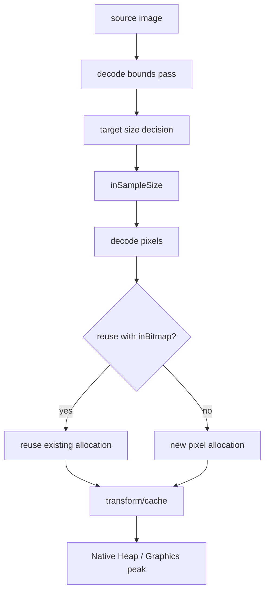
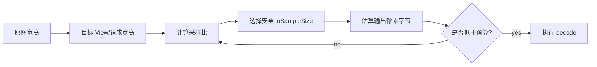
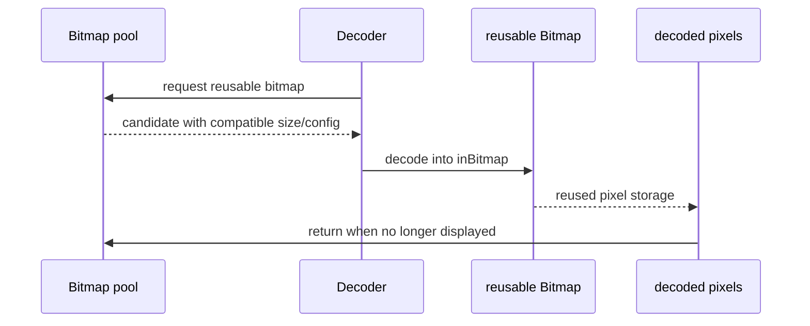
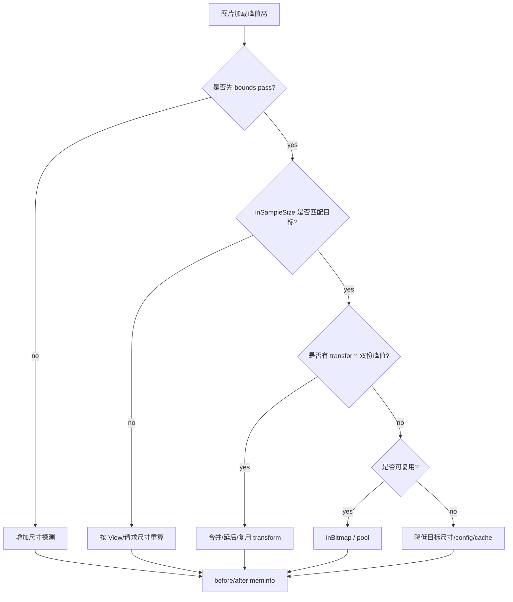

# Day 43: BitmapFactory.Options：inSampleSize、inBitmap 与解码峰值

> 目标：承接 Day 42 的 Bitmap 归因，把“内存涨在哪里”推进到“解码时怎么少涨”。重点不是背 API，而是控制峰值：bounds pass、采样、复用、transform 和 cache insertion。

---

## 1. 解码峰值路径



| 参数/阶段 | 控制什么 | 内存影响 |
|---|---|---|
| `inJustDecodeBounds` | 只读尺寸 | 避免先解原图 |
| `inSampleSize` | 降采样像素数 | 直接降低 pixel bytes |
| `inPreferredConfig` | 每像素字节 | ARGB_8888/RGB_565 差异 |
| `inBitmap` | 复用已有像素内存 | 降低反复分配和峰值 |
| transform | 新旧图共存 | 容易制造瞬时双倍峰值 |

---

## 2. inSampleSize 决策



| 输入 | 示例 | 结论 |
|---|---|---|
| 原图 | 4000 x 3000 ARGB_8888 | 约 45.8 MB |
| 目标 | 1000 x 750 | sample 4 后约 2.9 MB |
| 错误 | 先解原图再缩放 | 峰值包含原图 + 目标图 |
| 正确 | bounds pass 后采样解码 | 峰值接近目标图 |

---

## 3. inBitmap 复用边界



| 检查 | 为什么 |
|---|---|
| config 兼容 | 避免格式不匹配 |
| allocation byte count 足够 | 复用容量必须覆盖目标 |
| 生命周期安全 | 正在显示的 Bitmap 不能复用 |
| 图片库池管理 | 手写复用容易踩生命周期 |
| hardware Bitmap | 通常不走同一复用模型 |

---

## 4. 排障流



---

## 5. 证据模板

| 优化 | 期望变化 | 观测 |
|---|---|---|
| bounds + sample | 解码峰值下降 | Native/Graphics peak |
| `RGB_565` | 每像素从 4 到 2 字节 | 质量风险记录 |
| `inBitmap` | 分配次数下降 | heapprofd/allocation tracker |
| transform 合并 | 峰值下降 | meminfo timeline |
| cache 上限 | plateau 可控 | cache stats + meminfo |

```bash
adb shell dumpsys meminfo <package> > before.txt
adb shell am start -n <package>/<activity>
adb shell input swipe 500 1600 500 300
adb shell dumpsys meminfo <package> > after.txt
adb shell am dumpheap <package> /data/local/tmp/decode.hprof
adb pull /data/local/tmp/decode.hprof .
```

```bash
rg -n "inJustDecodeBounds|inSampleSize|inBitmap|inMutable|inPreferredConfig|decodeFile|decodeStream" .
rg -n "transform|centerCrop|fitCenter|override|thumbnail|preload|MemoryCache|BitmapPool" .
```

---

## 今日检查清单

- [ ] 已先执行 bounds pass 或等价尺寸探测。
- [ ] 已按展示尺寸/业务目标计算 `inSampleSize`，避免先解原图。
- [ ] 已估算 `width * height * bytesPerPixel` 并和 meminfo delta 对照。
- [ ] 已检查 `inBitmap` 复用容量、config、生命周期和池管理。
- [ ] 已识别 transform、圆角、模糊、缩放造成的新旧图共存峰值。
- [ ] 已区分 software 与 hardware Bitmap 的 Native/Graphics 账单。
- [ ] 已用 before/after 证据验证峰值、终值和 cache plateau。

---

## 6. 今天的结论

| 问题 | 优先修法 |
|---|---|
| 解码峰值高 | bounds pass + sample |
| 反复分配 | `inBitmap`/BitmapPool |
| transform 峰值高 | 避免新旧大图长时间共存 |
| cache 太大 | 明确上限和 trim 策略 |

Day 44 进入 Glide：把 MemoryCache、BitmapPool、EngineResource 和生命周期放进同一条内存链。
