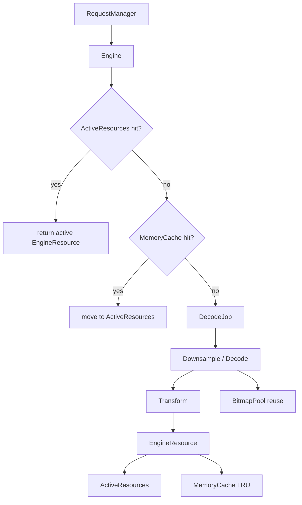
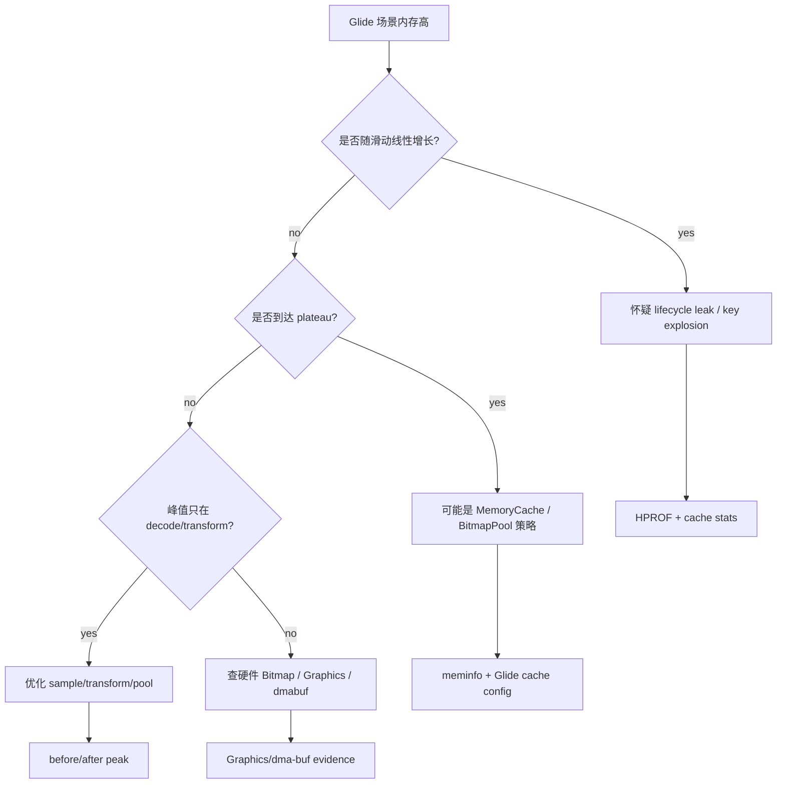
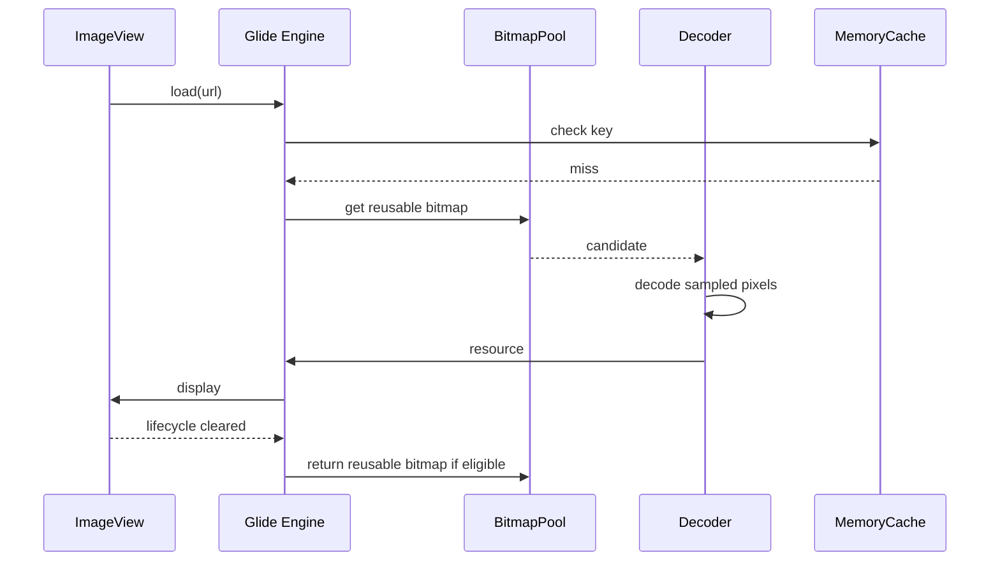
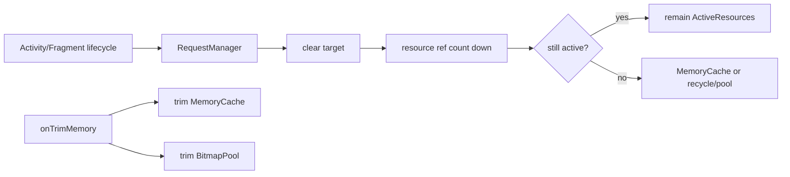

# Day 44: Glide 内存缓存架构：LruCache、BitmapPool 与生命周期

> 目标：承接 Day 43 的解码峰值控制，把 Glide 的 request、decode、transform、cache insertion、BitmapPool 复用和生命周期释放放进同一张内存账单。

---

## 1. Glide 内存路径



| 组件 | 作用 | 内存账单 |
|---|---|---|
| ActiveResources | 正在被 View 使用的资源 | Java wrapper + pixel |
| MemoryCache/LruCache | 可复用的已解码资源 | Java/Native/Graphics plateau |
| BitmapPool | 复用 mutable Bitmap 像素内存 | Native Heap 复用 |
| DecodeJob | 解码临时峰值 | Native/Graphics peak |
| Transform | 可能产生新 Bitmap | 峰值放大 |
| RequestManager | 绑定生命周期 | 泄漏或及时释放的关键 |

---

## 2. 缓存、池、泄漏怎么区分



| 现象 | 判断 | 证据 |
|---|---|---|
| 返回页面后资源仍 active | 生命周期泄漏 | HPROF retained path |
| 内存达到稳定上限 | 正常缓存 | cache size/pool size |
| 每次 transform 峰值高 | 解码/变换策略问题 | meminfo timeline |
| Native Heap 分配频繁 | pool 未命中 | allocation/heapprofd |
| Graphics 增长 | hardware Bitmap 或纹理 | meminfo Graphics/dma-buf |

---

## 3. BitmapPool 复用流



| 复用失败原因 | 后果 |
|---|---|
| 尺寸/config 不兼容 | 新分配 |
| Bitmap 正在显示 | 不能复用 |
| hardware Bitmap | 不走普通 mutable pool |
| transform 产生新对象 | 源/目标同时占用 |
| cache key 太分散 | MemoryCache 命中率低 |

---

## 4. Trim 与生命周期



| 事件 | Glide 应做什么 | 验证 |
|---|---|---|
| View detached | clear request | ActiveResources 下降 |
| Fragment destroyed | cancel/clear targets | HPROF 无旧 Fragment 持有 |
| memory trim | 缩减 cache/pool | meminfo plateau 降低 |
| list fling | 复用 pool | 分配频率下降 |

---

## 5. 采集模板

```bash
adb shell dumpsys meminfo <package> > glide-before.txt
adb shell am start -n <package>/<activity>
adb shell input swipe 500 1600 500 300
adb shell input keyevent KEYCODE_BACK
adb shell dumpsys meminfo <package> > glide-after-back.txt
adb shell am dumpheap <package> /data/local/tmp/glide.hprof
adb pull /data/local/tmp/glide.hprof .
```

```bash
rg -n "Glide\\.with|RequestManager|clear\\(|into\\(|asBitmap|override|centerCrop|fitCenter|transform" .
rg -n "MemoryCache|LruResourceCache|BitmapPool|LruBitmapPool|ActiveResources|EngineResource" .
```

---

## 6. 验收矩阵

| 问题 | 修复 | 验收 |
|---|---|---|
| lifecycle leak | 正确 `clear`，绑定 view/fragment lifecycle | HPROF 无旧页面链 |
| cache 过大 | 调整 MemoryCache/trim | plateau 降低 |
| pool 未命中 | 统一尺寸/config，减少变体 | 分配频率下降 |
| transform 峰值 | 降采样前置，避免重复大图 | peak 降低 |
| hardware Graphics 高 | 控制 hardware Bitmap/纹理路径 | Graphics/dma-buf 降低 |

---

## 今日检查清单

- [ ] 已区分 ActiveResources、MemoryCache、BitmapPool、DecodeJob 和 Transform 的内存角色。
- [ ] 已判断内存是线性增长、稳定 plateau，还是 decode/transform 瞬时峰值。
- [ ] 已用 HPROF 验证旧 Activity/Fragment/View/Target 是否仍持有资源。
- [ ] 已用 meminfo 区分 Java Heap、Native Heap、Graphics 变化。
- [ ] 已检查 cache key、尺寸、config、transform 是否导致复用率下降。
- [ ] 已验证生命周期 `clear`、`onTrimMemory`、返回页面后的释放行为。
- [ ] 已用同场景 before/after 验证 cache/pool/peak 三条线。

---

## 7. 今天的结论

Glide 内存问题的第一判断不是“有没有缓存”，而是：

| 现象 | 结论 |
|---|---|
| 可解释 plateau | 缓存策略 |
| 返回后仍持有旧页面 | 生命周期泄漏 |
| 滑动峰值高但回落 | decode/transform 峰值 |
| Native 分配频繁 | BitmapPool 命中差 |
| Graphics 高 | hardware Bitmap/纹理路径 |

Day 45 会进入大图加载：Region Decode、Tile 和峰值控制。
