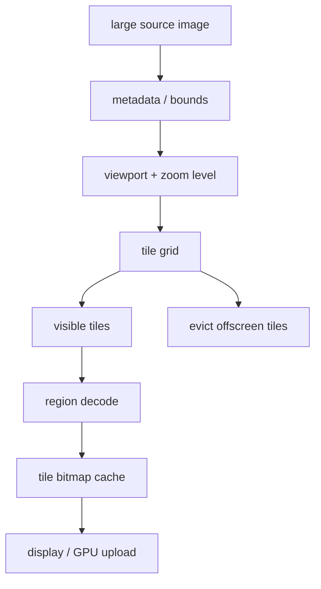
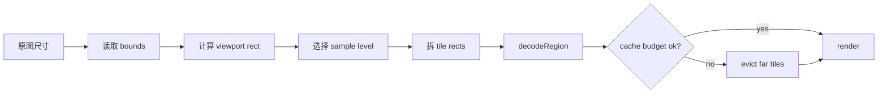
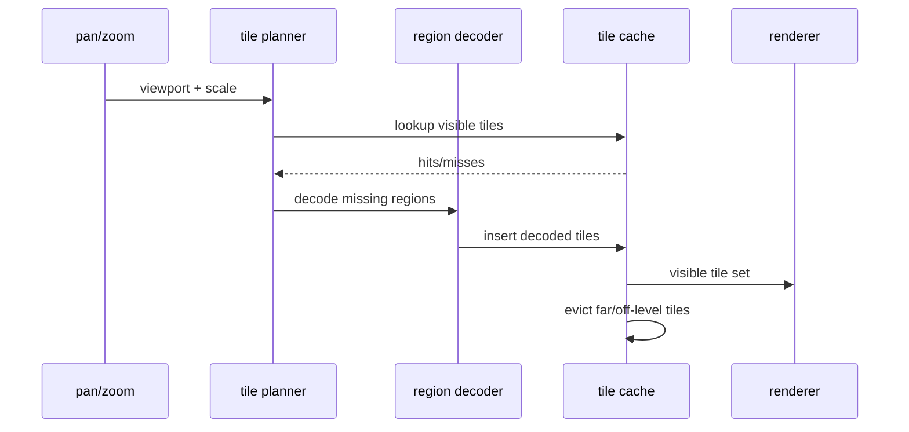
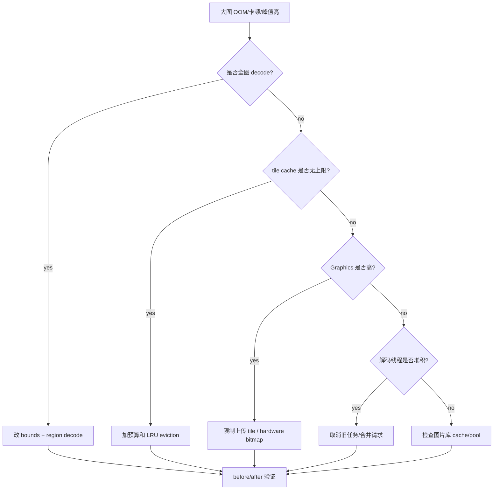

# Day 45: 大图加载策略：Region Decode、Tile 与峰值控制

> 目标：承接 Day 44 的 cache/pool/lifecycle 边界，处理超大图。核心原则：不要把整张图解进内存；只解当前 viewport 需要的区域和缩放层级。

---

## 1. 大图内存结构



| 层 | 控制点 | 内存账单 |
|---|---|---|
| source | 尺寸、格式、EXIF | 文件/stream buffer |
| viewport | 可见区域 | tile 数量 |
| zoom level | 采样层级 | pixel bytes |
| tile cache | 当前/邻近 tile | Native Heap/Graphics plateau |
| eviction | 离屏释放 | 峰值和终值 |

---

## 2. Region Decode 决策



| 场景 | 错误策略 | 更稳策略 |
|---|---|---|
| 20000x12000 长图 | 全图 decode 后缩放 | bounds + viewport region |
| 快速缩放 | 每帧重解全图 | 按 zoom level 复用 tile |
| 快速平移 | 保留所有历史 tile | 当前窗口 + 邻近预取 |
| hardware 上传 | CPU/GPU 双份峰值 | 限制 tile 数和上传时机 |

---

## 3. Tile 生命周期



| 生命周期阶段 | 风险 | 证据 |
|---|---|---|
| plan | tile 过细/过密 | tile count |
| decode | 临时 buffer 峰值 | meminfo peak |
| cache | plateau 过高 | cache size |
| render | Graphics 上涨 | Graphics/dma-buf |
| evict | 离屏未释放 | after-pan meminfo |

---

## 4. 排障流



---

## 5. 预算表

| 参数 | 示例 | 影响 |
|---|---:|---|
| tile size | 512x512 | 每块 ARGB_8888 约 1 MB |
| visible tiles | 12 | 可视区约 12 MB |
| prefetch ring | +8 | 体验换内存 |
| zoom levels | 2 active | 层级翻倍风险 |
| GPU upload | visible only | 控制 Graphics |

```bash
adb shell dumpsys meminfo <package> > before-large-image.txt
adb shell am start -n <package>/<activity>
adb shell input swipe 900 1500 200 1500
adb shell input swipe 500 1500 500 300
adb shell dumpsys meminfo <package> > after-pan-zoom.txt
adb shell cat /proc/<pid>/smaps_rollup > smaps-rollup.txt
```

```bash
rg -n "BitmapRegionDecoder|decodeRegion|Tile|Subsampling|Zoom|ScaleGestureDetector|Matrix" .
rg -n "LruCache|BitmapPool|MemoryCache|HardwareBuffer|Bitmap.Config.HARDWARE|recycle|clear" .
```

---

## 今日检查清单

- [ ] 已确认大图没有走全图 decode 后再缩放。
- [ ] 已用 bounds 获取原图尺寸，并按 viewport/zoom 计算 region。
- [ ] 已定义 tile size、可视 tile 数、预取半径和 cache 上限。
- [ ] 已区分 CPU pixel cache 与 GPU/Graphics 上传账单。
- [ ] 已处理 pan/zoom 时旧 decode 任务取消和离屏 tile 淘汰。
- [ ] 已用 meminfo/showmap/smaps 或 Graphics 证据验证峰值和 plateau。
- [ ] 已记录图片尺寸、tile 参数、设备版本、图片库版本和复现手势。

---

## 6. 今天的结论

| 问题 | 控制手段 |
|---|---|
| 全图峰值 | Region Decode |
| 平移增长 | tile LRU eviction |
| 缩放增长 | 限制 active zoom levels |
| Graphics 高 | 控制上传 tile 和 hardware path |
| 解码堆积 | 取消旧任务、合并请求 |

Day 46 进入硬件加速、RenderThread、GPU 内存与 dma-buf。
