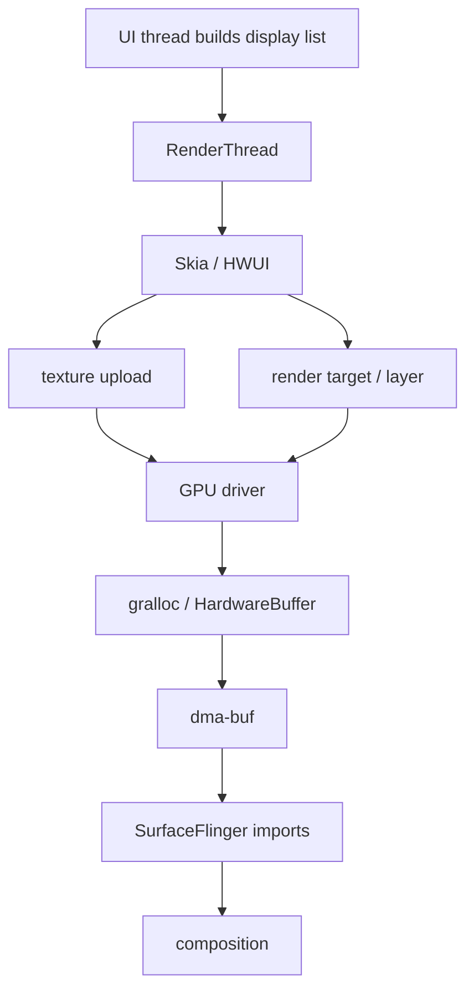
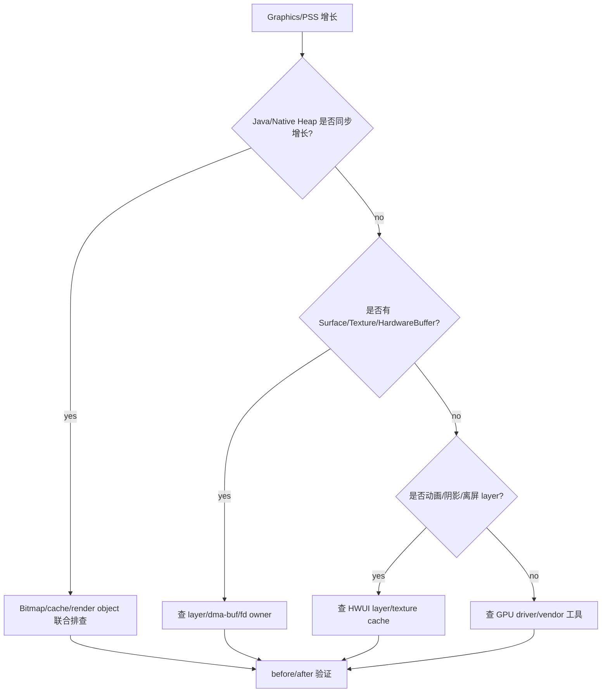
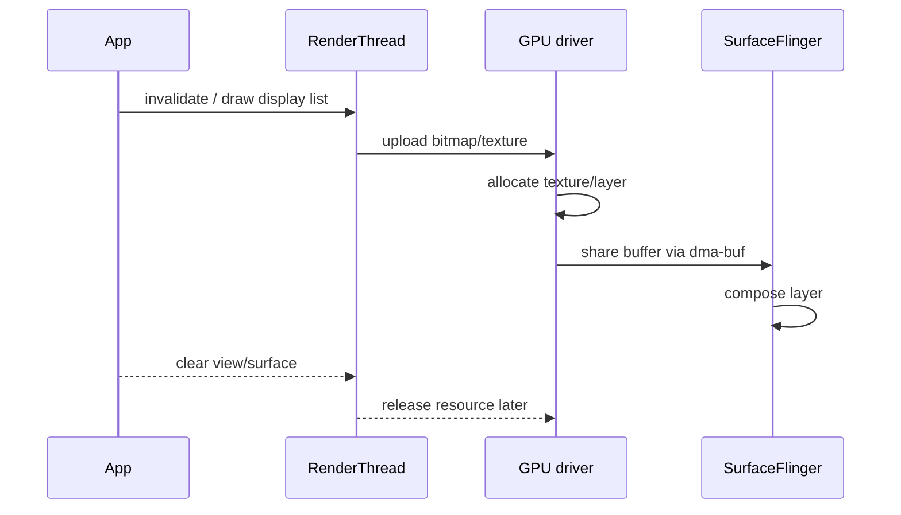

# Day 46: 硬件加速、RenderThread、GPU 内存与 dma-buf

> 目标：承接 Day 45 的 CPU/GPU tile 边界。今天把 App 绘制链路拆成 UI thread、RenderThread、GPU driver、SurfaceFlinger、HardwareBuffer/dma-buf，解释为什么 `Graphics` 增长不能只在 Java/Native Heap 里找。

---

## 1. 硬件加速内存路径



| 层 | 典型对象 | 账单 |
|---|---|---|
| App Java | View、Bitmap wrapper | Java Heap |
| Native rendering | Skia/HWUI objects | Native Heap |
| GPU resource | texture、layer、render target | Graphics |
| shared buffer | HardwareBuffer/gralloc | dma-buf/PSS |
| compositor | SurfaceFlinger imported buffer | System/Graphics |

---

## 2. 归因链

```mermaid
flowchart LR
    A[meminfo Graphics] --> B[Graphics bucket high]
    C[/proc maps/smaps] --> D[shared mappings]
    E[fd list] --> F[dmabuf / gralloc fd]
    G[SurfaceFlinger dump] --> H[layer/buffer owner]
    I[app lifecycle] --> J[View/Surface/Bitmap owner]
    B --> K[GPU attribution]
    D --> K
    F --> K
    H --> K
    J --> K
```

| 证据 | 用途 | 边界 |
|---|---|---|
| `dumpsys meminfo` Graphics | 快速看 GPU/graphics 账单 | 不说明 owner |
| fd/dma-buf | 找 shared buffer | 权限和 ROM 差异大 |
| SurfaceFlinger | 看 layer/buffer | 不直接给 Java 持有链 |
| HPROF | 找 View/Bitmap wrapper | 不证明 GPU 资源大小 |
| Perfetto | 对齐帧、上传、jank | 需要 trace 配置 |

---

## 3. 排障流



---

## 4. 常见增长来源



| 来源 | 表现 | 修法 |
|---|---|---|
| large bitmap texture | Graphics 增长 | 采样、region/tile、降低尺寸 |
| hardware layer | 动画后未回落 | 关闭不必要 layer，生命周期释放 |
| Surface/TextureView | 页面退出仍高 | release surface，断开 producer |
| RenderNode cache | UI 复杂度高 | 减少离屏渲染和过度缓存 |
| dma-buf import | 多进程共享 | 找 producer/consumer owner |

---

## 5. 命令模板

```bash
adb shell dumpsys meminfo <package> > graphics-before.txt
adb shell dumpsys SurfaceFlinger > surfaceflinger.txt
adb shell ls -l /proc/<pid>/fd > fd.txt
adb shell cat /proc/<pid>/smaps_rollup > smaps_rollup.txt
adb logcat -b main -b system -d > render-logcat.txt
```

```bash
rg -n "TextureView|SurfaceView|SurfaceTexture|HardwareBuffer|RenderNode|setLayerType" .
rg -n "Bitmap.Config.HARDWARE|asBitmap|ImageDecoder|decode|Glide|Coil|thumbnail|transform" .
```

---

## 今日检查清单

- [ ] 已区分 Java Heap、Native Heap、Graphics、PSS 的变化。
- [ ] 已确认是否存在 TextureView/SurfaceView/HardwareBuffer/hardware Bitmap。
- [ ] 已用 fd/dma-buf/SurfaceFlinger 证据寻找 producer-consumer owner。
- [ ] 已检查 RenderThread/HWUI layer、texture cache、动画和离屏渲染。
- [ ] 已把 Day 45 的 tile/region 策略和 GPU upload 数量对照。
- [ ] 已记录设备、ROM、GPU/driver、页面生命周期和复现步骤。
- [ ] 已用 before/after 验证 Graphics 和 dma-buf 是否回落。

---

## 6. 今天的结论

| 现象 | 不足结论 | 证据闭环 |
|---|---|---|
| Graphics 高 | Java 泄漏 | meminfo + fd/dma-buf + SurfaceFlinger |
| Native 不高 | 没有图片问题 | hardware Bitmap/texture 可能在 Graphics |
| 页面退出后仍高 | GC 没跑 | Surface/producer/RenderThread lifecycle |
| PSS 高 | App 独占 | shared buffer owner 需要单独证明 |

Day 47 进入进程内存限制：`memoryClass`、`largeHeap` 和进程上限。
