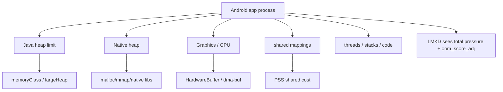
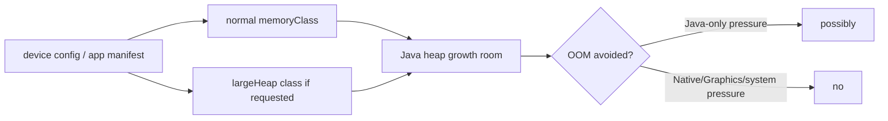
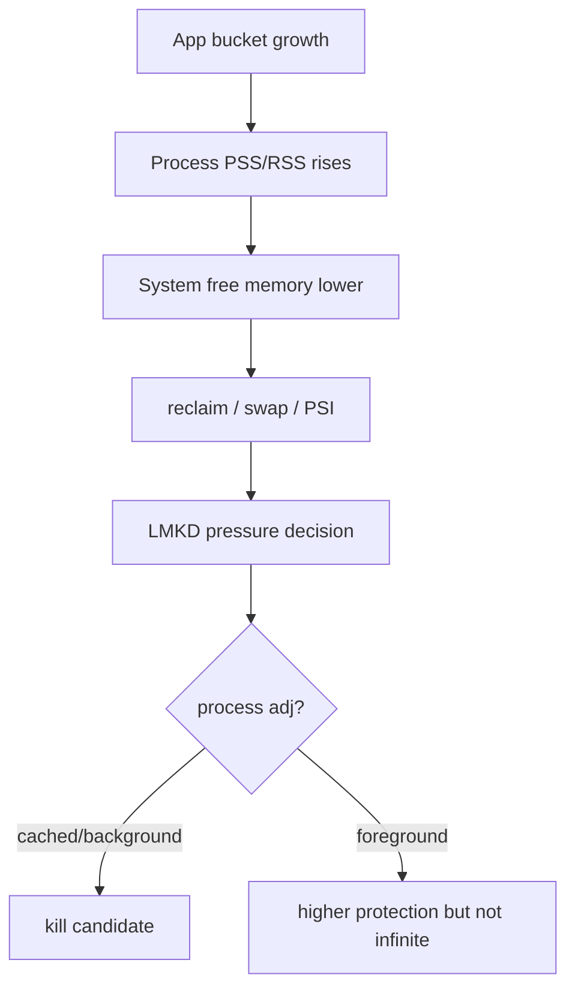
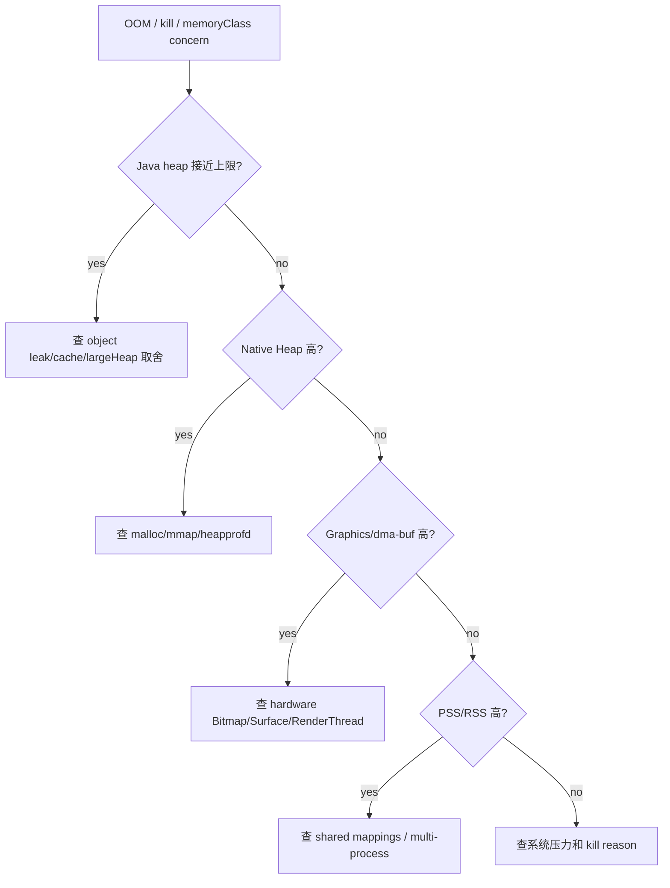

# Day 47: Android 进程内存限制：memoryClass、largeHeap 与进程上限

> 目标：承接 Day 46 的 Graphics/dma-buf 边界，拆清 `memoryClass`、`largeHeap`、Java heap、Native Heap、Graphics、PSS 和 LMKD 风险。结论先说：`largeHeap` 不是内存优化方案。

---

## 1. 进程内存账单



| Bucket | `largeHeap` 是否直接解决 | 证据 |
|---|---|---|
| Java Heap | 可能提高上限 | Runtime/ActivityManager |
| Native Heap | 否 | meminfo Native Heap |
| Graphics | 否 | meminfo Graphics/dma-buf |
| mmap/shared | 否 | showmap/smaps/fd |
| PSS/RSS | 否 | procrank/meminfo |

---

## 2. `memoryClass` 与 `largeHeap`



| 误区 | 正确边界 |
|---|---|
| `largeHeap=true` 能解决图片 OOM | 只可能缓解 Java heap，不能降低像素/Graphics |
| memoryClass 是进程总上限 | 它不是 PSS/RSS 总预算 |
| Native OOM 看 Java heap | 要看 Native Heap、maps、allocator |
| Graphics 高就加 largeHeap | 要查 hardware Bitmap、Surface、dma-buf |

---

## 3. LMKD 风险路径



| 场景 | 风险 |
|---|---|
| 前台大图页 | Java/Native/Graphics 峰值触发 OOM 或系统压力 |
| 后台缓存大 | adj 下降后成为 LMKD 候选 |
| 多进程图片服务 | 总 PSS 增加，账单分散 |
| shared buffer 未释放 | App 看似 heap 正常，系统压力仍高 |

---

## 4. 排障流



---

## 5. 命令模板

```bash
adb shell dumpsys meminfo <package> > meminfo.txt
adb shell dumpsys activity processes > processes.txt
adb shell dumpsys activity oom > oom.txt
adb shell cat /proc/<pid>/status > status.txt
adb shell cat /proc/<pid>/smaps_rollup > smaps_rollup.txt
```

```bash
rg -n "largeHeap|memoryClass|getLargeMemoryClass|getMemoryClass" .
rg -n "Bitmap|HardwareBuffer|TextureView|SurfaceView|mmap|malloc|LruCache|MemoryCache" .
```

---

## 今日检查清单

- [ ] 已区分 Java Heap OOM、Native OOM、Graphics 增长和 LMKD kill。
- [ ] 已确认 `memoryClass` / `largeHeap` 只解释 Java heap 上限。
- [ ] 已检查 Native Heap、Graphics、PSS/RSS、mmap/shared buffer。
- [ ] 已记录进程前后台状态、oom_score_adj、kill reason 或 tombstone。
- [ ] 已验证缓存策略没有把后台进程推成 LMKD 候选。
- [ ] 已说明为什么是否使用 `largeHeap` 是权衡，不是默认优化。
- [ ] 已用 before/after 证据验证 bucket-specific 改动有效。

---

## 6. 今天的结论

| 问题 | 不要用 | 应该用 |
|---|---|---|
| Java 对象过多 | 只开 largeHeap | HPROF/retained path/cache budget |
| Native 增长 | largeHeap | heapprofd/maps/meminfo |
| Graphics 高 | largeHeap | SurfaceFlinger/dma-buf/Graphics |
| LMKD kill | 只看 app heap | adj/PSS/system pressure |

Day 48 进入 Android 低内存全景：RAM、ZRAM、kswapd、PSI 与 LMKD。
