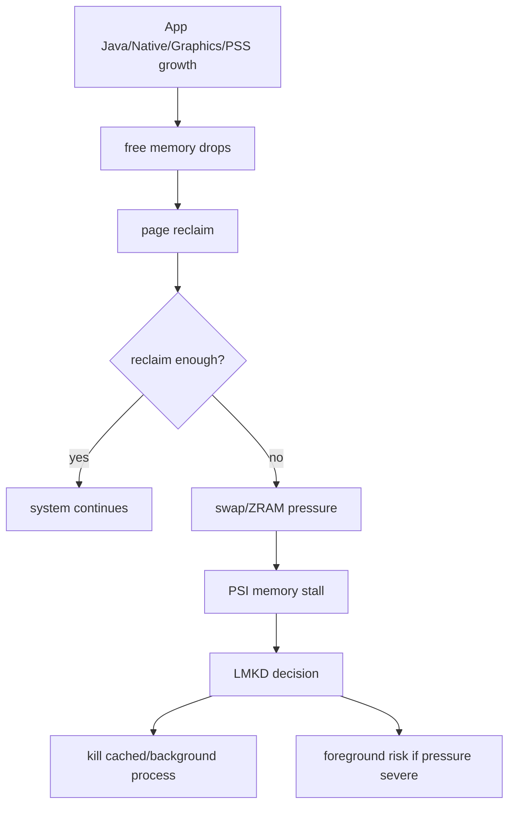
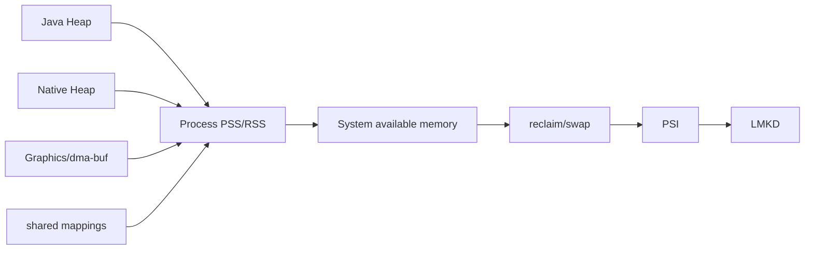
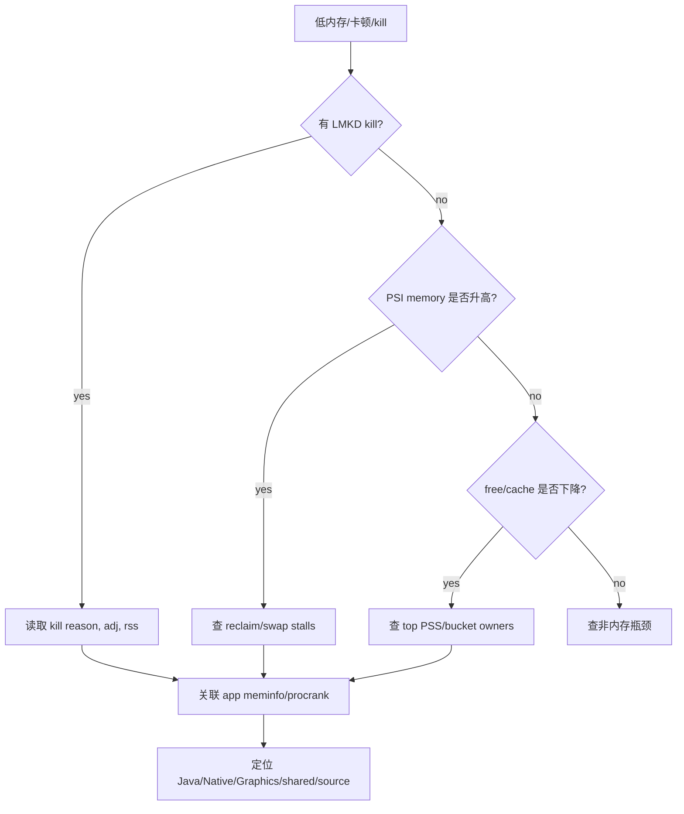
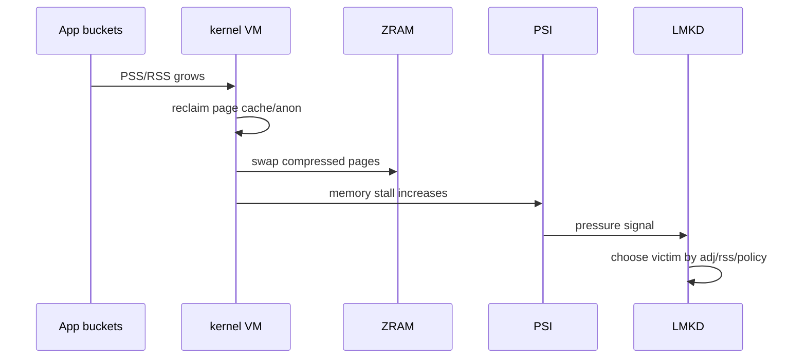

# Day 48: Android 低内存全景：RAM、ZRAM、kswapd、PSI 与 LMKD

> 目标：承接 Day 47 的进程 bucket 边界，把 App 内存增长放进系统低内存链路。低内存不是“某个 App heap 大”这么简单，而是 RAM、page cache、ZRAM、reclaim、PSI 和 LMKD 一起给出的结果。

---

## 1. 系统低内存结构



| 组件 | 角色 | 证据 |
|---|---|---|
| RAM | 物理页池 | `/proc/meminfo` |
| page cache | 文件缓存，可回收 | meminfo Cached |
| anon pages | App heap/stack/native 匿名页 | meminfo AnonPages、PSS |
| ZRAM | 压缩 swap | `/sys/block/zram0/mm_stat` |
| kswapd | 后台回收线程 | vmstat、Perfetto |
| PSI | stall 量化 | `/proc/pressure/memory` |
| LMKD | 用户态 kill 策略 | logcat/events/stats |

---

## 2. 从 App 到系统压力



| App 证据 | 系统侧后果 |
|---|---|
| Java Heap 增长 | anon pressure、GC/OOM |
| Native Heap 增长 | anon pressure、RSS/PSS 增长 |
| Graphics/dma-buf 增长 | shared buffer/system graphics pressure |
| 多进程 PSS 分散 | 系统总压力仍上升 |
| 后台缓存不释放 | adj 下降后更容易被 kill |

---

## 3. 排障流



---

## 4. 指标矩阵

| 问题 | 指标 | 判断 |
|---|---|---|
| 可用内存低 | MemAvailable/free/cache | 是否进入回收压力 |
| 回收活跃 | pgscan/pgsteal | kswapd/direct reclaim |
| swap 压力 | zram mm_stat、swap in/out | 压缩和换入换出代价 |
| stall | PSI some/full | 用户可感知卡顿风险 |
| kill | lmkd log、adj、RSS | 谁被杀、为什么 |
| owner | procrank/meminfo/showmap | 谁贡献压力 |



---

## 5. 采集模板

```bash
adb shell cat /proc/meminfo > meminfo-system.txt
adb shell cat /proc/vmstat > vmstat.txt
adb shell cat /proc/pressure/memory > psi-memory.txt
adb shell cat /sys/block/zram0/mm_stat > zram-mm_stat.txt
adb shell dumpsys meminfo > dumpsys-meminfo-all.txt
adb shell procrank > procrank.txt
adb logcat -b main -b system -b events -d | grep -i "lmkd\\|lowmemory\\|kill" > lmkd-log.txt
```

```bash
rg -n "onTrimMemory|trimMemory|MemoryCache|LruCache|largeHeap|foregroundService" .
rg -n "Bitmap|HardwareBuffer|mmap|malloc|ashmem|memfd|dma_buf|Surface" .
```

---

## 6. 证据闭环

| 结论 | 最低证据 |
|---|---|
| App 导致低内存 | app bucket delta + top PSS + system meminfo |
| 回收导致卡顿 | vmstat reclaim + PSI + Perfetto |
| ZRAM 代价高 | zram stats + swap activity + stall |
| LMKD 合理 kill | kill log + adj + RSS/PSS + pressure |
| shared buffer 压力 | dma-buf/fd + Graphics + owner path |

---

## 今日检查清单

- [ ] 已把 App Java/Native/Graphics/shared bucket 映射到系统 PSS/RSS。
- [ ] 已采集 `/proc/meminfo`、`vmstat`、PSI、ZRAM、procrank、lmkd log。
- [ ] 已区分 kswapd 后台回收、direct reclaim、swap/ZRAM 和 LMKD kill。
- [ ] 已读取 kill reason、adj、RSS/PSS，而不是只看被杀进程名。
- [ ] 已检查 Graphics/dma-buf/shared buffer 是否造成系统压力。
- [ ] 已记录设备 RAM、Android 版本、ROM、场景、前后台状态。
- [ ] 已用 before/after 证明优化降低系统压力而不只是降低 Java heap。

---

## 7. 今天的结论

| 层级 | 核心问题 |
|---|---|
| App | 哪个 bucket 增长 |
| Process | PSS/RSS 是否变成系统压力 |
| Kernel VM | 是否进入 reclaim/swap |
| PSI | 用户是否被 stall 影响 |
| LMKD | 谁被杀，adj 和 RSS 是否解释得通 |

Day 49 进入 Linux Page Reclaim：file/anon 页、LRU 与 MGLRU。
