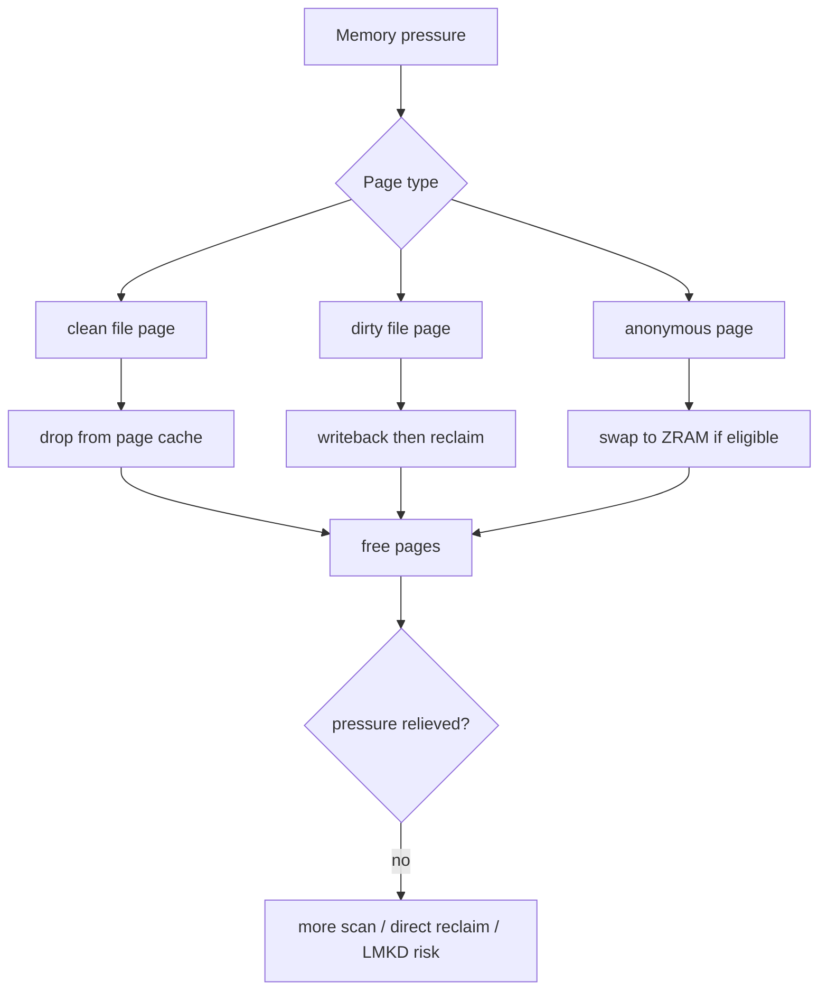
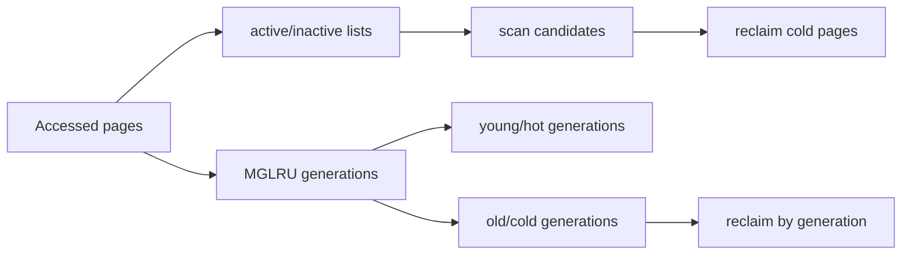
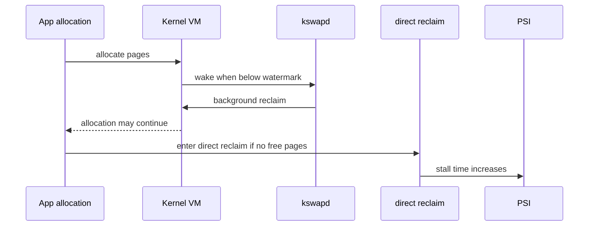
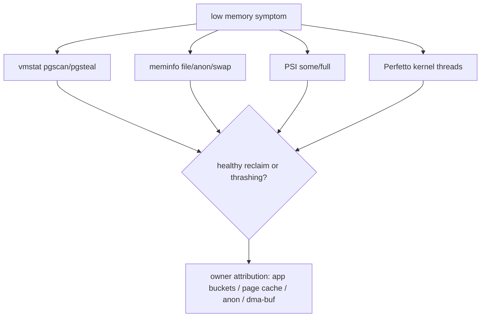

# Day 49: Linux Page Reclaim：file/anon 页、LRU 与 MGLRU

> 目标：承接 Day 48 的系统压力链，拆清 file/anon 页如何进入 reclaim，LRU/MGLRU 如何选择牺牲页，以及如何用 `vmstat`、Perfetto、PSI 证明 reclaim 成本。

---

## 1. Reclaim 全景



| 页类型 | 回收方式 | 代价 |
|---|---|---|
| clean file | 直接丢弃 | 低，之后可从文件重读 |
| dirty file | writeback 后回收 | 中高，受 IO 影响 |
| anon | swap/ZRAM 或保留 | 高，可能造成 stall |
| unevictable/pinned | 不易回收 | 压力转移到其他页 |

---

## 2. LRU 到 MGLRU



| 机制 | 关注点 | 排查含义 |
|---|---|---|
| classic LRU | active/inactive | 看 scan/steal 是否异常 |
| MGLRU | generation aging | 更细粒度地区分冷热 |
| refault | 刚回收又访问 | thrashing 信号 |
| workingset | 工作集大小 | 判断缓存是否被过度回收 |

---

## 3. kswapd 与 direct reclaim



| 路径 | 特征 | 用户感知 |
|---|---|---|
| kswapd | 后台回收 | 轻微或无感 |
| direct reclaim | 分配线程自己回收 | jank/卡顿风险高 |
| compaction | 找连续页 | 可能长耗时 |
| swap-in | 被换出页再访问 | 延迟尖刺 |

---

## 4. 证据流



| 指标 | 意义 |
|---|---|
| `pgscan_kswapd` | 后台扫描 |
| `pgscan_direct` | 分配线程被迫扫描 |
| `pgsteal_*` | 成功回收 |
| `workingset_refault` | 回收后很快再访问 |
| PSI `some/full` | stall 影响 |
| ZRAM stats | anon swap 压力 |

---

## 5. 命令模板

```bash
adb shell cat /proc/meminfo > meminfo.txt
adb shell cat /proc/vmstat > vmstat.txt
adb shell cat /proc/pressure/memory > psi-memory.txt
adb shell cat /sys/block/zram0/mm_stat > zram-mm_stat.txt
adb shell top -H -o PID,TID,NAME,CPU,RES
```

```bash
rg -n "onTrimMemory|LruCache|BitmapPool|HardwareBuffer|mmap|malloc|ashmem|memfd|dma_buf" .
```

---

## 今日检查清单

- [ ] 已区分 clean file、dirty file、anon、pinned/unevictable 页。
- [ ] 已检查 `pgscan`、`pgsteal`、`workingset_refault`、ZRAM 和 PSI。
- [ ] 已判断主要成本来自 kswapd、direct reclaim、writeback、swap-in 还是 compaction。
- [ ] 已把 reclaim 成本映射回 App Java/Native/Graphics/shared bucket。
- [ ] 已记录设备 RAM、kernel、Android 版本、场景和前后台状态。
- [ ] 已用 before/after 证明优化降低 scan/stall，而不只是降低单个 heap 字段。

---

## 6. 今天的结论

| 现象 | 解释 |
|---|---|
| file cache 下降但 PSI 不高 | 可能是健康回收 |
| direct reclaim 上升 | 分配线程被拖住 |
| refault 高 | 工作集被过度回收 |
| ZRAM 压力高 | anon 页成为主要代价 |
| PSI full 高 | 系统整体被内存卡住 |

Day 50 进入内存水位：zone、min/low/high watermark 与保留页。
