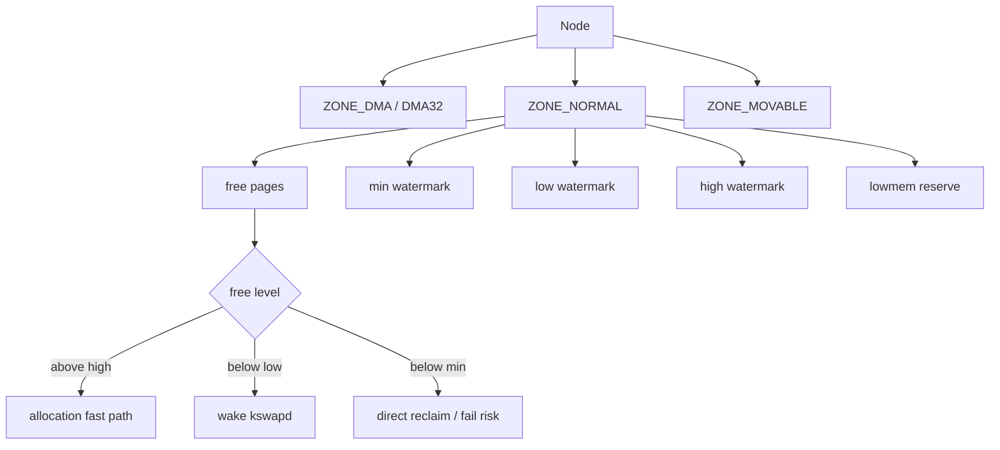
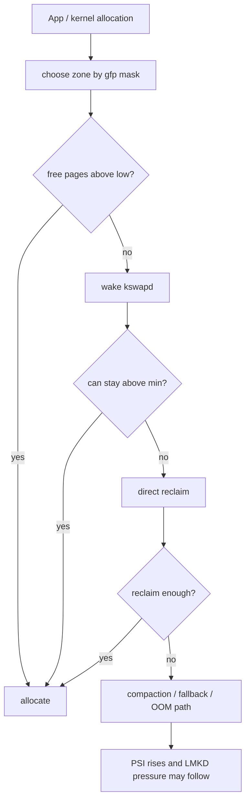
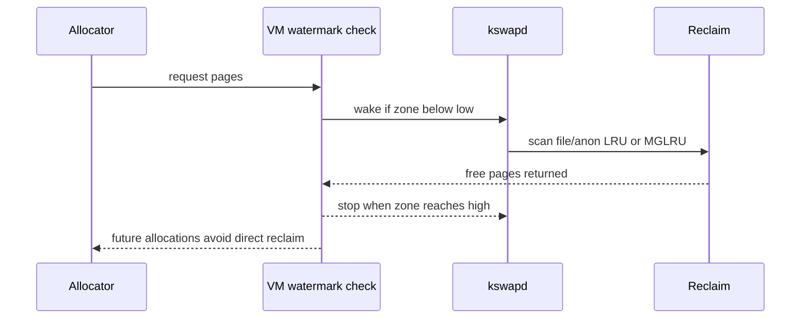
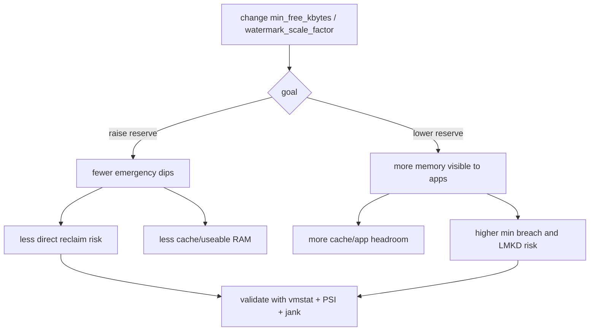

# Day 50: 内存水位机制：zone、min/low/high watermark 与保留页

> 目标：承接 Day 49 的 reclaim 模型，拆清 zone 水位如何决定 kswapd 唤醒、direct reclaim、分配失败与后续 LMKD 压力。

---

## 1. Zone 水位结构



| 字段 | 作用 | 观测入口 |
|---|---|---|
| `free` | zone 当前可用页 | `/proc/zoneinfo` |
| `min` | 不能轻易跌破的最低保护线 | `/proc/zoneinfo` |
| `low` | 后台回收启动线 | `/proc/zoneinfo` |
| `high` | kswapd 回收到的目标线 | `/proc/zoneinfo` |
| `lowmem_reserve[]` | 为低端 zone 保留页 | `/proc/zoneinfo` |

---

## 2. 分配路径决策



| 水位状态 | 内核动作 | App 侧症状 |
|---|---|---|
| `free > high` | 快速分配 | 无明显压力 |
| `low < free <= high` | 轻量检查 | 通常无感 |
| `min < free <= low` | 唤醒 kswapd | 后台 CPU 增加 |
| `free <= min` | direct reclaim 或失败路径 | 分配线程 stall、UI jank |

---

## 3. kswapd 目标线



| 连接到 Day 49 | Day 50 的补强 |
|---|---|
| Reclaim 解释“怎么回收” | Watermark 解释“何时回收” |
| LRU/MGLRU 解释“选谁牺牲” | Zone 水位解释“回收到哪里停” |
| PSI 解释“stall 成本” | `min/low/high` 解释“stall 前的触发线” |

---

## 4. 调参风险流



| 参数 | 可能收益 | 主要风险 |
|---|---|---|
| `vm.min_free_kbytes` 提高 | 更早保留应急页 | 可用缓存减少，低 RAM 机更敏感 |
| `watermark_scale_factor` 提高 | kswapd 更早/更多回收 | 后台扫描和 cache 抖动 |
| `watermark_boost_factor` 提高 | 碎片化后临时提高水位 | 可能造成过度回收 |
| 盲目降低水位 | 短期看似可用内存变多 | direct reclaim、compaction、LMKD 更突然 |

---

## 5. 证据矩阵

| 问题 | 必看证据 | 判断边界 |
|---|---|---|
| kswapd 是否被水位唤醒 | `/proc/zoneinfo` + `pgscan_kswapd` | free 接近 low 且后台扫描上升 |
| UI 是否卡在 direct reclaim | `pgscan_direct` + PSI `some/full` + Perfetto | 主线程或 RenderThread 分配附近出现 stall |
| 是否水位太低 | `min/low/high` + LMKD 日志 + PSI | free 跌破 min 后才开始严重回收或杀进程 |
| 是否水位太高 | file cache/refault + kswapd CPU | 可回收缓存被过早扫描，refault 上升 |
| 是否 zone/reserve 问题 | `lowmem_reserve[]` + allocation order | 某 zone 低水位触发，不等于全局 MemFree 低 |

---

## 6. 命令模板

```bash
adb shell cat /proc/zoneinfo > zoneinfo.before.txt
adb shell cat /proc/vmstat > vmstat.before.txt
adb shell cat /proc/pressure/memory > psi.before.txt
adb shell cat /proc/meminfo > meminfo.before.txt
adb shell getprop | grep -i lmk
```

```bash
adb shell "cat /proc/sys/vm/min_free_kbytes"
adb shell "cat /proc/sys/vm/watermark_scale_factor 2>/dev/null"
adb shell "cat /proc/sys/vm/watermark_boost_factor 2>/dev/null"
adb shell "cat /proc/pagetypeinfo" > pagetypeinfo.txt
```

```bash
rg -n "min_free_kbytes|watermark_scale_factor|watermark_boost_factor|lowmem_reserve|kswapd|direct reclaim" .
```

---

## 今日检查清单

- [ ] 已从 `/proc/zoneinfo` 记录每个 zone 的 `free/min/low/high`。
- [ ] 已区分全局 MemFree 低和某个 zone 低水位触发。
- [ ] 已检查 `lowmem_reserve[]`，没有把保留页误判成可随意使用内存。
- [ ] 已对比 `pgscan_kswapd`、`pgscan_direct`、`pgsteal_*` 和 PSI。
- [ ] 已把卡顿点对齐到分配、kswapd、direct reclaim 或 compaction。
- [ ] 已在调参前后保存 `zoneinfo`、`vmstat`、PSI、lmkd 日志和用户场景。
- [ ] 已验证调参没有用更高 refault、swap-in 或 LMKD 风险换取短期空闲内存。

---

## 7. 今天的结论

| 结论 | 工程含义 |
|---|---|
| Watermark 是 reclaim 的触发器 | 不能只看 MemFree，要看 zone 级别 |
| `low` 唤醒 kswapd | 健康路径是后台回收到 `high` |
| `min` 以下很危险 | 分配线程可能进入 direct reclaim 或失败路径 |
| reserve 不是浪费 | 它保护低端 zone 和高优先级分配 |
| 调参必须闭环验证 | 只看可用内存变多会掩盖 jank 和误杀风险 |

Day 51 继续追查：kswapd、direct reclaim、compaction 如何变成低端机 UI 抖动。
